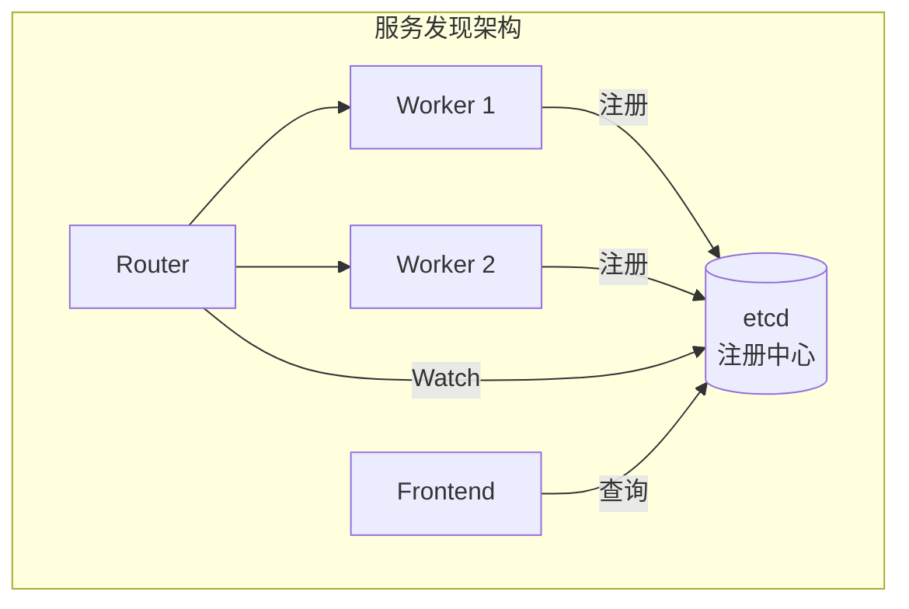
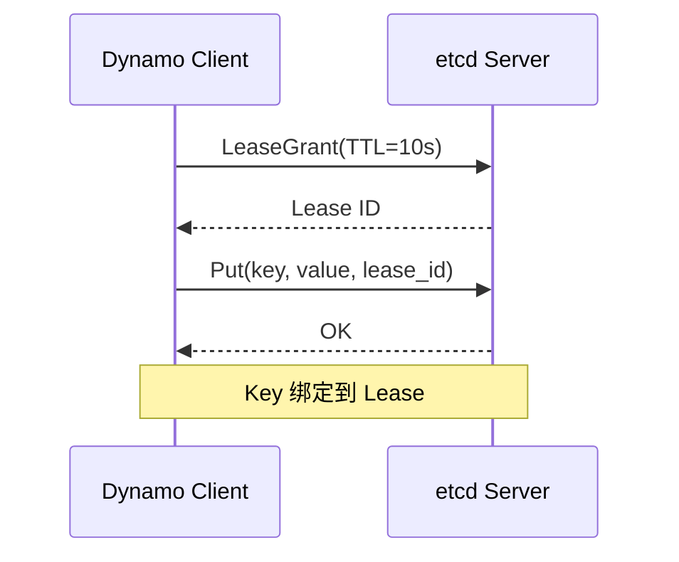
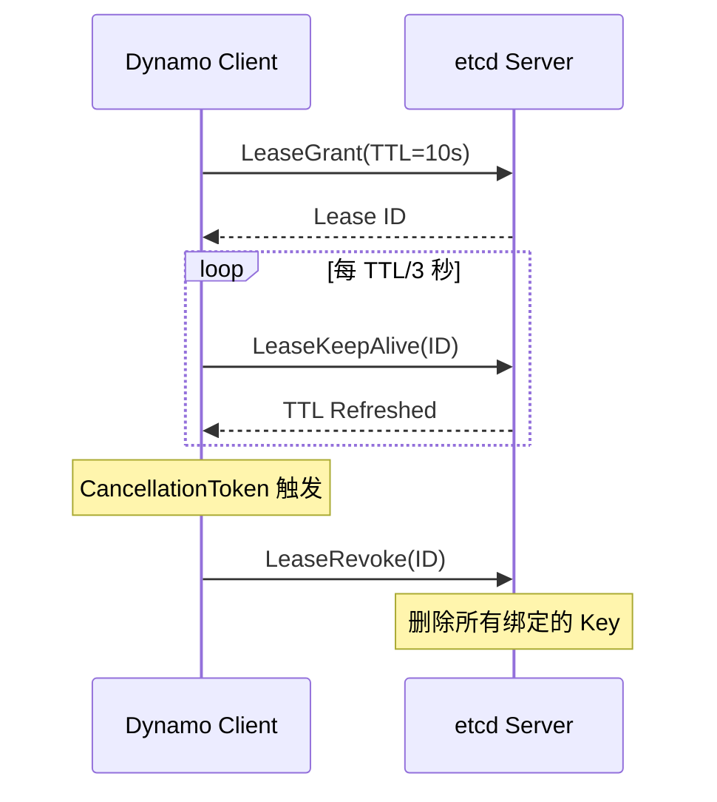
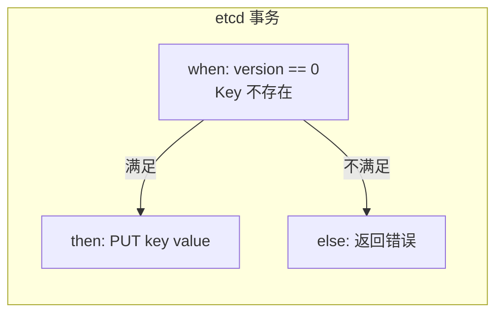
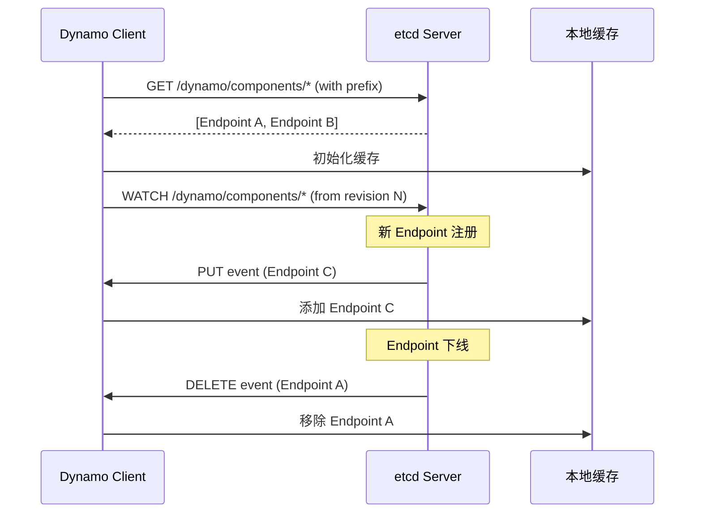
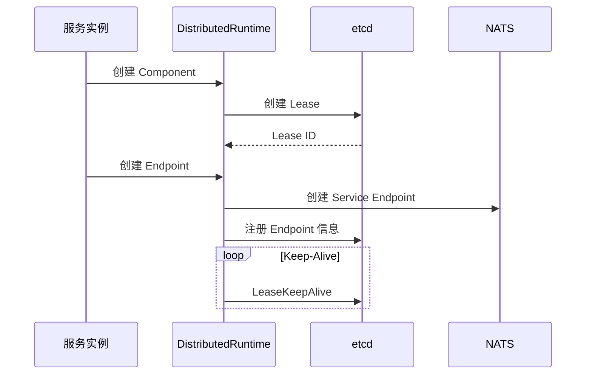
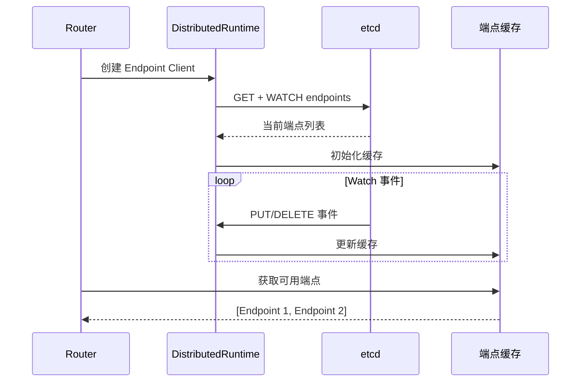
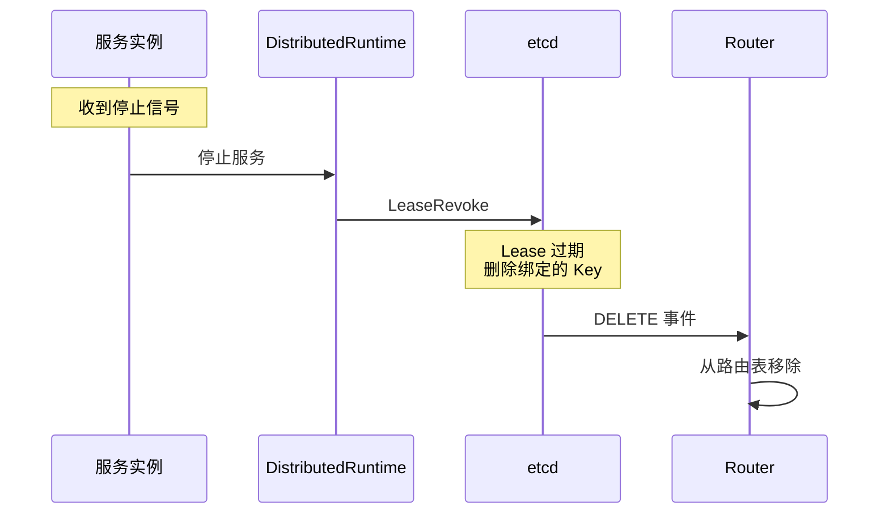
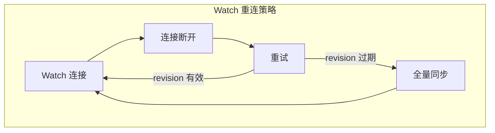
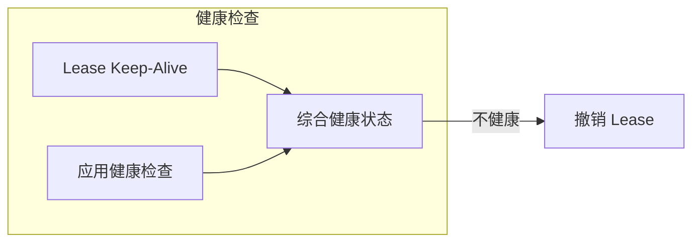

> 本文详细介绍 Dynamo 的服务发现机制，包括 etcd 租约管理、端点注册和 Watch 监听。

---

## 1. 服务发现概述

Dynamo 使用 **客户端发现模式**，通过 etcd 实现服务注册和发现：



---

## 2. etcd 租约管理

### 2.1 Lease 创建

每个服务实例创建一个 Lease，用于健康检查：



### 2.2 Keep-Alive 机制

Lease 创建后，需要定期发送 Keep-Alive 来保持活跃：



### 2.3 Lease 结构

```rust
pub struct Lease {
    id: i64,
    cancel_token: CancellationToken,
}

impl Lease {
    /// 获取 Lease ID
    pub fn id(&self) -> i64;

    /// 获取主取消令牌（取消会撤销 Lease）
    pub fn primary_token(&self) -> CancellationToken;

    /// 获取子取消令牌（取消不会撤销 Lease）
    pub fn child_token(&self) -> CancellationToken;

    /// 撤销 Lease
    pub fn revoke(&self);
}
```

---

## 3. 端点注册

### 3.1 注册信息结构

```rust
pub struct ComponentEndpointInfo {
    pub component: String,
    pub endpoint: String,
    pub namespace: String,
    pub lease_id: i64,
    pub transport: TransportType,
}

pub enum TransportType {
    NatsTcp(String),  // NATS 主题
}
```

### 3.2 etcd 中的存储

```
Key: dynamo/components/processor/generate:1a2b3c4d
Value: {
    "component": "processor",
    "endpoint": "generate",
    "namespace": "dynamo",
    "lease_id": 123456789,
    "transport": { "nats_tcp": "dynamo|processor.generate-1a2b3c4d" }
}
```

### 3.3 原子创建

使用 etcd 事务确保 Key 不存在时才创建：



---

## 4. Watch 监听

### 4.1 Watch 工作流程



### 4.2 PrefixWatcher

```rust
pub struct PrefixWatcher {
    prefix: String,
    watcher: Watcher,
    rx: Receiver<WatchEvent>,
}

pub enum WatchEvent {
    Put(KeyValue),
    Delete(KeyValue),
}
```

### 4.3 Watch 关键设计

| 设计点 | 说明 |
|--------|------|
| **revision 连续性** | 从 GET 返回的 revision + 1 开始 Watch，确保不遗漏事件 |
| **prev_key** | 删除事件时包含被删除的 Key 信息 |
| **Secondary Runtime** | Watch 循环在 Secondary Runtime 中运行，不影响主业务 |

---

## 5. 服务发现完整流程

### 5.1 服务注册流程



### 5.2 服务发现流程



### 5.3 服务下线流程



---

## 6. 最佳实践

### 6.1 Lease TTL 设置

| 场景 | 推荐 TTL | 原因 |
|------|----------|------|
| 稳定网络 | 10s | 快速检测故障 |
| 不稳定网络 | 30s | 避免频繁超时 |
| 开发测试 | 5s | 快速迭代 |

### 6.2 Watch 重连处理



### 6.3 健康检查集成



---

## 小结

本文介绍了 Dynamo 的服务发现机制：

1. **etcd 租约**：Lease 创建和 Keep-Alive
2. **端点注册**：原子创建，绑定 Lease
3. **Watch 监听**：实时感知服务变化
4. **完整流程**：注册、发现、下线

---

## 下一章

完成本章阅读后，建议继续阅读 [第三章：LLM 推理层原理](../03-llm-inference-layer/README.md)，了解 Dynamo 如何支持多种推理引擎。
