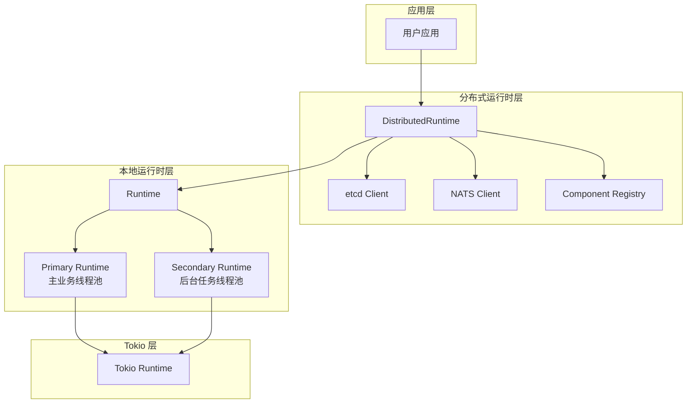

# 第二章：运行时层原理

> Dynamo 的运行时层是整个系统的基础设施，提供异步执行、分布式协调和服务发现能力。

## 本章概述

本章深入解析 Dynamo 运行时层的设计与实现，包括 Rust 异步编程基础、Runtime 双层设计、Component 系统、Pipeline 架构以及服务发现机制。

---

## 子文档列表

| 序号 | 文件 | 主题 | 内容简介 |
|------|------|------|----------|
| 1 | [01-async-programming-basics.md](01-async-programming-basics.md) | Rust 异步编程 | Future/Poll 机制、async/await 语法、Tokio 运行时 |
| 2 | [02-distributed-system-basics.md](02-distributed-system-basics.md) | 分布式系统基础 | CAP 定理、服务发现、心跳机制、Actor 模型 |
| 3 | [03-runtime-design.md](03-runtime-design.md) | Runtime 双层设计 | Local Runtime、Distributed Runtime、生命周期管理 |
| 4 | [04-component-system.md](04-component-system.md) | Component 系统 | Namespace、Component、Endpoint、Registry |
| 5 | [05-pipeline-architecture.md](05-pipeline-architecture.md) | Pipeline 架构 | AsyncEngine、Source/Sink/Operator、Context |
| 6 | [06-service-discovery.md](06-service-discovery.md) | 服务发现机制 | etcd 租约、端点注册、Watch 监听 |

---

## 阅读顺序建议

**推荐路径**：

- **新手路径**：按顺序阅读所有文档，从基础知识开始
- **快速上手**：直接阅读 [03-Runtime 设计](03-runtime-design.md) 和 [04-Component 系统](04-component-system.md)
- **深入理解**：重点关注 [05-Pipeline 架构](05-pipeline-architecture.md)

---

## 关键概念速查

| 概念 | 说明 | 详见文档 |
|------|------|----------|
| **Future** | Rust 异步计算的核心抽象 | [01-async-programming-basics.md](01-async-programming-basics.md) |
| **Tokio** | Rust 异步运行时 | [01-async-programming-basics.md](01-async-programming-basics.md) |
| **CAP 定理** | 分布式系统的基本约束 | [02-distributed-system-basics.md](02-distributed-system-basics.md) |
| **Runtime** | 本地运行时，管理 Tokio 线程池 | [03-runtime-design.md](03-runtime-design.md) |
| **DistributedRuntime** | 分布式运行时，包含 etcd/NATS 客户端 | [03-runtime-design.md](03-runtime-design.md) |
| **Namespace** | 命名空间，逻辑隔离 | [04-component-system.md](04-component-system.md) |
| **Component** | 组件，可部署的服务单元 | [04-component-system.md](04-component-system.md) |
| **Endpoint** | 端点，组件的可调用接口 | [04-component-system.md](04-component-system.md) |
| **AsyncEngine** | 异步引擎接口 | [05-pipeline-architecture.md](05-pipeline-architecture.md) |
| **Lease** | etcd 租约，用于服务健康检查 | [06-service-discovery.md](06-service-discovery.md) |

---

## 架构总览

---

## 下一章

完成本章阅读后，建议继续阅读 [第三章：LLM 推理层原理](../03-llm-inference-layer/README.md)，了解 Dynamo 如何支持多种推理引擎。
