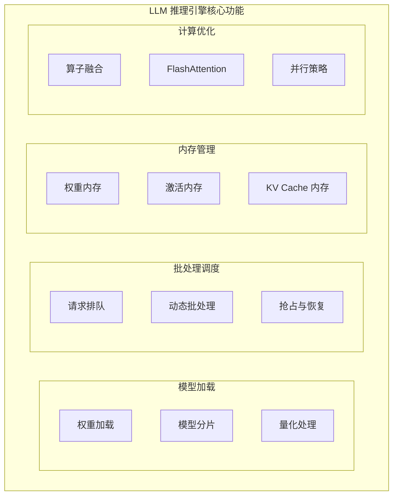
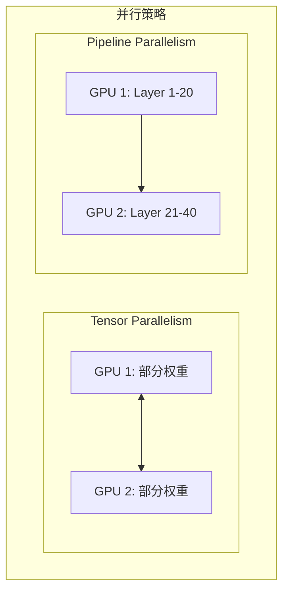
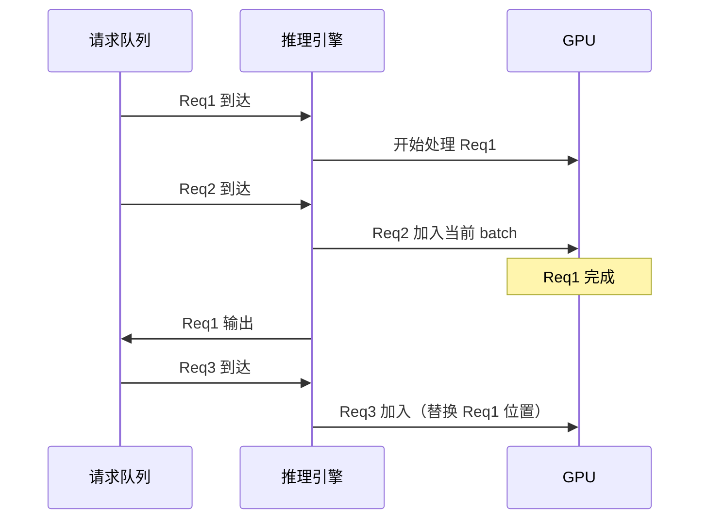
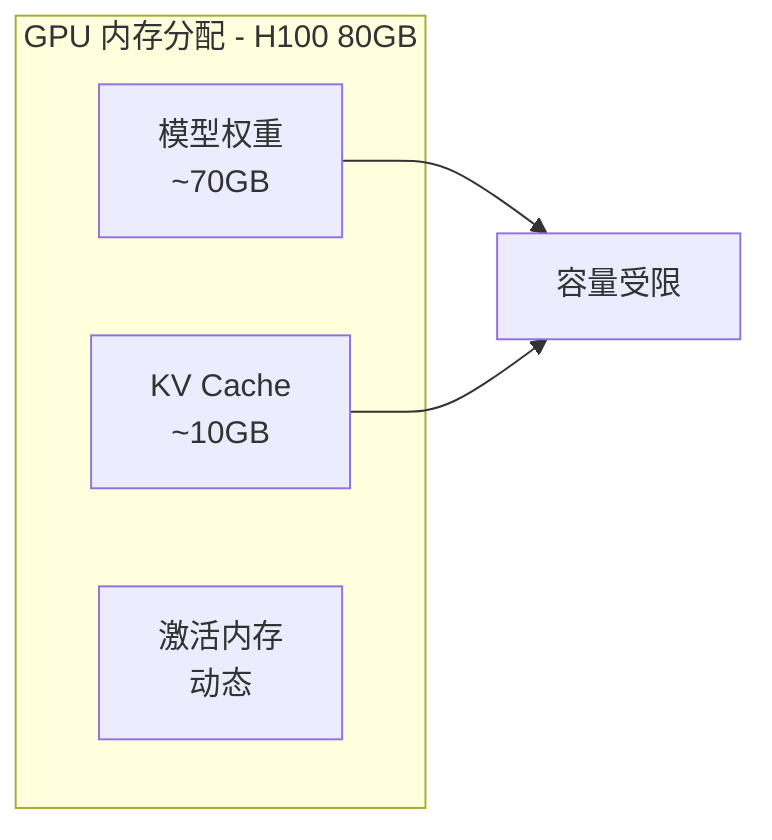
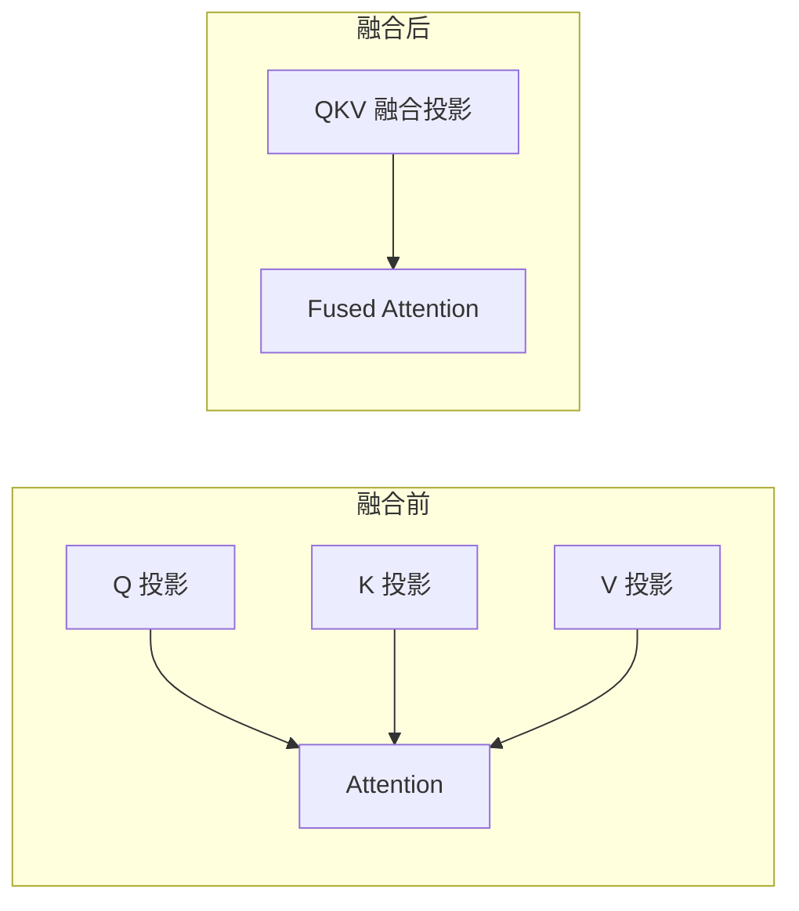
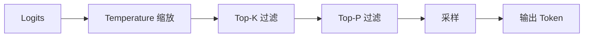

> 本文介绍 LLM 推理引擎的核心功能，包括模型加载、批处理策略和内存管理。

---

## 1. 推理引擎核心功能

LLM 推理引擎是将预训练模型部署为可用服务的核心组件：



---

## 2. 模型加载与初始化

### 2.1 权重加载

推理引擎首先需要将预训练模型从存储加载到 GPU 内存中：

1. **权重加载**：从磁盘读取模型权重（safetensors 或 PyTorch 格式）
2. **模型分片**：将模型切分到多个 GPU（Tensor Parallelism）
3. **量化处理**：可选地将 FP16/BF16 权重转换为 INT8/INT4/FP8

### 2.2 并行策略



| 并行策略 | 说明 | 适用场景 |
|---------|------|----------|
| **Tensor Parallelism** | 将每层权重切分到多个 GPU | 单节点多卡 |
| **Pipeline Parallelism** | 将不同层分配到不同 GPU | 多节点部署 |

---

## 3. 批处理策略

### 3.1 静态批处理

传统方法：等待凑齐一个 batch 再一起处理。

**问题**：最长请求决定整个 batch 的延迟。

### 3.2 动态批处理 (Continuous Batching)



**优势**：
- 请求完成即释放，新请求可立即加入
- GPU 利用率更高
- 减少平均延迟

---

## 4. 内存管理

### 4.1 内存类型

LLM 推理中的内存主要分为三部分：

| 内存类型 | 特点 | 大小估算（Llama-70B） |
|---------|------|----------------------|
| **权重内存** | 固定，与模型大小相关 | ~140GB (FP16) |
| **激活内存** | 临时，与 batch_size 相关 | 可变 |
| **KV Cache** | 动态增长，与序列长度相关 | 见下方公式 |

### 4.2 KV Cache 内存计算

```
KV Cache 内存 = 2 × L × H × D × S × B × dtype_size
```

其中：
- L = 层数 (80)
- H = 注意力头数 (64)
- D = 每头维度 (128)
- S = 序列长度
- B = 批大小
- dtype_size = 数据类型字节数 (FP16 = 2)

### 4.3 GPU HBM 容量限制



---

## 5. 计算优化

### 5.1 算子融合

将多个连续算子合并为一个 CUDA kernel：



### 5.2 FlashAttention

FlashAttention 通过优化内存访问模式，显著提升 Attention 计算效率：

- **Tiling**：将计算分块，充分利用 GPU 高速缓存
- **减少 HBM 访问**：避免存储完整的 attention 矩阵
- **IO 感知**：优化内存访问模式

---

## 6. 采样策略

### 6.1 采样参数

| 参数 | 说明 | 典型值 |
|------|------|--------|
| **Temperature** | 控制随机性，越高越随机 | 0.0-2.0 |
| **Top-P** | 核采样，累积概率阈值 | 0.9-0.95 |
| **Top-K** | 只考虑前 K 个 token | 40-100 |
| **Repetition Penalty** | 重复惩罚 | 1.0-1.2 |

### 6.2 采样流程



---

## 小结

本文介绍了 LLM 推理引擎的核心功能：

1. **模型加载**：权重加载、分片、量化
2. **批处理策略**：静态 vs 动态批处理
3. **内存管理**：权重、激活、KV Cache
4. **计算优化**：算子融合、FlashAttention
5. **采样策略**：Temperature、Top-P、Top-K

---

## 下一篇

继续阅读 [02-vLLM 技术解析](02-vllm-internals.md)，深入了解 vLLM 的核心技术。
