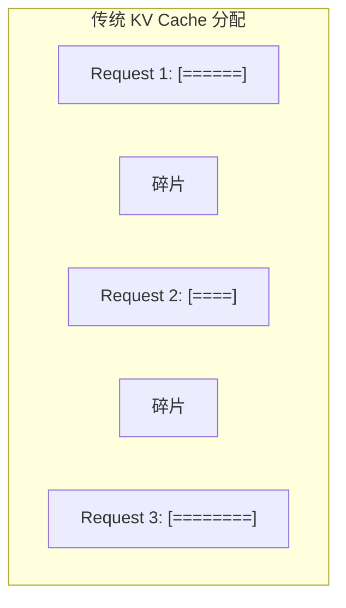
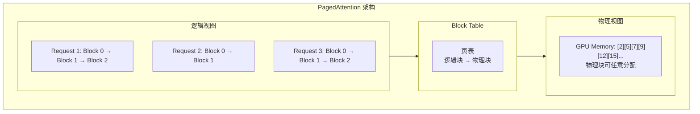
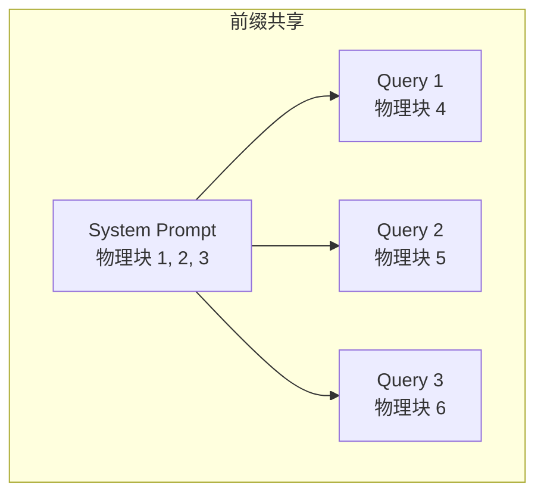
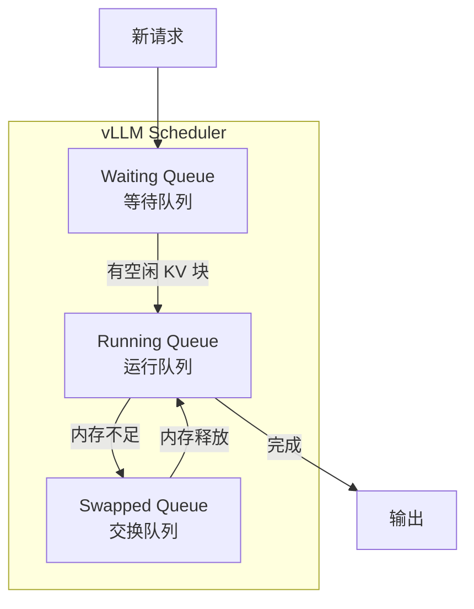
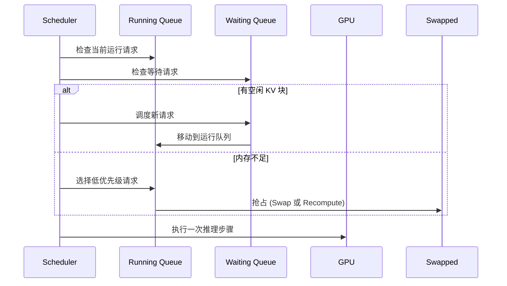
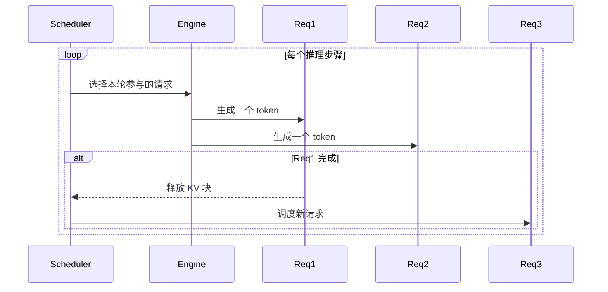

# vLLM 技术解析

> 本文深入解析 vLLM 的核心技术，包括 PagedAttention 和调度器设计。

---

## 1. PagedAttention 原理

### 1.1 传统方法的问题

传统方法为每个请求分配连续的 KV Cache 内存，导致大量内存碎片：



**问题**：
- 必须预分配最大长度
- 请求完成后留下碎片
- 内存利用率低

### 1.2 PagedAttention 设计

PagedAttention 借鉴操作系统虚拟内存的分页思想：



### 1.3 核心优势

| 优势 | 说明 |
|------|------|
| **消除内存碎片** | 块可以在任意位置分配 |
| **支持共享前缀** | 多个请求可以共享相同的物理块 |
| **动态增长** | 按需分配新块，无需预留最大长度 |
| **Copy-on-Write** | 修改时才复制，节省内存 |

### 1.4 块共享示例



**内存节省**：共享前缀只存一份，可节省 ~60% 内存。

---

## 2. vLLM 调度器设计

### 2.1 三队列架构

vLLM 的调度器管理三个队列：



### 2.2 队列说明

| 队列 | 说明 |
|------|------|
| **Waiting Queue** | 新到达的请求，等待 GPU 资源 |
| **Running Queue** | 正在执行的请求，占用 GPU 和 KV Cache |
| **Swapped Queue** | 被抢占的请求，KV Cache 已卸载到 CPU |

### 2.3 调度策略



### 2.4 抢占策略

| 策略 | 说明 | 适用场景 |
|------|------|----------|
| **Swap** | KV Cache 卸载到 CPU | 内存带宽充足 |
| **Recompute** | 丢弃 KV Cache，后续重算 | KV Cache 较小 |

---

## 3. Continuous Batching 实现

### 3.1 迭代级调度

vLLM 在每个推理步骤后重新评估调度决策：



### 3.2 优势

- **低延迟**：请求完成后立即释放资源
- **高吞吐**：新请求可立即加入
- **公平调度**：避免长请求阻塞短请求

---

## 4. 与 Dynamo 集成

### 4.1 VllmEngine 封装

Dynamo 通过 `VllmEngine` 封装 vLLM：

```rust
pub struct VllmEngine {
    cancel_token: CancellationToken,
    worker: worker::VllmWorker,
}

impl AsyncEngine for VllmEngine {
    async fn generate(&self, request: SingleIn<BackendInput>)
        -> Result<ManyOut<Annotated<LLMEngineOutput>>, Error>
    {
        // 调用 vLLM Worker 处理请求
    }
}
```

### 4.2 集成优势

| 特性 | 说明 |
|------|------|
| **统一接口** | 通过 AsyncEngine Trait 统一访问 |
| **取消支持** | 支持请求取消 |
| **流式输出** | 支持 Token 级流式响应 |
| **指标集成** | 集成 KV 指标发布 |

---

## 小结

本文介绍了 vLLM 的核心技术：

1. **PagedAttention**：分页 KV Cache 管理
2. **三队列调度器**：Waiting、Running、Swapped
3. **Continuous Batching**：迭代级动态调度
4. **与 Dynamo 集成**：AsyncEngine 封装

---

## 下一篇

继续阅读 [03-多引擎抽象层](03-multi-engine-abstraction.md)，了解 Dynamo 如何支持多种推理引擎。
