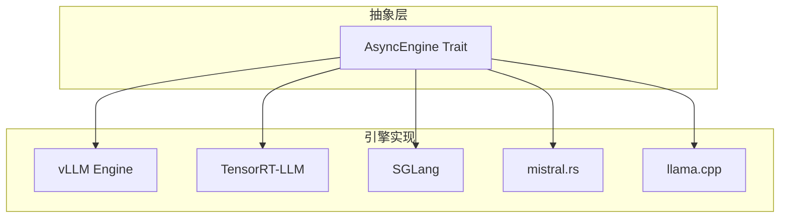
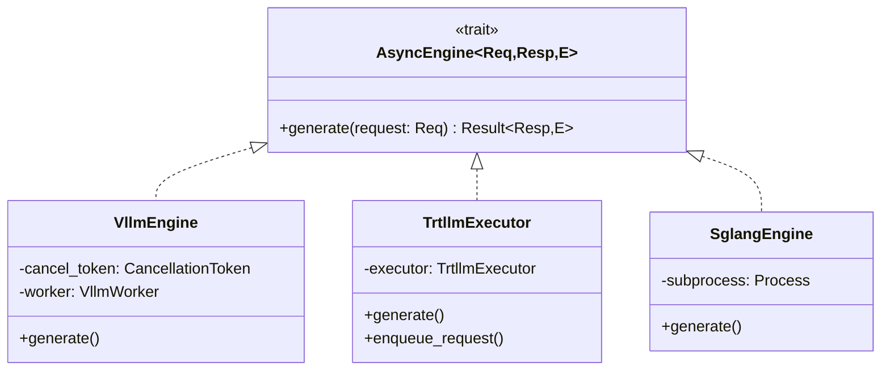
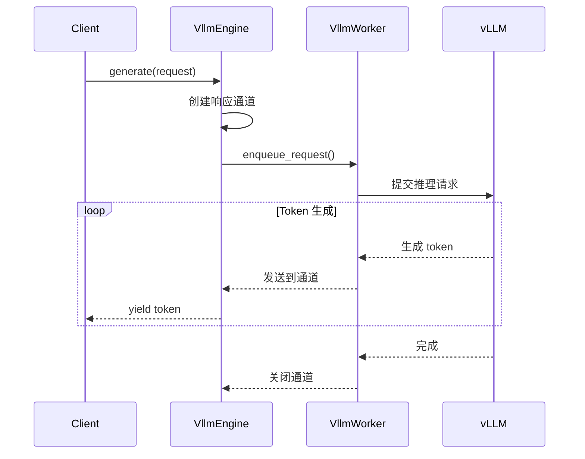
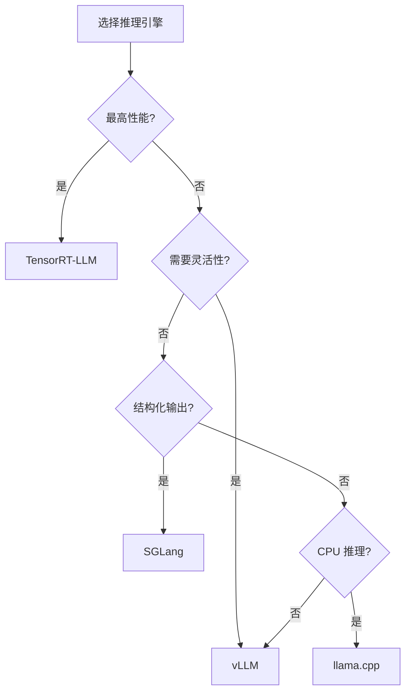

> 本文介绍 Dynamo 的多引擎抽象层设计，包括 AsyncEngine Trait 和各引擎的适配实现。

---

## 1. 设计理念

Dynamo 的核心设计理念之一是 **引擎无关性**——支持多种推理后端，通过统一接口对外暴露服务。



---

## 2. 引擎支持情况

| 引擎 | 特点 | Feature Flag | 状态 |
|------|------|-------------|------|
| **vLLM** | 最成熟的开源方案，PagedAttention | `vllm` | 生产就绪 |
| **TensorRT-LLM** | NVIDIA 官方，最高性能 | `trtllm` | 生产就绪 |
| **SGLang** | RadixAttention，结构化生成 | `sglang` | 支持中 |
| **mistral.rs** | Rust 原生，轻量级 | `mistralrs` | 实验中 |
| **llama.cpp** | CPU 友好，GGUF 格式 | `llamacpp` | 实验中 |

---

## 3. AsyncEngine Trait

### 3.1 Trait 定义

```rust
#[async_trait]
pub trait AsyncEngine<Req: Data, Resp: Data + AsyncEngineContextProvider, E: Data>:
    Send + Sync
{
    async fn generate(&self, request: Req) -> Result<Resp, E>;
}
```

### 3.2 类型关系



### 3.3 统一的输入/输出类型

| 类型 | 说明 |
|------|------|
| **Input** | `SingleIn<BackendInput>` - 已 tokenize 的请求 |
| **Output** | `ManyOut<Annotated<LLMEngineOutput>>` - 流式输出 |
| **Error** | `Error` - 统一错误类型 |

---

## 4. vLLM 引擎实现

### 4.1 VllmEngine 结构

```rust
pub struct VllmEngine {
    cancel_token: CancellationToken,
    worker: worker::VllmWorker,
}
```

### 4.2 generate 实现

```rust
#[async_trait]
impl AsyncEngine<SingleIn<BackendInput>, ManyOut<Annotated<LLMEngineOutput>>, Error>
    for VllmEngine
{
    async fn generate(&self, request: SingleIn<BackendInput>)
        -> Result<ManyOut<Annotated<LLMEngineOutput>>, Error>
    {
        // 1. 解包请求和上下文
        let (request, context) = request.into_parts();
        let ctx = context.context();

        // 2. 创建响应通道
        let (resp_tx, mut resp_rx) = tokio::sync::mpsc::channel(128);

        // 3. 构造工作请求
        let work_req = worker::WorkRequest {
            request_id: context.id().to_string(),
            request,
            response_channel: resp_tx,
        };

        // 4. 入队请求
        self.worker.enqueue_request(work_req).await?;

        // 5. 构造流式响应
        let output = stream! {
            loop {
                match resp_rx.recv().await {
                    Some(out) => yield out,
                    None => break,
                }
            }
        };

        Ok(ResponseStream::new(Box::pin(output), ctx))
    }
}
```

### 4.3 流程图



---

## 5. TensorRT-LLM 引擎实现

### 5.1 Executor 结构

TensorRT-LLM 引擎直接与 C++ 库交互：

```rust
pub struct Executor {
    inner: TrtllmExecutor,
    // ...
}
```

### 5.2 实现特点

| 特点 | 说明 |
|------|------|
| **C++ 绑定** | 通过 FFI 调用 TensorRT-LLM C++ 库 |
| **编译优化** | 使用预编译的 TensorRT 引擎 |
| **取消支持** | 支持请求级别的取消 |
| **状态机** | 使用 unfold 模式构造流 |

### 5.3 取消处理

```rust
// 启动取消监控任务
tokio::spawn(async move {
    tokio::select! {
        _ = context.stopped() => {
            // 请求被取消
            engine_context.cancel();
            cancel_token.cancel();
        }
        _ = tx.closed() => {
            // 响应流关闭
        }
    }
});
```

---

## 6. 引擎选择指南



| 场景 | 推荐引擎 | 原因 |
|------|----------|------|
| 生产环境，NVIDIA GPU | TensorRT-LLM | 最高性能 |
| 快速开发，灵活配置 | vLLM | 成熟稳定 |
| JSON 输出，正则约束 | SGLang | RadixAttention |
| CPU 推理，边缘设备 | llama.cpp | 轻量级 |

---

## 7. 添加新引擎

### 7.1 步骤

1. 实现 `AsyncEngine` Trait
2. 添加 Feature Flag
3. 注册到引擎工厂

### 7.2 示例

```rust
#[cfg(feature = "my_engine")]
pub mod my_engine;

// my_engine/engine.rs
pub struct MyEngine {
    // ...
}

#[async_trait]
impl AsyncEngine<SingleIn<BackendInput>, ManyOut<Annotated<LLMEngineOutput>>, Error>
    for MyEngine
{
    async fn generate(&self, request: SingleIn<BackendInput>)
        -> Result<ManyOut<Annotated<LLMEngineOutput>>, Error>
    {
        // 实现推理逻辑
    }
}
```

---

## 小结

本文介绍了 Dynamo 的多引擎抽象层：

1. **AsyncEngine Trait**：统一的推理引擎接口
2. **vLLM 实现**：通过 Worker 子进程调用
3. **TensorRT-LLM 实现**：直接 C++ 绑定
4. **引擎选择**：根据场景选择合适的引擎

---

## 下一篇

继续阅读 [04-Worker 设计详解](04-worker-design.md)，了解 Dynamo 的 Worker 架构。
