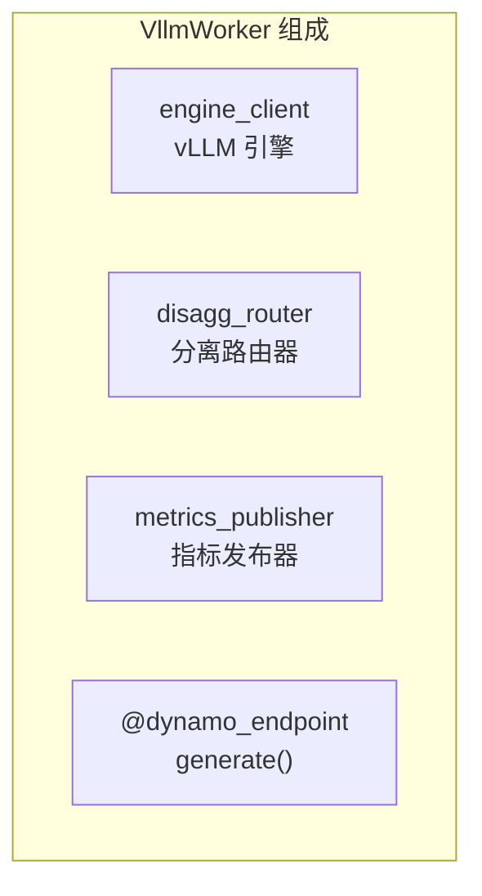
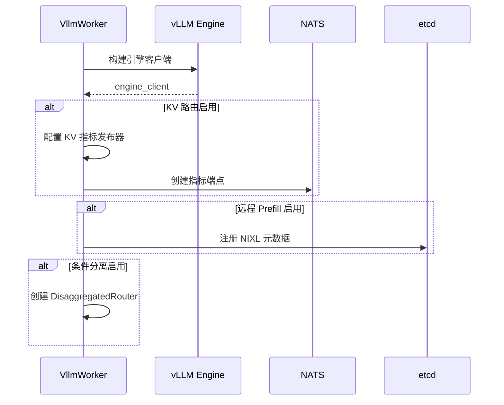
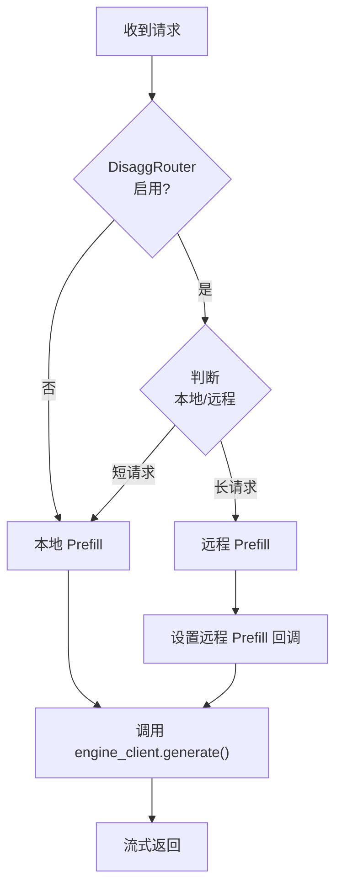
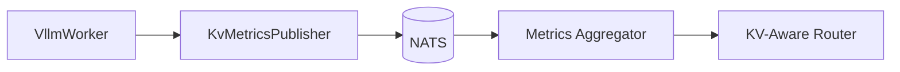
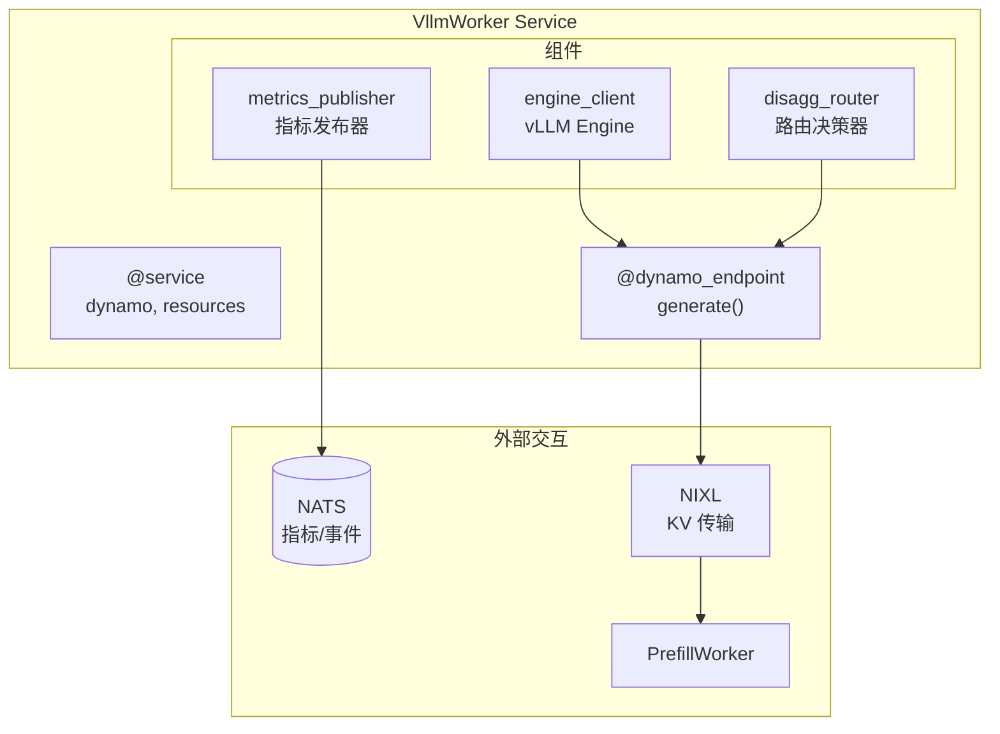

> 本文详细介绍 Dynamo 的 Worker 设计，包括 VllmWorker 的定义、生命周期管理和指标发布。

---

## 1. Worker 概述

Worker 是 Dynamo 中执行实际推理的服务单元，每个 Worker 封装一个推理引擎实例。



---

## 2. Python Worker 定义

### 2.1 服务装饰器

```python
@service(
    dynamo={
        "enabled": True,
        "namespace": "dynamo",
    },
    resources={"gpu": 1, "cpu": "10", "memory": "20Gi"},
    workers=1,
)
class VllmWorker:
    """vLLM Worker 服务"""

    prefill_worker = depends(PrefillWorker)  # 可选依赖
```

### 2.2 配置说明

| 配置项 | 说明 |
|--------|------|
| `namespace` | Dynamo 命名空间 |
| `resources.gpu` | GPU 数量 |
| `resources.cpu` | CPU 核心数 |
| `resources.memory` | 内存限制 |
| `workers` | Worker 实例数 |

---

## 3. 异步初始化

### 3.1 初始化流程



### 3.2 代码示例

```python
@async_on_start
async def async_init(self):
    """服务启动时的异步初始化"""

    # 1. 构建 vLLM 引擎客户端
    self._engine_context = build_async_engine_client_from_engine_args(
        self.engine_args
    )
    self.engine_client = await self._engine_context.__aenter__()

    # 2. 配置 KV 感知路由
    if self.engine_args.router == "kv":
        self.engine_client.set_metrics_publisher(self.metrics_publisher)
        self.metrics_publisher.publish(
            request_active_slots=0,
            kv_active_blocks=0,
            # ...
        )

    # 3. 注册 NIXL 元数据
    if self.engine_args.remote_prefill:
        metadata = self.engine_client.nixl_metadata
        metadata_store = NixlMetadataStore("dynamo", runtime)
        await metadata_store.put(metadata.engine_id, metadata)

    # 4. 配置分离式路由器
    if self.engine_args.conditional_disagg:
        self.disaggregated_router = PyDisaggregatedRouter(
            runtime,
            self.model_name,
            max_local_prefill_length=self.engine_args.max_local_prefill_length,
        )
```

---

## 4. Generate 端点

### 4.1 端点定义

```python
@dynamo_endpoint()
async def generate(self, request: vLLMGenerateRequest):
    """生成端点 - 处理推理请求"""
```

### 4.2 处理流程



### 4.3 代码示例

```python
@dynamo_endpoint()
async def generate(self, request: vLLMGenerateRequest):
    # 1. 决定是否远程 prefill
    if self.disaggregated_router is not None:
        disagg_router_decision = self.disaggregated_router.prefill_remote(
            len(request.engine_prompt["prompt_token_ids"]),
            request.prefix_hit_rate
        )
    else:
        disagg_router_decision = True

    # 2. 配置远程 prefill 参数
    if self.do_remote_prefill and disagg_router_decision:
        remote_prefill_params = RemotePrefillParams(
            is_remote_prefill=True,
            remote_prefill_request_callback=self.get_remote_prefill_request_callback(),
        )
    else:
        remote_prefill_params = None

    # 3. 调用引擎生成
    async for response in self.engine_client.generate(
        prompt=request.engine_prompt,
        sampling_params=request.sampling_params,
        request_id=request.request_id,
        remote_prefill_params=remote_prefill_params,
    ):
        yield MyRequestOutput(
            request_id=response.request_id,
            outputs=response.outputs,
            finished=response.finished,
        ).model_dump_json()
```

---

## 5. 指标发布

### 5.1 KvMetricsPublisher

```python
class KvMetricsPublisher:
    def publish(
        self,
        request_active_slots: int,
        request_total_slots: int,
        kv_active_blocks: int,
        kv_total_blocks: int,
        num_requests_waiting: int,
        gpu_cache_usage_perc: float,
        gpu_prefix_cache_hit_rate: float,
    ):
        # 发布指标到 NATS
```

### 5.2 指标说明

| 指标 | 说明 |
|------|------|
| `request_active_slots` | 活跃请求槽位数 |
| `request_total_slots` | 总请求槽位数 |
| `kv_active_blocks` | 活跃 KV 块数 |
| `kv_total_blocks` | 总 KV 块数 |
| `num_requests_waiting` | 等待队列长度 |
| `gpu_cache_usage_perc` | GPU 缓存使用率 |
| `gpu_prefix_cache_hit_rate` | 前缀缓存命中率 |

### 5.3 指标流向



---

## 6. Worker 架构图



---

## 7. 配置示例

### 7.1 YAML 配置

```yaml
VllmWorker:
  model: deepseek-ai/DeepSeek-R1-Distill-Llama-8B
  enable-prefix-caching: true
  tensor-parallel-size: 1
  router: kv
  remote-prefill: true
  conditional-disagg: true
  max-local-prefill-length: 512
  ServiceArgs:
    workers: 4
    resources:
      gpu: 1
      cpu: 10
      memory: 20Gi
```

### 7.2 配置说明

| 配置项 | 说明 | 默认值 |
|--------|------|--------|
| `enable-prefix-caching` | 启用前缀缓存 | false |
| `router` | 路由策略 (round-robin/kv) | round-robin |
| `remote-prefill` | 启用远程 Prefill | false |
| `conditional-disagg` | 条件分离 | false |
| `max-local-prefill-length` | 本地 Prefill 最大长度 | 2048 |

---

## 小结

本文介绍了 Dynamo 的 Worker 设计：

1. **服务定义**：使用 `@service` 装饰器
2. **异步初始化**：引擎、路由器、指标发布器
3. **Generate 端点**：处理推理请求
4. **指标发布**：KV 指标到 NATS

---

## 下一篇

继续阅读 [05-Disaggregated Serving](05-disaggregated-serving.md)，了解 Prefill/Decode 分离技术。
