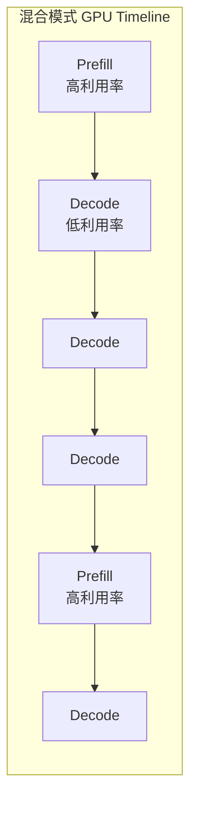
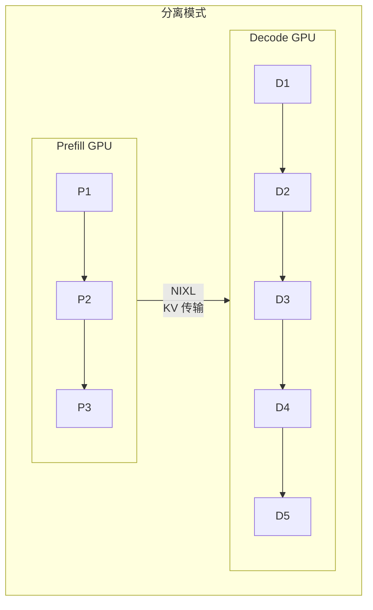
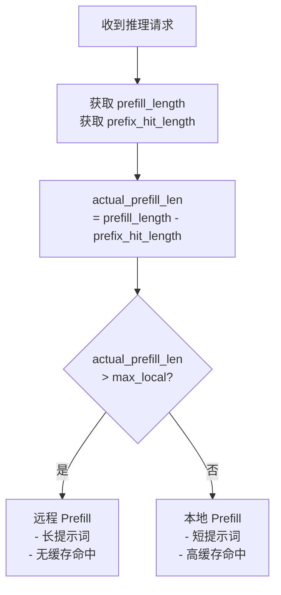
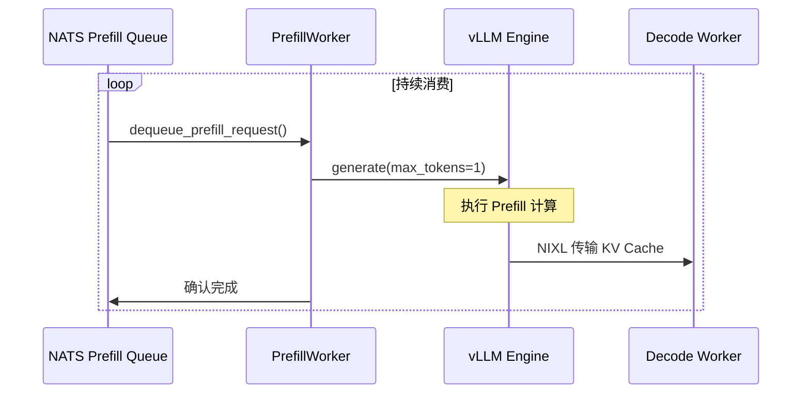
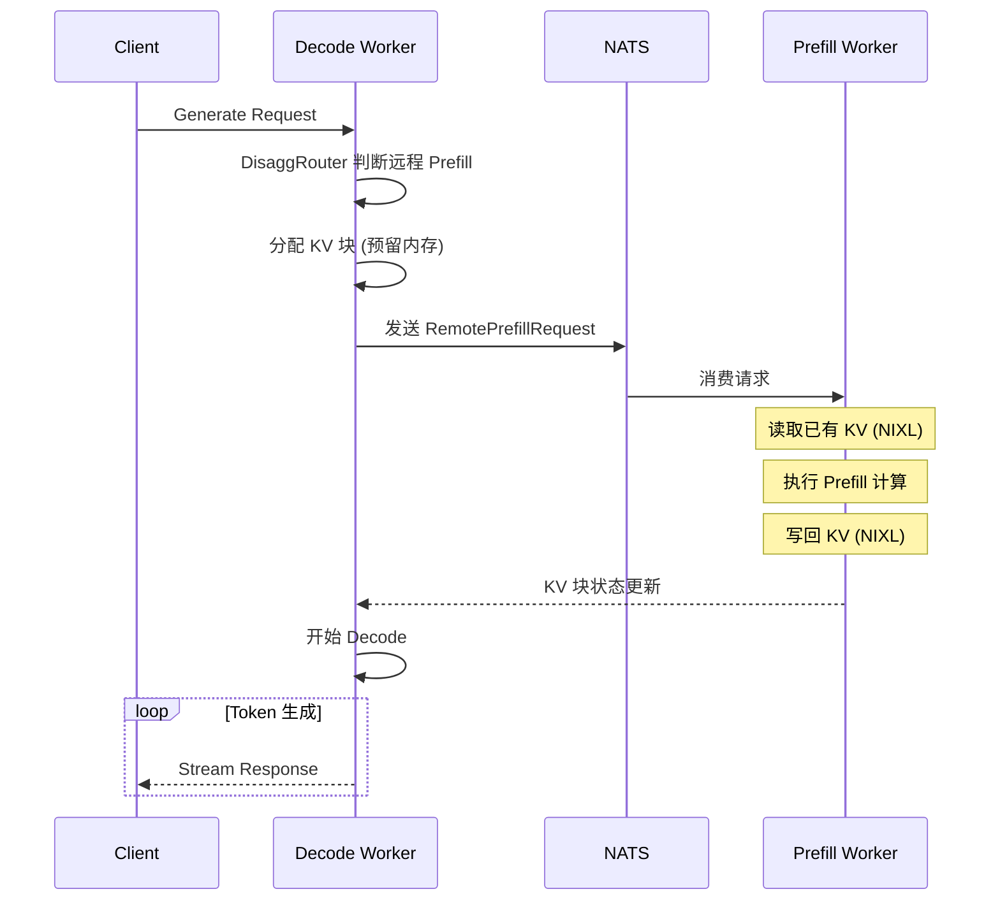

# Disaggregated Serving 详解

> 本文详细介绍 Dynamo 的 Disaggregated Serving（分离式服务），包括分离原理、DisaggregatedRouter 和远程 Prefill 流程。

---

## 1. 为什么需要分离式服务？

### 1.1 Prefill vs Decode 特性对比

| 特性 | Prefill 阶段 | Decode 阶段 |
|------|-------------|-------------|
| **计算类型** | 计算密集型 | 内存带宽密集型 |
| **处理数据** | 整个输入序列 | 每次 1 个 token |
| **GPU 利用率** | 高 (60-90%) | 低 (5-30%) |
| **持续时间** | 短 | 长 |
| **资源需求** | 高 FLOPS | 高内存带宽 |

### 1.2 混合执行的问题



**问题**：Prefill 和 Decode 交替执行，导致资源竞争和利用率波动。

### 1.3 分离式服务的解决方案



**优势**：
- 单节点吞吐提升 ~30%
- 多节点场景提升 2X+
- 更好的资源利用率

---

## 2. DisaggregatedRouter

### 2.1 核心功能

DisaggregatedRouter 负责决定每个请求应该本地 prefill 还是远程 prefill：

```rust
pub struct DisaggregatedRouter {
    max_local_prefill_length: Arc<Mutex<i32>>,
    model_name: String,
    config_watcher: Option<watch::Receiver<DisaggRouterConf>>,
}
```

### 2.2 路由决策逻辑



### 2.3 决策因素

| 因素 | 影响 |
|------|------|
| `prefill_length` | 输入 token 总数 |
| `prefix_hit_length` | 前缀缓存命中长度 |
| `max_local_prefill_length` | 本地 Prefill 阈值 |

### 2.4 动态配置

```rust
impl DisaggregatedRouter {
    pub fn prefill_remote(&self, prefill_length: i32, prefix_hit_length: i32) -> bool {
        let max_local_prefill_length = *self.max_local_prefill_length.lock().unwrap();

        // 实际需要计算的长度
        let actual_prefill_length = prefill_length - prefix_hit_length;

        // 超过阈值则远程 prefill
        actual_prefill_length > max_local_prefill_length
    }
}
```

---

## 3. PrefillWorker

### 3.1 服务定义

```python
@service(
    dynamo={
        "enabled": True,
        "namespace": "dynamo",
    },
    resources={"gpu": 1, "cpu": "10", "memory": "20Gi"},
    workers=1,
)
class PrefillWorker:
    """专用 Prefill Worker"""
```

### 3.2 配置约束

```python
def __init__(self):
    # Prefill Worker 特殊配置
    self.engine_args.enable_chunked_prefill = False
    self.engine_args.pipeline_parallel_size = 1
    self.engine_args.disable_async_output_proc = True
    self.engine_args.enforce_eager = True  # 必须同步执行
```

### 3.3 队列处理



---

## 4. 远程 Prefill 完整流程

### 4.1 时序图



### 4.2 RemotePrefillRequest

```python
class RemotePrefillRequest:
    request_id: str           # 请求 ID
    prompt_token_ids: List[int]  # Token IDs
    block_ids: List[int]      # Decode Worker 分配的块 ID
    engine_id: str            # Decode Worker 的引擎 ID
    sampling_params: SamplingParams
```

### 4.3 NIXL 传输


---

## 5. 部署配置

### 5.1 服务图定义

```python
# graphs/disagg.py
from components.frontend import Frontend
from components.prefill_worker import PrefillWorker
from components.processor import Processor
from components.worker import VllmWorker

Frontend.link(Processor).link(VllmWorker).link(PrefillWorker)
```

### 5.2 配置示例

```yaml
VllmWorker:
  model: deepseek-ai/DeepSeek-R1-Distill-Llama-8B
  enable-prefix-caching: true
  remote-prefill: true
  conditional-disagg: true
  max-local-prefill-length: 512
  ServiceArgs:
    workers: 4
    resources:
      gpu: 1

PrefillWorker:
  model: deepseek-ai/DeepSeek-R1-Distill-Llama-8B
  ServiceArgs:
    workers: 2
    resources:
      gpu: 1
```

---

## 6. 性能收益

| 场景 | 吞吐提升 | 说明 |
|------|----------|------|
| 单节点分离 | +30% | Prefill 和 Decode 独立调度 |
| 双节点分离 | +100%+ | 更多 Prefill 并行 |
| 高缓存命中 | 更高 | 减少实际 Prefill 计算 |

---

## 小结

本文介绍了 Dynamo 的 Disaggregated Serving：

1. **分离动机**：Prefill 和 Decode 资源特性不同
2. **DisaggregatedRouter**：智能路由决策
3. **PrefillWorker**：专用 Prefill 计算
4. **远程 Prefill 流程**：NATS 队列 + NIXL 传输

---

## 下一篇

继续阅读 [06-请求处理流程](06-request-processing.md)，了解完整的请求处理链路。
