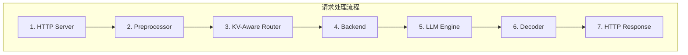
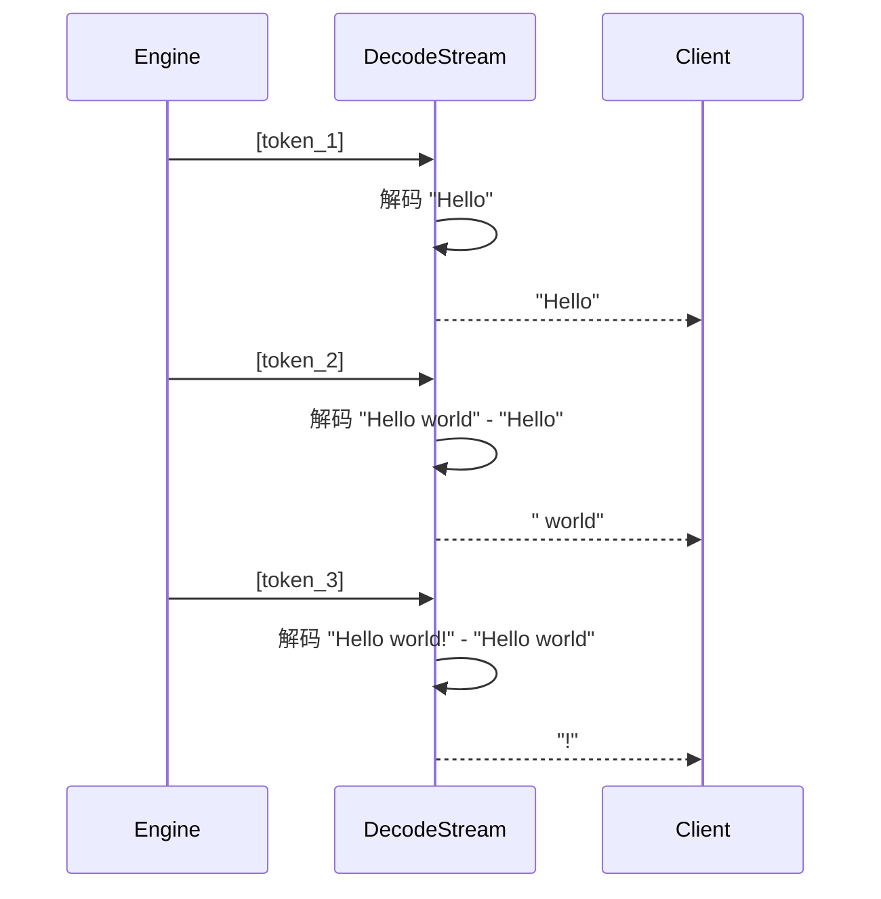
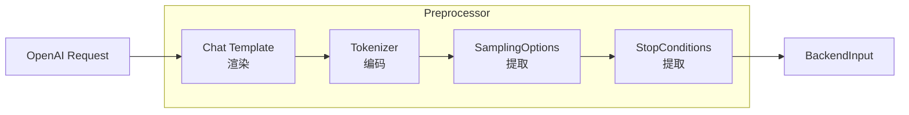
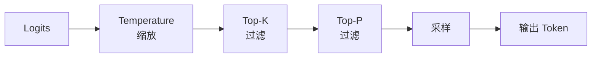
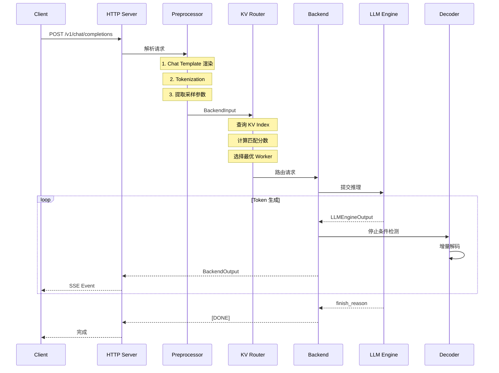

# 请求处理流程

> 本文介绍 Dynamo 的完整请求处理流程，从 HTTP 请求到流式响应。

---

## 1. 处理流程概览



---

## 2. Tokenization

### 2.1 Tokenizer 接口

```rust
pub trait Tokenizer: Send + Sync {
    fn encode(&self, text: &str) -> Result<Vec<u32>>;
    fn decode(&self, ids: &[u32]) -> Result<String>;
    fn vocab_size(&self) -> usize;
    fn eos_token_id(&self) -> Option<u32>;
    fn bos_token_id(&self) -> Option<u32>;
}
```

### 2.2 增量解码

```rust
pub struct DecodeStream {
    tokenizer: Arc<dyn Tokenizer>,
    ids: Vec<u32>,      // 累积的 token IDs
    prefix: String,     // 已解码的文本前缀
}

impl DecodeStream {
    /// 添加新 token 并返回增量文本
    pub fn add_tokens(&mut self, new_ids: &[u32]) -> Result<String> {
        self.ids.extend(new_ids);

        // 解码完整序列
        let full_text = self.tokenizer.decode(&self.ids)?;

        // 返回增量部分
        let delta = &full_text[self.prefix.len()..];
        self.prefix = full_text;

        Ok(delta.to_string())
    }
}
```

### 2.3 增量解码流程



---

## 3. Preprocessor

### 3.1 处理流程



### 3.2 Chat Template 渲染

```python
# 输入消息
messages = [
    {"role": "system", "content": "You are a helpful assistant."},
    {"role": "user", "content": "Hello!"}
]

# 渲染后的 prompt (Llama 3 格式)
prompt = """<|begin_of_text|><|start_header_id|>system<|end_header_id|>

You are a helpful assistant.<|eot_id|><|start_header_id|>user<|end_header_id|>

Hello!<|eot_id|><|start_header_id|>assistant<|end_header_id|>

"""
```

### 3.3 BackendInput 结构

```rust
pub struct BackendInput {
    pub token_ids: Vec<u32>,
    pub sampling_options: SamplingOptions,
    pub stop_conditions: StopConditions,
    pub mdcsum: String,  // 模型卡校验和
}
```

---

## 4. 采样参数

### 4.1 SamplingOptions

```rust
pub struct SamplingOptions {
    pub temperature: f32,        // 温度 (0.0-2.0)
    pub top_p: f32,              // Top-P 采样
    pub top_k: Option<u32>,      // Top-K 采样
    pub max_tokens: u32,         // 最大生成长度
    pub min_tokens: Option<u32>, // 最小生成长度
    pub repetition_penalty: Option<f32>,
    pub frequency_penalty: Option<f32>,
    pub presence_penalty: Option<f32>,
}
```

### 4.2 采样流程



---

## 5. 停止条件检测

### 5.1 StopConditions

```rust
pub struct StopConditions {
    pub stop_sequences: Vec<String>,
    pub include_stop_str_in_output: bool,
}
```

### 5.2 检测逻辑

```rust
impl Decoder {
    pub fn should_stop(&self, token_ids: &[u32], stop_sequences: &[String]) -> bool {
        // 1. 检查 EOS token
        if let Some(&last_token) = token_ids.last() {
            if self.eos_token_ids.contains(&last_token) {
                return true;
            }
        }

        // 2. 检查自定义停止序列
        for stop_seq in stop_sequences {
            if self.tok_trie.matches_suffix(token_ids, stop_seq) {
                return true;
            }
        }

        false
    }
}
```

### 5.3 FinishReason

```rust
pub enum FinishReason {
    EoS,            // 遇到 EOS token
    Length,         // 达到最大长度
    Stop,           // 匹配停止序列
    Error(String),  // 发生错误
    Cancelled,      // 被取消
}
```

---

## 6. 完整请求处理流程



---

## 7. HTTP 响应格式

### 7.1 SSE 流式响应

```
data: {"id":"chatcmpl-123","object":"chat.completion.chunk","model":"llama","choices":[{"delta":{"content":"Hi"}}]}

data: {"id":"chatcmpl-123","object":"chat.completion.chunk","model":"llama","choices":[{"delta":{"content":"!"}}]}

data: {"id":"chatcmpl-123","object":"chat.completion.chunk","model":"llama","choices":[{"finish_reason":"stop"}]}

data: [DONE]
```

### 7.2 非流式响应

```json
{
  "id": "chatcmpl-123",
  "object": "chat.completion",
  "model": "llama",
  "choices": [{
    "message": {
      "role": "assistant",
      "content": "Hi!"
    },
    "finish_reason": "stop"
  }],
  "usage": {
    "prompt_tokens": 10,
    "completion_tokens": 2,
    "total_tokens": 12
  }
}
```

---

## 8. 错误处理

### 8.1 错误类型

| 错误类型 | HTTP 状态码 | 说明 |
|---------|-------------|------|
| 模型不存在 | 404 | 请求的模型未部署 |
| 请求格式错误 | 400 | JSON 解析失败 |
| 超时 | 504 | 推理超时 |
| 引擎错误 | 500 | 推理引擎内部错误 |
| 取消 | 499 | 客户端断开连接 |

### 8.2 错误响应格式

```json
{
  "error": {
    "type": "invalid_request_error",
    "message": "Model 'gpt-5' not found",
    "code": "model_not_found"
  }
}
```

---

## 小结

本文介绍了 Dynamo 的完整请求处理流程：

1. **Tokenization**：文本编码和增量解码
2. **Preprocessor**：Chat Template 渲染
3. **采样参数**：Temperature、Top-P、Top-K
4. **停止条件**：EOS、Stop Sequences
5. **响应格式**：SSE 流式和非流式

---

## 下一章

完成本章阅读后，建议继续阅读 [第四章：KV Cache 管理与路由](../04-kv-cache-system/README.md)，了解 Dynamo 的 KV Cache 优化技术。
