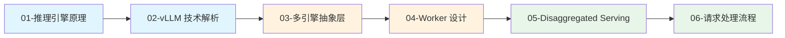
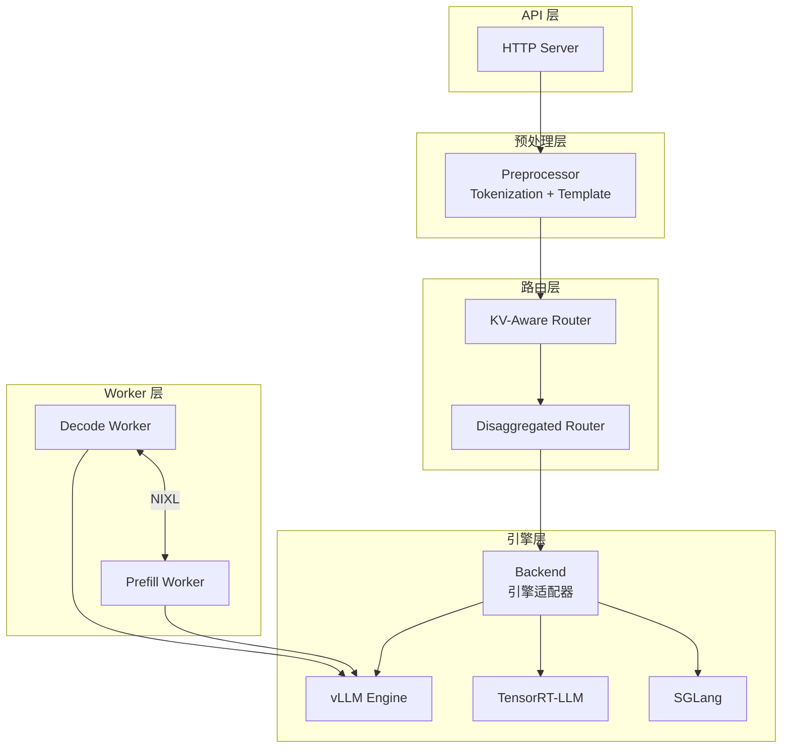

# 第三章：LLM 推理层原理

> Dynamo 的 LLM 推理层提供多引擎抽象、Worker 管理和 Disaggregated Serving 能力。

## 本章概述

本章深入解析 Dynamo 的 LLM 推理层，包括推理引擎原理、多引擎抽象层、Worker 设计、Disaggregated Serving 以及请求处理流程。

---

## 子文档列表

| 序号 | 文件 | 主题 | 内容简介 |
|------|------|------|----------|
| 1 | [01-inference-engine-basics.md](01-inference-engine-basics.md) | 推理引擎原理 | 模型加载、批处理、内存管理 |
| 2 | [02-vllm-internals.md](02-vllm-internals.md) | vLLM 技术解析 | PagedAttention、调度器设计 |
| 3 | [03-multi-engine-abstraction.md](03-multi-engine-abstraction.md) | 多引擎抽象层 | AsyncEngine Trait、引擎适配 |
| 4 | [04-worker-design.md](04-worker-design.md) | Worker 设计详解 | VllmWorker、生命周期、指标发布 |
| 5 | [05-disaggregated-serving.md](05-disaggregated-serving.md) | Disaggregated Serving | 分离原理、Router、远程 Prefill |
| 6 | [06-request-processing.md](06-request-processing.md) | 请求处理流程 | Tokenization、Sampling、Streaming |

---

## 阅读顺序建议

**推荐路径**：

- **新手路径**：按顺序阅读，从推理引擎基础开始
- **快速上手**：直接阅读 [04-Worker 设计](04-worker-design.md) 和 [05-Disaggregated Serving](05-disaggregated-serving.md)
- **深入理解**：重点关注 [02-vLLM 技术解析](02-vllm-internals.md)

---

## 关键概念速查

| 概念 | 说明 | 详见文档 |
|------|------|----------|
| **PagedAttention** | vLLM 的分页 KV Cache 管理 | [02-vllm-internals.md](02-vllm-internals.md) |
| **Continuous Batching** | 动态批处理技术 | [01-inference-engine-basics.md](01-inference-engine-basics.md) |
| **AsyncEngine** | 推理引擎抽象接口 | [03-multi-engine-abstraction.md](03-multi-engine-abstraction.md) |
| **VllmWorker** | vLLM 推理 Worker | [04-worker-design.md](04-worker-design.md) |
| **DisaggregatedRouter** | Prefill/Decode 分离路由器 | [05-disaggregated-serving.md](05-disaggregated-serving.md) |
| **PrefillWorker** | 专用 Prefill 计算 Worker | [05-disaggregated-serving.md](05-disaggregated-serving.md) |
| **BackendInput** | 引擎输入数据结构 | [06-request-processing.md](06-request-processing.md) |

---

## 架构总览

---

## 下一章

完成本章阅读后，建议继续阅读 [第四章：KV Cache 管理与路由](../04-kv-cache-system/README.md)，了解 Dynamo 的 KV Cache 优化技术。
