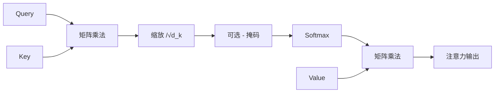
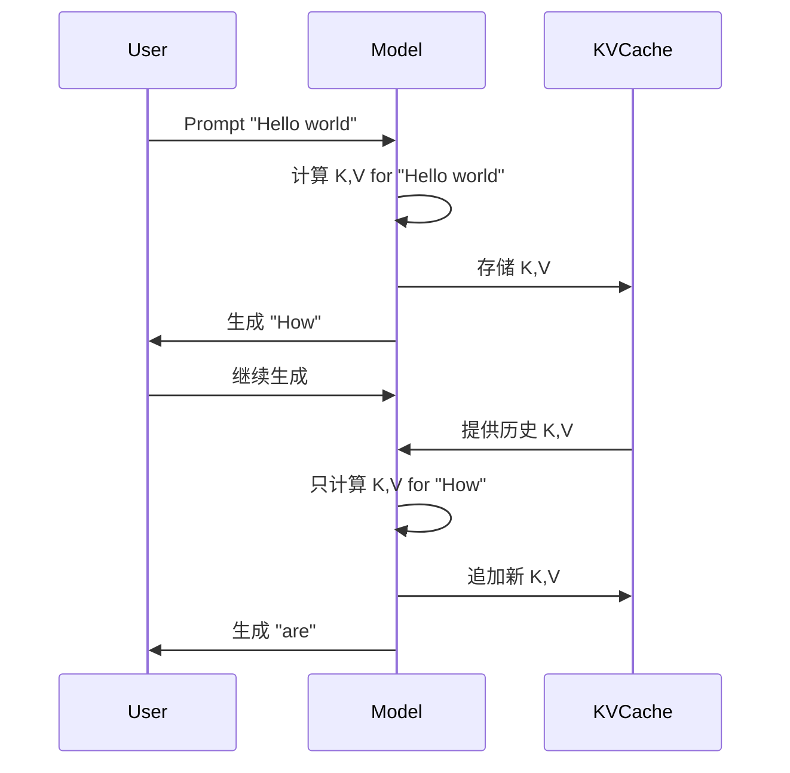
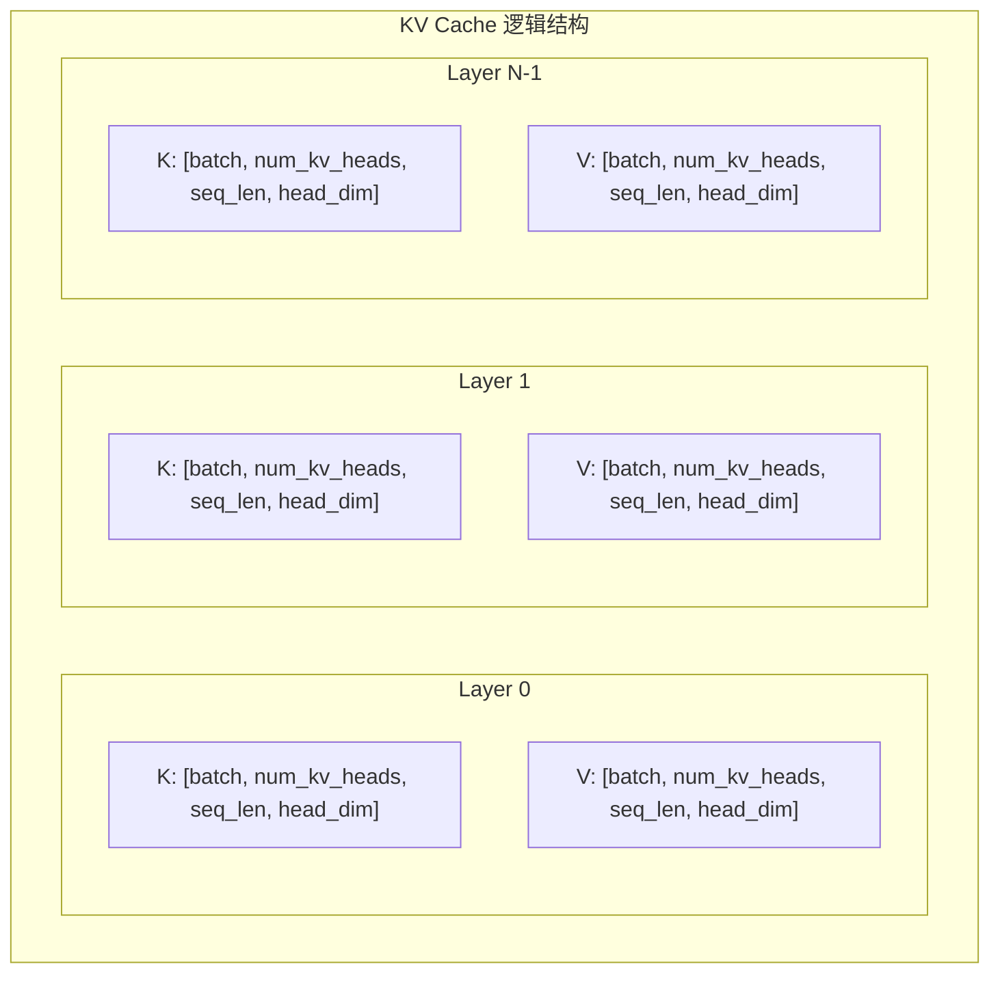
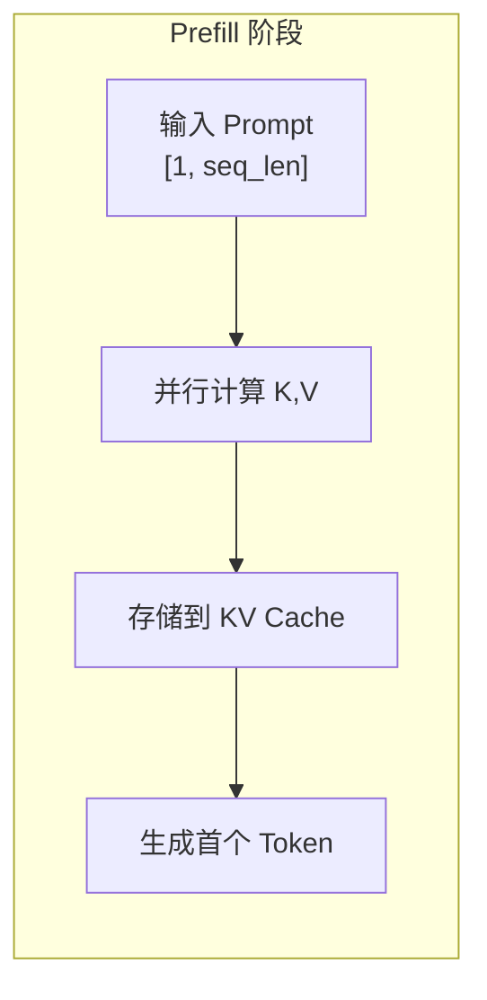
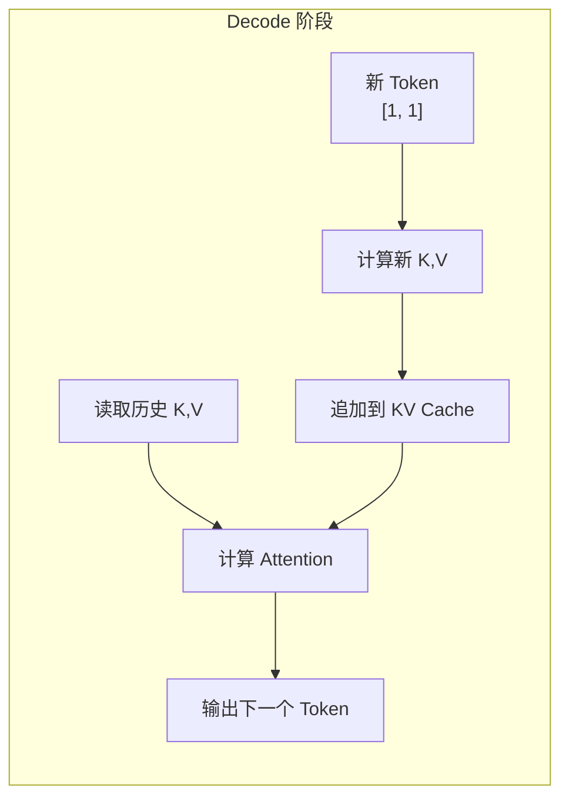
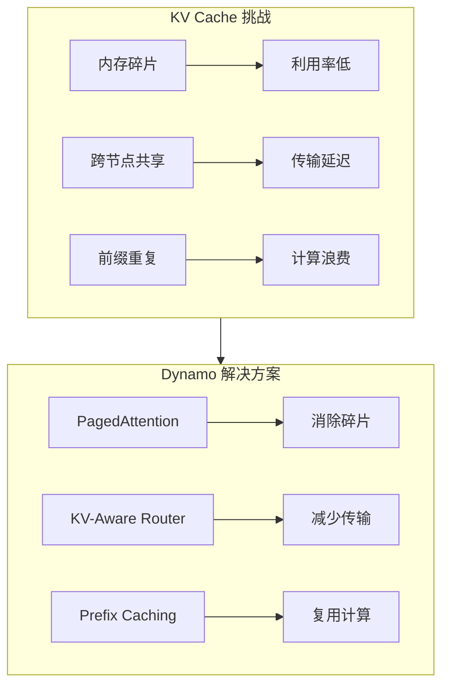

> 理解 KV Cache 是掌握 LLM 推理优化的基础。本文档从 Self-Attention 机制出发，深入解析 KV Cache 的工作原理和内存特性。

---

## 1. Self-Attention 机制回顾

### 1.1 Q/K/V 计算

在 Transformer 架构中，Self-Attention 是核心组件。对于输入序列 $X \in \mathbb{R}^{n \times d}$（$n$ 为序列长度，$d$ 为隐藏维度），Self-Attention 首先将其投影为 Query、Key、Value 三个矩阵：

$$
Q = X \cdot W_Q, \quad K = X \cdot W_K, \quad V = X \cdot W_V
$$

其中 $W_Q, W_K, W_V \in \mathbb{R}^{d \times d_k}$ 是可学习的投影矩阵。

```
输入 X [batch, seq_len, hidden_dim]
       │
       ├─── W_Q ───> Q [batch, seq_len, head_dim]
       │
       ├─── W_K ───> K [batch, seq_len, head_dim]  ← 这是需要缓存的
       │
       └─── W_V ───> V [batch, seq_len, head_dim]  ← 这是需要缓存的
```

### 1.2 Attention Score 计算

Attention 的核心公式为：

$$
\text{Attention}(Q, K, V) = \text{softmax}\left(\frac{QK^T}{\sqrt{d_k}}\right) \cdot V
$$

计算流程：



### 1.3 Multi-Head Attention

实际模型使用多头注意力，将注意力空间划分为多个子空间并行计算：

```
Multi-Head Attention:
┌─────────────────────────────────────────────────────────┐
│  Head 1: Q₁K₁ᵀV₁                                        │
│  Head 2: Q₂K₂ᵀV₂                                        │
│  ...                                                    │
│  Head h: QₕKₕᵀVₕ                                        │
│                                                         │
│  最终输出 = Concat(Head₁, Head₂, ..., Headₕ) · W_O     │
└─────────────────────────────────────────────────────────┘
```

---

## 2. 为什么需要 KV Cache

### 2.1 自回归生成的计算冗余

在自回归生成过程中，模型逐 Token 生成输出。每生成一个新 Token，都需要计算它与所有历史 Token 的注意力关系：

```
自回归生成过程：
Step 1: "Hello"        → 计算 K,V for "Hello"
Step 2: "Hello world"  → 重新计算 K,V for "Hello world" ❌ 浪费！
                       → 只计算 K,V for "world"，复用 "Hello" 的 K,V ✓ 高效！
```

### 2.2 复杂度分析

**没有 KV Cache 的情况**：
- 每生成一个 Token，需要重新计算所有历史 Token 的 K 和 V
- 时间复杂度：$O(n^2)$（$n$ 为当前序列长度）
- 生成 $m$ 个 Token 的总复杂度：$O(m \cdot n^2)$

**有 KV Cache 的情况**：
- 缓存历史 Token 的 K 和 V，只计算新 Token 的 K 和 V
- 每步时间复杂度：$O(n)$
- 生成 $m$ 个 Token 的总复杂度：$O(m \cdot n)$



---

## 3. KV Cache 内存占用

### 3.1 计算公式

KV Cache 的内存占用公式为：

$$
\text{KV Cache 大小} = 2 \times L \times H \times D \times S \times B \times \text{dtype\_size}
$$

其中：
- $2$：K 和 V 两个矩阵
- $L$：层数（num_layers）
- $H$：注意力头数（num_heads）
- $D$：每头维度（head_dim）
- $S$：序列长度（seq_len）
- $B$：批大小（batch_size）
- dtype_size：数据类型字节数（FP16=2，FP8=1）

### 3.2 实际案例计算

**Llama 70B 模型参数**：

| 参数 | 值 |
|------|-----|
| 层数 L | 80 |
| 注意力头数 H | 64 (GQA: KV头=8) |
| 每头维度 D | 128 |
| 数据类型 | FP16 (2 bytes) |

对于单个请求、序列长度 4096：

$$
\text{KV 大小} = 2 \times 80 \times 8 \times 128 \times 4096 \times 2 = 1.34 \text{ GB}
$$

### 3.3 内存增长曲线

```
KV Cache 内存 (Llama 70B, FP16)
     │
 8GB ┤                                    ╱
     │                                  ╱
 6GB ┤                                ╱
     │                              ╱
 4GB ┤                            ╱
     │                          ╱
 2GB ┤                        ╱
     │                      ╱
 1GB ┤────────────────────╱
     │
     └──────┬──────┬──────┬──────┬──────┬───
          1K    2K    4K    8K   16K   序列长度
```

---

## 4. KV Cache 数据结构

### 4.1 逻辑视图



### 4.2 物理布局

在 GPU 内存中，KV Cache 通常按以下方式组织：

```
GPU HBM 内存布局：
┌────────────────────────────────────────────────────────┐
│  Model Weights (固定)                                  │
├────────────────────────────────────────────────────────┤
│  Activations (临时)                                    │
├────────────────────────────────────────────────────────┤
│  KV Cache Pool                                         │
│  ┌──────────┬──────────┬──────────┬──────────┐        │
│  │ Request 1│ Request 2│ Request 3│   ...    │        │
│  │ KV Blocks│ KV Blocks│ KV Blocks│          │        │
│  └──────────┴──────────┴──────────┴──────────┘        │
└────────────────────────────────────────────────────────┘
```

---

## 5. Prefill 与 Decode 阶段

### 5.1 Prefill 阶段

Prefill 阶段处理输入 Prompt，一次性计算所有输入 Token 的 KV：



**特点**：
- 计算密集：大量矩阵乘法
- 内存写入：填充 KV Cache
- 延迟决定 TTFT（Time To First Token）

### 5.2 Decode 阶段

Decode 阶段逐个生成 Token，每次只处理一个新 Token：



**特点**：
- 内存密集：频繁读取 KV Cache
- 低计算强度：每次只处理 1 个 Token
- 延迟决定生成速度

### 5.3 两阶段对比

| 维度 | Prefill | Decode |
|------|---------|--------|
| 输入大小 | N tokens | 1 token |
| 计算模式 | 计算密集 | 内存密集 |
| KV Cache | 写入 | 读取 + 追加 |
| 瓶颈 | GPU 算力 | 内存带宽 |
| 优化方向 | Tensor 并行 | 批处理 |

---

## 6. 与 Dynamo 的关联

### 6.1 KV Cache 管理的挑战

在分布式推理场景中，KV Cache 带来新的挑战：



### 6.2 后续章节预览

本章后续文档将详细介绍：

1. **KV Cache 优化技术综述**：PagedAttention、Prefix Caching、Offloading
2. **KV-Aware Router**：基于 KV 命中的智能路由
3. **RadixTree 索引**：高效的前缀匹配数据结构
4. **KV Cache Manager**：块分配与多层存储
5. **KV 事件系统**：分布式状态同步

---

## 总结

KV Cache 是 LLM 推理优化的核心技术：

1. **原理**：缓存历史 Token 的 K、V 矩阵，避免重复计算
2. **收益**：将生成复杂度从 $O(m \cdot n^2)$ 降低到 $O(m \cdot n)$
3. **代价**：显著的内存占用，随序列长度线性增长
4. **挑战**：内存碎片、分布式共享、前缀复用

理解这些基础知识，是深入学习 Dynamo KV Cache 系统的前提。

---

## 参考资料

- [Attention Is All You Need](https://arxiv.org/abs/1706.03762) - Transformer 原论文
- [vLLM: Easy, Fast, and Cheap LLM Serving](https://arxiv.org/abs/2309.06180) - PagedAttention
