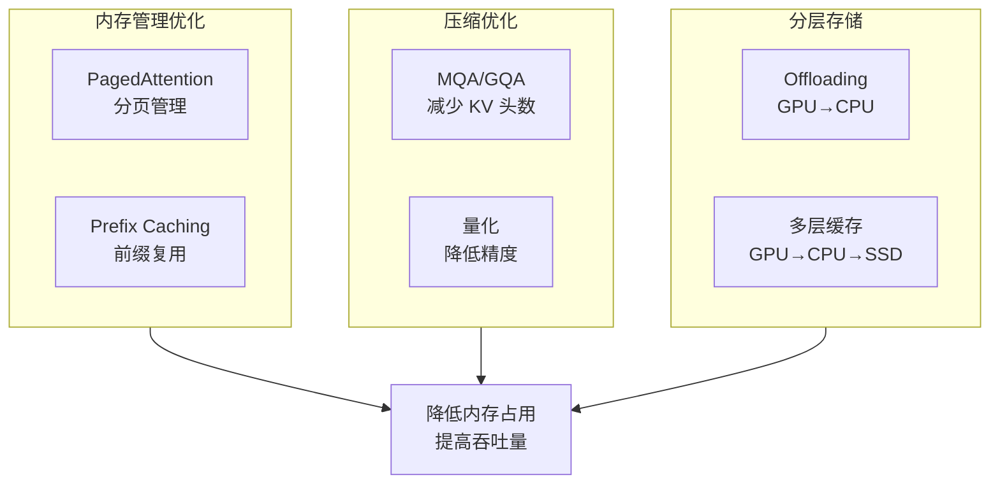
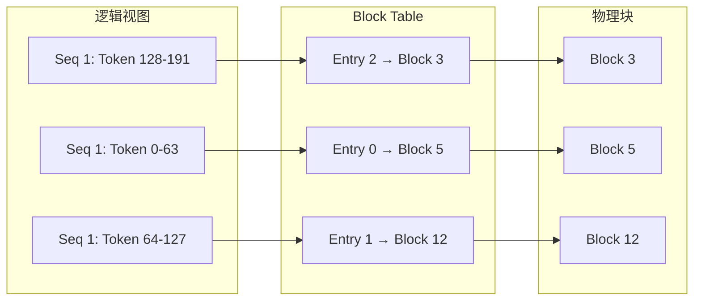
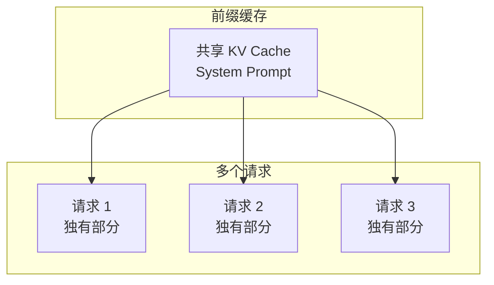
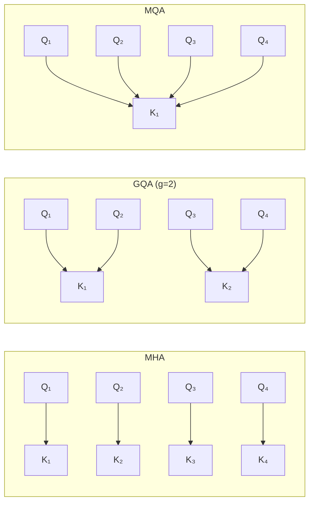
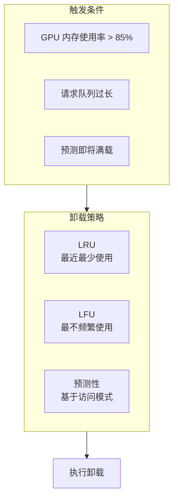
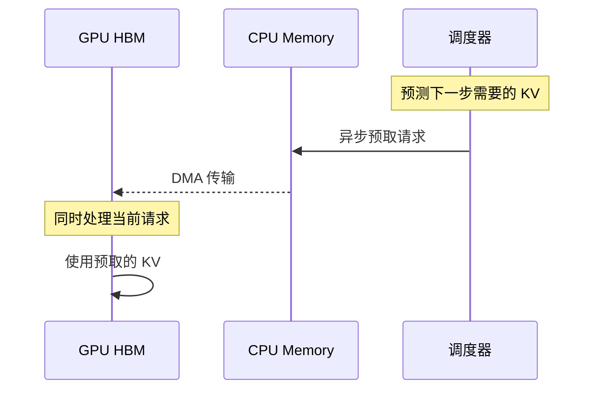
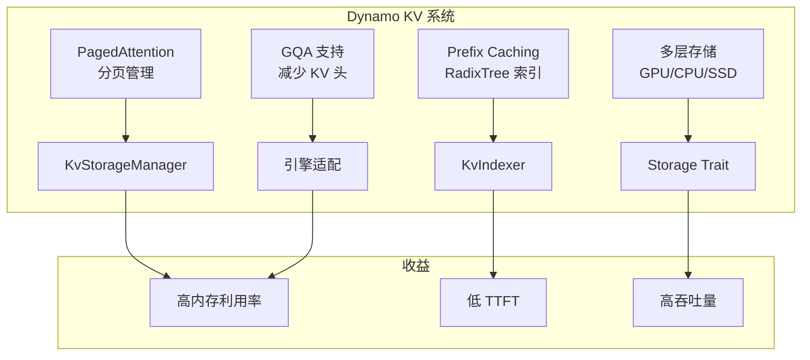

# KV Cache 优化技术综述

> 本文档综述 KV Cache 的主要优化技术，包括 PagedAttention、Prefix Caching、KV Compression 和 Offloading，为理解 Dynamo 的设计提供背景。

---

## 1. 优化技术全景



---

## 2. PagedAttention（vLLM）

### 2.1 传统连续内存的问题

传统方法为每个请求预分配连续内存空间，存在严重问题：

```
传统连续内存布局：
┌──────────────────────────────────────────────┐
│ Seq 1 KV [████████████░░░░░░░░░░░░░░░░░░░░] │ ← 内存碎片
│ Seq 2 KV [████████░░░░░░░░░░░░░░░░░░░░░░░░] │ ← 预分配浪费
│ Seq 3 KV [██████████████████████░░░░░░░░░░] │
└──────────────────────────────────────────────┘

问题：
1. 必须预分配最大长度 → 内存浪费
2. 不同请求长度不同 → 外部碎片
3. 无法动态扩展 → 灵活性差
```

### 2.2 PagedAttention 核心思想

借鉴操作系统的虚拟内存分页机制，将 KV Cache 组织为固定大小的块：

```
PagedAttention 分页布局：
┌────┬────┬────┬────┬────┬────┬────┬────┐
│ S1 │ S1 │ S2 │ S3 │ S3 │ S3 │ S1 │ S2 │  ← 灵活分配
│ B0 │ B1 │ B0 │ B0 │ B1 │ B2 │ B2 │ B1 │
└────┴────┴────┴────┴────┴────┴────┴────┘

Page Table:
Seq 1: [Block 0] → [Block 1] → [Block 6]
Seq 2: [Block 2] → [Block 7]
Seq 3: [Block 3] → [Block 4] → [Block 5]
```

### 2.3 块表（Block Table）



### 2.4 优势总结

| 优势 | 说明 |
|------|------|
| 消除碎片 | 固定大小块，无外部碎片 |
| 按需分配 | 动态增长，无需预分配 |
| 内存复用 | 请求结束立即回收 |
| Copy-on-Write | 支持 Beam Search 等场景 |

---

## 3. Prefix Caching

### 3.1 前缀复用场景

许多 LLM 应用存在大量相同前缀：

```
请求 1: "You are a helpful assistant. User: What is AI?"
请求 2: "You are a helpful assistant. User: How does ML work?"
          └──────── 共同前缀 ────────┘

System Prompt 通常占 100-1000 tokens，重复出现在每个请求中
```

### 3.2 Prefix Caching 机制



### 3.3 收益分析

| 场景 | 前缀长度 | 节省计算 |
|------|----------|----------|
| System Prompt | 100-500 tokens | 10-30% |
| Multi-turn 对话 | 1000-4000 tokens | 50-80% |
| RAG 上下文 | 2000-8000 tokens | 60-90% |
| 结构化输出 | 200-500 tokens | 10-20% |

### 3.4 实现挑战

1. **缓存键设计**：如何高效识别相同前缀？
2. **缓存失效**：何时清理过期缓存？
3. **并发安全**：多请求同时访问同一前缀？

Dynamo 使用 **RadixTree + Block Hash** 解决这些问题（后续文档详细介绍）。

---

## 4. KV Cache 压缩

### 4.1 Multi-Query Attention (MQA)

所有 Query 头共享同一组 K 和 V：

```
MHA (原始):           MQA (压缩):
Q₁ Q₂ Q₃ Q₄           Q₁ Q₂ Q₃ Q₄
│  │  │  │             │  │  │  │
K₁ K₂ K₃ K₄           K₁ K₁ K₁ K₁  ← 只有 1 组 KV
V₁ V₂ V₃ V₄           V₁ V₁ V₁ V₁

内存减少: H → 1 (如 64 → 1)
```

### 4.2 Grouped-Query Attention (GQA)

每 $g$ 个 Query 头共享一组 K 和 V：

```
MHA (原始):           GQA (分组):
Q₁ Q₂ Q₃ Q₄           Q₁ Q₂ Q₃ Q₄
│  │  │  │             │  │  │  │
K₁ K₂ K₃ K₄           K₁ K₁ K₂ K₂  ← 2 组 KV
V₁ V₂ V₃ V₄           V₁ V₁ V₂ V₂

内存减少: H → H/g (如 64 → 8)
```

### 4.3 三种注意力对比



### 4.4 模型适配

| 模型 | 注意力类型 | KV 头数 | Query 头数 |
|------|-----------|---------|-----------|
| Llama 2 70B | GQA | 8 | 64 |
| Llama 3 70B | GQA | 8 | 64 |
| Mistral 7B | GQA | 8 | 32 |
| Falcon 40B | MQA | 1 | 64 |

---

## 5. KV Cache Offloading

### 5.1 分层存储架构

当 GPU 内存不足时，可以将部分 KV Cache 卸载到 CPU 或 SSD：

```
              ┌─────────────┐
              │   GPU HBM   │  ← 最快，最小 (80GB/A100)
              │  ~1 TB/s    │
              └──────┬──────┘
                     │ 卸载
              ┌──────┴──────┐
              │ Pinned CPU  │  ← 快，较大 (~128GB-1TB)
              │  ~25 GB/s   │
              └──────┬──────┘
                     │ 卸载
              ┌──────┴──────┐
              │  System RAM │  ← 中等，大 (~1TB-2TB)
              │  ~10 GB/s   │
              └──────┬──────┘
                     │ 卸载
              ┌──────┴──────┐
              │  NVMe SSD   │  ← 较慢，很大 (~10TB+)
              │  ~7 GB/s    │
              └─────────────┘
```

### 5.2 Offloading 策略



### 5.3 预取机制

为了减少 Offloading 带来的延迟，需要预取机制：



---

## 6. Dynamo 的综合优化

### 6.1 技术整合

Dynamo 综合运用多种优化技术：



### 6.2 KV-Aware 路由

Dynamo 独特的 KV-Aware 路由机制：

1. **索引 KV 位置**：使用 RadixTree 跟踪每个 Worker 的 KV Cache
2. **计算重叠**：新请求与各 Worker KV 的前缀重叠度
3. **智能路由**：将请求发送到 KV 命中率最高的 Worker

详见后续 [03-kv-aware-router.md](03-kv-aware-router.md)。

---

## 7. 性能影响

### 7.1 优化前后对比

| 指标 | 无优化 | 有优化 | 提升 |
|------|--------|--------|------|
| 内存利用率 | ~50% | ~95% | 1.9x |
| 并发请求数 | 4 | 16 | 4x |
| TTFT | 500ms | 200ms | 2.5x |
| 吞吐量 | 100 tok/s | 500 tok/s | 5x |

### 7.2 关键配置参数

| 参数 | 说明 | 推荐值 |
|------|------|--------|
| `block_size` | 每块 Token 数 | 16-128 |
| `gpu_memory_utilization` | GPU 内存使用率 | 0.85-0.95 |
| `max_num_seqs` | 最大并发序列 | 根据模型调整 |
| `enable_prefix_caching` | 启用前缀缓存 | true |

---

## 总结

KV Cache 优化技术的核心思想：

1. **PagedAttention**：分页管理，消除碎片
2. **Prefix Caching**：复用共同前缀，减少计算
3. **GQA/MQA**：减少 KV 头数，降低内存
4. **Offloading**：多层存储，扩展容量

Dynamo 综合运用这些技术，并创新性地引入 KV-Aware 路由，在分布式场景下实现高效的 KV Cache 管理。

---

## 参考资料

- [vLLM: Easy, Fast, and Cheap LLM Serving](https://arxiv.org/abs/2309.06180)
- [GQA: Training Generalized Multi-Query Transformer Models](https://arxiv.org/abs/2305.13245)
- [FlexGen: High-Throughput Generative Inference](https://arxiv.org/abs/2303.06865)
