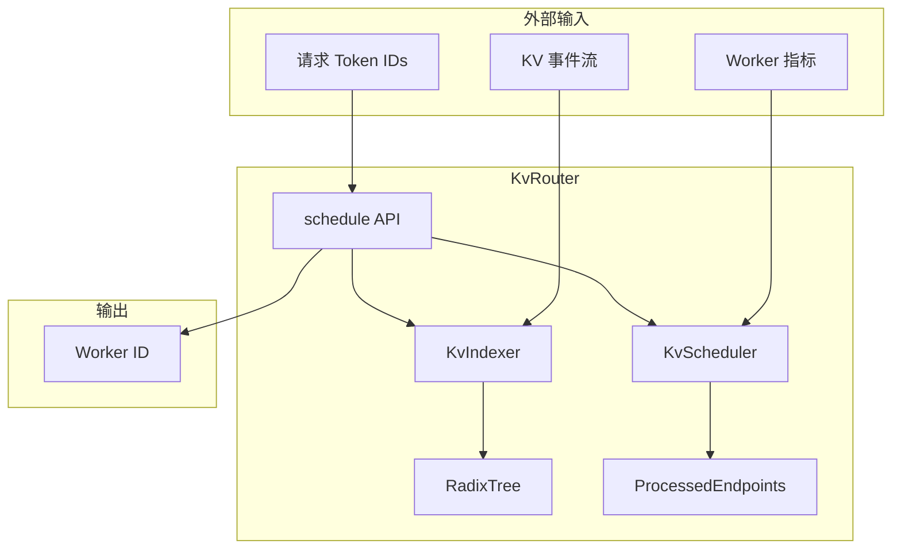
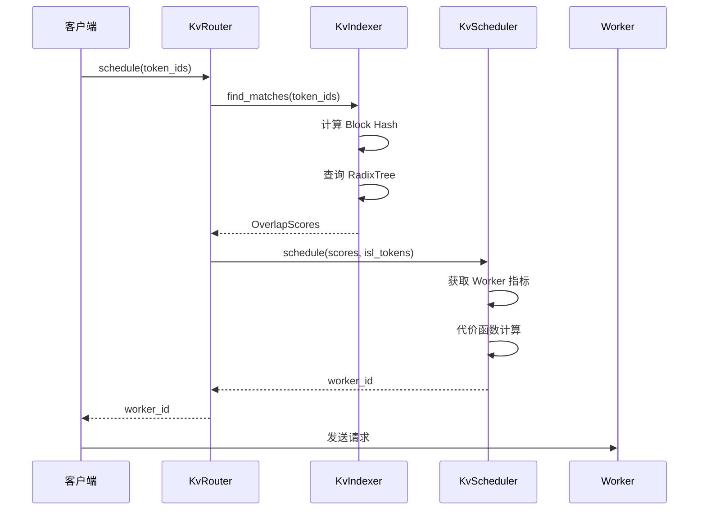
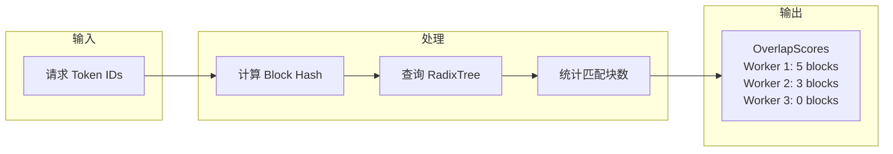
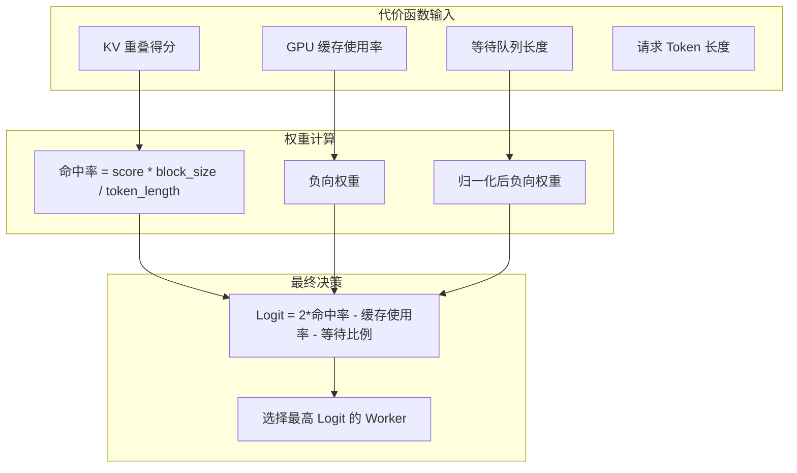
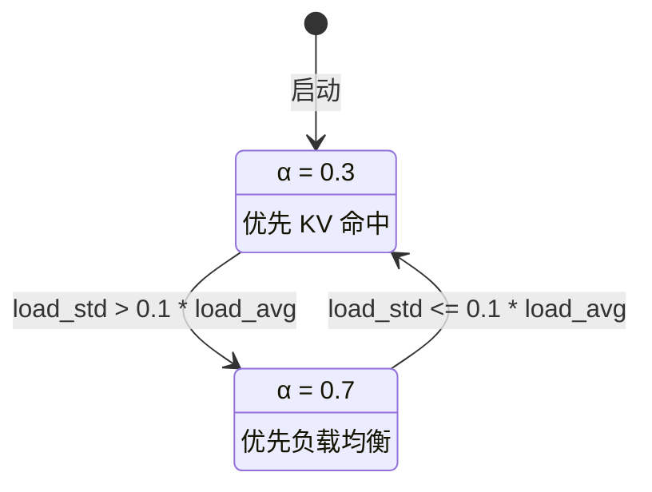

# KV-Aware Router 详解

> KV-Aware Router 是 Dynamo 的核心创新之一。本文档详细解析其设计原理、评分机制和代价函数。

---

## 1. 路由问题定义

### 1.1 传统负载均衡的局限

传统负载均衡策略（Round-Robin、Random、Least-Connections）不考虑 KV Cache 状态：

```
传统负载均衡：
请求 "Hello world" → Worker 1 (计算并缓存 KV)
请求 "Hello there" → Worker 2 (重新计算 "Hello" 的 KV) ❌ 浪费！

KV-Aware 路由：
请求 "Hello world" → Worker 1 (计算并缓存 KV)
请求 "Hello there" → Worker 1 (复用 "Hello" 的 KV) ✓ 高效！
```

### 1.2 KV Cache 命中的价值

KV Cache 命中可以：
1. **避免重复 Prefill**：节省计算资源
2. **降低 TTFT**：更快返回首个 Token
3. **提高吞吐量**：同等资源处理更多请求

**量化分析**：

| 场景 | 无 KV 复用 | 有 KV 复用 | 收益 |
|------|-----------|-----------|------|
| System Prompt (500 tokens) | 50ms | 5ms | 90% ↓ |
| Multi-turn (2000 tokens) | 200ms | 20ms | 90% ↓ |
| 长上下文 (8000 tokens) | 800ms | 80ms | 90% ↓ |

---

## 2. KV-Aware Router 架构

### 2.1 整体架构



### 2.2 核心组件

```rust
// lib/llm/src/kv_router.rs
pub struct KvRouter {
    /// 服务名称
    service_name: String,
    /// 取消令牌
    cancellation_token: CancellationToken,
    /// 调度器
    scheduler: KvScheduler,
    /// 索引器
    indexer: KvIndexer,
}
```

---

## 3. 调度流程

### 3.1 请求处理流程



### 3.2 调度 API

```rust
impl KvRouter {
    /// 调度请求到最优 Worker
    pub async fn schedule(&self, token_ids: &Vec<u32>, _lora_id: u64) -> Result<i64> {
        let isl_tokens = token_ids.len();

        // 1. 查询 KV 重叠
        let overlap_scores = self
            .indexer
            .find_matches_for_request(token_ids.as_slice())
            .await?;

        // 2. 调度决策
        let worker_id = self.scheduler.schedule(overlap_scores, isl_tokens).await?;

        Ok(worker_id)
    }
}
```

---

## 4. OverlapScores 评分机制

### 4.1 评分结构

```rust
/// 记录每个 Worker 的重叠块数
#[derive(Debug, Clone, Default)]
pub struct OverlapScores {
    /// Worker ID → 匹配的块数
    pub scores: HashMap<WorkerId, usize>,
}

impl OverlapScores {
    /// 获取最高得分的 Worker
    pub fn best_worker(&self) -> Option<WorkerId> {
        self.scores
            .iter()
            .max_by_key(|(_, &score)| score)
            .map(|(&worker_id, _)| worker_id)
    }

    /// 获取最高得分
    pub fn max_score(&self) -> usize {
        self.scores.values().copied().max().unwrap_or(0)
    }
}
```

### 4.2 评分计算



---

## 5. 代价函数设计

### 5.1 多因素权衡

代价函数需要平衡多个因素：

| 因素 | 权重方向 | 说明 |
|------|----------|------|
| KV 重叠率 | 正向 | 重叠越多越好 |
| GPU 负载 | 负向 | 负载越低越好 |
| 等待队列 | 负向 | 队列越短越好 |
| 负载均衡 | 动态 | 防止热点 |

### 5.2 Python 实现

```python
# examples/llm/components/kv_router.py
def _cost_function(
    self,
    scores: OverlapScores | None,
    metrics: AggregatedMetrics | None,
    token_length: int,
):
    """代价函数：决定最佳路由目标"""

    # 1. 计算 KV 命中率得分
    worker_scores = {}
    if scores:
        for worker_id, score in scores.scores.items():
            # score 是匹配的块数，乘以 block_size 得到 token 数
            # 除以 token_length 得到命中率
            worker_scores[worker_id] = (
                score * self.indexer.block_size() / token_length
            )

    # 2. 收集 Worker 指标
    worker_metrics = {}
    max_waiting = 0.0
    if metrics:
        for endpoint in metrics.endpoints:
            worker_id = endpoint.worker_id
            worker_metrics[worker_id] = {
                "gpu_cache_usage_perc": getattr(endpoint, "gpu_cache_usage_perc", 0.0),
                "num_requests_waiting": getattr(endpoint, "num_requests_waiting", 0.0),
            }
            max_waiting = max(max_waiting, worker_metrics[worker_id]["num_requests_waiting"])

    # 3. 计算综合 Logit
    worker_logits = {}
    for worker_id in self.workers_client.endpoint_ids():
        score = worker_scores.get(worker_id, 0.0)
        metrics_dict = worker_metrics.get(worker_id, {
            "gpu_cache_usage_perc": 0.0,
            "num_requests_waiting": 0.0,
        })

        normalized_waiting = (
            metrics_dict["num_requests_waiting"] / max_waiting
            if max_waiting > 0 else 0.0
        )

        # 代价函数:
        # - 2 * score: KV 命中权重（正向）
        # - gpu_cache_usage_perc: GPU 缓存使用率（负向）
        # - normalized_waiting: 等待队列长度（负向）
        worker_logits[worker_id] = (
            2 * score
            - metrics_dict["gpu_cache_usage_perc"]
            - normalized_waiting
        )

    # 4. 选择最高 Logit 的 Worker
    if not worker_logits or all(logit == 0 for logit in worker_logits.values()):
        return ""

    max_logit = max(worker_logits.values())
    best_workers = [wid for wid, logit in worker_logits.items() if logit == max_logit]
    best_worker_id = random.choice(best_workers)  # 随机选择打平的 Worker

    return best_worker_id, worker_scores.get(best_worker_id, 0.0)
```

### 5.3 Rust 实现

```rust
// lib/llm/src/kv_router/scheduler.rs
pub fn select_worker(
    workers: &mut ProcessedEndpoints,
    request: &SchedulingRequest,
    kv_block_size: usize,
) -> Result<i64, KvSchedulerError> {
    // 负载均衡模式判断
    let balance_threshold: f64 = 0.1;
    let balance_mode = workers.load_std > balance_threshold * workers.load_avg;

    // 动态调整 alpha 权重
    let alpha = if balance_mode { 0.7 } else { 0.3 };
    let gamma = 0.1;

    let mut best_index = None;
    let mut best_cost = f64::INFINITY;

    for (i, w) in workers.endpoints.iter().enumerate() {
        // 排除已满的 Worker
        if w.data.request_active_slots >= w.data.request_total_slots
            || w.data.kv_active_blocks >= w.data.kv_total_blocks
        {
            continue;
        }

        // 计算 KV 负载比例
        let kv_load_ratio = w.data.kv_active_blocks as f64 / w.data.kv_total_blocks as f64;
        let load_deviation = kv_load_ratio - workers.load_avg;

        // 获取重叠得分
        let worker_id = workers.worker_ids[i];
        let overlap_score = request.overlap.scores.get(&worker_id).map_or(0, |x| *x);
        let overlap_tokens = overlap_score * kv_block_size;

        // 计算新增 Token 数
        let new_tokens = request.isl_tokens.saturating_sub(overlap_tokens);
        let normalized_new_tokens = new_tokens as f64 / request.isl_tokens as f64;

        // 计算请求负载比例
        let request_load_ratio =
            w.data.request_active_slots as f64 / w.data.request_total_slots as f64;

        // 综合代价函数
        // cost = α * load_deviation + (1-α) * normalized_new_tokens + γ * request_load_ratio
        let cost = alpha * load_deviation
            + (1.0 - alpha) * normalized_new_tokens
            + gamma * request_load_ratio;

        if cost < best_cost {
            best_cost = cost;
            best_index = Some(i);
        }
    }

    match best_index {
        Some(i) => {
            workers.endpoints[i].data.request_active_slots += 1;
            Ok(workers.endpoints[i].worker_id())
        }
        None => Err(KvSchedulerError::AllWorkersBusy),
    }
}
```

### 5.4 代价函数可视化



---

## 6. 动态权重调整

### 6.1 负载均衡模式

当系统负载不均衡时，自动调整权重：

```rust
// 计算负载标准差
let load_std = calculate_std(&loads);
let load_avg = calculate_avg(&loads);

// 负载均衡模式判断
let balance_mode = load_std > 0.1 * load_avg;

// 动态调整 alpha
let alpha = if balance_mode {
    0.7  // 更重视负载均衡
} else {
    0.3  // 更重视 KV 命中
};
```

### 6.2 模式切换



---

## 7. KvRouter 完整实现

```rust
impl KvRouter {
    pub async fn from_runtime(
        runtime: DistributedRuntime,
        component: Component,
        kv_block_size: usize,
    ) -> Result<Arc<Self>> {
        let namespace = runtime.namespace(component.namespace().name())?;
        Self::new(component, namespace, kv_block_size).await
    }

    pub async fn new(
        component: Component,
        namespace: Namespace,
        kv_block_size: usize,
    ) -> Result<Arc<Self>> {
        let cancellation_token = CancellationToken::new();
        let (ep_tx, ep_rx) = tokio::sync::mpsc::channel(128);

        // 启动端点收集任务
        tokio::spawn(collect_endpoints_task(
            component.clone(),
            ep_tx,
            cancellation_token.clone(),
        ));

        // 创建索引器和调度器
        let indexer = KvIndexer::new(cancellation_token.clone(), kv_block_size);
        let scheduler = KvScheduler::start(ep_rx, namespace, kv_block_size).await?;

        // 订阅 KV 事件
        let mut kv_events_rx = component.subscribe(KV_EVENT_SUBJECT).await?;
        let kv_events_tx = indexer.event_sender();

        // 事件转发任务
        tokio::spawn(async move {
            while let Some(event) = kv_events_rx.next().await {
                let event: RouterEvent = match serde_json::from_slice(&event.payload) {
                    Ok(event) => event,
                    Err(e) => {
                        tracing::warn!("Failed to deserialize RouterEvent: {:?}", e);
                        continue;
                    }
                };
                if let Err(e) = kv_events_tx.send(event).await {
                    tracing::trace!("failed to send kv event to indexer: {:?}", e);
                }
            }
        });

        Ok(Arc::new(Self {
            service_name: component.service_name(),
            cancellation_token,
            scheduler,
            indexer,
        }))
    }
}
```

---

## 8. 性能指标

### 8.1 关键指标

| 指标 | 描述 | 目标值 |
|------|------|--------|
| `kv_hit_rate` | KV Cache 命中率 | > 30% |
| `routing_latency` | 路由决策延迟 | < 5ms |
| `load_balance_score` | 负载均衡得分 | < 0.2 |

### 8.2 监控示例

```prometheus
# KV 命中率
dynamo_kv_hit_rate{worker="worker-1"} 0.45

# 路由延迟
dynamo_routing_latency_seconds_bucket{le="0.001"} 100
dynamo_routing_latency_seconds_bucket{le="0.005"} 950
dynamo_routing_latency_seconds_bucket{le="0.01"} 999
```

---

## 总结

KV-Aware Router 的核心创新：

1. **KV 感知**：路由决策考虑 KV Cache 状态
2. **多因素代价函数**：平衡命中率、负载、队列长度
3. **动态权重**：根据系统状态自动调整策略
4. **分布式协调**：通过 NATS 实时同步状态

这套机制使 Dynamo 能够在分布式环境中实现高效的 KV Cache 复用，显著降低 TTFT 并提高整体吞吐量。

---

## 参考文件

- [lib/llm/src/kv_router.rs](../../../lib/llm/src/kv_router.rs) - KvRouter 入口
- [lib/llm/src/kv_router/scheduler.rs](../../../lib/llm/src/kv_router/scheduler.rs) - 调度器
- [examples/llm/components/kv_router.py](../../../examples/llm/components/kv_router.py) - Python 实现
