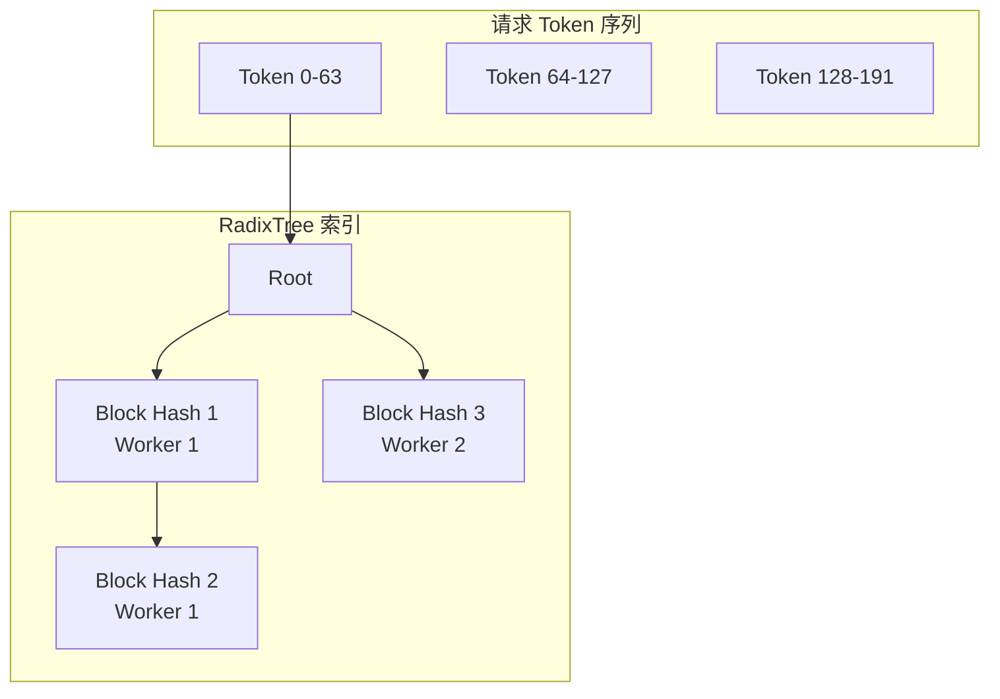
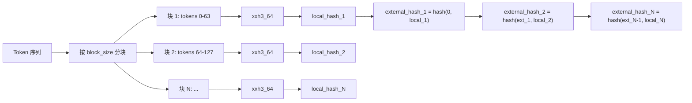
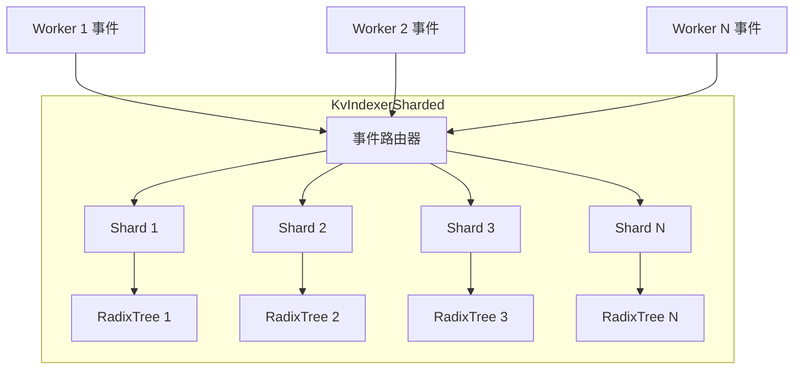
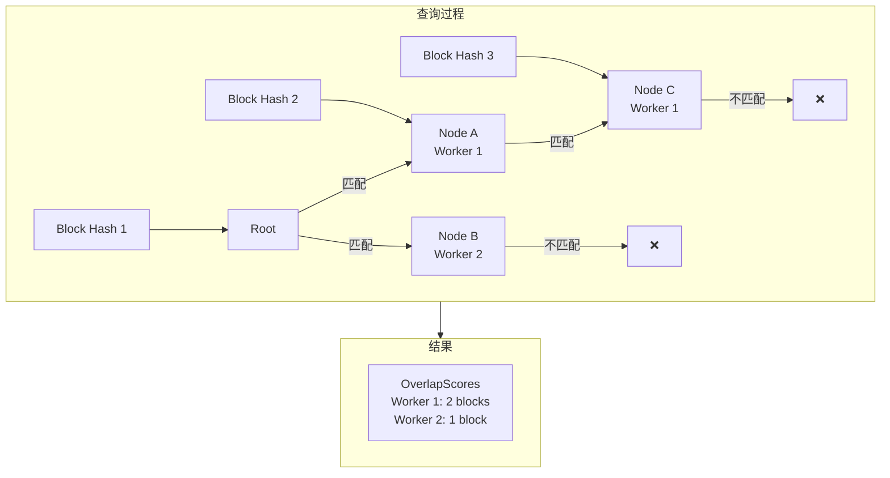
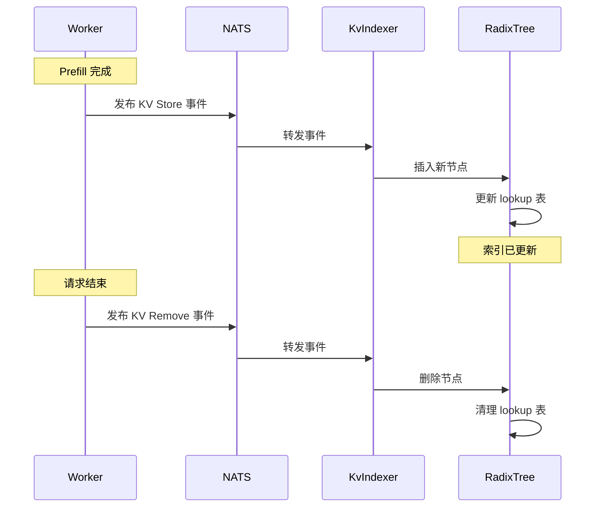

# RadixTree 索引机制

> RadixTree 是 Dynamo KV-Aware Router 的核心数据结构。本文档详细解析其原理、实现和应用。

---

## 1. Radix Tree 基础

### 1.1 Trie 与 Radix Tree

**Trie（前缀树）** 是一种用于存储字符串集合的树形数据结构，每个节点代表一个字符：

```
传统 Trie（存储 test, team, tom）:
         root
        /    \
       t      ...
      / \
     e   o
    / \   \
   s   a   m
   |   |
   t   m
```

**Radix Tree（基数树）** 是压缩的 Trie，将单链节点合并：

```
Radix Tree（存储相同内容）:
         root
        /    \
     te       tom
    /  \
  st    am
```

### 1.2 优势

| 特性 | Trie | Radix Tree |
|------|------|------------|
| 空间复杂度 | O(n*m) | O(n) 压缩后 |
| 查询复杂度 | O(m) | O(m) |
| 前缀查询 | 支持 | 支持 |
| 适用场景 | 密集键 | 稀疏键、公共前缀多 |

---

## 2. Dynamo 中的 RadixTree

### 2.1 应用场景

Dynamo 使用 RadixTree 将 Token 序列映射到 KV Cache 块位置：



### 2.2 数据结构定义

```rust
// lib/llm/src/kv_router/indexer.rs

pub type LocalBlockHash = u64;
pub type ExternalSequenceBlockHash = u64;

/// RadixTree 节点
pub(crate) struct RadixBlock {
    /// 本地哈希（块内 Token IDs 的哈希）
    hash: LocalBlockHash,
    /// 拥有此块的 Worker ID
    worker_id: WorkerId,
    /// 外部序列块哈希（包含父节点上下文）
    external_hash: ExternalSequenceBlockHash,
    /// 子节点（按本地哈希索引）
    children: HashMap<LocalBlockHash, SharedRadixBlock>,
    /// 最后访问时间戳
    timestamp: Instant,
}

/// RadixTree 主结构
pub struct RadixTree {
    /// 根节点
    root: SharedRadixBlock,
    /// 快速查找表：Worker ID → External Hash → Node
    lookup: HashMap<WorkerId, HashMap<ExternalSequenceBlockHash, SharedRadixBlock>>,
    /// 节点过期时间
    expiration_duration: Option<Duration>,
}
```

---

## 3. Block Hash 计算

### 3.1 Local Hash

Local Hash 仅考虑块内的 Token IDs：

```rust
/// 计算 Token 序列的块哈希列表
pub fn compute_block_hash_for_seq(
    tokens: &[u32],
    kv_block_size: usize,
) -> Vec<LocalBlockHash> {
    tokens
        .chunks(kv_block_size)
        .filter_map(|chunk| {
            if chunk.len() == kv_block_size {
                // 使用 xxh3 计算哈希
                let hash = xxh3_64(bytemuck::cast_slice(chunk));
                Some(hash)
            } else {
                // 不完整的块不计算哈希
                None
            }
        })
        .collect()
}
```

### 3.2 External Hash

External Hash 将父节点上下文纳入考虑，确保相同的局部块在不同上下文中有不同标识：

```rust
/// 计算外部序列块哈希
pub fn compute_sequence_block_hash_for_seq(
    tokens: &[u32],
    kv_block_size: usize,
) -> Vec<ExternalSequenceBlockHash> {
    let mut result = Vec::new();
    let mut parent_hash: ExternalSequenceBlockHash = 0;

    for chunk in tokens.chunks(kv_block_size) {
        if chunk.len() == kv_block_size {
            let local_hash = xxh3_64(bytemuck::cast_slice(chunk));
            // 组合父哈希和本地哈希
            let external_hash = xxh3_64(&[
                parent_hash.to_le_bytes(),
                local_hash.to_le_bytes(),
            ].concat());
            result.push(external_hash);
            parent_hash = external_hash;
        }
    }

    result
}
```

### 3.3 哈希计算流程



---

## 4. KvIndexer 索引器

### 4.1 单线程索引器

```rust
pub struct KvIndexer {
    /// 取消令牌
    cancel: CancellationToken,
    /// 事件发送通道
    event_tx: mpsc::Sender<RouterEvent>,
    /// 匹配请求通道
    match_tx: mpsc::Sender<MatchRequest>,
    /// KV 块大小
    kv_block_size: usize,
}

impl KvIndexer {
    pub fn new(cancel: CancellationToken, kv_block_size: usize) -> Self {
        let (event_tx, event_rx) = mpsc::channel(1024);
        let (match_tx, match_rx) = mpsc::channel(128);

        // 启动后台索引任务
        tokio::spawn(indexer_task(cancel.clone(), event_rx, match_rx));

        Self {
            cancel,
            event_tx,
            match_tx,
            kv_block_size,
        }
    }

    /// 获取事件发送器
    pub fn event_sender(&self) -> mpsc::Sender<RouterEvent> {
        self.event_tx.clone()
    }

    /// 查询匹配
    pub async fn find_matches_for_request(
        &self,
        token_ids: &[u32],
    ) -> Result<OverlapScores> {
        let (resp_tx, resp_rx) = oneshot::channel();

        let request = MatchRequest {
            token_ids: token_ids.to_vec(),
            resp_tx,
        };

        self.match_tx.send(request).await?;
        resp_rx.await?
    }
}
```

### 4.2 分片索引器

对于高并发场景，提供分片索引器：

```rust
pub struct KvIndexerSharded {
    shards: Vec<Arc<KvIndexerShard>>,
    num_shards: usize,
    kv_block_size: usize,
}

impl KvIndexerSharded {
    pub fn new(
        cancel: CancellationToken,
        kv_block_size: usize,
        num_shards: usize,
    ) -> Self {
        let shards = (0..num_shards)
            .map(|_| Arc::new(KvIndexerShard::new(cancel.clone(), kv_block_size)))
            .collect();

        Self {
            shards,
            num_shards,
            kv_block_size,
        }
    }

    /// 根据 worker_id 路由到特定分片
    fn get_shard(&self, worker_id: WorkerId) -> &KvIndexerShard {
        let shard_idx = (worker_id as usize) % self.num_shards;
        &self.shards[shard_idx]
    }
}
```

### 4.3 分片架构



---

## 5. 匹配查询算法

### 5.1 查询流程

```rust
impl RadixTree {
    /// 查找与请求 Token 序列的重叠
    pub fn find_matches(&self, token_ids: &[u32], kv_block_size: usize) -> OverlapScores {
        let block_hashes = compute_block_hash_for_seq(token_ids, kv_block_size);
        let mut scores: HashMap<WorkerId, usize> = HashMap::new();

        // 从根节点开始遍历
        let mut current_nodes = vec![&self.root];

        for hash in &block_hashes {
            let mut next_nodes = Vec::new();

            for node in &current_nodes {
                // 在当前节点的子节点中查找匹配
                if let Some(child) = node.children.get(hash) {
                    // 增加该 worker 的得分
                    *scores.entry(child.worker_id).or_insert(0) += 1;
                    next_nodes.push(child);
                }
            }

            if next_nodes.is_empty() {
                break; // 没有更多匹配
            }
            current_nodes = next_nodes;
        }

        OverlapScores { scores }
    }
}
```

### 5.2 查询可视化



---

## 6. 索引更新

### 6.1 事件类型

```rust
/// KV Cache 事件数据
#[derive(Debug, Clone, Serialize, Deserialize)]
pub enum KvCacheEventData {
    /// 新块存储
    Stored(KvCacheStoreData),
    /// 块移除
    Removed(KvCacheRemoveData),
}

/// 存储事件
#[derive(Debug, Clone, Serialize, Deserialize)]
pub struct KvCacheStoreData {
    pub request_id: String,
    pub token_ids: Vec<u32>,
    pub block_hashes: Vec<u64>,
    pub lora_id: Option<u64>,
}

/// 移除事件
#[derive(Debug, Clone, Serialize, Deserialize)]
pub struct KvCacheRemoveData {
    pub block_hashes: Vec<u64>,
}
```

### 6.2 更新流程



---

## 7. 过期与清理

### 7.1 时间戳更新

每次访问节点时更新时间戳：

```rust
impl RadixBlock {
    fn touch(&mut self) {
        self.timestamp = Instant::now();
    }
}
```

### 7.2 过期清理

```rust
impl RadixTree {
    /// 清理过期节点
    fn cleanup_expired(&mut self) {
        if let Some(duration) = self.expiration_duration {
            let now = Instant::now();
            let mut to_remove = Vec::new();

            // 遍历所有节点，标记过期的
            for (worker_id, hashes) in &self.lookup {
                for (hash, node) in hashes {
                    if now.duration_since(node.timestamp) > duration {
                        to_remove.push((*worker_id, *hash));
                    }
                }
            }

            // 删除过期节点
            for (worker_id, hash) in to_remove {
                self.remove_node(worker_id, hash);
            }
        }
    }
}
```

---

## 8. 性能优化

### 8.1 xxHash3 算法

Dynamo 使用 xxHash3 计算块哈希，它提供：

| 特性 | 值 |
|------|-----|
| 速度 | ~30 GB/s |
| 分布 | 极佳 |
| 输出 | 64-bit |
| 冲突 | 极低 |

### 8.2 查找表优化

使用双层 HashMap 实现 O(1) 查找：

```rust
// Worker ID → External Hash → Node
lookup: HashMap<WorkerId, HashMap<ExternalSequenceBlockHash, SharedRadixBlock>>
```

### 8.3 批量更新

使用带缓冲的 Channel 实现微批量更新：

```rust
// 事件 Channel 配置
let (event_tx, event_rx) = mpsc::channel(1024);  // 缓冲 1024 个事件

// 后台任务批量处理
while let Some(events) = recv_batch(&mut event_rx, 100).await {
    for event in events {
        tree.update(event);
    }
}
```

---

## 9. Block Size 选择

### 9.1 权衡因素

| Block Size | 优点 | 缺点 |
|------------|------|------|
| 小 (16-32) | 细粒度匹配，高复用率 | 索引开销大，碎片多 |
| 中 (64) | 平衡 | 推荐默认值 |
| 大 (128-256) | 低索引开销 | 粗粒度匹配，复用率低 |

### 9.2 推荐配置

```yaml
# 短上下文场景（< 2K tokens）
kv_block_size: 32

# 通用场景
kv_block_size: 64

# 长上下文场景（> 8K tokens）
kv_block_size: 128
```

---

## 总结

RadixTree 在 Dynamo 中的作用：

1. **前缀匹配**：高效识别 Token 序列的公共前缀
2. **Worker 定位**：快速查找 KV Cache 所在的 Worker
3. **重叠统计**：计算请求与各 Worker 的 KV 重叠度
4. **动态更新**：实时响应 KV Cache 的存储和移除

这套索引机制是 KV-Aware 路由的基础，使 Dynamo 能够实现智能的请求分发。

---

## 参考文件

- [lib/llm/src/kv_router/indexer.rs](../../../lib/llm/src/kv_router/indexer.rs) - 索引器实现
