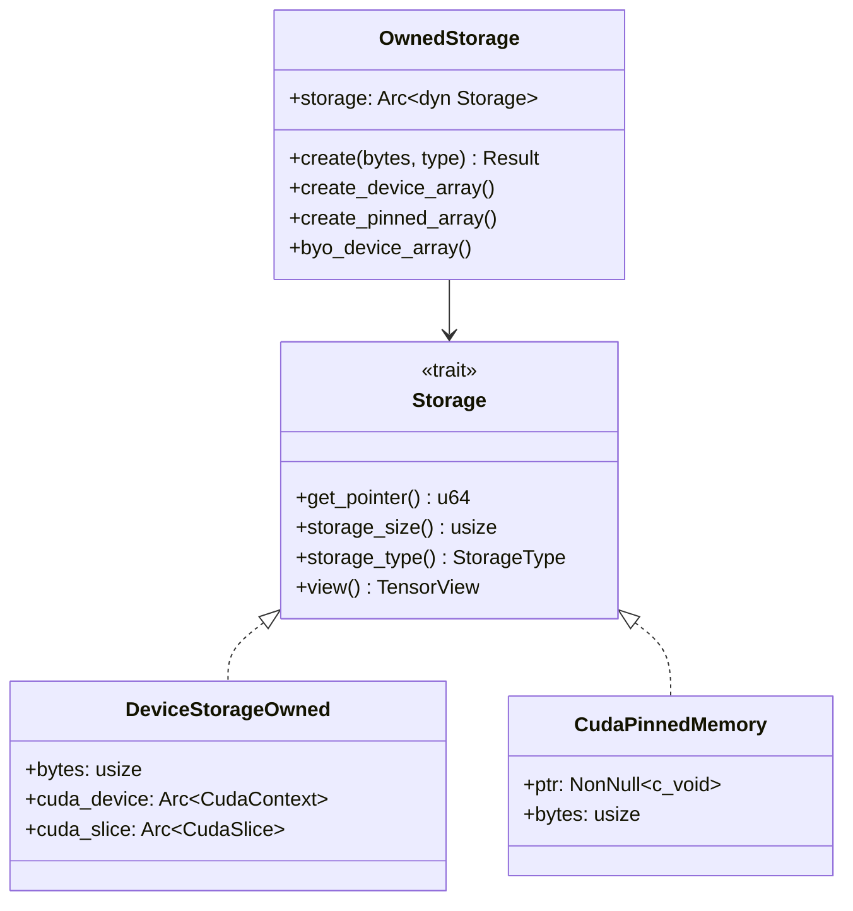
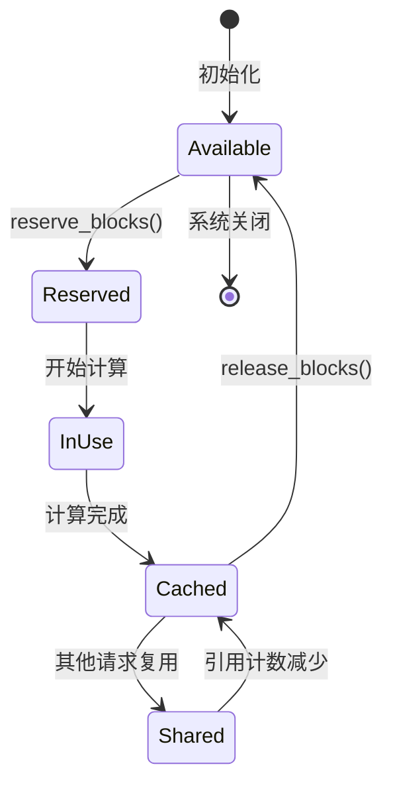

> KV Cache Manager 负责 KV Cache 的存储分配、生命周期管理和多层存储。本文档详细解析其设计与实现。

---

## 1. 存储架构

### 1.1 多层存储类型

Dynamo 支持三种存储类型：

```rust
// lib/llm/src/kv/storage.rs
#[derive(Debug, Clone, PartialEq, Eq)]
pub enum StorageType {
    /// GPU 设备内存（HBM）
    Device(Arc<CudaContext>),
    /// CUDA Pinned 内存（CPU，但 GPU 可直接访问）
    Pinned,
    /// 系统内存（用于 Grace 等嵌入式平台）
    System,
}
```

### 1.2 存储层级金字塔

```
              ┌─────────────┐
              │   GPU HBM   │  ← 最快，最小 (80GB/A100)
              │  ~1 TB/s    │
              └──────┬──────┘
                     │ 卸载
              ┌──────┴──────┐
              │ Pinned CPU  │  ← 快，较大 (~128GB-1TB)
              │  ~25 GB/s   │
              └──────┬──────┘
                     │ 卸载
              ┌──────┴──────┐
              │  System RAM │  ← 中等，大 (~1TB-2TB)
              │  ~10 GB/s   │
              └──────┬──────┘
                     │ 卸载
              ┌──────┴──────┐
              │  NVMe SSD   │  ← 较慢，很大 (~10TB+)
              │  ~7 GB/s    │
              └─────────────┘
```

### 1.3 数据类型支持

```rust
#[derive(Debug, Clone, Copy, PartialEq, Eq)]
pub enum DType {
    F32,   // 32-bit float (4 bytes)
    F16,   // 16-bit float (2 bytes)
    BF16,  // Brain float 16 (2 bytes)
    FP8,   // 8-bit float (1 byte)
    U8,    // Unsigned 8-bit int
    // ... 其他类型
}

impl DType {
    pub fn size_in_bytes(&self) -> usize {
        match self {
            DType::F32 => 4,
            DType::F16 | DType::BF16 => 2,
            DType::FP8 | DType::U8 => 1,
            // ...
        }
    }
}
```

---

## 2. Storage Trait 设计

### 2.1 核心 Trait

```rust
pub trait Storage: std::fmt::Debug {
    /// 获取内存指针
    fn get_pointer(&self) -> u64;

    /// 获取存储总大小（字节）
    fn storage_size(&self) -> usize;

    /// 获取存储类型
    fn storage_type(&self) -> StorageType;

    /// 创建 Tensor 视图
    fn view<const D: usize>(
        &self,
        shape: [usize; D],
        dtype: DType,
    ) -> Result<TensorView<'_, Self, D>>
    where
        Self: Sized,
    {
        TensorView::new(self, shape, dtype.size_in_bytes())
    }
}
```

### 2.2 存储类型关系



---

## 3. OwnedStorage 实现

### 3.1 存储创建

```rust
#[derive(Clone)]
pub struct OwnedStorage {
    storage: Arc<dyn Storage>,
}

impl OwnedStorage {
    /// 创建指定类型的存储
    pub fn create(bytes: usize, storage_type: StorageType) -> Result<Self> {
        match storage_type {
            StorageType::Device(device) => Self::create_device_array(bytes, device),
            StorageType::Pinned => Self::create_pinned_array(bytes),
            StorageType::System => {
                raise!("System memory not yet supported");
            }
        }
    }

    /// 创建 GPU 设备内存
    pub fn create_device_array(bytes: usize, device: Arc<CudaContext>) -> Result<Self> {
        let device_storage = DeviceStorageOwned::new(bytes, device)?;
        Ok(Self::new(Arc::new(device_storage)))
    }

    /// 创建 Pinned 内存
    pub fn create_pinned_array(bytes: usize) -> Result<Self> {
        let pinned_memory = CudaPinnedMemory::new(bytes)?;
        Ok(Self::new(Arc::new(pinned_memory)))
    }

    /// 从外部 CUDA 指针创建（BYO - Bring Your Own）
    pub fn byo_device_array(
        device_ptr: u64,
        bytes: usize,
        device: Arc<CudaContext>,
        owner: Arc<dyn Any + Send + Sync>,
    ) -> Result<Self> {
        let device_storage = DeviceStorageFromAny::new(owner, device_ptr, bytes, device);
        Ok(Self::new(Arc::new(device_storage)))
    }
}
```

### 3.2 CUDA 内存管理

```rust
/// CUDA Pinned Memory 封装
pub struct CudaPinnedMemory {
    ptr: NonNull<c_void>,
    bytes: usize,
}

impl CudaPinnedMemory {
    pub fn new(bytes: usize) -> Result<Self> {
        if bytes == 0 {
            raise!("Bytes must be greater than 0");
        }

        let mut ptr: *mut c_void = std::ptr::null_mut();

        // 调用 CUDA API 分配 Pinned 内存
        let result = unsafe { cuda_malloc_host(&mut ptr, bytes) };
        if result != 0 {
            raise!("Failed to allocate pinned memory");
        }

        let ptr = NonNull::new(ptr)
            .ok_or_else(|| anyhow::anyhow!("Null pointer after allocation"))?;

        // 清零内存
        unsafe {
            std::ptr::write_bytes(ptr.as_ptr() as *mut u8, 0, bytes);
        }

        Ok(Self { ptr, bytes })
    }
}

impl Drop for CudaPinnedMemory {
    fn drop(&mut self) {
        let result = unsafe { cuda_free_host(self.ptr.as_ptr()) };
        if result != 0 {
            eprintln!("Failed to free pinned memory");
        }
    }
}
```

---

## 4. TensorView 设计

### 4.1 张量视图结构

```rust
/// 张量视图，提供对存储的结构化访问
pub struct TensorView<'a, T: Storage, const D: usize> {
    /// 底层存储
    storage: &'a T,
    /// 形状（各维度大小）
    shape: [usize; D],
    /// 步长（元素单位）
    strides: [usize; D],
    /// 字节步长
    byte_strides: [usize; D],
    /// 偏移量（字节）
    offset: usize,
    /// 元素大小（字节）
    element_size: usize,
    /// 总元素数
    total_elements: usize,
}
```

### 4.2 视图操作

```rust
impl<'a, T: Storage, const D: usize> TensorView<'a, T, D> {
    /// 创建新视图
    pub fn new(storage: &'a T, shape: [usize; D], element_size: usize) -> Result<Self> {
        // 计算行主序步长
        let mut strides = [0; D];
        let mut byte_strides = [0; D];

        if D > 0 {
            strides[D - 1] = 1;
            byte_strides[D - 1] = element_size;

            for i in (0..D - 1).rev() {
                strides[i] = strides[i + 1] * shape[i + 1];
                byte_strides[i] = strides[i] * element_size;
            }
        }

        let total_elements = shape.iter().product();

        // 验证视图不超出存储边界
        if total_elements * element_size > storage.storage_size() {
            return Err(error!(
                "Shape {:?} requires {} bytes, but storage only has {} bytes",
                shape,
                total_elements * element_size,
                storage.storage_size()
            ));
        }

        Ok(Self {
            storage,
            shape,
            strides,
            byte_strides,
            offset: 0,
            element_size,
            total_elements,
        })
    }

    /// 计算绝对内存地址
    pub fn address(&self, indices: &[usize; D]) -> Result<u64> {
        let byte_offset = self.byte_offset(indices)?;
        Ok(self.storage.get_pointer() + byte_offset as u64)
    }

    /// 创建切片视图
    pub fn slice(&self, dim: usize, start: usize, end: Option<usize>) -> Result<Self> {
        if dim >= D {
            return Err(format!("Dimension {} out of bounds", dim));
        }

        let end_idx = end.unwrap_or(self.shape[dim]);

        let mut new_shape = self.shape;
        new_shape[dim] = end_idx - start;

        let new_offset = self.offset + start * self.byte_strides[dim];

        Ok(Self {
            storage: self.storage,
            shape: new_shape,
            strides: self.strides,
            byte_strides: self.byte_strides,
            offset: new_offset,
            element_size: self.element_size,
            total_elements: new_shape.iter().product(),
        })
    }
}
```

### 4.3 数据传输

```rust
impl<'a, T: Storage, const D: usize> TensorView<'a, T, D> {
    /// Host-to-Device 传输
    pub fn h2d<S: Storage>(
        &self,
        device_view: &mut TensorView<'_, S, D>,
        stream: &CudaStream,
    ) -> Result<()> {
        let rc = unsafe {
            cuda_memcpy_async(
                dst_ptr, src_ptr, size_in_bytes,
                stream.cu_stream() as *mut c_void
            )
        };

        if rc != 0 {
            return Err(error!("cudaMemcpyAsync failed"));
        }
        Ok(())
    }

    /// Device-to-Host 传输
    pub fn d2h<S: Storage>(
        &self,
        host_view: &mut TensorView<'_, S, D>,
        stream: &CudaStream,
    ) -> Result<()> {
        // 类似 h2d，方向相反
        // ...
    }
}
```

---

## 5. KvStorageManager

### 5.1 管理器结构

```rust
pub struct KvStorageManager {
    /// 可用块池
    available_blocks: AvailableBlocks,
    /// 正在使用的块
    inflight_blocks: ReservedBlocks,
    /// 块大小（tokens）
    block_size: usize,
}

/// 可用块的管理
type AvailableBlocks = Arc<Mutex<VecDeque<BlockId>>>;

/// 已预留块的追踪
type ReservedBlocks = Arc<Mutex<HashMap<RequestId, Vec<BlockId>>>>;
```

### 5.2 块分配与释放

```rust
impl KvStorageManager {
    pub fn new(total_blocks: usize, block_size: usize) -> Self {
        let available: VecDeque<BlockId> = (0..total_blocks as BlockId).collect();

        Self {
            available_blocks: Arc::new(Mutex::new(available)),
            inflight_blocks: Arc::new(Mutex::new(HashMap::new())),
            block_size,
        }
    }

    /// 预留指定数量的块
    pub fn reserve_blocks(
        &self,
        request_id: RequestId,
        num_blocks: usize,
    ) -> Result<Vec<BlockId>> {
        let mut available = self.available_blocks.lock().unwrap();

        if available.len() < num_blocks {
            return Err(anyhow::anyhow!(
                "Not enough blocks: requested {}, available {}",
                num_blocks,
                available.len()
            ));
        }

        let blocks: Vec<BlockId> = (0..num_blocks)
            .map(|_| available.pop_front().unwrap())
            .collect();

        let mut inflight = self.inflight_blocks.lock().unwrap();
        inflight.insert(request_id, blocks.clone());

        Ok(blocks)
    }

    /// 释放请求的所有块
    pub fn release_blocks(&self, request_id: RequestId) -> Result<()> {
        let mut inflight = self.inflight_blocks.lock().unwrap();

        if let Some(blocks) = inflight.remove(&request_id) {
            let mut available = self.available_blocks.lock().unwrap();
            for block in blocks {
                available.push_back(block);
            }
        }

        Ok(())
    }

    /// 获取可用块数量
    pub fn available_count(&self) -> usize {
        self.available_blocks.lock().unwrap().len()
    }

    /// 获取使用中块数量
    pub fn inflight_count(&self) -> usize {
        self.inflight_blocks
            .lock()
            .unwrap()
            .values()
            .map(|v| v.len())
            .sum()
    }
}
```

---

## 6. 块生命周期

### 6.1 状态转换



### 6.2 引用计数

对于支持前缀共享的场景，使用引用计数：

```rust
struct CachedBlock {
    block_id: BlockId,
    ref_count: AtomicUsize,
    hash: BlockHash,
    timestamp: Instant,
}

impl CachedBlock {
    fn acquire(&self) {
        self.ref_count.fetch_add(1, Ordering::SeqCst);
    }

    fn release(&self) -> bool {
        self.ref_count.fetch_sub(1, Ordering::SeqCst) == 1
    }
}
```

---

## 7. 容量规划

### 7.1 推荐配置（A100 80GB）

```
GPU HBM: 60GB（留 20GB 给模型权重和激活）
  └─ 可缓存 ~45K 请求的 KV（Llama 70B, 1K tokens）

Pinned CPU: 128GB
  └─ 可缓存 ~96K 请求的 KV

System RAM: 512GB
  └─ 可缓存 ~384K 请求的 KV
```

### 7.2 阈值设置

```rust
struct StorageTierConfig {
    // GPU 使用率超过此阈值时，开始卸载到 CPU
    gpu_offload_threshold: 0.85,

    // CPU 使用率超过此阈值时，开始卸载到磁盘
    cpu_offload_threshold: 0.90,

    // 预取策略：当访问热度超过阈值时，提前加载
    prefetch_threshold: 0.7,
}
```

---

## 8. 性能监控

### 8.1 关键指标

| 指标 | 描述 | 目标值 |
|------|------|--------|
| `available_blocks` | 可用块数 | > 10% |
| `inflight_blocks` | 使用中块数 | < 90% |
| `allocation_latency` | 分配延迟 | < 1ms |
| `release_latency` | 释放延迟 | < 0.5ms |

### 8.2 指标导出

```rust
impl KvStorageManager {
    pub fn export_metrics(&self) -> StorageMetrics {
        StorageMetrics {
            available_blocks: self.available_count(),
            inflight_blocks: self.inflight_count(),
            total_blocks: self.available_count() + self.inflight_count(),
            utilization: self.inflight_count() as f64
                / (self.available_count() + self.inflight_count()) as f64,
        }
    }
}
```

---

## 总结

KV Cache Manager 的核心职责：

1. **存储抽象**：统一 GPU/CPU/System 内存接口
2. **块管理**：高效的分配和释放
3. **生命周期**：清晰的状态转换
4. **多层存储**：支持 Offloading 扩展容量

这套管理机制为 Dynamo 的高性能 KV Cache 系统提供了坚实的基础。

---

## 参考文件

- [lib/llm/src/kv/storage.rs](../../../lib/llm/src/kv/storage.rs) - 存储抽象
- [lib/llm/src/kv/manager.rs](../../../lib/llm/src/kv/manager.rs) - 块管理
