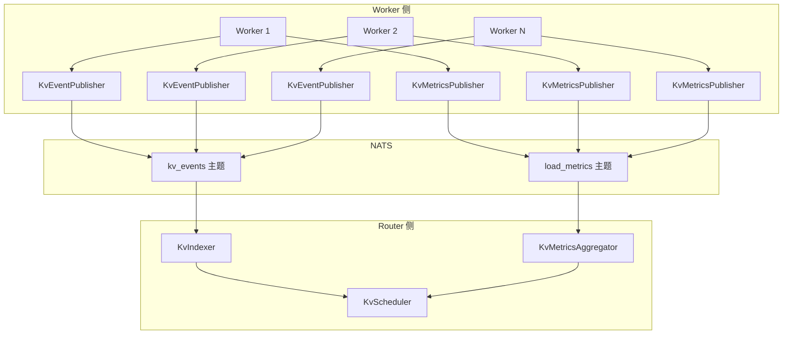
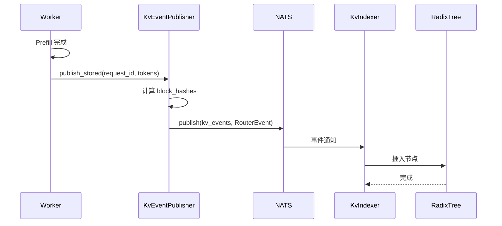
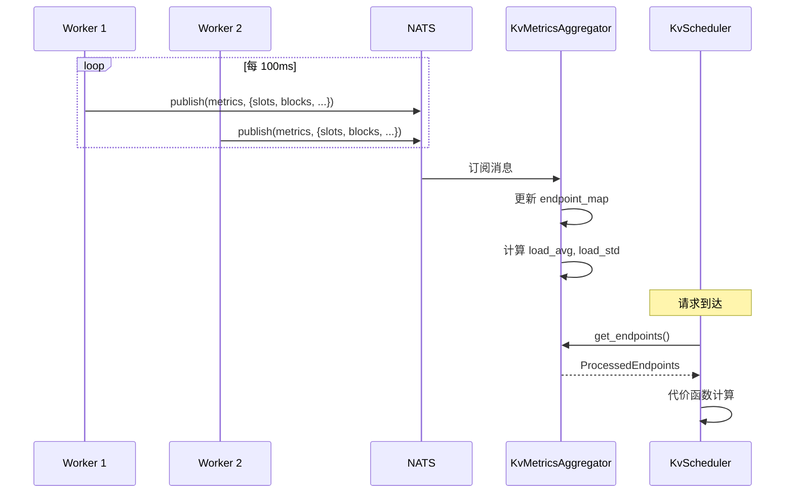

# KV 事件系统

> KV 事件系统实现了 Worker 与 Router 之间的状态同步。本文档详细解析事件类型、发布机制和聚合处理。

---

## 1. 事件系统概述

### 1.1 系统架构



### 1.2 事件流类型

| 事件流 | 方向 | 用途 |
|--------|------|------|
| KV Events | Worker → Router | 通知 KV Cache 变化 |
| Metrics | Worker → Router | 报告负载指标 |
| Hit Rate | Router → 监控 | 统计命中率 |

---

## 2. 事件类型定义

### 2.1 KV Cache 事件

```rust
// lib/llm/src/kv_router/protocols.rs

/// KV Cache 事件数据
#[derive(Debug, Clone, Serialize, Deserialize)]
pub enum KvCacheEventData {
    /// 新块存储
    Stored(KvCacheStoreData),
    /// 块移除
    Removed(KvCacheRemoveData),
}

/// 存储事件数据
#[derive(Debug, Clone, Serialize, Deserialize)]
pub struct KvCacheStoreData {
    /// 请求 ID
    pub request_id: String,
    /// Token IDs
    pub token_ids: Vec<u32>,
    /// 存储的块哈希列表
    pub block_hashes: Vec<u64>,
    /// LoRA ID（可选）
    pub lora_id: Option<u64>,
}

/// 移除事件数据
#[derive(Debug, Clone, Serialize, Deserialize)]
pub struct KvCacheRemoveData {
    /// 移除的块哈希列表
    pub block_hashes: Vec<u64>,
}

/// 路由器事件（Worker → Router）
#[derive(Debug, Clone, Serialize, Deserialize)]
pub struct RouterEvent {
    /// Worker ID
    pub worker_id: i64,
    /// 事件数据
    pub data: KvCacheEventData,
}
```

### 2.2 指标协议

```rust
/// 前向传播指标
#[derive(Debug, Clone, Serialize, Deserialize, Default)]
pub struct ForwardPassMetrics {
    /// 活跃请求槽位数
    pub request_active_slots: u64,
    /// 总请求槽位数
    pub request_total_slots: u64,
    /// 活跃 KV 块数
    pub kv_active_blocks: u64,
    /// 总 KV 块数
    pub kv_total_blocks: u64,
    /// GPU 缓存使用率 (0.0-1.0)
    pub gpu_cache_usage_perc: f32,
    /// GPU 前缀缓存命中率 (0.0-1.0)
    pub gpu_prefix_cache_hit_rate: f32,
    /// 等待中的请求数
    pub num_requests_waiting: u64,
}

impl ForwardPassMetrics {
    /// 检查是否有可用容量
    pub fn has_capacity(&self) -> bool {
        self.request_active_slots < self.request_total_slots
            && self.kv_active_blocks < self.kv_total_blocks
    }

    /// 计算 KV 负载比例
    pub fn kv_load_ratio(&self) -> f64 {
        if self.kv_total_blocks == 0 {
            return 0.0;
        }
        self.kv_active_blocks as f64 / self.kv_total_blocks as f64
    }
}
```

---

## 3. KvEventPublisher

### 3.1 发布器结构

```rust
// lib/llm/src/kv_router/publisher.rs

pub struct KvEventPublisher {
    /// 事件发送通道
    tx: mpsc::UnboundedSender<KvCacheEvent>,
    /// Worker ID
    worker_id: i64,
    /// KV 块大小
    kv_block_size: usize,
}

/// KV Cache 事件
#[derive(Debug, Clone)]
pub struct KvCacheEvent {
    pub worker_id: i64,
    pub data: KvCacheEventData,
}
```

### 3.2 发布方法

```rust
impl KvEventPublisher {
    pub fn new(
        component: Component,
        worker_id: i64,
        kv_block_size: usize,
    ) -> Self {
        let (tx, rx) = mpsc::unbounded_channel();

        // 启动后台发布任务
        tokio::spawn(publish_events_task(component, rx));

        Self { tx, worker_id, kv_block_size }
    }

    /// 发布块存储事件
    pub fn publish_stored(
        &self,
        request_id: String,
        token_ids: Vec<u32>,
        lora_id: Option<u64>,
    ) -> Result<()> {
        // 计算块哈希
        let block_hashes = compute_block_hash_for_seq(&token_ids, self.kv_block_size);

        let event = KvCacheEvent {
            worker_id: self.worker_id,
            data: KvCacheEventData::Stored(KvCacheStoreData {
                request_id,
                token_ids,
                block_hashes,
                lora_id,
            }),
        };

        self.tx.send(event)?;
        Ok(())
    }

    /// 发布块移除事件
    pub fn publish_removed(&self, block_hashes: Vec<u64>) -> Result<()> {
        let event = KvCacheEvent {
            worker_id: self.worker_id,
            data: KvCacheEventData::Removed(KvCacheRemoveData { block_hashes }),
        };

        self.tx.send(event)?;
        Ok(())
    }
}
```

### 3.3 后台发布任务

```rust
/// 后台发布任务
async fn publish_events_task(
    component: Component,
    mut rx: mpsc::UnboundedReceiver<KvCacheEvent>,
) {
    while let Some(event) = rx.recv().await {
        let router_event = RouterEvent {
            worker_id: event.worker_id,
            data: event.data,
        };

        if let Err(e) = component.publish(KV_EVENT_SUBJECT, &router_event).await {
            tracing::warn!("Failed to publish KV event: {:?}", e);
        }
    }
}
```

---

## 4. KvMetricsPublisher

### 4.1 指标发布器

```rust
pub struct KvMetricsPublisher {
    /// 指标发送器
    tx: tokio::sync::watch::Sender<Arc<ForwardPassMetrics>>,
    /// 指标接收器（用于读取当前值）
    rx: tokio::sync::watch::Receiver<Arc<ForwardPassMetrics>>,
}

impl KvMetricsPublisher {
    pub fn new(
        component: Component,
        endpoint_name: String,
        worker_id: i64,
    ) -> Self {
        let (tx, rx) = tokio::sync::watch::channel(
            Arc::new(ForwardPassMetrics::default())
        );

        // 启动后台指标发布任务
        let rx_clone = rx.clone();
        tokio::spawn(publish_metrics_task(
            component, endpoint_name, worker_id, rx_clone
        ));

        Self { tx, rx }
    }

    /// 更新指标
    pub fn update(&self, metrics: ForwardPassMetrics) {
        let _ = self.tx.send(Arc::new(metrics));
    }

    /// 获取当前指标
    pub fn current(&self) -> Arc<ForwardPassMetrics> {
        self.rx.borrow().clone()
    }
}
```

### 4.2 定期发布

```rust
/// 后台指标发布任务（定期发布）
async fn publish_metrics_task(
    component: Component,
    endpoint_name: String,
    worker_id: i64,
    mut rx: tokio::sync::watch::Receiver<Arc<ForwardPassMetrics>>,
) {
    let mut interval = tokio::time::interval(Duration::from_millis(100));

    loop {
        interval.tick().await;

        let metrics = rx.borrow().clone();

        let endpoint_info = EndpointMetrics {
            worker_id,
            endpoint_name: endpoint_name.clone(),
            metrics: (*metrics).clone(),
        };

        if let Err(e) = component.publish(KV_METRICS_ENDPOINT, &endpoint_info).await {
            tracing::trace!("Failed to publish metrics: {:?}", e);
        }
    }
}
```

---

## 5. KvMetricsAggregator

### 5.1 聚合器结构

```rust
pub struct KvMetricsAggregator {
    /// 服务名称
    pub service_name: String,
    /// 聚合的端点信息
    pub endpoints: Arc<Mutex<ProcessedEndpoints>>,
}

/// 处理后的端点信息
#[derive(Debug, Clone, Default)]
pub struct ProcessedEndpoints {
    /// 端点列表
    pub endpoints: Vec<EndpointInfo>,
    /// Worker ID 列表
    pub worker_ids: Vec<i64>,
    /// 平均负载
    pub load_avg: f64,
    /// 负载标准差
    pub load_std: f64,
}
```

### 5.2 聚合实现

```rust
impl KvMetricsAggregator {
    pub fn new(component: Component) -> Self {
        let endpoints = Arc::new(Mutex::new(ProcessedEndpoints::default()));
        let endpoints_clone = endpoints.clone();

        // 启动后台聚合任务
        tokio::spawn(aggregate_metrics_task(component, endpoints_clone));

        Self {
            service_name: component.service_name(),
            endpoints,
        }
    }

    /// 获取当前聚合指标
    pub fn get_endpoints(&self) -> ProcessedEndpoints {
        self.endpoints.lock().unwrap().clone()
    }
}

impl ProcessedEndpoints {
    /// 从端点列表构建
    pub fn from_endpoints(endpoints: Vec<EndpointInfo>) -> Self {
        let worker_ids: Vec<i64> = endpoints.iter().map(|e| e.worker_id).collect();

        // 计算平均负载
        let loads: Vec<f64> = endpoints
            .iter()
            .map(|e| e.data.kv_load_ratio())
            .collect();

        let load_avg = if loads.is_empty() {
            0.0
        } else {
            loads.iter().sum::<f64>() / loads.len() as f64
        };

        // 计算负载标准差
        let load_std = if loads.len() < 2 {
            0.0
        } else {
            let variance = loads
                .iter()
                .map(|&x| (x - load_avg).powi(2))
                .sum::<f64>()
                / (loads.len() - 1) as f64;
            variance.sqrt()
        };

        Self {
            endpoints,
            worker_ids,
            load_avg,
            load_std,
        }
    }
}
```

### 5.3 后台聚合任务

```rust
/// 后台聚合任务
async fn aggregate_metrics_task(
    component: Component,
    endpoints: Arc<Mutex<ProcessedEndpoints>>,
) {
    let mut subscription = component.subscribe(KV_METRICS_ENDPOINT).await.unwrap();
    let mut endpoint_map: HashMap<i64, EndpointInfo> = HashMap::new();

    while let Some(msg) = subscription.next().await {
        if let Ok(info) = serde_json::from_slice::<EndpointMetrics>(&msg.payload) {
            endpoint_map.insert(info.worker_id, EndpointInfo {
                worker_id: info.worker_id,
                name: info.endpoint_name,
                data: info.metrics,
            });

            // 更新聚合结果
            let endpoint_list: Vec<EndpointInfo> = endpoint_map.values().cloned().collect();
            let processed = ProcessedEndpoints::from_endpoints(endpoint_list);

            *endpoints.lock().unwrap() = processed;
        }
    }
}
```

---

## 6. 事件流时序

### 6.1 KV Store 事件流



### 6.2 指标聚合流



---

## 7. 命中率统计

### 7.1 命中率事件

```rust
/// KV 命中率事件
#[derive(Debug, Clone, Serialize, Deserialize)]
pub struct KVHitRateEvent {
    /// 请求的 Token 数
    pub isl_tokens: usize,
    /// 命中的 Token 数
    pub hit_tokens: usize,
    /// 目标 Worker ID
    pub worker_id: i64,
}
```

### 7.2 统计计算

```rust
impl KVHitRateEvent {
    pub fn hit_rate(&self) -> f64 {
        if self.isl_tokens == 0 {
            return 0.0;
        }
        self.hit_tokens as f64 / self.isl_tokens as f64
    }
}

// 在调度器中发送命中率事件
let hit_tokens = overlap_score * kv_block_size;
let event = KVHitRateEvent {
    isl_tokens: request.isl_tokens,
    hit_tokens,
    worker_id,
};
event_tx.send(event)?;
```

---

## 8. 配置与调优

### 8.1 发布频率

| 事件类型 | 默认频率 | 调优建议 |
|----------|----------|----------|
| KV Events | 实时 | 保持实时 |
| Metrics | 100ms | 50-200ms |
| Hit Rate | 实时 | 可批量 |

### 8.2 Channel 配置

```rust
// KV 事件 Channel（无界，避免背压）
let (tx, rx) = mpsc::unbounded_channel();

// 指标 Channel（watch，只保留最新值）
let (tx, rx) = tokio::sync::watch::channel(default);

// 匹配请求 Channel（有界，控制并发）
let (tx, rx) = mpsc::channel(128);
```

### 8.3 NATS Subject 命名

```
NATS Subject 命名规范：
namespace.{ns_name}.component.{comp_name}.{event_type}

示例：
- KV 事件：namespace.dynamo.component.VllmWorker.kv_events
- 负载指标：namespace.dynamo.component.VllmWorker.load_metrics
- 命中率：namespace.dynamo.component.Router.kv-hit-rate
```

---

## 总结

KV 事件系统的核心功能：

1. **KV 事件发布**：通知 KV Cache 的存储和移除
2. **指标发布**：定期报告 Worker 负载状态
3. **指标聚合**：汇总所有 Worker 的状态信息
4. **命中率统计**：评估路由效果

这套事件系统是 KV-Aware 路由的神经网络，确保 Router 能够做出最优决策。

---

## 参考文件

- [lib/llm/src/kv_router/protocols.rs](../../../lib/llm/src/kv_router/protocols.rs) - 协议定义
- [lib/llm/src/kv_router/publisher.rs](../../../lib/llm/src/kv_router/publisher.rs) - 发布器
- [lib/llm/src/kv_router/metrics_aggregator.rs](../../../lib/llm/src/kv_router/metrics_aggregator.rs) - 聚合器
