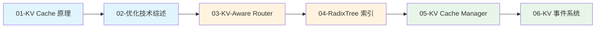
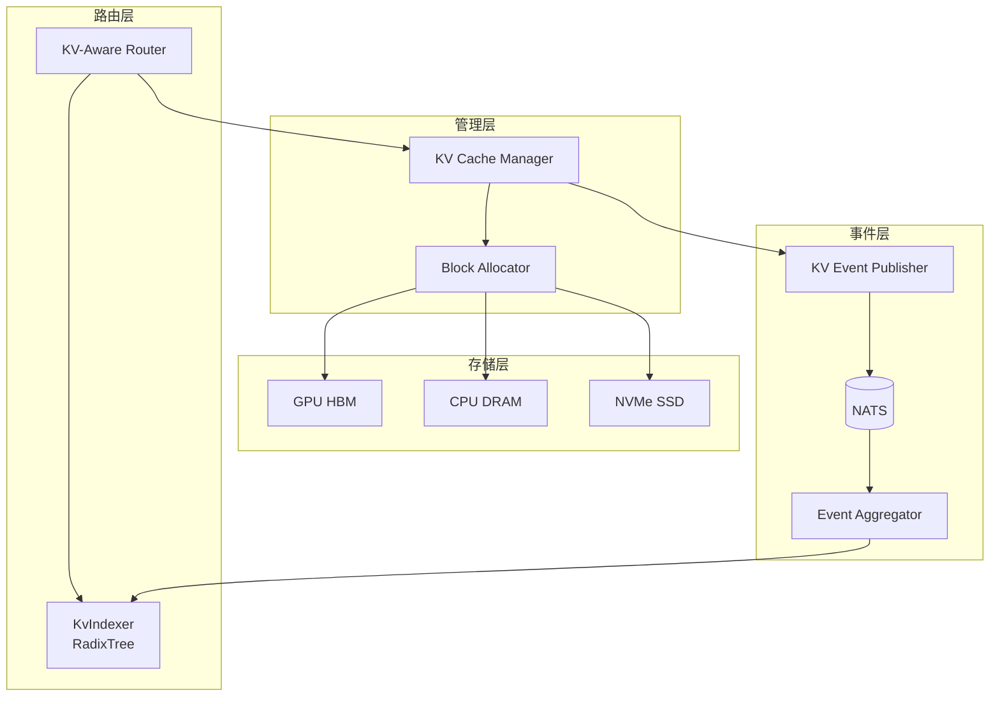

# 第四章：KV Cache 管理与路由

> Dynamo 的 KV Cache 系统提供智能路由、RadixTree 索引和多层存储能力。

## 本章概述

本章深入解析 Dynamo 的 KV Cache 管理系统，包括 KV Cache 原理、优化技术综述、KV-Aware Router、RadixTree 索引、KV Cache Manager 以及事件系统。

---

## 子文档列表

| 序号 | 文件 | 主题 | 内容简介 |
|------|------|------|----------|
| 1 | [01-transformer-kv-cache.md](01-transformer-kv-cache.md) | KV Cache 原理 | Self-Attention 中的 KV Cache |
| 2 | [02-kv-optimization-survey.md](02-kv-optimization-survey.md) | 优化技术综述 | PagedAttention、Prefix Caching、Offloading |
| 3 | [03-kv-aware-router.md](03-kv-aware-router.md) | KV-Aware Router | 路由问题、评分机制、代价函数 |
| 4 | [04-radix-tree-indexing.md](04-radix-tree-indexing.md) | RadixTree 索引 | RadixTree、Block Hash、KvIndexer |
| 5 | [05-kv-cache-manager.md](05-kv-cache-manager.md) | KV Cache Manager | V1/V2 架构、块类型、多层存储 |
| 6 | [06-kv-event-system.md](06-kv-event-system.md) | KV 事件系统 | 事件类型、Publisher、Aggregator |

---

## 阅读顺序建议

---

## 关键概念速查

| 概念 | 说明 | 详见文档 |
|------|------|----------|
| **KV Cache** | 存储历史 Key/Value 的缓存 | [01-transformer-kv-cache.md](01-transformer-kv-cache.md) |
| **PagedAttention** | vLLM 的分页 KV 管理 | [02-kv-optimization-survey.md](02-kv-optimization-survey.md) |
| **Prefix Caching** | 前缀复用技术 | [02-kv-optimization-survey.md](02-kv-optimization-survey.md) |
| **KV-Aware Router** | 基于 KV 命中的智能路由 | [03-kv-aware-router.md](03-kv-aware-router.md) |
| **RadixTree** | 前缀索引数据结构 | [04-radix-tree-indexing.md](04-radix-tree-indexing.md) |
| **KvIndexer** | 分布式 KV 索引器 | [04-radix-tree-indexing.md](04-radix-tree-indexing.md) |

---

## 架构总览

---

## 下一章

完成本章阅读后，建议继续阅读 [第五章：分布式通信机制](../05-distributed-communication/README.md)，了解 Dynamo 的通信架构。
