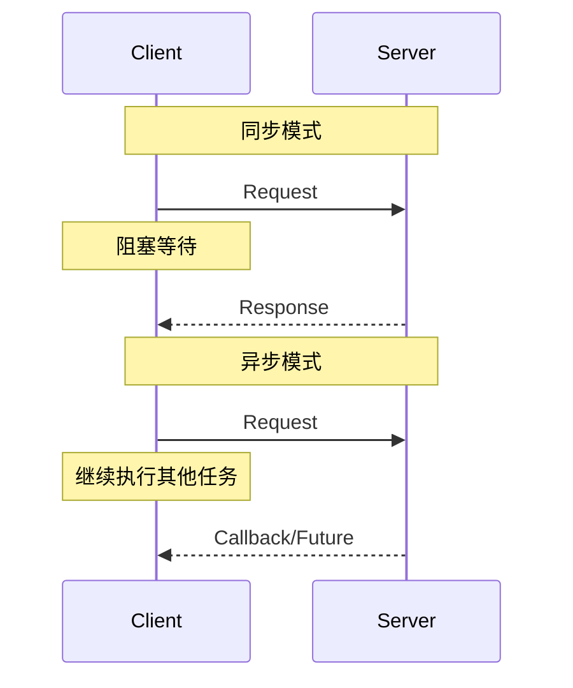
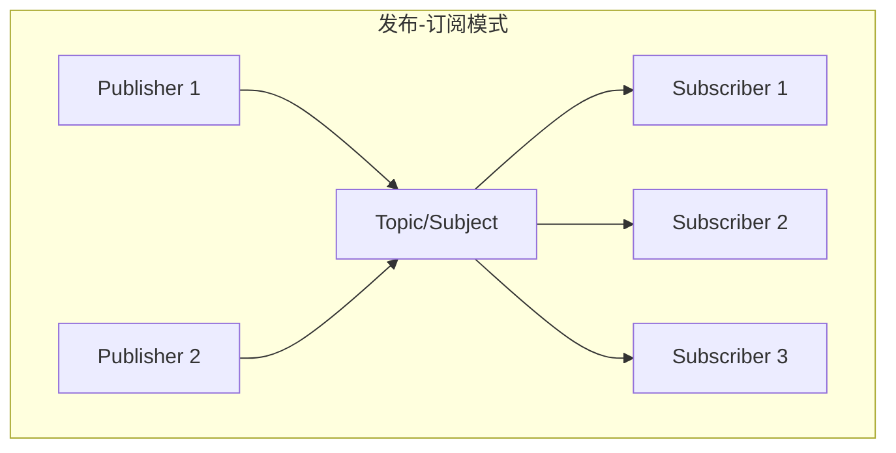
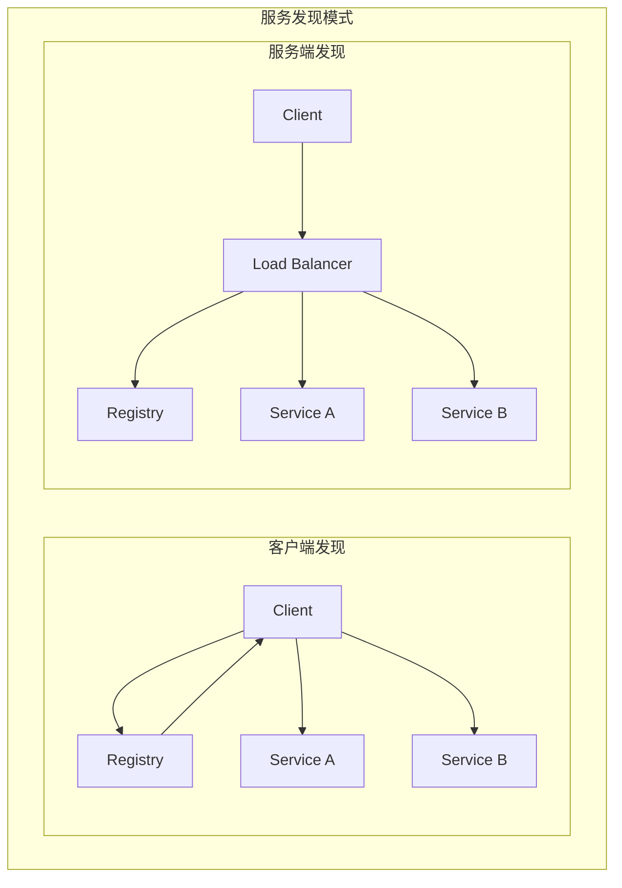
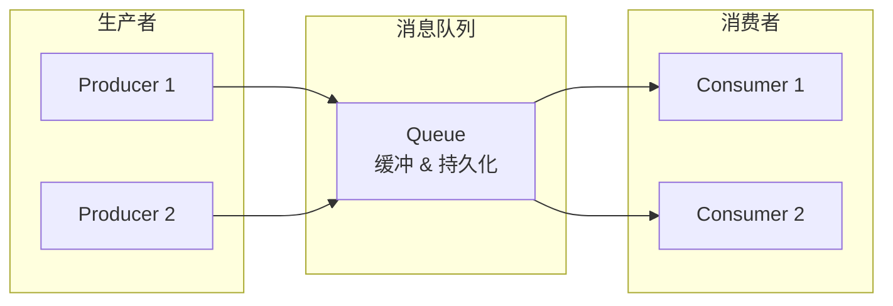
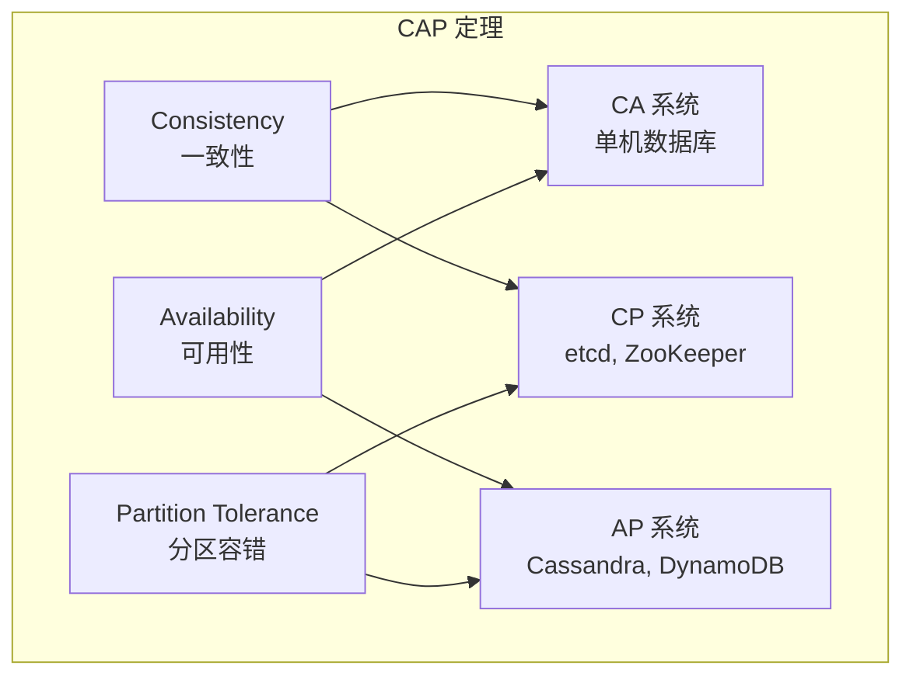
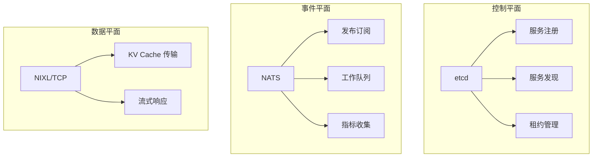

> 本文档介绍分布式系统通信的基础概念，为理解 Dynamo 的三平面架构提供背景知识。

---

## 1. 分布式通信模式

### 1.1 通信模式对比

```
┌─────────────────────────────────────────────────────────────────────┐
│                     分布式通信模式对比                                │
├─────────────────┬─────────────────┬─────────────────────────────────┤
│     模式        │     特点         │         适用场景               │
├─────────────────┼─────────────────┼─────────────────────────────────┤
│ 同步请求-响应   │ 阻塞等待响应     │ 需要立即结果的操作             │
│ 异步请求-响应   │ 非阻塞，回调通知 │ 长时间运行的操作               │
│ 发布-订阅       │ 解耦生产者消费者 │ 事件通知、状态广播             │
│ 点对点          │ 一对一通信       │ 直接数据传输                   │
│ 广播            │ 一对多通信       │ 状态同步、配置分发             │
└─────────────────┴─────────────────┴─────────────────────────────────┘
```

### 1.2 请求-响应模式



### 1.3 发布-订阅模式



**优势**：
- 解耦：发布者不需要知道订阅者
- 灵活：动态添加/移除订阅者
- 扩展：支持多对多通信

---

## 2. 服务发现与配置中心

### 2.1 为什么需要服务发现

在微服务架构中，服务实例是动态的：
- IP 地址可能变化
- 实例数量可能伸缩
- 实例可能故障重启

服务发现解决这些问题：



### 2.2 服务发现的核心功能

| 功能 | 说明 |
|------|------|
| 服务注册 | 服务启动时注册自己的地址 |
| 服务发现 | 客户端查询可用服务实例 |
| 健康检查 | 定期检测服务是否存活 |
| 负载均衡 | 在多个实例间分配请求 |

### 2.3 Dynamo 的选择

**Dynamo 采用客户端发现模式**：
- 客户端直接查询 etcd 获取服务列表
- 客户端负责选择目标实例
- 减少中间层，降低延迟

---

## 3. 消息队列基础

### 3.1 消息队列的作用



### 3.2 核心功能

| 功能 | 说明 |
|------|------|
| 异步解耦 | 生产者和消费者不需要同时在线 |
| 流量削峰 | 缓冲突发流量，保护下游服务 |
| 可靠传递 | 消息持久化，确保不丢失 |
| 广播分发 | 一条消息可被多个消费者处理 |

### 3.3 消息模式

**点对点（Queue）**：
```
Producer → Queue → Consumer (一个消息只被一个消费者处理)
```

**发布-订阅（Topic）**：
```
Publisher → Topic → Subscriber 1
                 → Subscriber 2
                 → Subscriber N
```

---

## 4. 高性能数据传输

### 4.1 传统 TCP 的瓶颈

```
传统 TCP 数据传输：
┌────────┐    copy    ┌────────┐    copy    ┌────────┐
│ App    │ ────────→ │ Kernel │ ────────→ │ NIC    │
│ Buffer │           │ Buffer │           │ Buffer │
└────────┘           └────────┘           └────────┘
    ↑                    ↑                    ↑
  用户态               内核态               硬件层
```

**问题**：
- 多次内存拷贝
- 频繁上下文切换
- CPU 开销大

### 4.2 RDMA 零拷贝

```
RDMA 零拷贝传输：
┌────────┐  DMA direct  ┌────────┐
│ App    │ ──────────→ │ NIC    │
│ Buffer │             │ Buffer │
└────────┘             └────────┘
    ↑                      ↑
  用户态                 硬件层
```

**RDMA（Remote Direct Memory Access）优势**：
- 绕过 CPU，直接访问远程内存
- 零拷贝，减少内存带宽消耗
- 微秒级延迟

### 4.3 性能对比

| 指标 | TCP | RDMA |
|------|-----|------|
| 延迟 | ~100μs | ~1μs |
| 吞吐 | ~10 Gbps | ~100+ Gbps |
| CPU 占用 | 高 | 极低 |
| 适用场景 | 通用 | 高性能计算 |

---

## 5. 一致性模型

### 5.1 CAP 定理

分布式系统无法同时满足：
- **C**onsistency（一致性）
- **A**vailability（可用性）
- **P**artition tolerance（分区容错）



### 5.2 Dynamo 的选择

| 组件 | 一致性级别 | 原因 |
|------|-----------|------|
| etcd | 强一致性 (CP) | 服务注册需要准确 |
| NATS | 最终一致性 (AP) | 事件通知允许短暂延迟 |
| KV Transfer | N/A | 数据传输，不涉及一致性 |

---

## 6. 与 Dynamo 的关联

### 6.1 三平面架构预览

Dynamo 将通信需求分为三个独立的平面：



### 6.2 技术选型理由

| 平面 | 技术 | 选型理由 |
|------|------|----------|
| 控制 | etcd | 强一致性、Watch 支持、成熟稳定 |
| 事件 | NATS | 高性能、轻量级、多模式支持 |
| 数据 | NIXL | RDMA 支持、GPU 直传、零拷贝 |

---

## 总结

分布式通信的核心概念：

1. **通信模式**：请求-响应、发布-订阅、广播
2. **服务发现**：动态寻址、健康检查、负载均衡
3. **消息队列**：异步解耦、流量削峰、可靠传递
4. **高性能传输**：RDMA、零拷贝、低延迟

理解这些基础概念，是深入学习 Dynamo 三平面架构的前提。

---

## 参考资料

- [Designing Data-Intensive Applications](https://dataintensive.net/)
- [RDMA over Converged Ethernet](https://en.wikipedia.org/wiki/RDMA_over_Converged_Ethernet)
- [CAP Theorem](https://en.wikipedia.org/wiki/CAP_theorem)
