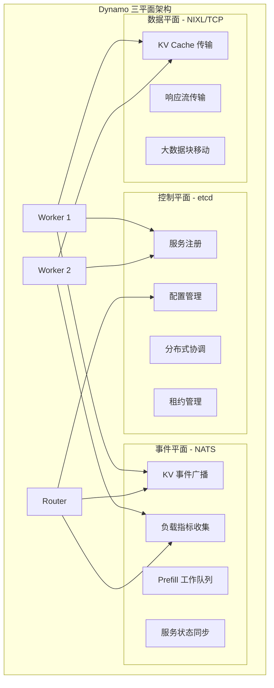
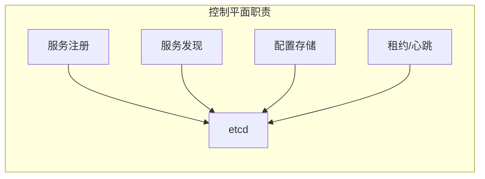
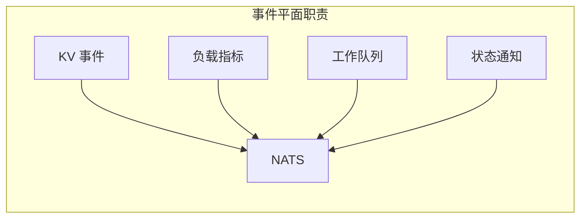
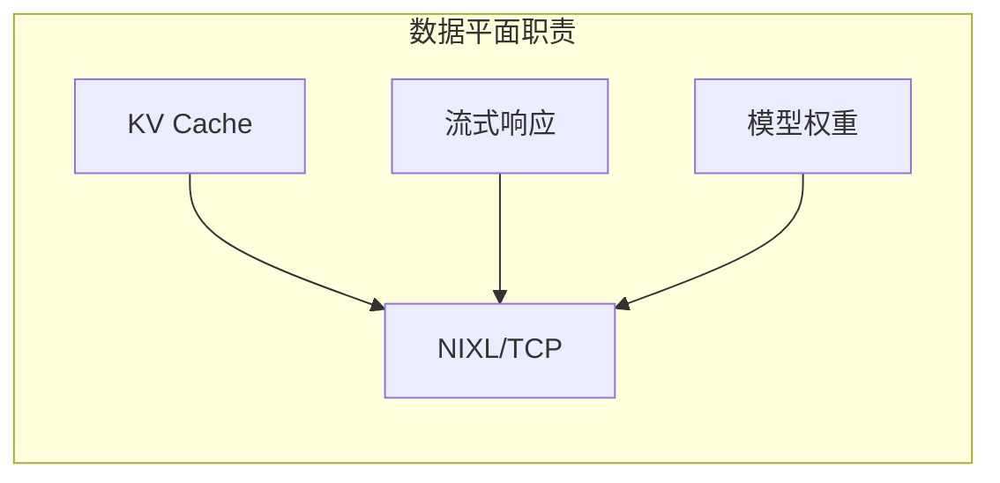
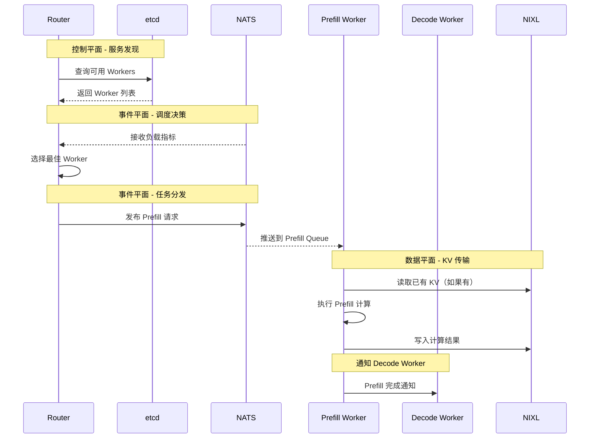
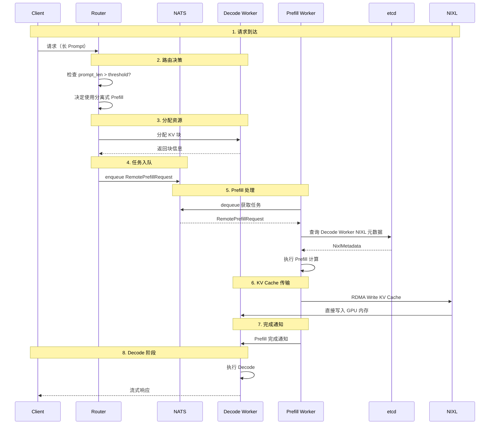
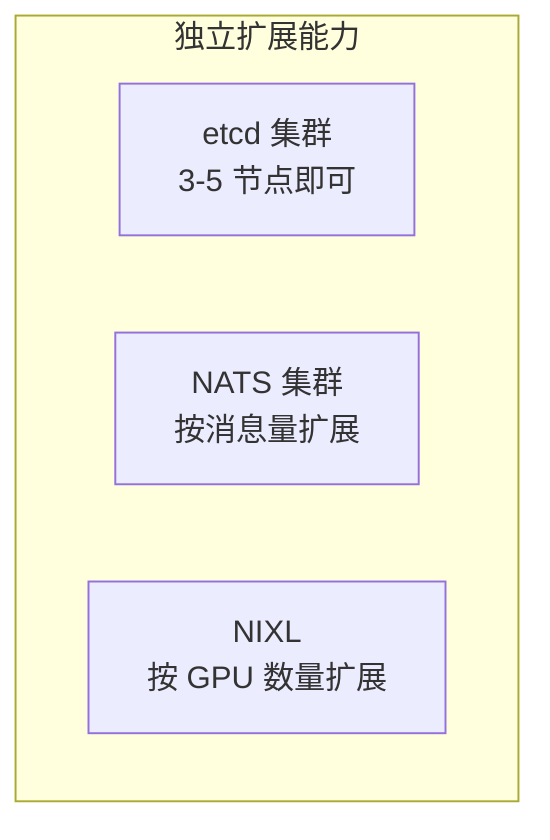

# 三平面架构设计

> Dynamo 采用三平面架构，将不同类型的通信需求分离到不同的基础设施组件中。本文档解析这一设计的原理和优势。

---

## 1. 架构总览

### 1.1 三平面定义



### 1.2 职责对比

| 平面 | 技术选型 | 主要职责 | 数据特点 |
|------|----------|----------|----------|
| 控制平面 | etcd | 服务发现、配置管理、租约 | 小数据量、强一致性 |
| 事件平面 | NATS | 事件广播、指标收集、工作队列 | 中等数据量、高吞吐 |
| 数据平面 | NIXL/TCP | KV Cache 传输、流式响应 | 大数据量、低延迟 |

---

## 2. 控制平面

### 2.1 职责范围

控制平面负责系统的"元数据"管理：



### 2.2 数据特点

- **数据量小**：KB 级别的元数据
- **更新频率低**：秒级到分钟级
- **一致性要求高**：必须准确

### 2.3 为什么选择 etcd

| 特性 | etcd | 其他选项 |
|------|------|----------|
| 一致性 | Raft 强一致 | ZooKeeper (ZAB) |
| Watch | 原生支持 | ✓ |
| 租约 | 内置支持 | 需要自实现 |
| 运维 | 简单 | 复杂 |

---

## 3. 事件平面

### 3.1 职责范围

事件平面负责系统内的"事件流"：



### 3.2 数据特点

- **数据量中等**：消息级别
- **更新频率高**：毫秒到秒级
- **可靠性要求**：允许偶尔丢失（Core NATS）或必须可靠（JetStream）

### 3.3 为什么选择 NATS

| 特性 | NATS | Kafka | RabbitMQ |
|------|------|-------|----------|
| 延迟 | 微秒级 | 毫秒级 | 毫秒级 |
| 部署 | 单二进制 | 依赖 ZK | 依赖 Erlang |
| 协议 | 简单文本 | 复杂二进制 | AMQP |
| 持久化 | JetStream | 内置 | 内置 |

---

## 4. 数据平面

### 4.1 职责范围

数据平面负责大规模数据传输：



### 4.2 数据特点

- **数据量大**：MB 到 GB 级别
- **延迟敏感**：影响 TTFT
- **带宽密集**：需要高吞吐

### 4.3 技术选择

| 场景 | 技术 | 原因 |
|------|------|------|
| KV Cache 传输 | NIXL (RDMA) | 低延迟、高带宽 |
| 流式响应 | TCP Pipeline | 广泛兼容 |
| 无 RDMA 环境 | TCP 回退 | 通用性 |

---

## 5. 平面间协作

### 5.1 完整请求流程



### 5.2 分离式 Prefill 流程



---

## 6. 设计优势

### 6.1 关注点分离

每个平面专注于特定类型的通信：

```
控制平面：强一致性，低频更新
     ↓
事件平面：高吞吐，最终一致
     ↓
数据平面：低延迟，大带宽
```

### 6.2 独立扩展



### 6.3 故障隔离

| 故障场景 | 影响范围 | 恢复策略 |
|----------|----------|----------|
| etcd 不可用 | 新服务无法注册 | 现有服务继续运行 |
| NATS 不可用 | 事件延迟 | 本地缓存兜底 |
| NIXL 故障 | KV 传输失败 | 回退到 TCP |

---

## 7. 配置建议

### 7.1 小规模部署（< 10 GPU）

```yaml
control_plane:
  etcd:
    nodes: 1  # 单节点即可
    memory: 2GB

event_plane:
  nats:
    nodes: 1
    memory: 1GB

data_plane:
  nixl:
    enabled: false  # 使用 TCP
```

### 7.2 中规模部署（10-50 GPU）

```yaml
control_plane:
  etcd:
    nodes: 3  # 3 节点集群
    memory: 4GB

event_plane:
  nats:
    nodes: 3
    memory: 2GB
    jetstream: true

data_plane:
  nixl:
    enabled: true
    fallback: tcp
```

### 7.3 大规模部署（50+ GPU）

```yaml
control_plane:
  etcd:
    nodes: 5
    memory: 8GB
    ssd: true

event_plane:
  nats:
    nodes: 5
    memory: 4GB
    jetstream: true

data_plane:
  nixl:
    enabled: true
    rdma_interface: ib0
```

---

## 总结

三平面架构的核心思想：

1. **关注点分离**：不同通信需求使用不同技术
2. **技术适配**：每个平面选择最合适的技术
3. **独立扩展**：各平面可以独立扩容
4. **故障隔离**：一个平面故障不影响其他平面

这套架构使 Dynamo 能够在保证可靠性的同时，实现高性能的分布式推理。

---

## 参考资料

- [etcd Documentation](https://etcd.io/docs/)
- [NATS Documentation](https://docs.nats.io/)
- [NVIDIA NIXL](https://developer.nvidia.com/nixl)
