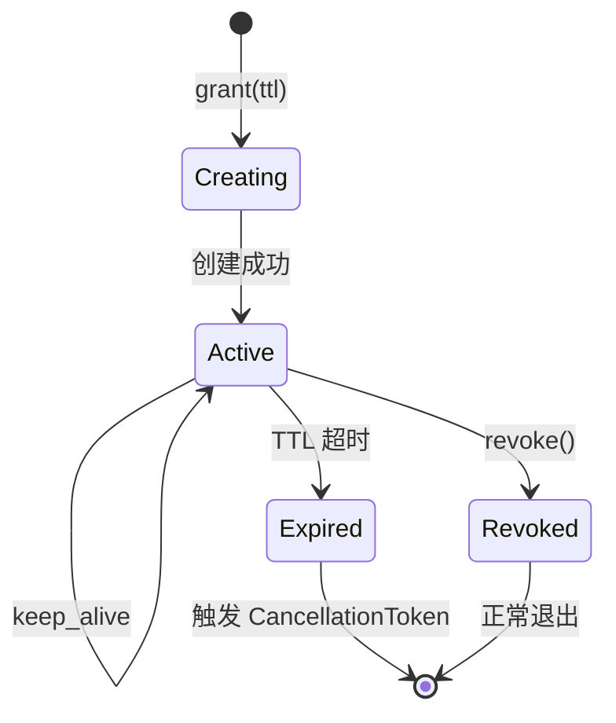
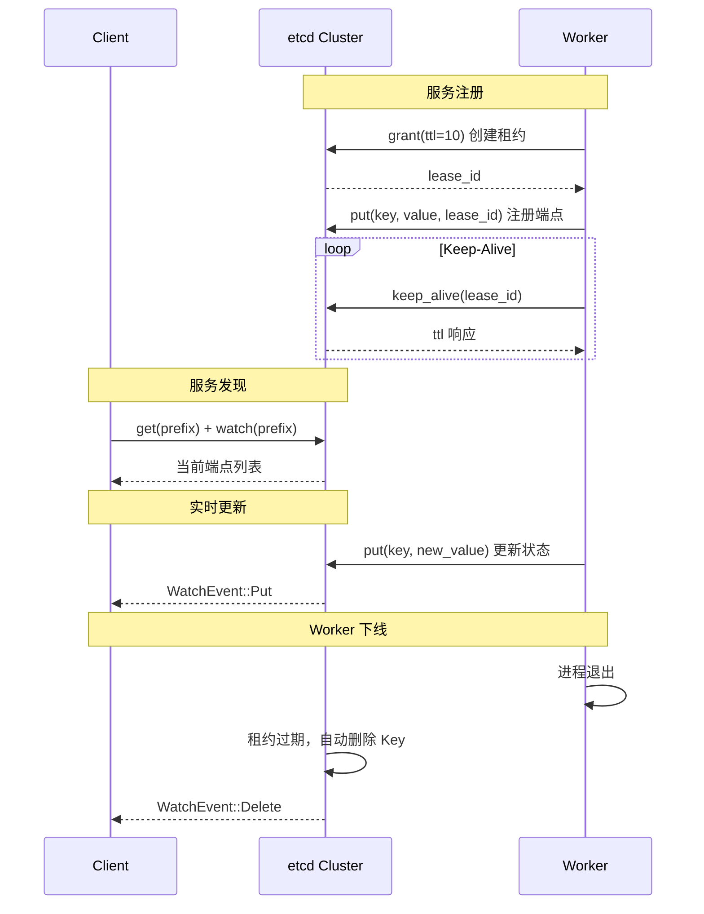
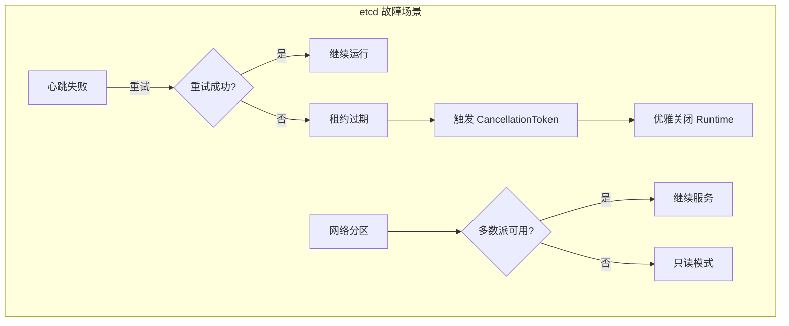

> etcd 是 Dynamo 控制平面的核心组件，负责服务注册、发现和租约管理。本文档详细解析其集成实现。

---

## 1. etcd 基础概念

### 1.1 核心能力

| 功能 | 说明 |
|------|------|
| 键值存储 | 可靠的 Key-Value 存储 |
| Watch | 监听 Key 变化，实时通知 |
| 租约（Lease） | 自动过期的键，用于健康检查 |
| 事务 | 原子性的多 Key 操作 |
| MVCC | 多版本并发控制，支持历史版本查询 |

### 1.2 数据模型

```
etcd 数据模型：
┌─────────────────────────────────────────────┐
│  Key: /dynamo/components/VllmWorker/endpoints/worker-1  │
│  Value: {"id": "worker-1", "address": "..."}            │
│  Lease: 12345678 (TTL: 10s)                             │
│  Revision: 100                                          │
└─────────────────────────────────────────────┘
```

---

## 2. Dynamo etcd Client 设计

### 2.1 Client 结构

```rust
// lib/runtime/src/transports/etcd.rs

/// ETCD Client
#[derive(Clone)]
pub struct Client {
    client: etcd_client::Client,   // 底层 etcd 客户端
    primary_lease: i64,            // 主租约 ID
    runtime: Runtime,              // 关联的 Runtime
}

#[derive(Debug, Clone)]
pub struct Lease {
    /// ETCD lease ID
    id: i64,
    /// 与租约关联的 CancellationToken
    cancel_token: CancellationToken,
}
```

### 2.2 设计要点

1. **租约绑定 Runtime**：主租约与 Runtime 的 `CancellationToken` 绑定
2. **自动续约**：后台任务自动发送心跳
3. **故障传播**：租约失效时自动触发 Runtime 关闭

---

## 3. 租约（Lease）管理

### 3.1 租约状态机



### 3.2 租约创建

```rust
// lib/runtime/src/transports/etcd/lease.rs

/// 创建租约并绑定 CancellationToken
pub async fn create_lease(
    mut lease_client: LeaseClient,
    ttl: i64,
    token: CancellationToken,
) -> Result<Lease> {
    // 1. 向 etcd 申请租约
    let lease = lease_client.grant(ttl, None).await?;

    let id = lease.id();
    let ttl = lease.ttl();
    let child = token.child_token();
    let clone = token.clone();

    // 2. 启动后台 keep-alive 任务
    tokio::spawn(async move {
        match keep_alive(lease_client, id, ttl, child).await {
            Ok(_) => tracing::trace!("keep alive task exited successfully"),
            Err(e) => {
                tracing::info!("keep alive task failed: {:?}", e);
                // 3. 租约失效时取消 Token
                token.cancel();
            }
        }
    });

    Ok(Lease { id, cancel_token: clone })
}
```

### 3.3 Keep-Alive 机制

```rust
/// 持续保持租约存活
pub async fn keep_alive(
    client: LeaseClient,
    lease_id: i64,
    ttl: i64,
    token: CancellationToken,
) -> Result<()> {
    let mut ttl = ttl;
    let mut deadline = create_deadline(ttl)?;

    let mut client = client;
    let (mut heartbeat_sender, mut heartbeat_receiver) =
        client.keep_alive(lease_id).await?;

    loop {
        // 检查是否超过最后期限
        if deadline < std::time::Instant::now() {
            return Err(error!("failed to issue heartbeat in time"));
        }

        tokio::select! {
            biased;

            // 处理心跳响应
            status = heartbeat_receiver.message() => {
                if let Some(resp) = status? {
                    ttl = resp.ttl();
                    deadline = create_deadline(ttl)?;

                    if resp.ttl() == 0 {
                        return Err(error!("lease expired or revoked"));
                    }
                }
            }

            // 处理取消信号
            _ = token.cancelled() => {
                tracing::trace!(lease_id, "cancellation token triggered");
                let _ = client.revoke(lease_id).await?;
                return Ok(());
            }

            // 定时发送心跳（TTL 的一半）
            _ = tokio::time::sleep(Duration::from_secs(ttl as u64 / 2)) => {
                tracing::trace!(lease_id, "sending keep alive");
                if let Err(e) = heartbeat_sender.keep_alive().await {
                    tracing::warn!(lease_id, "keep alive failed: {:?}", e);
                    ttl = 0;  // 触发重试
                }
            }
        }
    }
}
```

---

## 4. 服务注册

### 4.1 原子性创建

```rust
/// 原子性创建 Key（如果不存在）
pub async fn kv_create(
    &self,
    key: String,
    value: Vec<u8>,
    lease_id: Option<i64>,
) -> Result<()> {
    let put_options = lease_id.map(|id| PutOptions::new().with_lease(id));

    // 构建事务：仅当 Key 不存在时创建
    let txn = Txn::new()
        .when(vec![
            Compare::version(key.as_str(), CompareOp::Equal, 0)  // Key 不存在
        ])
        .and_then(vec![
            TxnOp::put(key.as_str(), value, put_options),  // 创建 Key
        ]);

    let result = self.client.kv_client().txn(txn).await?;

    if result.succeeded() {
        Ok(())
    } else {
        Err(error!("failed to create key"))
    }
}
```

### 4.2 注册数据结构

```
etcd Key 命名规范：
/{namespace}/components/{component_name}/endpoints/{endpoint_id}

示例：
/dynamo/components/VllmWorker/endpoints/worker-abc123

Value 内容（JSON）：
{
    "id": "worker-abc123",
    "subject": "dynamo.VllmWorker.generate.worker-abc123",
    "address": "192.168.1.100:8080",
    "data": {
        "kv_active_blocks": 1000,
        "kv_total_blocks": 10000,
        "request_active_slots": 5,
        "request_total_slots": 100
    }
}
```

---

## 5. 服务发现（Watch）

### 5.1 Watch 机制

```rust
pub async fn kv_get_and_watch_prefix(
    &self,
    prefix: impl AsRef<str> + std::fmt::Display,
) -> Result<PrefixWatcher> {
    let mut kv_client = self.client.kv_client();
    let mut watch_client = self.client.watch_client();

    // 1. 获取当前所有匹配的 Key
    let mut get_response = kv_client
        .get(prefix.as_ref(), Some(GetOptions::new().with_prefix()))
        .await?;

    // 2. 获取起始 revision（用于增量 Watch）
    let start_revision = get_response
        .header()
        .ok_or(error!("missing header"))?
        .revision() + 1;

    // 3. 建立 Watch 连接
    let (watcher, mut watch_stream) = watch_client
        .watch(
            prefix.as_ref(),
            Some(WatchOptions::new()
                .with_prefix()
                .with_start_revision(start_revision)
                .with_prev_key()),
        )
        .await?;

    let kvs = get_response.take_kvs();
    let (tx, rx) = mpsc::channel(32);

    // 4. 启动后台任务转发事件
    self.runtime.secondary().spawn(async move {
        // 先发送初始数据
        for kv in kvs {
            if tx.send(WatchEvent::Put(kv)).await.is_err() {
                break;
            }
        }

        // 持续监听变化
        while let Some(Ok(response)) = watch_stream.next().await {
            for event in response.events() {
                match event.event_type() {
                    etcd_client::EventType::Put => {
                        if let Some(kv) = event.kv() {
                            let _ = tx.send(WatchEvent::Put(kv.clone())).await;
                        }
                    }
                    etcd_client::EventType::Delete => {
                        if let Some(kv) = event.kv() {
                            let _ = tx.send(WatchEvent::Delete(kv.clone())).await;
                        }
                    }
                }
            }
        }
    });

    Ok(PrefixWatcher { prefix, watcher, rx })
}
```

### 5.2 Watch 事件类型

```rust
#[derive(Debug)]
pub enum WatchEvent {
    Put(KeyValue),    // Key 创建或更新
    Delete(KeyValue), // Key 删除
}
```

---

## 6. 服务发现时序



---

## 7. 配置建议

### 7.1 环境变量

```yaml
# etcd 连接配置
ETCD_ENDPOINTS: "http://etcd1:2379,http://etcd2:2379,http://etcd3:2379"
```

### 7.2 租约配置

```rust
// 推荐配置
lease_ttl: 10  // 秒，推荐 5-30 秒
```

### 7.3 调优建议

| 参数 | 推荐值 | 说明 |
|------|--------|------|
| TTL | 10s | 过短增加心跳开销，过长延迟故障检测 |
| 集群规模 | 3 或 5 节点 | 确保高可用 |
| Watch 数量 | < 10000 | 单个 etcd 的 Watch 限制 |

---

## 8. 故障处理

### 8.1 故障场景



### 8.2 恢复策略

| 故障 | 影响 | 恢复策略 |
|------|------|----------|
| 单节点故障 | 无影响 | 自动故障转移 |
| 网络抖动 | 短暂不可用 | 自动重连 |
| 租约过期 | 服务下线 | 重新注册 |

---

## 总结

etcd 在 Dynamo 中的核心作用：

1. **服务注册**：Worker 启动时注册端点
2. **服务发现**：Router 通过 Watch 发现服务
3. **租约管理**：自动检测服务健康状态
4. **原子操作**：事务确保数据一致性

这套机制确保了 Dynamo 集群中服务的动态管理和高可用性。

---

## 参考文件

- [lib/runtime/src/transports/etcd.rs](../../../lib/runtime/src/transports/etcd.rs) - etcd Client
- [lib/runtime/src/transports/etcd/lease.rs](../../../lib/runtime/src/transports/etcd/lease.rs) - 租约管理
