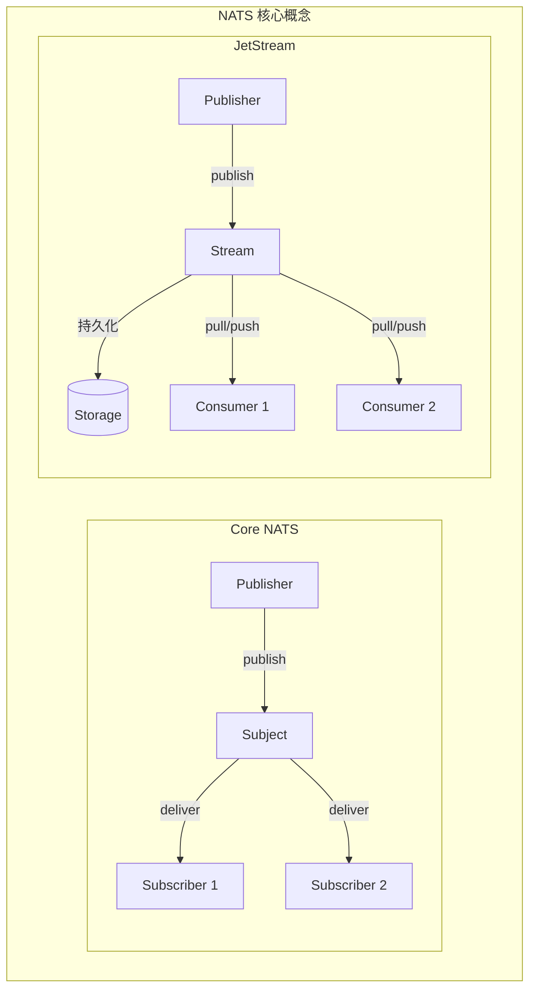
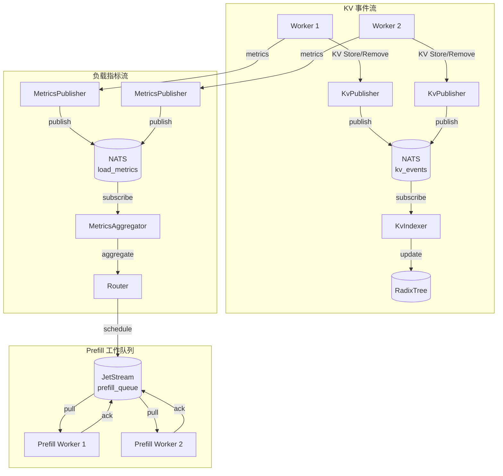

> NATS 是 Dynamo 事件平面的核心组件，负责事件广播、指标收集和工作队列。本文档详细解析其集成实现。

---

## 1. NATS 架构概述

### 1.1 核心概念



### 1.2 Core NATS vs JetStream

| 特性 | Core NATS | JetStream |
|------|-----------|-----------|
| 持久化 | 否 | 是 |
| 消息重放 | 否 | 是 |
| 消息确认 | 否 | 是 |
| 消费者组 | 否 | 是 |
| 适用场景 | 实时事件 | 可靠队列 |

---

## 2. Dynamo NATS Client 设计

### 2.1 Client 结构

```rust
// lib/runtime/src/transports/nats.rs

#[derive(Clone)]
pub struct Client {
    client: client::Client,       // Core NATS 客户端
    js_ctx: jetstream::Context,   // JetStream 上下文
}

impl Client {
    /// 验证配置并连接到 NATS 服务器
    pub async fn connect(self) -> Result<Client> {
        self.validate()?;

        let client = match self.auth {
            NatsAuth::UserPass(username, password) => {
                async_nats::ConnectOptions::with_user_and_password(username, password)
            }
            NatsAuth::Token(token) => {
                async_nats::ConnectOptions::with_token(token)
            }
            NatsAuth::NKey(nkey) => {
                async_nats::ConnectOptions::with_nkey(nkey)
            }
            NatsAuth::CredentialsFile(path) => {
                async_nats::ConnectOptions::with_credentials_file(path).await?
            }
        };

        let client = client.connect(self.server).await?;
        let js_ctx = jetstream::new(client.clone());

        Ok(Client { client, js_ctx })
    }
}
```

### 2.2 认证方式

| 认证方式 | 环境变量 |
|----------|----------|
| 用户名/密码 | `NATS_AUTH_USERNAME`, `NATS_AUTH_PASSWORD` |
| Token | `NATS_AUTH_TOKEN` |
| NKey | `NATS_AUTH_NKEY` |
| 凭证文件 | `NATS_AUTH_CREDENTIALS_FILE` |

---

## 3. 事件发布/订阅接口

### 3.1 Trait 定义

```rust
// lib/runtime/src/traits/events.rs

/// 事件发布者接口
#[async_trait]
pub trait EventPublisher {
    /// 获取基础主题
    fn subject(&self) -> String;

    /// 发布序列化事件
    async fn publish(
        &self,
        event_name: impl AsRef<str> + Send + Sync,
        event: &(impl Serialize + Send + Sync),
    ) -> Result<()>;

    /// 发布原始字节
    async fn publish_bytes(
        &self,
        event_name: impl AsRef<str> + Send + Sync,
        bytes: Vec<u8>,
    ) -> Result<()>;
}

/// 事件订阅者接口
#[async_trait]
pub trait EventSubscriber {
    /// 订阅指定事件
    async fn subscribe(
        &self,
        event_name: impl AsRef<str> + Send + Sync,
    ) -> Result<async_nats::Subscriber>;

    /// 订阅并自动反序列化
    async fn subscribe_with_type<T: for<'de> Deserialize<'de> + Send + 'static>(
        &self,
        event_name: impl AsRef<str> + Send + Sync,
    ) -> Result<impl Stream<Item = Result<T>> + Send>;
}
```

### 3.2 Component 实现

```rust
// lib/runtime/src/component/component.rs

#[async_trait]
impl EventPublisher for Component {
    fn subject(&self) -> String {
        format!("namespace.{}.component.{}", self.namespace.name, self.name)
    }

    async fn publish(
        &self,
        event_name: impl AsRef<str> + Send + Sync,
        event: &(impl Serialize + Send + Sync),
    ) -> Result<()> {
        let bytes = serde_json::to_vec(event)?;
        self.publish_bytes(event_name, bytes).await
    }

    async fn publish_bytes(
        &self,
        event_name: impl AsRef<str> + Send + Sync,
        bytes: Vec<u8>,
    ) -> Result<()> {
        let subject = format!("{}.{}", self.subject(), event_name.as_ref());
        Ok(self.drt()
            .nats_client()
            .client()
            .publish(subject, bytes.into())
            .await?)
    }
}

#[async_trait]
impl EventSubscriber for Component {
    async fn subscribe(
        &self,
        event_name: impl AsRef<str> + Send + Sync,
    ) -> Result<async_nats::Subscriber> {
        let subject = format!("{}.{}", self.subject(), event_name.as_ref());
        Ok(self.drt().nats_client().client().subscribe(subject).await?)
    }

    async fn subscribe_with_type<T: for<'de> Deserialize<'de> + Send + 'static>(
        &self,
        event_name: impl AsRef<str> + Send + Sync,
    ) -> Result<impl Stream<Item = Result<T>> + Send> {
        let subscriber = self.subscribe(event_name).await?;

        let stream = subscriber.map(move |msg| {
            serde_json::from_slice::<T>(&msg.payload)
                .with_context(|| format!("Failed to deserialize: {:?}", msg.payload))
        });

        Ok(stream)
    }
}
```

---

## 4. Subject 命名规范

### 4.1 命名结构

```
NATS Subject 命名结构：
namespace.{ns_name}.component.{component_name}.{event_name}

示例：
- KV 事件：namespace.dynamo.component.VllmWorker.kv_events
- 负载指标：namespace.dynamo.component.VllmWorker.load_metrics
- 命中率：namespace.dynamo.component.Router.kv-hit-rate
```

### 4.2 通配符订阅

```
NATS 支持通配符：
*  - 匹配单个 token
>  - 匹配多个 token

示例：
namespace.dynamo.component.*.kv_events  # 所有组件的 KV 事件
namespace.dynamo.component.>            # 所有组件的所有事件
```

---

## 5. JetStream 工作队列

### 5.1 Python 实现

```python
# examples/llm/utils/nats_queue.py

class NATSQueue:
    def __init__(
        self,
        stream_name: str = "default",
        nats_server: str = "nats://localhost:4222",
        dequeue_timeout: float = 1,
    ):
        self.nats_url = nats_server
        self._nc: Optional[NATS] = None
        self._js: Optional[JetStreamContext] = None
        self._stream_name = stream_name.replace("/", "_")
        self._subject = f"{self._stream_name}.*"
        self.dequeue_timeout = dequeue_timeout
        self._subscriber: Optional[JetStreamContext.PullSubscription] = None

    async def connect(self):
        """建立连接并创建 Stream"""
        if self._nc is None:
            self._nc = NATS()
            await self._nc.connect(self.nats_url)
            self._js = self._nc.jetstream()

            # 检查 Stream 是否存在，不存在则创建
            try:
                await self._js.stream_info(self._stream_name)
            except NotFoundError:
                await self._js.add_stream(
                    name=self._stream_name,
                    subjects=[self._subject]
                )

            # 创建持久化订阅者
            self._subscriber = await self._js.pull_subscribe(
                f"{self._stream_name}.queue",
                durable="worker-group"
            )

    async def enqueue_task(self, task_data: bytes) -> None:
        """入队任务"""
        await self.ensure_connection()
        await self._js.publish(f"{self._stream_name}.queue", task_data)

    async def dequeue_task(self) -> Optional[bytes]:
        """出队任务并确认"""
        await self.ensure_connection()
        try:
            msgs = await self._subscriber.fetch(1, timeout=self.dequeue_timeout)
            if msgs:
                msg = msgs[0]
                await msg.ack()  # 确认消息已处理
                return msg.data
            return None
        except asyncio.TimeoutError:
            return None
```

### 5.2 Prefill Queue 封装

```python
# examples/llm/utils/prefill_queue.py

class PrefillQueue(NATSQueue):
    """Prefill 请求专用队列"""

    def __init__(
        self,
        stream_name="prefill_queue",
        nats_server: str = "nats://localhost:4222",
        dequeue_timeout: float = 1,
    ):
        super().__init__(
            stream_name=stream_name,
            nats_server=nats_server,
            dequeue_timeout=dequeue_timeout,
        )

    async def enqueue_prefill_request(
        self, prefill_request: RemotePrefillRequest
    ) -> None:
        encoded_request = msgspec.json.encode(prefill_request)
        await self.enqueue_task(encoded_request)

    async def dequeue_prefill_request(self) -> Optional[RemotePrefillRequest]:
        encoded_request = await self.dequeue_task()
        if encoded_request is not None:
            return msgspec.json.decode(encoded_request, type=RemotePrefillRequest)
        return None
```

---

## 6. 事件流架构



---

## 7. 配置建议

### 7.1 环境变量

```yaml
# NATS 连接配置
NATS_SERVER: "nats://nats1:4222"
NATS_AUTH_USERNAME: "user"
NATS_AUTH_PASSWORD: "password"

# 或使用其他认证方式
NATS_AUTH_TOKEN: "your-token"
NATS_AUTH_NKEY: "your-nkey"
NATS_AUTH_CREDENTIALS_FILE: "/path/to/credentials"
```

### 7.2 JetStream 配置

```python
# Stream 配置示例
await js.add_stream(
    name="prefill_queue",
    subjects=["prefill_queue.*"],
    retention=RetentionPolicy.WORK_QUEUE,  # 工作队列模式
    max_msgs=100000,                        # 最大消息数
    max_bytes=1024*1024*1024,              # 最大存储 1GB
)
```

### 7.3 调优建议

| 参数 | 推荐值 | 说明 |
|------|--------|------|
| 消息大小 | < 1MB | 大数据用 NIXL |
| Consumer batch | 1-10 | 根据处理能力 |
| Stream retention | WORK_QUEUE | 处理后删除 |

---

## 8. Dynamo 中的使用

### 8.1 KV 事件发布

```python
# Worker 发布 KV 事件
await component.publish("kv_events", RouterEvent(
    worker_id=self.worker_id,
    data=KvCacheEventData.Stored(KvCacheStoreData(
        request_id=request_id,
        token_ids=token_ids,
        block_hashes=block_hashes,
    ))
))
```

### 8.2 指标订阅

```python
# Router 订阅指标
async for msg in component.subscribe("load_metrics"):
    metrics = serde_json.loads(msg.data)
    aggregator.update(metrics)
```

---

## 总结

NATS 在 Dynamo 中的核心作用：

1. **事件广播**：Core NATS 发布 KV 事件和指标
2. **工作队列**：JetStream 实现可靠的 Prefill 队列
3. **状态同步**：实时同步 Worker 状态到 Router
4. **解耦通信**：发布-订阅模式解耦组件

这套机制确保了 Dynamo 集群中的高效事件通信。

---

## 参考文件

- [lib/runtime/src/transports/nats.rs](../../../lib/runtime/src/transports/nats.rs) - NATS Client
- [lib/runtime/src/traits/events.rs](../../../lib/runtime/src/traits/events.rs) - 事件接口
- [examples/llm/utils/nats_queue.py](../../../examples/llm/utils/nats_queue.py) - Python 队列
