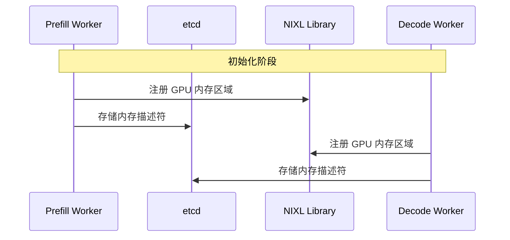
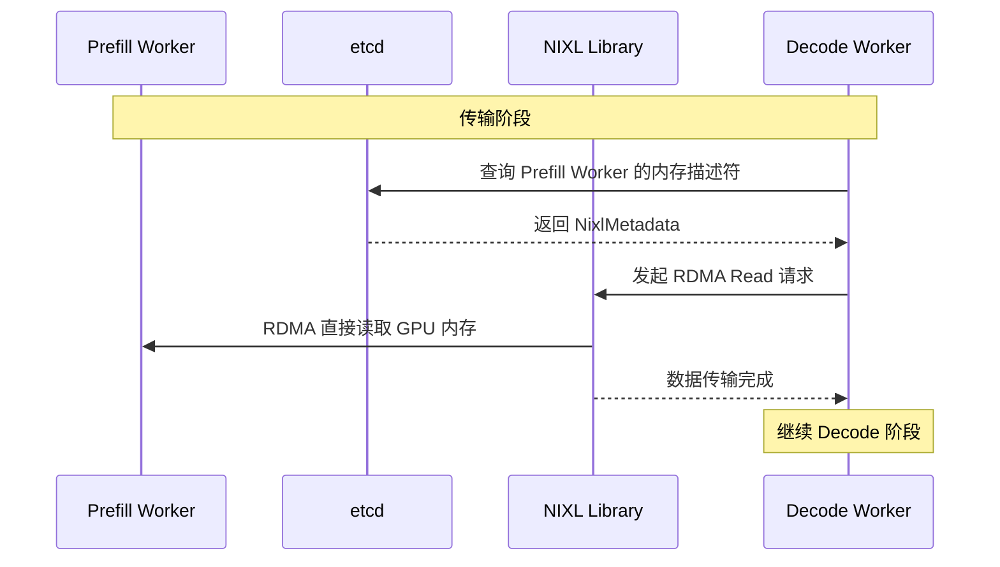
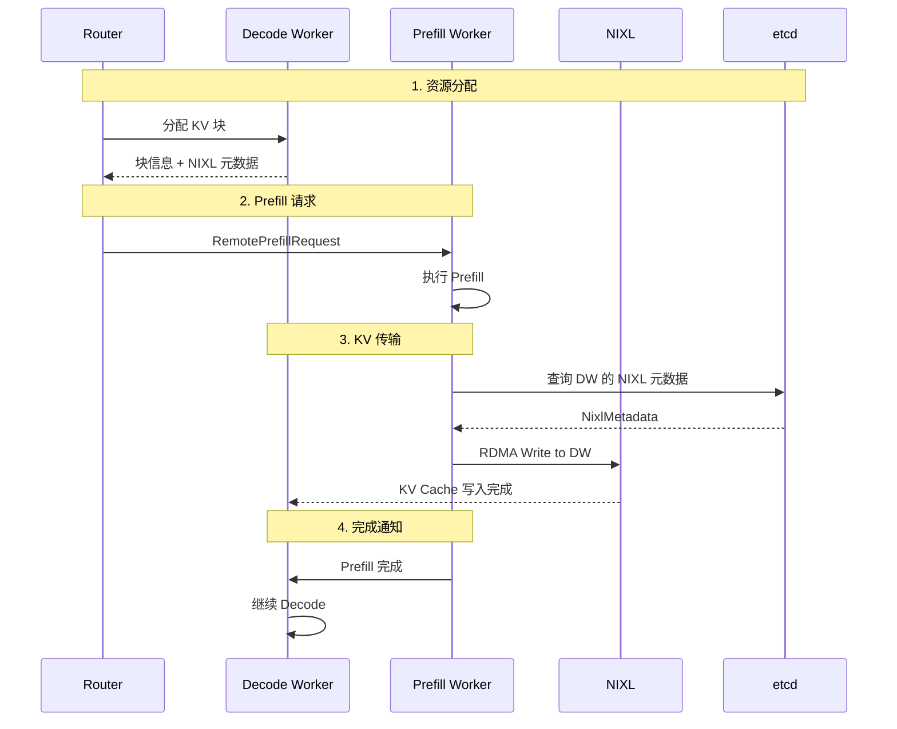
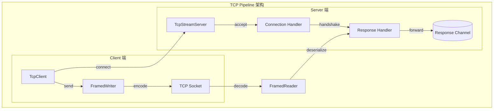

# NIXL 数据传输

> NIXL（NVIDIA Inference Transfer Library）是 Dynamo 数据平面的核心组件，用于高性能 KV Cache 传输。本文档解析其原理和使用。

---

## 1. NIXL 概述

### 1.1 设计目标

NIXL 专为 GPU 间大规模数据传输设计：

- **低延迟**：微秒级传输延迟
- **高带宽**：充分利用 RDMA 网络
- **零拷贝**：GPU 内存直接传输

### 1.2 传输模式对比

| 模式 | 路径 | 延迟 | 带宽 |
|------|------|------|------|
| TCP | GPU→CPU→NIC→CPU→GPU | ~1ms | ~10 Gbps |
| RDMA | GPU→NIC→GPU | ~10μs | ~200 Gbps |
| NVLink | GPU→GPU (同节点) | ~1μs | ~600 Gbps |

---

## 2. 内存描述符

### 2.1 元数据结构

```python
# examples/llm/utils/nixl.py

@dataclass
class NixlMetadata:
    engine_id: str
    memory_descriptors: Dict[str, MemoryDescriptor]
    agent_name: str
```

### 2.2 元数据存储

```python
class NixlMetadataStore:
    """NIXL 元数据存储（通过 etcd）"""

    NIXL_METADATA_KEY = "nixl_metadata"

    def __init__(self, namespace: str, runtime: DistributedRuntime) -> None:
        self._namespace = namespace
        self._stored: set[str] = set()
        self._cached: dict[str, NixlMetadata] = {}
        self._client = runtime.etcd_client()
        self._key_prefix = f"{self._namespace}/{NixlMetadataStore.NIXL_METADATA_KEY}"

    async def put(self, engine_id, metadata: NixlMetadata):
        """注册内存描述符到 etcd"""
        serialized_metadata = msgspec.msgpack.encode(metadata)
        key = "/".join([self._key_prefix, engine_id])
        await self._client.kv_put(key, serialized_metadata, None)
        self._stored.add(engine_id)

    async def get(self, engine_id) -> NixlMetadata:
        """获取远程 Worker 的内存描述符"""
        if engine_id in self._cached:
            return self._cached[engine_id]

        key = "/".join([self._key_prefix, engine_id])
        key_values = await self._client.kv_get_prefix(key)

        for item in key_values:
            deserialized_metadata = msgspec.msgpack.decode(
                item["value"], type=NixlMetadata
            )
            self._cached[engine_id] = deserialized_metadata
            return deserialized_metadata

        raise Exception(f"metadata not found for engine {engine_id}")
```

---

## 3. 传输流程

### 3.1 初始化阶段



### 3.2 传输阶段



---

## 4. RDMA 操作

### 4.1 内存注册

在使用 RDMA 前，必须先注册内存区域：

```
RDMA 内存注册：
┌────────────────────────────────────────┐
│  GPU HBM                               │
│  ┌──────────────────────────────────┐  │
│  │  KV Cache Region (注册)          │  │
│  │  Address: 0x7f0000000000         │  │
│  │  Size: 64GB                      │  │
│  │  Permissions: Read/Write         │  │
│  └──────────────────────────────────┘  │
└────────────────────────────────────────┘
                    ↓
           NIXL 内存描述符
                    ↓
              存储到 etcd
```

### 4.2 RDMA Read

```
RDMA Read 操作：
┌─────────────────┐         ┌─────────────────┐
│  Decode Worker  │         │  Prefill Worker │
│  (Requester)    │         │  (Target)       │
│                 │         │                 │
│  ┌───────────┐  │  RDMA   │  ┌───────────┐  │
│  │ Local Buf │ ←├────────────┤ Remote Buf│  │
│  └───────────┘  │  Read   │  └───────────┘  │
│                 │         │                 │
└─────────────────┘         └─────────────────┘

特点：
- 目标端无感知（不消耗 CPU）
- 零拷贝
- 单侧操作
```

### 4.3 RDMA Write

```
RDMA Write 操作：
┌─────────────────┐         ┌─────────────────┐
│  Prefill Worker │         │  Decode Worker  │
│  (Requester)    │         │  (Target)       │
│                 │         │                 │
│  ┌───────────┐  │  RDMA   │  ┌───────────┐  │
│  │ Local Buf │──├───────────→│ Remote Buf│  │
│  └───────────┘  │  Write  │  └───────────┘  │
│                 │         │                 │
└─────────────────┘         └─────────────────┘

特点：
- 目标端无感知
- 适合 KV Cache 推送
```

---

## 5. 与 Disaggregated Serving 的集成

### 5.1 完整流程



### 5.2 数据流

```
KV Cache 传输数据流：

Prefill Worker GPU                    Decode Worker GPU
┌─────────────────────┐               ┌─────────────────────┐
│  KV Cache (计算结果) │               │  KV Cache (预分配)  │
│                     │   RDMA Write  │                     │
│  Layer 0 K         │──────────────→│  Layer 0 K         │
│  Layer 0 V         │──────────────→│  Layer 0 V         │
│  Layer 1 K         │──────────────→│  Layer 1 K         │
│  Layer 1 V         │──────────────→│  Layer 1 V         │
│  ...               │──────────────→│  ...               │
└─────────────────────┘               └─────────────────────┘
```

---

## 6. TCP 回退

### 6.1 何时使用 TCP

在以下情况下使用 TCP 回退：

- 无 RDMA 硬件
- 跨数据中心传输
- 开发/测试环境

### 6.2 TCP Pipeline



---

## 7. 配置建议

### 7.1 NIXL 配置

```yaml
data_plane:
  nixl:
    enabled: true
    rdma_interface: "ib0"    # RDMA 网卡
    fallback: "tcp"          # 回退选项
```

### 7.2 性能调优

| 参数 | 推荐值 | 说明 |
|------|--------|------|
| MTU | 4096 | 大 MTU 提高效率 |
| Queue Depth | 128 | 并发请求数 |
| Completion Mode | Polling | 低延迟 |

---

## 8. 监控指标

### 8.1 关键指标

| 指标 | 说明 | 目标值 |
|------|------|--------|
| `nixl_transfer_latency` | 传输延迟 | < 100μs |
| `nixl_bandwidth_gbps` | 传输带宽 | > 100 Gbps |
| `nixl_error_rate` | 错误率 | < 0.01% |

### 8.2 故障排查

```bash
# 检查 RDMA 设备
ibstat

# 检查带宽
ib_write_bw -d mlx5_0

# 检查延迟
ib_write_lat -d mlx5_0
```

---

## 总结

NIXL 在 Dynamo 中的核心作用：

1. **高性能传输**：利用 RDMA 实现微秒级延迟
2. **零拷贝**：GPU 内存直接传输
3. **元数据管理**：通过 etcd 共享内存描述符
4. **灵活回退**：无 RDMA 时自动使用 TCP

这套机制使 Disaggregated Serving 成为可能，显著降低了跨 Worker 的 KV Cache 传输开销。

---

## 参考资料

- [NVIDIA NIXL Documentation](https://developer.nvidia.com/nixl)
- [RDMA Programming Guide](https://docs.nvidia.com/networking/display/MLNXOFEDv461000/RDMA+Programming+Guide)
- [examples/llm/utils/nixl.py](../../../examples/llm/utils/nixl.py) - Python 集成
