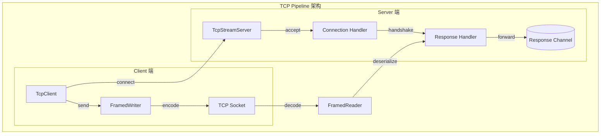
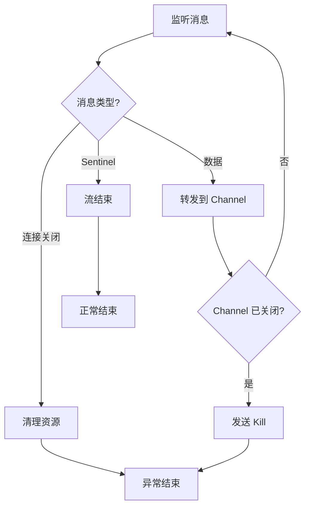
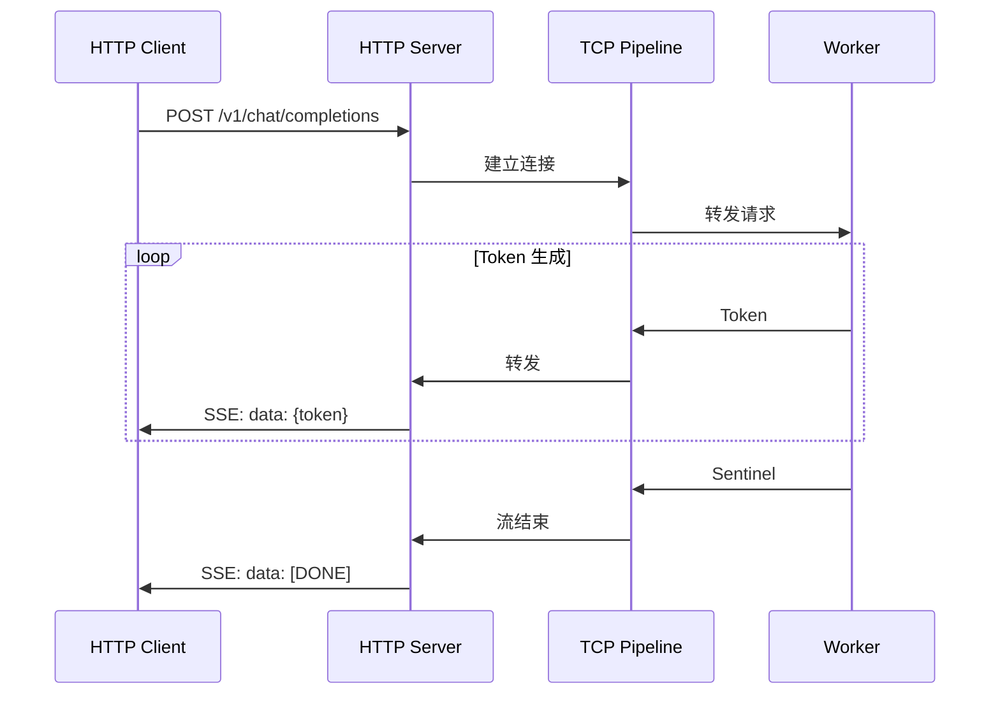
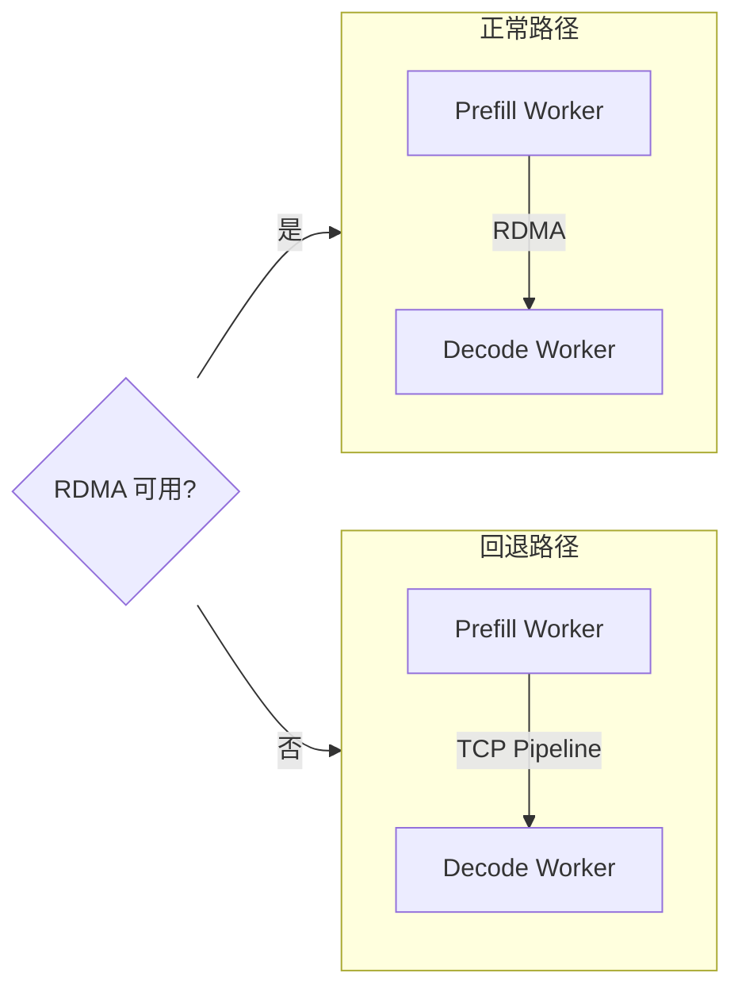

# TCP Pipeline 通信

> TCP Pipeline 是 Dynamo 数据平面的通用传输层，用于流式响应和 NIXL 回退。本文档解析其设计与实现。

---

## 1. TCP Pipeline 架构

### 1.1 整体架构



### 1.2 使用场景

| 场景 | 说明 |
|------|------|
| 流式响应 | Token 流从 Worker 到 Client |
| NIXL 回退 | 无 RDMA 时的 KV 传输 |
| 控制消息 | 请求/响应协调 |

---

## 2. TcpStreamServer 实现

### 2.1 服务器结构

```rust
// lib/runtime/src/pipeline/network/tcp/server.rs

/// TCP 流服务器，监听端口接收响应连接
pub struct TcpStreamServer {
    local_ip: String,
    local_port: u16,
    state: Arc<Mutex<State>>,
}

#[derive(Default)]
struct State {
    tx_subjects: HashMap<String, RequestedSendConnection>,
    rx_subjects: HashMap<String, RequestedRecvConnection>,
    handle: Option<tokio::task::JoinHandle<Result<()>>>,
}
```

### 2.2 服务器创建

```rust
impl TcpStreamServer {
    pub async fn new(options: ServerOptions) -> Result<Arc<Self>, PipelineError> {
        // 获取本地 IP
        let local_ip = match options.interface {
            Some(interface) => {
                let interfaces: HashMap<String, IpAddr> =
                    list_afinet_netifas()?.into_iter().collect();
                interfaces.get(&interface)?.to_string()
            }
            None => local_ip().unwrap().to_string(),
        };

        let state = Arc::new(Mutex::new(State::default()));

        // 启动监听
        let local_port = Self::start(local_ip.clone(), options.port, state.clone())
            .await?;

        tracing::info!("tcp transport service on {}:{}", local_ip, local_port);

        Ok(Arc::new(Self { local_ip, local_port, state }))
    }
}
```

---

## 3. 连接处理

### 3.1 处理流程

```rust
// 处理 TCP 连接
async fn process_stream(
    stream: tokio::net::TcpStream,
    state: Arc<Mutex<State>>
) -> Result<()> {
    // 分割为读写两半
    let (read_half, write_half) = tokio::io::split(stream);

    // 添加编解码器
    let mut framed_reader = FramedRead::new(read_half, TwoPartCodec::default());
    let framed_writer = FramedWrite::new(write_half, TwoPartCodec::default());

    // 等待握手消息
    let first_message = framed_reader.next().await
        .ok_or(error!("Connection closed without handshake"))??;

    let handshake: CallHomeHandshake = match first_message.header() {
        Some(header) => serde_json::from_slice(header)?,
        None => return Err(error!("Expected handshake message")),
    };

    // 根据流类型分发处理
    match handshake.stream_type {
        StreamType::Request => process_request_stream().await,
        StreamType::Response => {
            process_response_stream(
                handshake.subject,
                state,
                framed_reader,
                framed_writer
            ).await
        }
    }
}
```

### 3.2 握手协议

```rust
#[derive(Debug, Serialize, Deserialize)]
struct CallHomeHandshake {
    subject: String,
    stream_type: StreamType,
}

#[derive(Debug, Serialize, Deserialize)]
enum StreamType {
    Request,
    Response,
}
```

---

## 4. TwoPartCodec 消息格式

### 4.1 消息结构

```
TwoPartMessage 格式：
┌──────────────────┬──────────────────┬──────────────────┬──────────────────┐
│ Header Length    │ Data Length      │ Header (JSON)    │ Data (bytes)     │
│ (4 bytes, u32)   │ (4 bytes, u32)   │ (variable)       │ (variable)       │
└──────────────────┴──────────────────┴──────────────────┴──────────────────┘
```

### 4.2 消息类型

```rust
enum TwoPartMessage {
    HeaderOnly(Bytes),           // 控制消息
    DataOnly(Bytes),             // 纯数据
    HeaderAndData(Bytes, Bytes), // 带元数据的数据
}

impl TwoPartMessage {
    fn header(&self) -> Option<&Bytes> {
        match self {
            TwoPartMessage::HeaderOnly(h) => Some(h),
            TwoPartMessage::HeaderAndData(h, _) => Some(h),
            TwoPartMessage::DataOnly(_) => None,
        }
    }

    fn data(&self) -> Option<&Bytes> {
        match self {
            TwoPartMessage::DataOnly(d) => Some(d),
            TwoPartMessage::HeaderAndData(_, d) => Some(d),
            TwoPartMessage::HeaderOnly(_) => None,
        }
    }
}
```

---

## 5. 控制消息

### 5.1 控制消息类型

```rust
#[derive(Debug, Serialize, Deserialize, PartialEq)]
pub enum ControlMessage {
    Stop,      // 请求停止（graceful）
    Kill,      // 强制终止
    Sentinel,  // 流结束标记
}
```

### 5.2 控制消息处理

```rust
enum ControlAction {
    Continue,   // 继续处理
    Shutdown,   // 关闭连接
}

fn process_control_message(message: Bytes) -> Result<ControlAction> {
    match serde_json::from_slice::<ControlMessage>(&message)? {
        ControlMessage::Sentinel => {
            // 客户端发送 Sentinel 表示数据发送完毕
            tracing::trace!("sentinel received; shutting down");
            Ok(ControlAction::Shutdown)
        }
        ControlMessage::Kill | ControlMessage::Stop => {
            // 这些消息不应从客户端收到
            anyhow::bail!("unexpected control message received");
        }
    }
}
```

---

## 6. 流式响应处理

### 6.1 响应转发

```rust
// 客户端断开检测
tokio::select! {
    _ = response_tx.closed() => {
        // 响应通道关闭，发送 Kill 信号
        control_tx.send(ControlMessage::Kill).await?;
        break;
    }

    _ = context.killed() => {
        // 上下文被杀死
        control_tx.send(ControlMessage::Kill).await?;
        break;
    }

    msg = framed_reader.next() => {
        match msg {
            Some(Ok(msg)) => { /* 处理消息 */ }
            Some(Err(_)) => { panic!("invalid message"); }
            None => {
                // TCP 连接被客户端关闭
                tracing::trace!("tcp stream was closed by client");
                break;
            }
        }
    }
}
```

### 6.2 断开检测



---

## 7. 配置选项

### 7.1 服务器配置

```rust
#[derive(Debug, Serialize, Deserialize, Clone, Builder, Default)]
pub struct ServerOptions {
    #[builder(default = "0")]
    pub port: u16,              // 0 表示自动分配端口

    #[builder(default)]
    pub interface: Option<String>,  // 绑定的网络接口
}
```

### 7.2 性能调优

| 参数 | 推荐值 | 说明 |
|------|--------|------|
| Buffer size | 64KB | 流式传输缓冲 |
| TCP_NODELAY | true | 减少小包延迟 |
| SO_KEEPALIVE | true | 检测死连接 |

---

## 8. 与其他组件的集成

### 8.1 HTTP 流式响应



### 8.2 NIXL 回退

当 RDMA 不可用时，KV Cache 传输回退到 TCP：



---

## 总结

TCP Pipeline 的核心功能：

1. **流式传输**：支持长连接的流式数据传输
2. **协议封装**：TwoPartCodec 提供灵活的消息格式
3. **控制消息**：Sentinel/Kill/Stop 支持优雅关闭
4. **断开检测**：及时释放资源

这套机制为 Dynamo 提供了可靠的通用传输层。

---

## 参考文件

- [lib/runtime/src/pipeline/network/tcp/server.rs](../../../lib/runtime/src/pipeline/network/tcp/server.rs) - TCP Server
- [lib/runtime/src/pipeline/network/tcp/client.rs](../../../lib/runtime/src/pipeline/network/tcp/client.rs) - TCP Client
