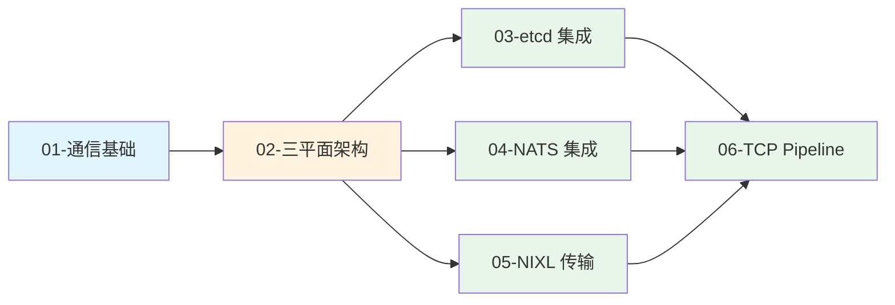
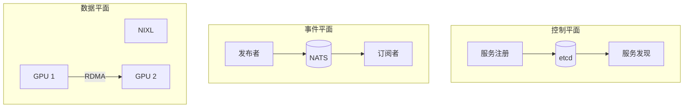

# 第五章：分布式通信机制

> Dynamo 的分布式通信系统采用三平面架构，提供可靠的协调、事件和数据传输能力。

## 本章概述

本章深入解析 Dynamo 的分布式通信机制，包括通信基础、三平面架构、etcd 集成、NATS 集成、NIXL 数据传输以及 TCP Pipeline。

---

## 子文档列表

| 序号 | 文件 | 主题 | 内容简介 |
|------|------|------|----------|
| 1 | [01-distributed-comm-basics.md](01-distributed-comm-basics.md) | 通信基础 | 通信模式、消息队列、RDMA |
| 2 | [02-three-plane-architecture.md](02-three-plane-architecture.md) | 三平面架构 | 控制/事件/数据平面设计 |
| 3 | [03-etcd-integration.md](03-etcd-integration.md) | etcd 集成 | Client、Lease、Watch |
| 4 | [04-nats-integration.md](04-nats-integration.md) | NATS 集成 | Pub/Sub、JetStream、队列 |
| 5 | [05-nixl-data-transfer.md](05-nixl-data-transfer.md) | NIXL 传输 | 内存描述符、RDMA 操作 |
| 6 | [06-tcp-pipeline.md](06-tcp-pipeline.md) | TCP Pipeline | Ingress/Egress、Codec |

---

## 阅读顺序建议

---

## 关键概念速查

| 概念 | 说明 | 详见文档 |
|------|------|----------|
| **控制平面** | etcd，强一致性服务注册 | [02-three-plane-architecture.md](02-three-plane-architecture.md) |
| **事件平面** | NATS，高可用事件传递 | [02-three-plane-architecture.md](02-three-plane-architecture.md) |
| **数据平面** | NIXL，高性能 KV 传输 | [02-three-plane-architecture.md](02-three-plane-architecture.md) |
| **Lease** | etcd 租约，服务健康检查 | [03-etcd-integration.md](03-etcd-integration.md) |
| **Pub/Sub** | NATS 发布订阅模式 | [04-nats-integration.md](04-nats-integration.md) |
| **RDMA** | 远程直接内存访问 | [05-nixl-data-transfer.md](05-nixl-data-transfer.md) |

---

## 架构总览

---

## 下一章

完成本章阅读后，建议继续阅读 [第六章：Python SDK 原理](../06-python-sdk/README.md)，了解 Dynamo 的 Python 接口设计。
