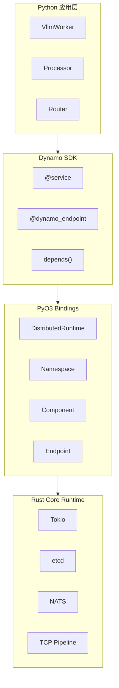
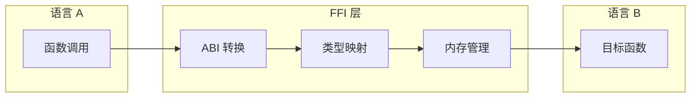
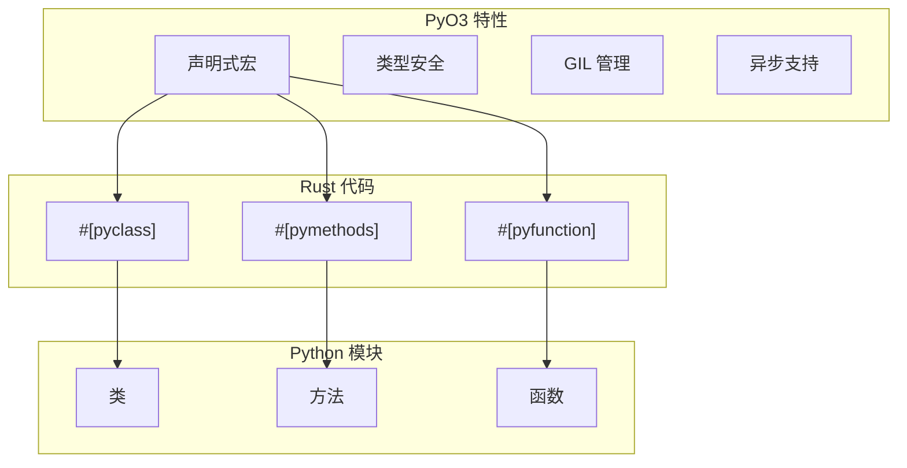
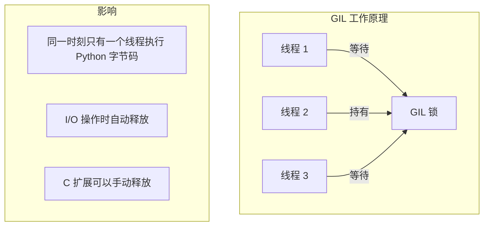
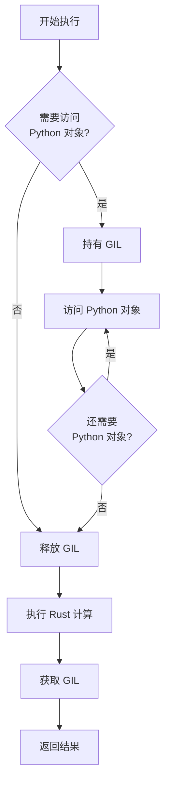
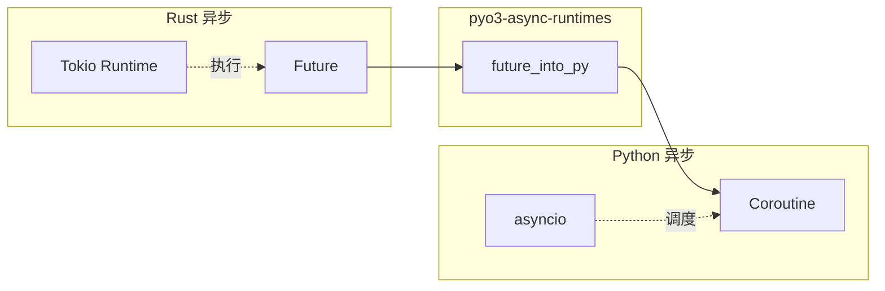
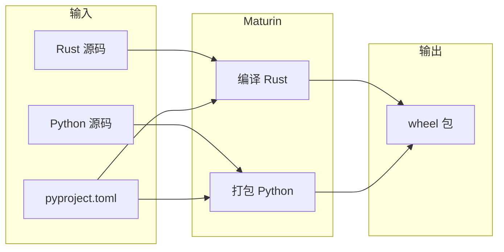
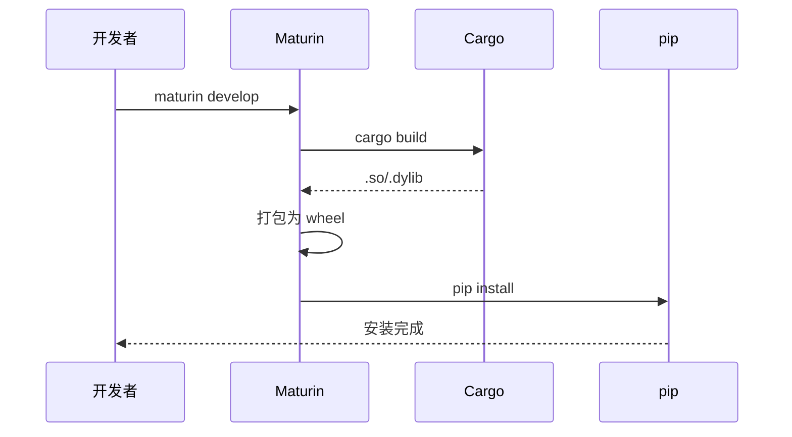

# Rust-Python 互操作基础

> 本文档介绍 Rust 与 Python 之间的互操作技术，为理解 Dynamo Python SDK 的实现奠定基础。

---

## 1. 为什么需要跨语言互操作

### 1.1 Dynamo 的技术选型

在设计 Dynamo 时，团队面临一个核心抉择：

| 语言 | 优势 | 劣势 |
|------|------|------|
| Rust | 极致性能、内存安全、并发能力 | ML 生态较弱 |
| Python | ML/AI 生态主流、开发效率高 | 性能较低、GIL 限制 |

最终方案是 **Rust 核心 + Python 接口**：



### 1.2 分层设计优势

```
用户友好                     性能优化
    ↑                          ↑
┌─────────────────────────────────────────────┐
│              Python 应用层                    │
│   - 直观的装饰器 API                          │
│   - 与 ML 生态无缝集成                        │
└─────────────────────────────────────────────┘
                    ↓
┌─────────────────────────────────────────────┐
│              PyO3 绑定层                      │
│   - 类型安全的跨语言调用                       │
│   - 自动 GIL 管理                            │
└─────────────────────────────────────────────┘
                    ↓
┌─────────────────────────────────────────────┐
│              Rust 核心运行时                   │
│   - 高性能异步 I/O                           │
│   - 零拷贝数据传输                            │
└─────────────────────────────────────────────┘
```

---

## 2. FFI 基础知识

### 2.1 Foreign Function Interface

FFI（Foreign Function Interface）是不同编程语言之间相互调用的机制：



### 2.2 传统 FFI 方式

传统的 Rust-Python 互操作需要多个步骤：

```rust
// 1. Rust 代码编译为 C ABI 兼容的动态库
#[no_mangle]
pub extern "C" fn add_numbers(a: i32, b: i32) -> i32 {
    a + b
}
```

```python
# 2. Python 使用 ctypes 调用
import ctypes

lib = ctypes.CDLL("./libmylib.so")
lib.add_numbers.argtypes = [ctypes.c_int32, ctypes.c_int32]
lib.add_numbers.restype = ctypes.c_int32

result = lib.add_numbers(1, 2)  # 3
```

这种方式的问题：

| 问题 | 说明 |
|------|------|
| 类型不安全 | 需要手动声明参数类型 |
| 复杂类型困难 | 字符串、结构体处理繁琐 |
| 内存管理手动 | 容易内存泄漏 |
| 无异常支持 | 错误处理复杂 |

---

## 3. PyO3 框架

### 3.1 PyO3 简介

[PyO3](https://pyo3.rs) 是 Rust 生态中最成熟的 Python 绑定框架：



### 3.2 核心宏介绍

#### #[pyclass] - 定义 Python 类

```rust
#[pyclass]
struct Calculator {
    value: f64,
}
```

#### #[pymethods] - 定义方法

```rust
#[pymethods]
impl Calculator {
    // 构造函数
    #[new]
    fn new(initial: f64) -> Self {
        Calculator { value: initial }
    }

    // 实例方法
    fn add(&mut self, x: f64) {
        self.value += x;
    }

    // 带返回值的方法
    fn get_value(&self) -> f64 {
        self.value
    }

    // 静态方法
    #[staticmethod]
    fn create_zero() -> Self {
        Calculator { value: 0.0 }
    }
}
```

#### #[pyfunction] - 定义独立函数

```rust
#[pyfunction]
fn fibonacci(n: u32) -> u64 {
    match n {
        0 => 0,
        1 => 1,
        _ => fibonacci(n - 1) + fibonacci(n - 2),
    }
}
```

### 3.3 在 Python 中使用

```python
from my_rust_module import Calculator, fibonacci

# 使用类
calc = Calculator(10.0)
calc.add(5.0)
print(calc.get_value())  # 15.0

# 使用函数
print(fibonacci(10))  # 55
```

---

## 4. GIL 管理

### 4.1 什么是 GIL

GIL（Global Interpreter Lock）是 Python 的全局解释器锁：



### 4.2 PyO3 中的 GIL 处理

```rust
// 需要 GIL 的操作
fn with_gil(py: Python<'_>) {
    // 可以访问 Python 对象
    let dict = PyDict::new(py);
    dict.set_item("key", "value").unwrap();
}

// 释放 GIL 执行耗时操作
fn release_gil(py: Python<'_>) {
    py.allow_threads(|| {
        // 这里不能访问 Python 对象
        // 但可以并行执行 Rust 代码
        expensive_rust_computation();
    });
}
```

### 4.3 GIL 管理最佳实践



| 场景 | GIL 策略 |
|------|----------|
| 访问 Python 对象 | 必须持有 GIL |
| 纯 Rust 计算 | 释放 GIL |
| 调用 Python 回调 | 重新获取 GIL |
| 长时间 I/O | 释放 GIL |

---

## 5. 异步互操作

### 5.1 Rust Future 与 Python Coroutine



### 5.2 转换实现

```rust
fn async_operation<'py>(&self, py: Python<'py>) -> PyResult<Bound<'py, PyAny>> {
    let data = self.inner.clone();

    // 将 Rust Future 转换为 Python coroutine
    pyo3_async_runtimes::tokio::future_into_py(py, async move {
        // 异步执行 Rust 代码
        let result = data.do_async_work().await?;

        // 返回值自动转换为 Python 对象
        Ok(result)
    })
}
```

在 Python 中使用：

```python
import asyncio

async def main():
    runtime = DistributedRuntime(...)
    # 调用返回 coroutine
    namespace = await runtime.namespace("myns")
    component = await namespace.component("mycomp")

asyncio.run(main())
```

### 5.3 异步迭代器

对于流式响应，需要实现异步迭代器：

```rust
#[pyclass]
struct ResponseStream {
    inner: rs::ResponseStream,
}

#[pymethods]
impl ResponseStream {
    // __aiter__ 返回自身
    fn __aiter__(slf: PyRef<'_, Self>) -> PyRef<'_, Self> {
        slf
    }

    // __anext__ 返回下一个元素
    fn __anext__<'py>(&mut self, py: Python<'py>) -> PyResult<Option<Bound<'py, PyAny>>> {
        let stream = self.inner.clone();

        pyo3_async_runtimes::tokio::future_into_py(py, async move {
            match stream.next().await {
                Some(Ok(item)) => Ok(Some(item)),
                Some(Err(e)) => Err(PyErr::new::<PyRuntimeError, _>(e.to_string())),
                None => Ok(None),  // 流结束
            }
        })
    }
}
```

Python 使用：

```python
async for response in client.generate(request):
    print(response.text)
```

---

## 6. Maturin 构建工具

### 6.1 Maturin 简介

[Maturin](https://www.maturin.rs) 是专门用于构建 Rust Python 扩展的工具：



### 6.2 项目配置

```toml
# pyproject.toml
[build-system]
requires = ["maturin>=1.0,<2.0"]
build-backend = "maturin"

[project]
name = "dynamo"
version = "0.1.0"

[tool.maturin]
module-name = "dynamo._core"
python-source = "python"
features = ["pyo3/extension-module"]
```

### 6.3 常用命令

| 命令 | 说明 |
|------|------|
| `maturin develop` | 开发模式，安装到当前环境 |
| `maturin build --release` | 构建发布版 wheel |
| `maturin publish` | 发布到 PyPI |
| `maturin build --target x86_64-unknown-linux-gnu` | 交叉编译 |

### 6.4 构建流程



---

## 7. 类型映射

### 7.1 基础类型映射

| Rust 类型 | Python 类型 |
|-----------|-------------|
| `i32, i64, u32, u64` | `int` |
| `f32, f64` | `float` |
| `bool` | `bool` |
| `String` | `str` |
| `Vec<T>` | `list` |
| `HashMap<K, V>` | `dict` |
| `Option<T>` | `T | None` |
| `Result<T, E>` | `T` (错误转为异常) |

### 7.2 复杂类型转换

```rust
#[pyclass]
struct Config {
    #[pyo3(get, set)]
    name: String,

    #[pyo3(get, set)]
    values: Vec<i32>,

    #[pyo3(get, set)]
    metadata: HashMap<String, String>,
}

#[pymethods]
impl Config {
    #[new]
    fn new(name: String) -> Self {
        Config {
            name,
            values: Vec::new(),
            metadata: HashMap::new(),
        }
    }
}
```

---

## 总结

Rust-Python 互操作的关键要点：

1. **PyO3 框架**：提供声明式宏，简化绑定编写
2. **GIL 管理**：正确处理 GIL 以保证线程安全和性能
3. **异步支持**：pyo3-async-runtimes 桥接 Rust/Python 异步
4. **Maturin 构建**：简化打包和发布流程

这套技术栈让 Dynamo 能够同时享受 Rust 的性能和 Python 的易用性。

---

## 参考资料

- [PyO3 官方文档](https://pyo3.rs)
- [Maturin 文档](https://www.maturin.rs)
- [pyo3-async-runtimes](https://github.com/awestlake87/pyo3-asyncio)
