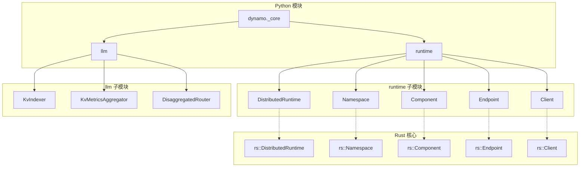
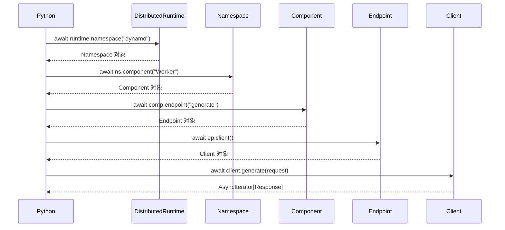
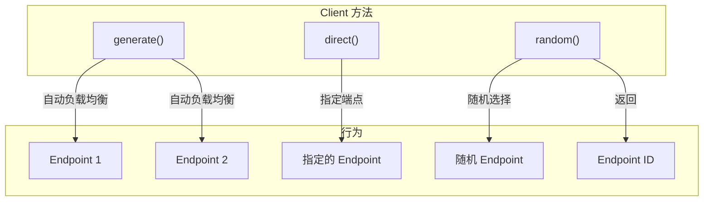
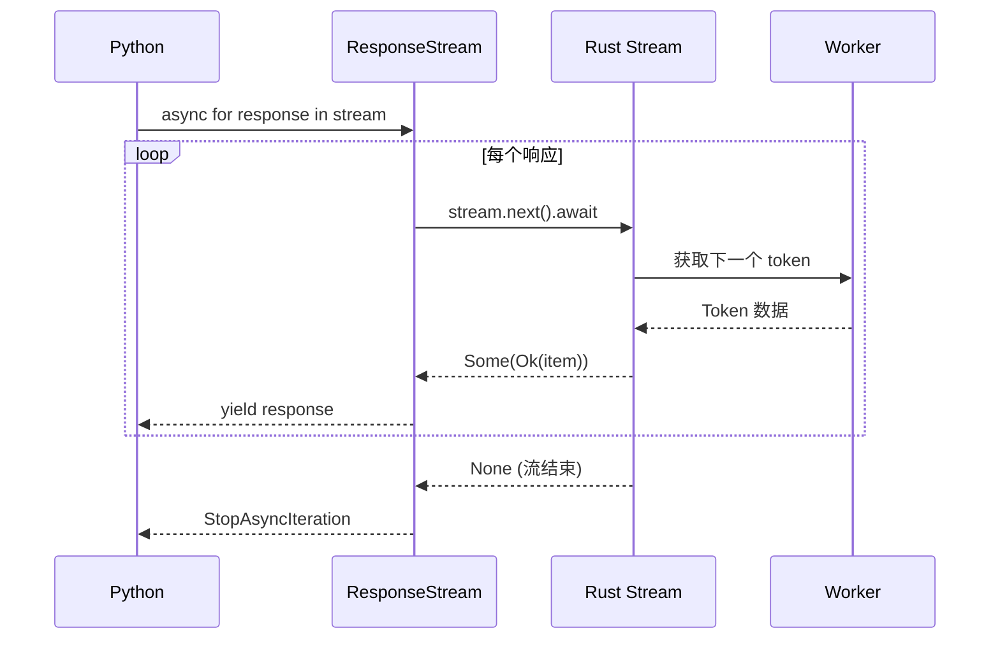
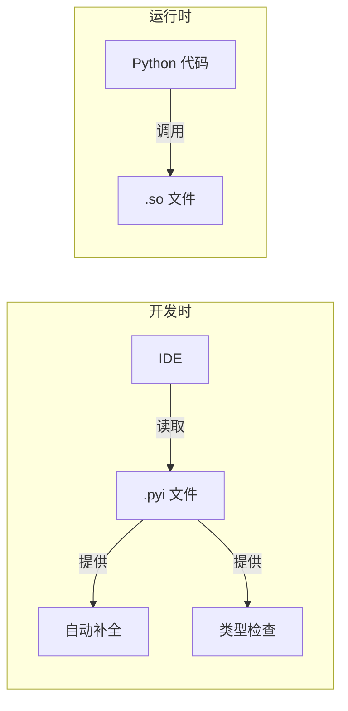

# PyO3 绑定实现

> 本文档详细解析 Dynamo 的 PyO3 绑定层，包括核心类的设计、LLM 相关绑定和异步支持的实现细节。

---

## 1. 模块结构

### 1.1 Python 包结构

```
dynamo/
├── _core.pyi              # 类型存根（Type Stubs）
├── _core.*.so             # 编译后的 Rust 扩展
├── runtime/               # 运行时相关
├── llm/                   # LLM 相关绑定
└── sdk/                   # SDK 工具
```

### 1.2 绑定层架构



---

## 2. 核心类绑定

### 2.1 DistributedRuntime

`DistributedRuntime` 是 Python 绑定的入口点：

```rust
// lib/bindings/python/rust/lib.rs

#[pyclass]
struct DistributedRuntime {
    inner: rs::DistributedRuntime,
    event_loop: PyObject,  // 保存 Python 事件循环引用
}

#[pymethods]
impl DistributedRuntime {
    /// 创建命名空间
    fn namespace<'py>(
        &self,
        py: Python<'py>,
        name: String,
    ) -> PyResult<Bound<'py, PyAny>> {
        let rt = self.inner.clone();
        pyo3_async_runtimes::tokio::future_into_py(py, async move {
            let ns = rt.namespace(&name).await?;
            Ok(Namespace { inner: ns })
        })
    }

    /// 获取主命名空间
    fn namespace_primary<'py>(&self, py: Python<'py>) -> PyResult<Bound<'py, PyAny>> {
        let rt = self.inner.clone();
        pyo3_async_runtimes::tokio::future_into_py(py, async move {
            let ns = rt.namespace_primary().await?;
            Ok(Namespace { inner: ns })
        })
    }
}
```

关键设计点：

| 设计 | 说明 |
|------|------|
| `inner` 字段 | 持有 Rust Runtime 的引用 |
| `event_loop` 字段 | 保存 Python 事件循环用于异步回调 |
| `future_into_py` | 将 Rust Future 转为 Python coroutine |

### 2.2 Namespace

```rust
#[pyclass]
struct Namespace {
    inner: rs::Namespace,
}

#[pymethods]
impl Namespace {
    /// 获取或创建组件
    fn component<'py>(
        &self,
        py: Python<'py>,
        name: String,
    ) -> PyResult<Bound<'py, PyAny>> {
        let ns = self.inner.clone();
        pyo3_async_runtimes::tokio::future_into_py(py, async move {
            let comp = ns.component(&name).await?;
            Ok(Component { inner: comp })
        })
    }

    /// 获取命名空间名称
    fn name(&self) -> String {
        self.inner.name().to_string()
    }
}
```

### 2.3 Component

```rust
#[pyclass]
struct Component {
    inner: rs::Component,
}

#[pymethods]
impl Component {
    /// 获取端点
    fn endpoint<'py>(
        &self,
        py: Python<'py>,
        name: String,
    ) -> PyResult<Bound<'py, PyAny>> {
        let comp = self.inner.clone();
        pyo3_async_runtimes::tokio::future_into_py(py, async move {
            let ep = comp.endpoint(&name).await?;
            Ok(Endpoint { inner: ep })
        })
    }

    /// 注册端点
    fn register_endpoint<'py>(
        &self,
        py: Python<'py>,
        name: String,
        handler: PyObject,
    ) -> PyResult<Bound<'py, PyAny>> {
        let comp = self.inner.clone();
        pyo3_async_runtimes::tokio::future_into_py(py, async move {
            comp.register_endpoint(&name, handler).await?;
            Ok(())
        })
    }
}
```

### 2.4 Endpoint 与 Client

```rust
#[pyclass]
struct Endpoint {
    inner: rs::Endpoint,
}

#[pymethods]
impl Endpoint {
    /// 创建客户端
    fn client<'py>(&self, py: Python<'py>) -> PyResult<Bound<'py, PyAny>> {
        let ep = self.inner.clone();
        pyo3_async_runtimes::tokio::future_into_py(py, async move {
            let client = ep.client().await?;
            Ok(Client { inner: client })
        })
    }
}
```

### 2.5 调用链示意



---

## 3. Client 类详解

`Client` 是最重要的绑定类，提供 RPC 调用能力：

### 3.1 基本结构

```rust
#[pyclass]
struct Client {
    inner: rs::Client,
}
```

### 3.2 负载均衡方法

```rust
#[pymethods]
impl Client {
    /// 获取所有端点 ID
    fn endpoint_ids(&self) -> Vec<i64> {
        self.inner.endpoint_ids()
    }

    /// 随机选择端点发起请求（内置负载均衡）
    fn generate<'py>(
        &self,
        py: Python<'py>,
        request: PyObject,
        annotated: Option<bool>,
    ) -> PyResult<Bound<'py, PyAny>> {
        let client = self.inner.clone();
        let annotated = annotated.unwrap_or(false);

        pyo3_async_runtimes::tokio::future_into_py(py, async move {
            let req_bytes = serialize_request(request)?;
            let response_stream = client.generate(req_bytes).await?;
            Ok(ResponseStream::new(response_stream, annotated))
        })
    }
}
```

### 3.3 直接调用方法

```rust
#[pymethods]
impl Client {
    /// 直接调用指定端点
    fn direct<'py>(
        &self,
        py: Python<'py>,
        request: PyObject,
        endpoint_id: i64,
        annotated: Option<bool>,
    ) -> PyResult<Bound<'py, PyAny>> {
        let client = self.inner.clone();
        let annotated = annotated.unwrap_or(false);

        pyo3_async_runtimes::tokio::future_into_py(py, async move {
            let req_bytes = serialize_request(request)?;
            let response_stream = client.direct(req_bytes, endpoint_id).await?;
            Ok(ResponseStream::new(response_stream, annotated))
        })
    }

    /// 随机选择端点并返回选中的端点 ID
    fn random<'py>(
        &self,
        py: Python<'py>,
        request: PyObject,
        annotated: Option<bool>,
    ) -> PyResult<Bound<'py, PyAny>> {
        let client = self.inner.clone();
        pyo3_async_runtimes::tokio::future_into_py(py, async move {
            let req_bytes = serialize_request(request)?;
            let (endpoint_id, response_stream) = client.random(req_bytes).await?;
            Ok((endpoint_id, ResponseStream::new(response_stream, annotated.unwrap_or(false))))
        })
    }
}
```

### 3.4 Client 方法对比



| 方法 | 使用场景 | 返回值 |
|------|----------|--------|
| `generate()` | 普通请求 | AsyncIterator |
| `direct()` | 需要指定 Worker | AsyncIterator |
| `random()` | 需要知道路由结果 | (endpoint_id, AsyncIterator) |

---

## 4. LLM 相关绑定

### 4.1 KvIndexer

用于 KV Cache 索引管理：

```rust
#[pyclass]
pub struct KvIndexer {
    inner: rs_llm::KvIndexer,
}

#[pymethods]
impl KvIndexer {
    #[new]
    fn new(block_size: usize) -> Self {
        KvIndexer {
            inner: rs_llm::KvIndexer::new(block_size),
        }
    }

    /// 查找前缀匹配
    fn find_matches(&self, token_ids: Vec<u32>) -> PyResult<OverlapScores> {
        let scores = self.inner.find_matches(&token_ids);
        Ok(OverlapScores::from(scores))
    }

    /// 更新索引
    fn update(&mut self, event: &KvCacheEvent) -> PyResult<()> {
        self.inner.update(event.inner.clone());
        Ok(())
    }

    /// 移除索引
    fn remove(&mut self, worker_id: i64, block_hashes: Vec<u64>) -> PyResult<()> {
        self.inner.remove(worker_id, &block_hashes);
        Ok(())
    }
}
```

### 4.2 KvMetricsAggregator

用于聚合 Worker 负载指标：

```rust
#[pyclass]
pub struct KvMetricsAggregator {
    inner: rs_llm::KvMetricsAggregator,
}

#[pymethods]
impl KvMetricsAggregator {
    #[new]
    fn new() -> Self {
        KvMetricsAggregator {
            inner: rs_llm::KvMetricsAggregator::new(),
        }
    }

    /// 更新指标
    fn update(&mut self, worker_id: i64, metrics: &ForwardPassMetrics) {
        self.inner.update(worker_id, metrics.inner.clone());
    }

    /// 获取聚合指标
    fn get_metrics(&self) -> HashMap<i64, ForwardPassMetrics> {
        self.inner.get_metrics()
            .into_iter()
            .map(|(k, v)| (k, ForwardPassMetrics::from(v)))
            .collect()
    }

    /// 获取指定 Worker 的指标
    fn get_worker_metrics(&self, worker_id: i64) -> Option<ForwardPassMetrics> {
        self.inner.get_worker_metrics(worker_id)
            .map(ForwardPassMetrics::from)
    }
}
```

### 4.3 DisaggregatedRouter

用于 Disaggregated Serving 的路由决策：

```rust
#[pyclass]
pub struct DisaggregatedRouter {
    inner: rs_llm::DisaggregatedRouter,
}

#[pymethods]
impl DisaggregatedRouter {
    #[new]
    fn new(
        max_local_prefill_length: usize,
        conditional_disagg: bool,
    ) -> Self {
        DisaggregatedRouter {
            inner: rs_llm::DisaggregatedRouter::new(
                max_local_prefill_length,
                conditional_disagg,
            ),
        }
    }

    /// 判断是否应该远程 Prefill
    fn prefill_remote(&self, prompt_len: usize, prefix_hit_rate: f32) -> bool {
        self.inner.prefill_remote(prompt_len, prefix_hit_rate)
    }
}
```

### 4.4 LLM 绑定使用示例

```python
from dynamo._core.llm import KvIndexer, KvMetricsAggregator, DisaggregatedRouter

# KV 索引
indexer = KvIndexer(block_size=16)
scores = indexer.find_matches([1, 2, 3, 4, 5])

# 指标聚合
aggregator = KvMetricsAggregator()
aggregator.update(worker_id=1, metrics=metrics)
all_metrics = aggregator.get_metrics()

# 路由决策
router = DisaggregatedRouter(
    max_local_prefill_length=1024,
    conditional_disagg=True
)
should_remote = router.prefill_remote(prompt_len=2048, prefix_hit_rate=0.8)
```

---

## 5. 异步流式响应

### 5.1 ResponseStream 实现

```rust
#[pyclass]
struct ResponseStream {
    inner: rs::ResponseStream,
    annotated: bool,
}

impl ResponseStream {
    fn new(stream: rs::ResponseStream, annotated: bool) -> Self {
        ResponseStream { inner: stream, annotated }
    }
}

#[pymethods]
impl ResponseStream {
    // 实现 __aiter__ 使其成为异步迭代器
    fn __aiter__(slf: PyRef<'_, Self>) -> PyRef<'_, Self> {
        slf
    }

    // 实现 __anext__ 返回下一个元素
    fn __anext__<'py>(&mut self, py: Python<'py>) -> PyResult<Option<Bound<'py, PyAny>>> {
        let stream = self.inner.clone();
        let annotated = self.annotated;

        pyo3_async_runtimes::tokio::future_into_py(py, async move {
            match stream.next().await {
                Some(Ok(item)) => {
                    if annotated {
                        // 返回带元数据的响应
                        Ok(Some(AnnotatedResponse::from(item)))
                    } else {
                        Ok(Some(item.data))
                    }
                }
                Some(Err(e)) => Err(PyErr::new::<pyo3::exceptions::PyRuntimeError, _>(
                    format!("{}", e)
                )),
                None => Ok(None),  // 流结束，触发 StopAsyncIteration
            }
        })
    }
}
```

### 5.2 流式响应流程



### 5.3 Python 端使用

```python
async def process_stream(client, request):
    """处理流式响应"""
    async for response in client.generate(request):
        # 每个 token 都会触发
        print(response.text, end="", flush=True)

    print()  # 流结束
```

---

## 6. 类型存根文件

### 6.1 _core.pyi 示例

```python
# dynamo/_core.pyi

from typing import AsyncIterator, Optional, List, Dict, Any, Tuple

class DistributedRuntime:
    """分布式运行时入口"""
    async def namespace(self, name: str) -> Namespace: ...
    async def namespace_primary(self) -> Namespace: ...

class Namespace:
    """命名空间"""
    def name(self) -> str: ...
    async def component(self, name: str) -> Component: ...

class Component:
    """组件"""
    async def endpoint(self, name: str) -> Endpoint: ...
    async def register_endpoint(self, name: str, handler: Any) -> None: ...

class Endpoint:
    """端点"""
    async def client(self) -> Client: ...

class Client:
    """客户端"""
    def endpoint_ids(self) -> List[int]: ...
    async def generate(
        self,
        request: Any,
        annotated: bool = False
    ) -> AsyncIterator[Any]: ...
    async def direct(
        self,
        request: Any,
        endpoint_id: int,
        annotated: bool = False
    ) -> AsyncIterator[Any]: ...
    async def random(
        self,
        request: Any,
        annotated: bool = False
    ) -> Tuple[int, AsyncIterator[Any]]: ...

# LLM 相关
class KvIndexer:
    def __init__(self, block_size: int) -> None: ...
    def find_matches(self, token_ids: List[int]) -> OverlapScores: ...
    def update(self, event: KvCacheEvent) -> None: ...

class KvMetricsAggregator:
    def __init__(self) -> None: ...
    def update(self, worker_id: int, metrics: ForwardPassMetrics) -> None: ...
    def get_metrics(self) -> Dict[int, ForwardPassMetrics]: ...
```

### 6.2 类型存根的作用



---

## 7. 序列化机制

### 7.1 msgspec 集成

Dynamo 使用 msgspec 进行高性能序列化：

```python
import msgspec

# 定义消息结构
class Request(msgspec.Struct):
    prompt: str
    max_tokens: int = 256
    temperature: float = 1.0

class Response(msgspec.Struct):
    text: str
    finish_reason: str | None = None
    usage: dict | None = None

# 序列化
request = Request(prompt="Hello")
encoded = msgspec.msgpack.encode(request)

# 反序列化
decoded = msgspec.msgpack.decode(encoded, type=Request)
```

### 7.2 PyO3 中的序列化处理

```rust
fn serialize_request(py: Python, request: PyObject) -> PyResult<Vec<u8>> {
    // 调用 Python 的 msgspec 序列化
    let msgspec = py.import("msgspec")?;
    let msgpack = msgspec.getattr("msgpack")?;
    let encoded: &PyBytes = msgpack
        .call_method1("encode", (request,))?
        .extract()?;
    Ok(encoded.as_bytes().to_vec())
}

fn deserialize_response(
    py: Python,
    data: &[u8],
    response_type: PyObject
) -> PyResult<PyObject> {
    let msgspec = py.import("msgspec")?;
    let msgpack = msgspec.getattr("msgpack")?;
    let decoded = msgpack.call_method1("decode", (data, response_type))?;
    Ok(decoded.into())
}
```

---

## 总结

PyO3 绑定层的核心设计：

| 特性 | 实现方式 |
|------|----------|
| 类型安全 | #[pyclass]、#[pymethods] 宏 |
| 异步支持 | pyo3-async-runtimes |
| 流式响应 | __aiter__ / __anext__ 协议 |
| 类型提示 | .pyi 存根文件 |
| 序列化 | msgspec 集成 |

这套绑定让 Python 开发者能够直接使用 Rust 核心运行时的全部能力。

---

## 参考文件

- [lib/bindings/python/rust/lib.rs](../../../lib/bindings/python/rust/lib.rs) - PyO3 绑定主文件
- [lib/bindings/python/rust/llm.rs](../../../lib/bindings/python/rust/llm.rs) - LLM 相关绑定
- [dynamo/_core.pyi](../../../python/dynamo/_core.pyi) - 类型存根
