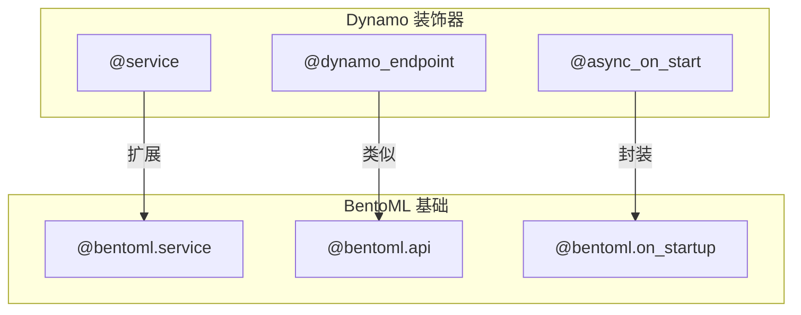
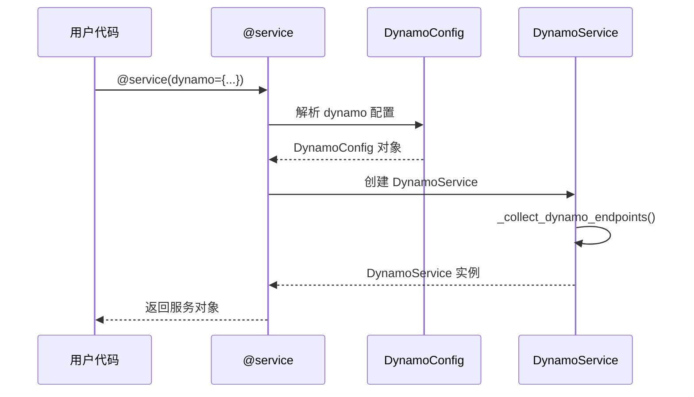
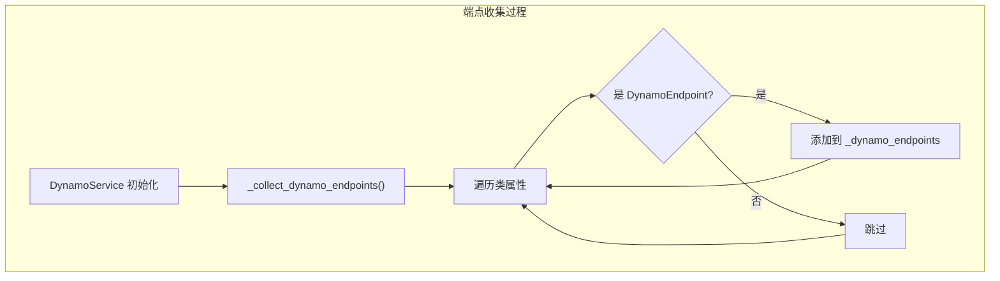
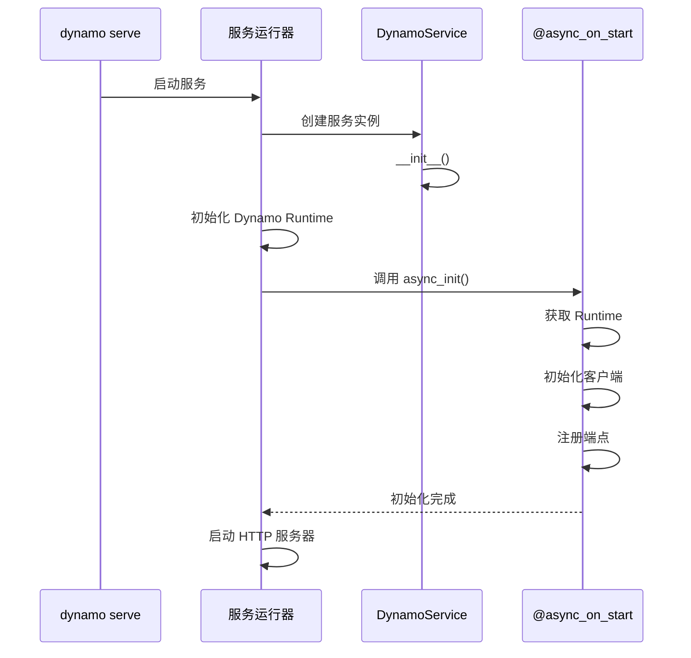
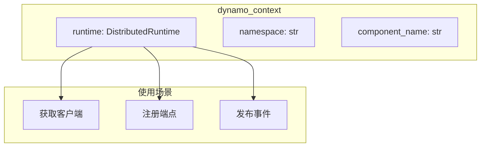
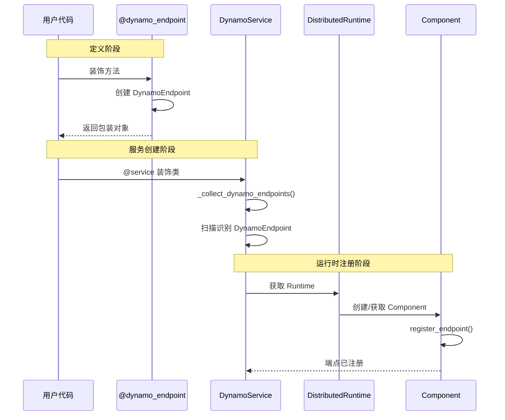

> 本文档详解 Dynamo SDK 提供的服务定义装饰器，包括 @service、@dynamo_endpoint 和 @async_on_start 的设计原理和使用方法。

---

## 1. 装饰器概述

### 1.1 装饰器体系

Dynamo SDK 基于 BentoML 框架扩展，提供了一套声明式的服务定义装饰器：



### 1.2 装饰器功能对比

| 装饰器 | 功能 | 应用对象 |
|--------|------|----------|
| `@service` | 定义服务类 | 类 |
| `@dynamo_endpoint` | 定义 RPC 端点 | 方法 |
| `@async_on_start` | 异步初始化钩子 | 方法 |
| `depends()` | 声明服务依赖 | 类属性 |

---

## 2. @service 装饰器

### 2.1 装饰器定义

```python
# deploy/dynamo/sdk/src/dynamo/sdk/lib/service.py

def service(
    inner: type[T] | None = None,
    /,
    *,
    image: Image | None = None,
    envs: list[dict[str, t.Any]] | None = None,
    dynamo: dict | None = None,
    **kwargs,
) -> Any:
    """
    增强的服务装饰器，支持 Dynamo 配置

    Args:
        inner: 被装饰的类
        image: 容器镜像配置
        envs: 环境变量
        dynamo: Dynamo 配置字典
        **kwargs: BentoML 原生参数（resources, workers 等）
    """

    def decorator(cls: type[T]) -> DynamoService[T]:
        # 解析 Dynamo 配置
        dynamo_config = None
        if dynamo:
            dynamo_config = DynamoConfig(
                enabled=dynamo.get("enabled", False),
                name=dynamo.get("name"),
                namespace=dynamo.get("namespace"),
            )

        # 创建 DynamoService 实例
        svc = DynamoService(
            config=kwargs.get("config"),
            inner=cls,
            image=image,
            envs=envs,
            dynamo_config=dynamo_config,
        )

        return svc

    if inner is not None:
        return decorator(inner)
    return decorator
```

### 2.2 DynamoConfig 配置

```python
@dataclass
class DynamoConfig:
    """Dynamo 特定配置"""
    enabled: bool = False           # 是否启用 Dynamo 分布式功能
    name: str | None = None         # 组件名称（覆盖类名）
    namespace: str | None = None    # 命名空间
```

### 2.3 使用示例

```python
# 基础用法
@service(
    dynamo={"enabled": True, "namespace": "dynamo"},
)
class SimpleWorker:
    pass

# 完整配置
@service(
    dynamo={
        "enabled": True,
        "namespace": "dynamo",
        "name": "vllm-worker"  # 自定义组件名
    },
    resources={"gpu": 1, "cpu": "10"},
    workers=1,
    image=Image(python_version="3.10"),
)
class VllmWorker:
    model_path: str = "/models/llama"

    @dynamo_endpoint()
    async def generate(self, request: Request) -> AsyncIterator[Response]:
        async for token in self.engine.generate(request):
            yield token
```

### 2.4 装饰器执行流程



---

## 3. @dynamo_endpoint 装饰器

### 3.1 DynamoEndpoint 类

```python
# deploy/dynamo/sdk/src/dynamo/sdk/lib/decorators.py

class DynamoEndpoint:
    """Dynamo 端点描述符"""

    def __init__(
        self,
        func: t.Callable,
        name: str | None = None,
    ):
        self.func = func
        self.name = name or func.__name__
        self.is_dynamo_endpoint = True  # 标记属性

        # 保留原函数的元信息
        functools.update_wrapper(self, func)

    def __call__(self, *args, **kwargs):
        """直接调用时执行原函数"""
        return self.func(*args, **kwargs)

    def __get__(self, obj, objtype=None):
        """描述符协议，支持实例方法调用"""
        if obj is None:
            return self
        # 绑定到实例
        return functools.partial(self.func, obj)
```

### 3.2 装饰器函数

```python
def dynamo_endpoint(
    name: str | None = None,
) -> t.Callable[[t.Callable], DynamoEndpoint]:
    """
    Dynamo 端点装饰器

    Args:
        name: 端点名称，默认使用函数名

    Example:
        @dynamo_endpoint(name="generate")
        async def generate(self, request):
            ...
    """
    def decorator(func: t.Callable) -> DynamoEndpoint:
        return DynamoEndpoint(func, name)
    return decorator
```

### 3.3 端点收集流程



```python
def _collect_dynamo_endpoints(self) -> None:
    """扫描并收集所有 Dynamo 端点"""
    for name in dir(self.inner):
        attr = getattr(self.inner, name, None)
        if isinstance(attr, DynamoEndpoint):
            self._dynamo_endpoints[attr.name] = attr
```

### 3.4 使用示例

```python
@service(dynamo={"enabled": True, "namespace": "dynamo"})
class VllmWorker:
    # 默认端点名：generate
    @dynamo_endpoint()
    async def generate(self, request: dict) -> AsyncIterator[dict]:
        async for output in self.engine.generate(request):
            yield output

    # 自定义端点名：prefill
    @dynamo_endpoint(name="prefill")
    async def do_prefill(self, request: dict) -> dict:
        return await self.engine.prefill(request)

    # 普通方法，不会注册为端点
    def _internal_method(self):
        pass
```

---

## 4. @async_on_start 装饰器

### 4.1 装饰器定义

```python
# deploy/dynamo/sdk/src/dynamo/sdk/lib/decorators.py

def async_on_start(func: t.Callable) -> t.Callable:
    """
    异步初始化钩子装饰器

    在服务启动时异步执行，用于：
    - 获取 Dynamo Runtime
    - 初始化客户端连接
    - 注册端点

    Example:
        @async_on_start
        async def async_init(self):
            runtime = dynamo_context["runtime"]
            self.client = await self._get_client(runtime)
    """
    # 设置 BentoML 钩子标记
    setattr(func, "__bentoml_startup_hook__", True)

    # 使用 BentoML 的 on_startup 装饰器
    return bentoml.on_startup(func)
```

### 4.2 初始化时机



### 4.3 使用示例

```python
@service(dynamo={"enabled": True, "namespace": "dynamo"})
class Processor:
    worker = depends(VllmWorker)

    @async_on_start
    async def async_init(self):
        """服务启动时执行"""
        from dynamo.sdk import dynamo_context

        # 获取运行时
        runtime = dynamo_context["runtime"]

        # 获取 Worker 客户端
        ns = await runtime.namespace("dynamo")
        comp = await ns.component("VllmWorker")
        ep = await comp.endpoint("generate")
        self.worker_client = await ep.client()

        # 初始化其他资源
        self.tokenizer = load_tokenizer()
```

---

## 5. 上下文注入

### 5.1 dynamo_context

```python
# deploy/dynamo/sdk/src/dynamo/sdk/__init__.py

# 全局上下文，在服务启动时填充
dynamo_context: Dict[str, Any] = {}
```

### 5.2 上下文填充

```python
def _setup_context(runtime, namespace, component_name):
    """在服务启动时填充上下文"""
    dynamo_context["runtime"] = runtime
    dynamo_context["namespace"] = namespace
    dynamo_context["component_name"] = component_name
```

### 5.3 上下文结构



---

## 6. 装饰器组合使用

### 6.1 完整服务示例

```python
from dynamo.sdk import (
    service,
    dynamo_endpoint,
    async_on_start,
    depends,
    dynamo_context
)

@service(
    dynamo={"enabled": True, "namespace": "dynamo"},
    resources={"gpu": 1},
    workers=1,
)
class VllmWorker:
    """vLLM 推理 Worker"""

    # 配置属性
    model_path: str = "/models/llama"
    tensor_parallel_size: int = 1

    def __init__(self):
        """同步初始化"""
        self.engine = None
        self.metrics_publisher = None

    @async_on_start
    async def async_init(self):
        """异步初始化"""
        # 初始化 vLLM 引擎
        from vllm import AsyncEngineArgs, AsyncLLMEngine
        args = AsyncEngineArgs(
            model=self.model_path,
            tensor_parallel_size=self.tensor_parallel_size,
        )
        self.engine = AsyncLLMEngine.from_engine_args(args)

        # 注册端点
        runtime = dynamo_context["runtime"]
        ns = await runtime.namespace("dynamo")
        comp = await ns.component("VllmWorker")

        # 启动指标发布
        self.metrics_publisher = await comp.create_metrics_publisher()

    @dynamo_endpoint(name="generate")
    async def generate(self, request: dict) -> AsyncIterator[dict]:
        """生成端点"""
        prompt = request["prompt"]
        sampling_params = request.get("sampling_params", {})

        async for output in self.engine.generate(prompt, sampling_params):
            yield {
                "text": output.outputs[0].text,
                "finish_reason": output.outputs[0].finish_reason,
            }

    @dynamo_endpoint(name="health")
    async def health(self) -> dict:
        """健康检查端点"""
        return {"status": "healthy", "model": self.model_path}
```

### 6.2 服务依赖示例

```python
@service(dynamo={"enabled": True, "namespace": "dynamo"})
class Processor:
    """请求处理器"""

    # 声明依赖
    worker = depends(VllmWorker)
    router = depends(KvRouter)

    @async_on_start
    async def async_init(self):
        """初始化客户端"""
        self.worker_client = await self.worker.get_endpoint("generate")
        self.router_client = await self.router.get_endpoint("route")

    @dynamo_endpoint()
    async def process(self, request: dict) -> AsyncIterator[dict]:
        """处理请求"""
        # 获取路由决策
        tokens = request.get("tokens", [])
        worker_id = await self.router_client.route(tokens)

        # 调用指定 Worker
        async for response in self.worker_client.direct(request, worker_id):
            yield response
```

---

## 7. 端点注册流程

### 7.1 完整流程图



### 7.2 端点元数据

每个注册的端点包含以下信息：

| 字段 | 说明 |
|------|------|
| `name` | 端点名称 |
| `func` | 处理函数 |
| `component` | 所属组件 |
| `namespace` | 所属命名空间 |

---

## 总结

Dynamo 装饰器的核心设计：

1. **@service**：定义服务，配置 Dynamo 分布式功能
2. **@dynamo_endpoint**：声明 RPC 端点，自动注册到服务发现
3. **@async_on_start**：异步初始化，获取运行时和客户端
4. **dynamo_context**：全局上下文，访问运行时资源

这套装饰器让开发者能够以声明式方式定义分布式服务。

---

## 参考文件

- [deploy/dynamo/sdk/src/dynamo/sdk/lib/service.py](../../../deploy/dynamo/sdk/src/dynamo/sdk/lib/service.py) - @service 实现
- [deploy/dynamo/sdk/src/dynamo/sdk/lib/decorators.py](../../../deploy/dynamo/sdk/src/dynamo/sdk/lib/decorators.py) - 装饰器实现
