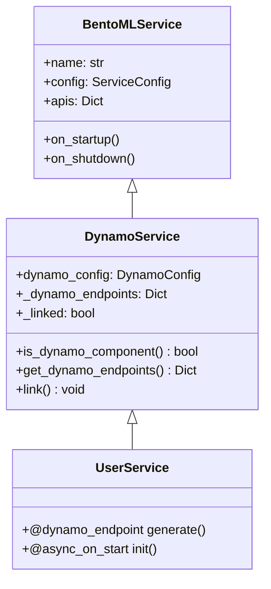
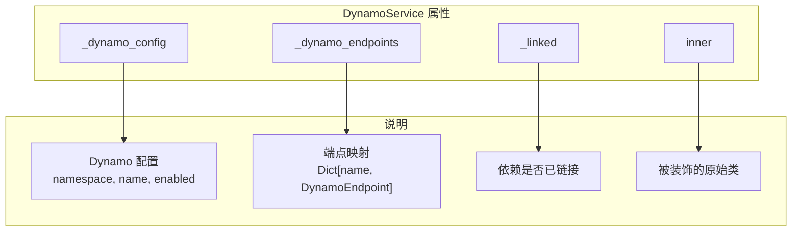
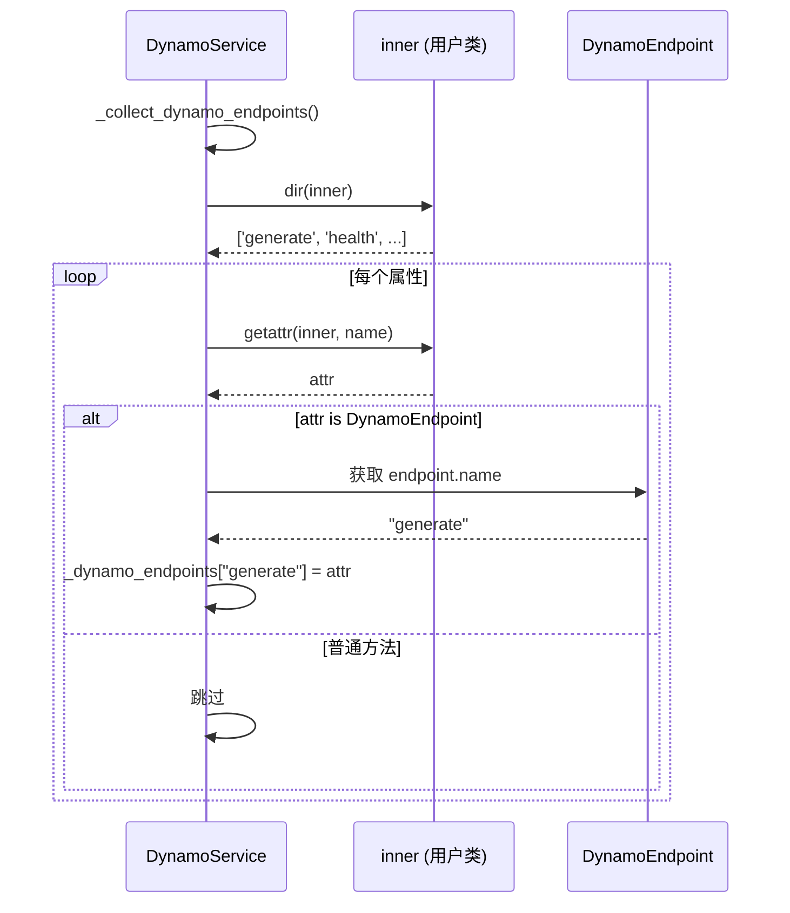
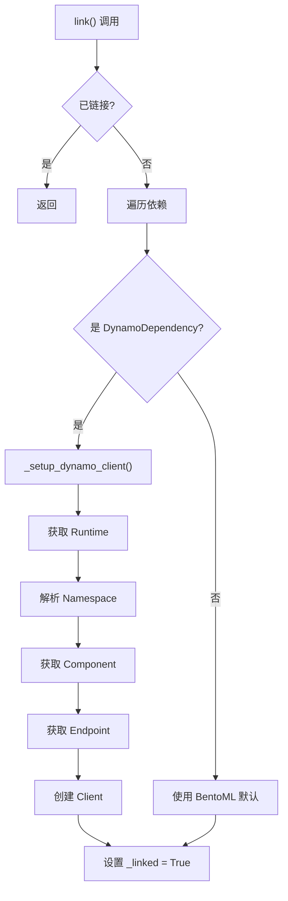
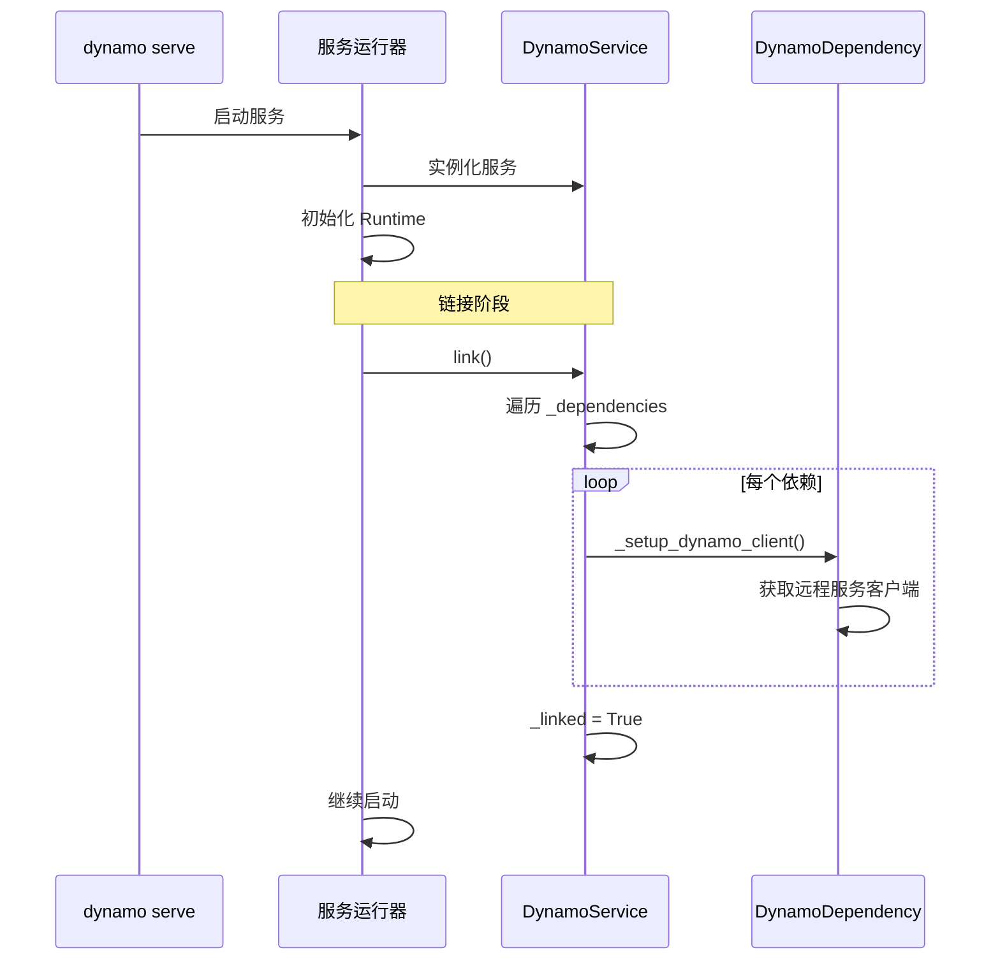
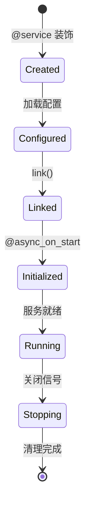
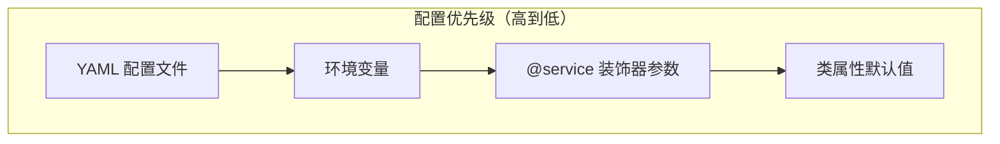
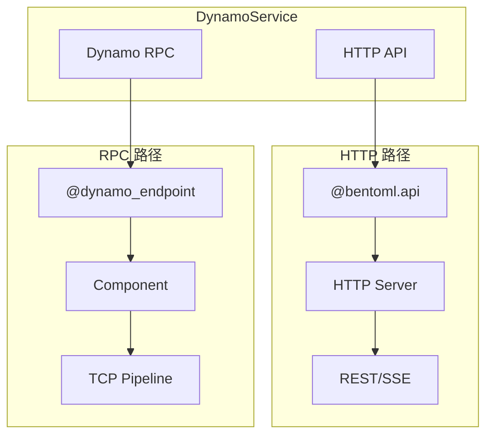

> 本文档深入解析 DynamoService 类的设计，包括继承关系、端点管理和依赖链接机制。

---

## 1. 类继承体系

### 1.1 继承关系图



### 1.2 设计理念

DynamoService 采用"装饰者 + 扩展"模式：

| 层次 | 职责 |
|------|------|
| BentoMLService | HTTP API、生命周期管理 |
| DynamoService | 分布式能力、端点管理 |
| UserService | 业务逻辑实现 |

---

## 2. DynamoService 实现

### 2.1 类定义

```python
# deploy/dynamo/sdk/src/dynamo/sdk/lib/service.py

class DynamoService(Service[T]):
    """扩展 BentoML Service 的 Dynamo 服务类"""

    def __init__(
        self,
        config: Config | dict[str, Config] | None,
        inner: type[T],
        image: Image | None = None,
        envs: list[dict[str, t.Any]] | None = None,
        dynamo_config: DynamoConfig | None = None,
    ) -> None:
        super().__init__(config, inner, image, envs)

        # Dynamo 特定属性
        self._dynamo_config = dynamo_config or DynamoConfig()
        self._dynamo_endpoints: Dict[str, DynamoEndpoint] = {}
        self._linked = False

        # 收集 @dynamo_endpoint 装饰的方法
        self._collect_dynamo_endpoints()
```

### 2.2 属性说明



---

## 3. 端点收集机制

### 3.1 收集方法

```python
def _collect_dynamo_endpoints(self) -> None:
    """扫描并收集所有 Dynamo 端点"""
    for name in dir(self.inner):
        attr = getattr(self.inner, name, None)
        if isinstance(attr, DynamoEndpoint):
            self._dynamo_endpoints[attr.name] = attr
```

### 3.2 收集流程



### 3.3 端点查询方法

```python
def is_dynamo_component(self) -> bool:
    """检查是否配置为 Dynamo 组件"""
    return self._dynamo_config.enabled

def get_dynamo_endpoints(self) -> Dict[str, DynamoEndpoint]:
    """获取所有 Dynamo 端点"""
    return self._dynamo_endpoints

def get_endpoint(self, name: str) -> DynamoEndpoint | None:
    """获取指定端点"""
    return self._dynamo_endpoints.get(name)
```

---

## 4. 依赖链接机制

### 4.1 link() 方法

```python
def link(self) -> None:
    """链接服务依赖"""
    if self._linked:
        return

    # 处理服务依赖
    for dep in self._dependencies:
        if isinstance(dep, DynamoDependency):
            dep._setup_dynamo_client()

    self._linked = True
```

### 4.2 链接流程



### 4.3 链接时机



---

## 5. 服务状态管理

### 5.1 生命周期



### 5.2 状态检查方法

```python
class DynamoService(Service[T]):

    def is_dynamo_component(self) -> bool:
        """是否启用 Dynamo"""
        return self._dynamo_config.enabled

    def is_linked(self) -> bool:
        """依赖是否已链接"""
        return self._linked

    def has_endpoint(self, name: str) -> bool:
        """是否有指定端点"""
        return name in self._dynamo_endpoints

    @property
    def component_name(self) -> str:
        """获取组件名称"""
        return self._dynamo_config.name or self.name

    @property
    def namespace_name(self) -> str:
        """获取命名空间"""
        return self._dynamo_config.namespace or "default"
```

---

## 6. 配置继承

### 6.1 配置优先级



### 6.2 配置合并

```python
def _apply_config(self, config: dict) -> None:
    """应用外部配置"""
    # Dynamo 配置
    if "dynamo" in config:
        dynamo_cfg = config["dynamo"]
        if "namespace" in dynamo_cfg:
            self._dynamo_config.namespace = dynamo_cfg["namespace"]
        if "name" in dynamo_cfg:
            self._dynamo_config.name = dynamo_cfg["name"]

    # 服务参数
    if "ServiceArgs" in config:
        svc_args = config["ServiceArgs"]
        # 合并到 BentoML 配置
        self._update_bentoml_config(svc_args)

    # 类属性
    for key, value in config.items():
        if hasattr(self.inner, key):
            setattr(self.inner, key, value)
```

### 6.3 配置示例

```yaml
# configs/agg.yaml

VllmWorker:
  # 类属性
  model_path: /models/llama-7b
  tensor_parallel_size: 1

  # Dynamo 配置
  dynamo:
    namespace: production
    name: llama-worker

  # 服务参数
  ServiceArgs:
    workers: 2
    resources:
      gpu: 1
      cpu: "10"
```

---

## 7. 与 BentoML 的集成

### 7.1 API 兼容

DynamoService 保持与 BentoML Service 的完全兼容：

```python
@service(
    dynamo={"enabled": True, "namespace": "dynamo"},
    # BentoML 原生参数
    resources={"gpu": 1},
    workers=1,
    traffic={"timeout": 300},
)
class MyService:
    # BentoML API（HTTP）
    @bentoml.api
    def http_endpoint(self, request: Request) -> Response:
        return Response(...)

    # Dynamo 端点（RPC）
    @dynamo_endpoint()
    async def rpc_endpoint(self, request: dict) -> AsyncIterator[dict]:
        yield {...}
```

### 7.2 双模式支持



---

## 8. 使用示例

### 8.1 完整服务定义

```python
from dynamo.sdk import service, dynamo_endpoint, async_on_start, depends

@service(
    dynamo={"enabled": True, "namespace": "dynamo"},
    resources={"gpu": 1},
)
class VllmWorker:
    """vLLM Worker 服务"""

    # 配置属性（可被 YAML 覆盖）
    model_path: str = "/models/default"

    def __init__(self):
        self.engine = None

    @async_on_start
    async def async_init(self):
        """异步初始化"""
        self.engine = await create_engine(self.model_path)

    @dynamo_endpoint()
    async def generate(self, request: dict):
        """生成端点"""
        async for token in self.engine.generate(request):
            yield token


@service(dynamo={"enabled": True, "namespace": "dynamo"})
class Processor:
    """处理器服务"""

    # 依赖注入
    worker = depends(VllmWorker)

    @async_on_start
    async def async_init(self):
        self.client = await self.worker.get_endpoint("generate")

    @dynamo_endpoint()
    async def process(self, request: dict):
        async for resp in self.client.generate(request):
            yield resp
```

### 8.2 服务图定义

```python
# graphs/agg.py

from ..components.worker import VllmWorker
from ..components.processor import Processor
from ..components.frontend import Frontend

# 服务图入口
# 依赖关系自动解析：Frontend -> Processor -> VllmWorker
Frontend = Frontend
```

---

## 总结

DynamoService 的核心设计：

| 特性 | 实现 |
|------|------|
| 继承 BentoML | 复用成熟的服务框架 |
| 端点收集 | 自动扫描 @dynamo_endpoint |
| 依赖链接 | link() 建立服务连接 |
| 配置合并 | 支持多级配置覆盖 |
| 双模式 | 同时支持 HTTP 和 RPC |

这套设计让 Dynamo 服务既保持了 BentoML 的易用性，又获得了分布式能力。

---

## 参考文件

- [deploy/dynamo/sdk/src/dynamo/sdk/lib/service.py](../../../deploy/dynamo/sdk/src/dynamo/sdk/lib/service.py) - DynamoService 定义
- [deploy/dynamo/sdk/src/dynamo/sdk/lib/dependency.py](../../../deploy/dynamo/sdk/src/dynamo/sdk/lib/dependency.py) - 依赖注入实现
