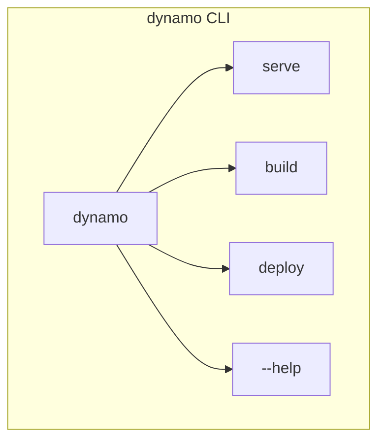
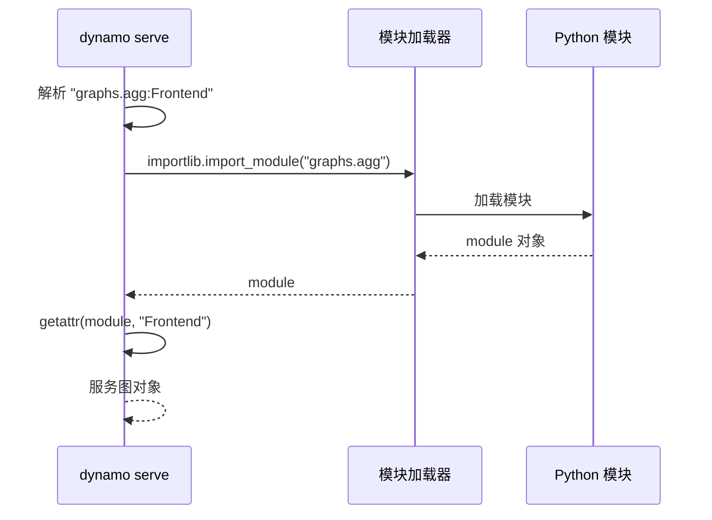
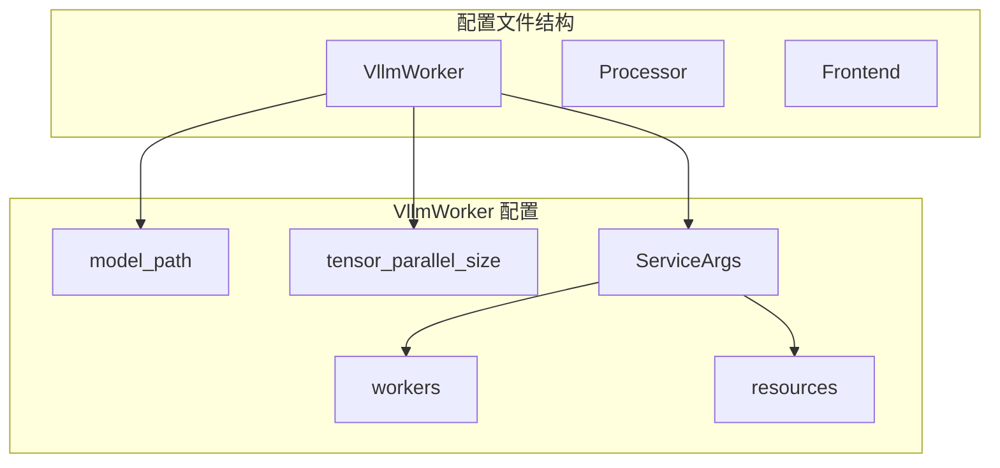
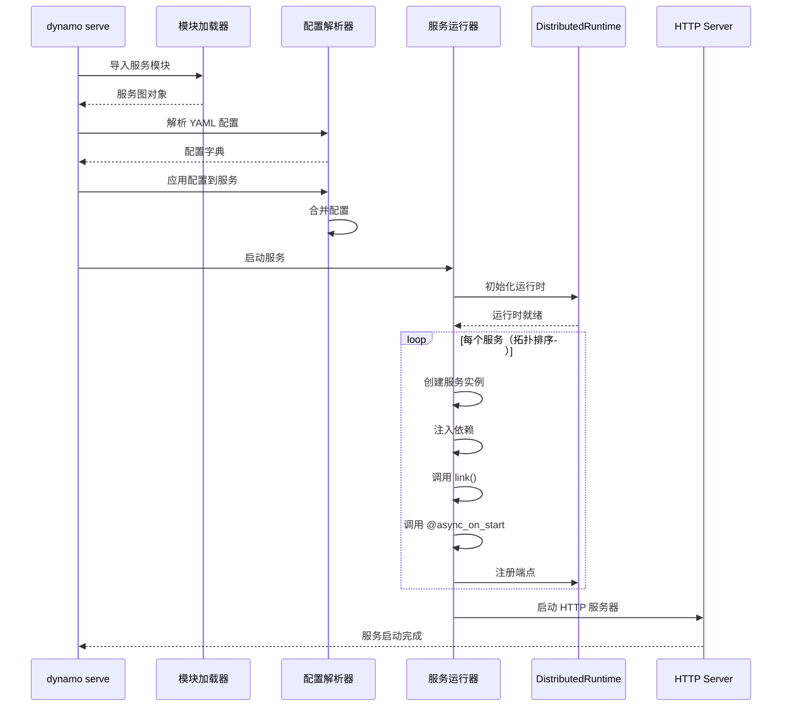
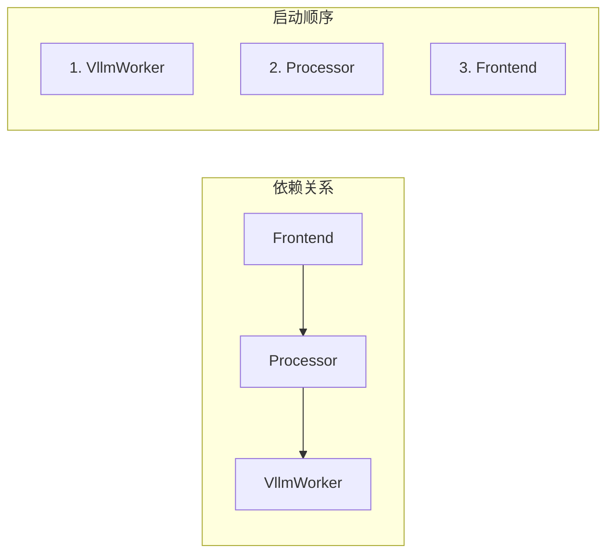
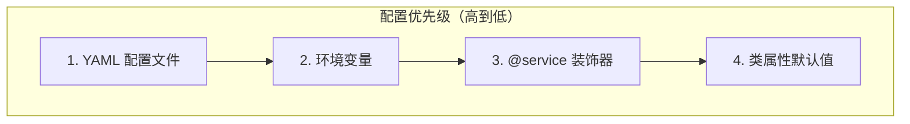

> 本文档介绍 Dynamo SDK 提供的命令行工具，包括 dynamo serve 命令的使用和配置文件格式。

---

## 1. CLI 概述

### 1.1 命令结构



### 1.2 主要命令

| 命令 | 说明 |
|------|------|
| `dynamo serve` | 启动本地服务 |
| `dynamo build` | 构建服务镜像 |
| `dynamo deploy` | 部署到集群 |

---

## 2. dynamo serve 命令

### 2.1 命令定义

```python
# deploy/dynamo/sdk/src/dynamo/sdk/cli/serve.py

@click.command()
@click.argument("bento", type=click.STRING, default=".")
@click.option(
    "-f", "--file",
    type=click.Path(exists=True),
    help="配置文件路径"
)
@click.option(
    "--port",
    type=int,
    default=3000,
    help="HTTP 服务端口"
)
@click.option(
    "--host",
    type=str,
    default="0.0.0.0",
    help="HTTP 服务地址"
)
@click.option(
    "--development",
    is_flag=True,
    help="开发模式（热重载）"
)
@click.option(
    "--dry-run",
    is_flag=True,
    help="仅验证配置，不启动服务"
)
def serve(
    ctx,
    bento: str,
    file: str | None,
    port: int,
    host: str,
    development: bool,
    dry_run: bool,
):
    """
    启动 Dynamo 服务

    BENTO: 服务图模块路径，格式为 module:attribute
    """
    ...
```

### 2.2 参数说明

| 参数 | 类型 | 默认值 | 说明 |
|------|------|--------|------|
| `BENTO` | 位置参数 | "." | 服务模块路径 |
| `-f/--file` | 选项 | None | YAML 配置文件 |
| `--port` | 选项 | 3000 | HTTP 端口 |
| `--host` | 选项 | 0.0.0.0 | 绑定地址 |
| `--development` | 标志 | False | 开发模式 |
| `--dry-run` | 标志 | False | 仅验证 |

### 2.3 使用示例

```bash
# 基本用法
dynamo serve graphs.agg:Frontend

# 指定配置文件
dynamo serve graphs.agg:Frontend -f configs/agg.yaml

# 指定端口
dynamo serve graphs.agg:Frontend --port 8080

# 开发模式（热重载）
dynamo serve graphs.agg:Frontend --development

# 验证配置
dynamo serve graphs.agg:Frontend -f configs/agg.yaml --dry-run
```

---

## 3. 服务模块路径

### 3.1 路径格式

```
module.path:attribute_name
```

示例：

| 路径 | 说明 |
|------|------|
| `graphs.agg:Frontend` | graphs/agg.py 中的 Frontend |
| `myapp.services:MyService` | myapp/services.py 中的 MyService |
| `components.worker:VllmWorker` | components/worker.py 中的 VllmWorker |

### 3.2 服务图结构

```python
# graphs/agg.py

from ..components.worker import VllmWorker
from ..components.processor import Processor
from ..components.frontend import Frontend

# 定义服务图入口
# 依赖关系：Frontend -> Processor -> VllmWorker
Frontend = Frontend
```

### 3.3 模块解析



---

## 4. 配置文件格式

### 4.1 YAML 结构

```yaml
# configs/agg.yaml

# 服务名: 配置
VllmWorker:
  # 类属性（直接映射）
  model_path: /models/llama-7b
  tensor_parallel_size: 1
  max_model_len: 16384

  # 服务参数
  ServiceArgs:
    workers: 2
    resources:
      gpu: 1
      cpu: "10"
      memory: "64Gi"

Processor:
  batch_size: 32

  ServiceArgs:
    workers: 4
    resources:
      cpu: "4"

Frontend:
  port: 8080

  ServiceArgs:
    workers: 1
```

### 4.2 配置层次



### 4.3 ServiceArgs 详解

| 参数 | 说明 | 示例 |
|------|------|------|
| `workers` | Worker 进程数 | `2` |
| `resources.gpu` | GPU 数量 | `1` |
| `resources.cpu` | CPU 核数 | `"10"` |
| `resources.memory` | 内存限制 | `"64Gi"` |
| `traffic.timeout` | 请求超时 | `300` |

---

## 5. 启动流程

### 5.1 完整流程



### 5.2 服务图解析

```python
def _parse_service_graph(graph):
    """
    解析服务依赖图，返回拓扑排序

    Returns:
        按依赖顺序排列的服务列表
    """
    services = []
    visited = set()

    def visit(svc):
        if svc.name in visited:
            return
        visited.add(svc.name)

        # 先访问依赖（深度优先）
        for dep in svc._dependencies:
            if hasattr(dep, 'on') and dep.on:
                visit(dep.on)

        services.append(svc)

    visit(graph)
    return services
```

### 5.3 拓扑排序示例



---

## 6. 配置应用

### 6.1 配置合并逻辑

```python
def _apply_config(service, config: dict) -> None:
    """应用配置到服务"""

    # 1. 类属性
    for key, value in config.items():
        if key not in ("ServiceArgs", "dynamo"):
            if hasattr(service.inner, key):
                setattr(service.inner, key, value)

    # 2. Dynamo 配置
    if "dynamo" in config:
        _apply_dynamo_config(service, config["dynamo"])

    # 3. 服务参数
    if "ServiceArgs" in config:
        _apply_service_args(service, config["ServiceArgs"])
```

### 6.2 配置优先级



---

## 7. 开发模式

### 7.1 热重载

```bash
dynamo serve graphs.agg:Frontend --development
```

开发模式特性：

| 特性 | 说明 |
|------|------|
| 热重载 | 代码变更自动重启 |
| 详细日志 | 更详细的调试信息 |
| 单进程 | 简化调试 |

### 7.2 配置验证

```bash
dynamo serve graphs.agg:Frontend -f config.yaml --dry-run
```

Dry-run 模式：
- 解析服务模块
- 加载配置文件
- 验证配置正确性
- 不启动实际服务

---

## 8. 日志配置

### 8.1 日志级别

```bash
# 设置日志级别
DYNAMO_LOG_LEVEL=debug dynamo serve graphs.agg:Frontend

# 或
export DYNAMO_LOG_LEVEL=debug
dynamo serve graphs.agg:Frontend
```

| 级别 | 说明 |
|------|------|
| `debug` | 详细调试信息 |
| `info` | 一般信息（默认） |
| `warn` | 警告信息 |
| `error` | 错误信息 |

### 8.2 日志格式

```
2024-01-15T10:30:00.123Z INFO  [dynamo::serve] Starting VllmWorker...
2024-01-15T10:30:01.456Z INFO  [dynamo::serve] VllmWorker registered on namespace.dynamo.component.VllmWorker
2024-01-15T10:30:02.789Z INFO  [dynamo::serve] HTTP server listening on 0.0.0.0:3000
```

---

## 9. 环境变量

### 9.1 常用环境变量

| 变量 | 说明 | 默认值 |
|------|------|--------|
| `DYNAMO_LOG_LEVEL` | 日志级别 | info |
| `DYNAMO_NAMESPACE` | 默认命名空间 | default |
| `ETCD_ENDPOINTS` | etcd 地址 | localhost:2379 |
| `NATS_SERVER` | NATS 地址 | nats://localhost:4222 |

### 9.2 使用示例

```bash
export ETCD_ENDPOINTS=etcd1:2379,etcd2:2379
export NATS_SERVER=nats://nats:4222
export DYNAMO_NAMESPACE=production

dynamo serve graphs.agg:Frontend -f configs/prod.yaml
```

---

## 10. 完整示例

### 10.1 项目结构

```
my_project/
├── components/
│   ├── __init__.py
│   ├── worker.py
│   ├── processor.py
│   └── frontend.py
├── graphs/
│   ├── __init__.py
│   └── agg.py
├── configs/
│   ├── dev.yaml
│   └── prod.yaml
└── pyproject.toml
```

### 10.2 启动命令

```bash
# 开发环境
cd my_project
dynamo serve graphs.agg:Frontend -f configs/dev.yaml --development

# 生产环境
dynamo serve graphs.agg:Frontend -f configs/prod.yaml --port 8080
```

### 10.3 配置文件

```yaml
# configs/dev.yaml
VllmWorker:
  model_path: /models/llama-7b
  ServiceArgs:
    workers: 1
    resources:
      gpu: 1

Processor:
  ServiceArgs:
    workers: 2

Frontend:
  ServiceArgs:
    workers: 1
```

---

## 总结

Dynamo CLI 的核心功能：

| 功能 | 命令/选项 |
|------|-----------|
| 启动服务 | `dynamo serve module:attr` |
| 加载配置 | `-f config.yaml` |
| 开发模式 | `--development` |
| 配置验证 | `--dry-run` |

CLI 工具简化了 Dynamo 服务的本地开发和测试流程。

---

## 参考文件

- [deploy/dynamo/sdk/src/dynamo/sdk/cli/serve.py](../../../deploy/dynamo/sdk/src/dynamo/sdk/cli/serve.py) - CLI 命令实现
- [examples/llm/configs/](../../../examples/llm/configs/) - 配置文件示例
