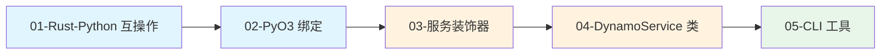
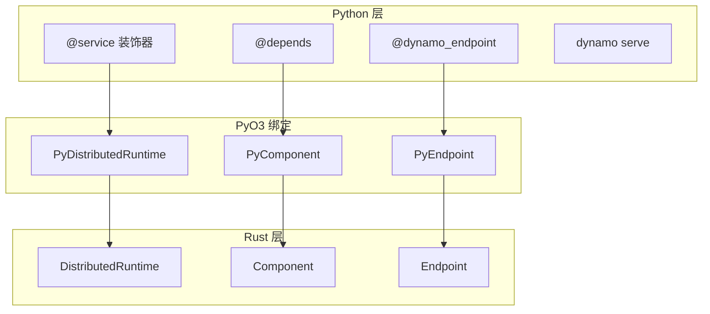

# 第六章：Python SDK 原理

> Dynamo 的 Python SDK 通过 PyO3 实现 Rust-Python 互操作，提供简洁的服务定义接口。

## 本章概述

本章深入解析 Dynamo 的 Python SDK，包括 Rust-Python 互操作、PyO3 绑定实现、服务装饰器、DynamoService 类以及 CLI 工具。

---

## 子文档列表

| 序号 | 文件 | 主题 | 内容简介 |
|------|------|------|----------|
| 1 | [01-rust-python-interop.md](01-rust-python-interop.md) | Rust-Python 互操作 | FFI、PyO3、Maturin |
| 2 | [02-pyo3-bindings.md](02-pyo3-bindings.md) | PyO3 绑定实现 | 核心类、LLM 类、异步支持 |
| 3 | [03-service-decorators.md](03-service-decorators.md) | 服务装饰器 | @service、@dynamo_endpoint、@depends |
| 4 | [04-dynamo-service-class.md](04-dynamo-service-class.md) | DynamoService 类 | 继承关系、链接、端点管理 |
| 5 | [05-cli-tools.md](05-cli-tools.md) | CLI 工具 | dynamo serve、配置文件 |

---

## 阅读顺序建议

---

## 关键概念速查

| 概念 | 说明 | 详见文档 |
|------|------|----------|
| **PyO3** | Rust-Python 绑定库 | [01-rust-python-interop.md](01-rust-python-interop.md) |
| **@service** | 服务定义装饰器 | [03-service-decorators.md](03-service-decorators.md) |
| **@dynamo_endpoint** | 端点定义装饰器 | [03-service-decorators.md](03-service-decorators.md) |
| **@depends** | 依赖注入装饰器 | [03-service-decorators.md](03-service-decorators.md) |
| **DynamoService** | 服务基类 | [04-dynamo-service-class.md](04-dynamo-service-class.md) |
| **dynamo serve** | 服务启动命令 | [05-cli-tools.md](05-cli-tools.md) |

---

## 架构总览

---

## 下一章

完成本章阅读后，建议继续阅读 [第七章：HTTP API 层原理](../07-http-api-layer/README.md)，了解 Dynamo 的 HTTP 接口设计。
