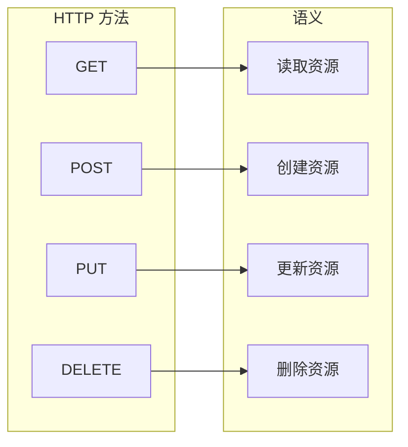
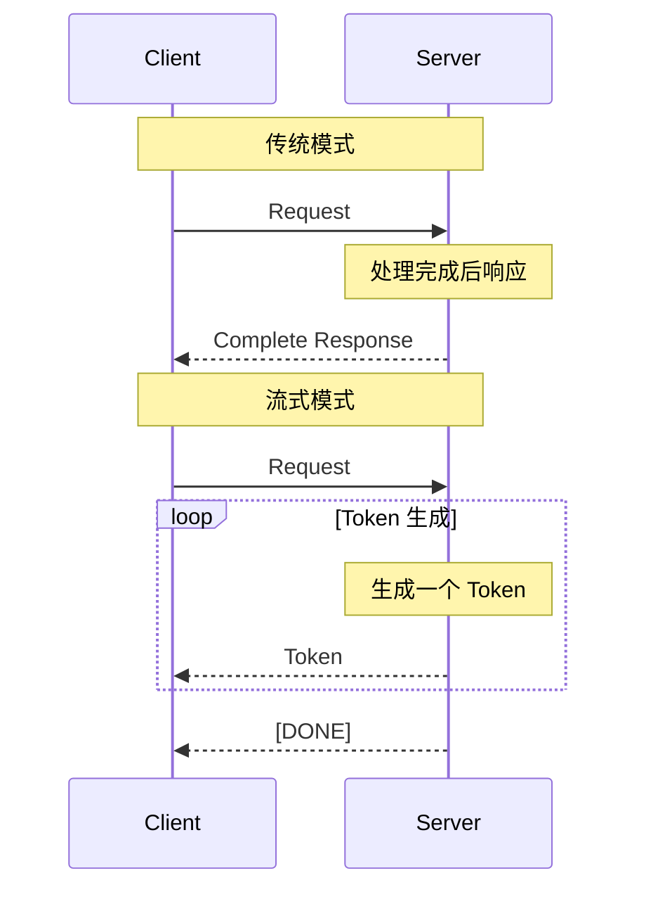
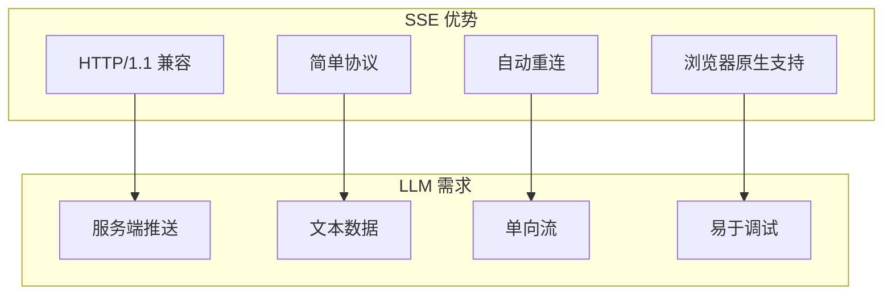
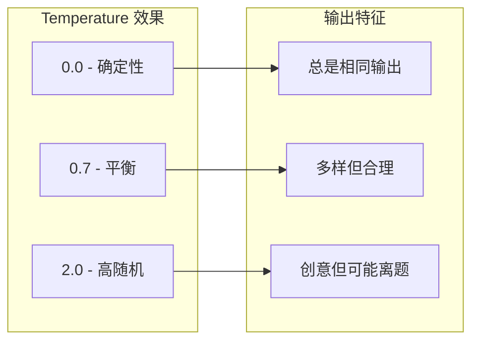

> 本文档介绍 REST API 设计原则和 LLM 推理 API 的特殊需求，为理解 Dynamo HTTP 层奠定基础。

---

## 1. REST API 设计原则

### 1.1 核心原则

REST（Representational State Transfer）是 Web API 设计的主流范式：

| 原则 | 说明 | 示例 |
|------|------|------|
| 资源导向 | URL 表示资源 | `/v1/models`、`/v1/chat/completions` |
| 无状态 | 每个请求独立 | 不依赖服务端会话 |
| 统一接口 | 标准 HTTP 方法 | GET、POST、PUT、DELETE |
| 分层系统 | 客户端无感知中间层 | 负载均衡、网关 |

### 1.2 HTTP 方法语义



| 方法 | 幂等性 | 安全性 | 典型用途 |
|------|--------|--------|----------|
| GET | 是 | 是 | 查询资源 |
| POST | 否 | 否 | 创建资源 |
| PUT | 是 | 否 | 全量更新 |
| PATCH | 否 | 否 | 部分更新 |
| DELETE | 是 | 否 | 删除资源 |

---

## 2. LLM 推理 API 的特殊挑战

### 2.1 流式响应需求

传统 HTTP 请求-响应模型：

```
Client ──Request──> Server
Client <──Response── Server (一次性返回)
```

LLM 流式响应模型：

```
Client ──Request──> Server
Client <──Token 1── Server
Client <──Token 2── Server
Client <──Token 3── Server
...
Client <──[DONE]─── Server
```

### 2.2 时序对比



### 2.3 特殊需求

| 需求 | 说明 | 解决方案 |
|------|------|----------|
| 长连接 | Token 生成可能持续数分钟 | 适当的超时配置 |
| 断开检测 | 客户端断开需取消生成 | 服务端主动检测 |
| 高并发 | GPU 资源有限 | 请求排队、负载均衡 |
| 资源管理 | 及时释放计算资源 | RAII 模式 |

---

## 3. 流式响应技术选型

### 3.1 技术对比

| 技术 | 方向 | 协议 | 特点 | 适用场景 |
|------|------|------|------|----------|
| **SSE** | 单向 | HTTP/1.1 | 自动重连、文本 | LLM Token 流 ✓ |
| WebSocket | 双向 | 升级协议 | 二进制支持 | 聊天应用 |
| HTTP/2 Push | 单向 | HTTP/2 | 需要 HTTP/2 | 静态资源 |
| Long Polling | 单向 | HTTP/1.1 | 兼容性好 | 遗留系统 |

### 3.2 为什么选择 SSE



### 3.3 SSE 协议格式

```http
HTTP/1.1 200 OK
Content-Type: text/event-stream
Cache-Control: no-cache
Connection: keep-alive

data: {"id":"chatcmpl-1","choices":[{"delta":{"content":"Hello"}}]}

data: {"id":"chatcmpl-1","choices":[{"delta":{"content":" world"}}]}

data: [DONE]
```

SSE 事件格式：

| 字段 | 说明 |
|------|------|
| `data:` | 数据内容（必需） |
| `event:` | 事件类型（可选） |
| `id:` | 事件 ID（可选） |
| `retry:` | 重连间隔（可选） |

---

## 4. OpenAI API 规范

### 4.1 为什么兼容 OpenAI

OpenAI API 已成为 LLM 服务的事实标准：

- **广泛采用**：大量客户端库和应用支持
- **文档完善**：详细的 API 文档
- **生态丰富**：LangChain、LlamaIndex 等框架原生支持
- **易于迁移**：用户可以无缝切换

### 4.2 核心端点

| 端点 | 方法 | 说明 |
|------|------|------|
| `/v1/chat/completions` | POST | 聊天完成（主要端点） |
| `/v1/completions` | POST | 文本完成（Legacy） |
| `/v1/models` | GET | 列出可用模型 |

### 4.3 请求格式

```json
{
  "model": "llama-3-70b",
  "messages": [
    {"role": "system", "content": "You are a helpful assistant."},
    {"role": "user", "content": "Hello!"}
  ],
  "stream": true,
  "max_tokens": 256,
  "temperature": 0.7
}
```

### 4.4 响应格式

#### 非流式响应

```json
{
  "id": "chatcmpl-123",
  "object": "chat.completion",
  "created": 1694268190,
  "model": "llama-3-70b",
  "choices": [
    {
      "index": 0,
      "message": {
        "role": "assistant",
        "content": "Hello! How can I help you today?"
      },
      "finish_reason": "stop"
    }
  ],
  "usage": {
    "prompt_tokens": 10,
    "completion_tokens": 8,
    "total_tokens": 18
  }
}
```

#### 流式响应（SSE）

```
data: {"id":"chatcmpl-123","object":"chat.completion.chunk","created":1694268190,"model":"llama-3-70b","choices":[{"index":0,"delta":{"role":"assistant"},"finish_reason":null}]}

data: {"id":"chatcmpl-123","object":"chat.completion.chunk","created":1694268190,"model":"llama-3-70b","choices":[{"index":0,"delta":{"content":"Hello"},"finish_reason":null}]}

data: {"id":"chatcmpl-123","object":"chat.completion.chunk","created":1694268190,"model":"llama-3-70b","choices":[{"index":0,"delta":{"content":"!"},"finish_reason":null}]}

data: {"id":"chatcmpl-123","object":"chat.completion.chunk","created":1694268190,"model":"llama-3-70b","choices":[{"index":0,"delta":{},"finish_reason":"stop"}]}

data: [DONE]
```

### 4.5 消息角色

| 角色 | 说明 |
|------|------|
| `system` | 系统指令，定义助手行为 |
| `user` | 用户输入 |
| `assistant` | 助手回复 |
| `tool` | 工具调用结果 |

---

## 5. 请求参数详解

### 5.1 采样参数

| 参数 | 类型 | 说明 | 默认值 |
|------|------|------|--------|
| `temperature` | float | 控制随机性，0-2 | 1.0 |
| `top_p` | float | 核采样概率 | 1.0 |
| `frequency_penalty` | float | 频率惩罚 | 0 |
| `presence_penalty` | float | 存在惩罚 | 0 |

### 5.2 生成控制

| 参数 | 类型 | 说明 |
|------|------|------|
| `max_tokens` | int | 最大生成 Token 数 |
| `stop` | array | 停止词列表 |
| `n` | int | 生成候选数量 |

### 5.3 参数效果



---

## 6. 错误处理

### 6.1 HTTP 状态码

| 状态码 | 说明 | 示例场景 |
|--------|------|----------|
| 200 | 成功 | 正常响应 |
| 400 | 请求错误 | 参数格式错误 |
| 401 | 未授权 | API Key 无效 |
| 404 | 未找到 | 模型不存在 |
| 429 | 限流 | 请求过多 |
| 500 | 服务器错误 | 内部异常 |
| 503 | 服务不可用 | 模型未就绪 |

### 6.2 错误响应格式

```json
{
  "error": {
    "message": "Model 'unknown-model' not found",
    "type": "invalid_request_error",
    "code": "model_not_found"
  }
}
```

---

## 7. 客户端使用示例

### 7.1 Python（openai 库）

```python
from openai import OpenAI

client = OpenAI(
    base_url="http://localhost:8080/v1",
    api_key="not-needed"
)

# 非流式
response = client.chat.completions.create(
    model="llama-3-70b",
    messages=[{"role": "user", "content": "Hello!"}]
)
print(response.choices[0].message.content)

# 流式
stream = client.chat.completions.create(
    model="llama-3-70b",
    messages=[{"role": "user", "content": "Hello!"}],
    stream=True
)
for chunk in stream:
    if chunk.choices[0].delta.content:
        print(chunk.choices[0].delta.content, end="")
```

### 7.2 cURL

```bash
# 非流式
curl http://localhost:8080/v1/chat/completions \
  -H "Content-Type: application/json" \
  -d '{
    "model": "llama-3-70b",
    "messages": [{"role": "user", "content": "Hello!"}]
  }'

# 流式
curl http://localhost:8080/v1/chat/completions \
  -H "Content-Type: application/json" \
  -d '{
    "model": "llama-3-70b",
    "messages": [{"role": "user", "content": "Hello!"}],
    "stream": true
  }'
```

---

## 总结

LLM HTTP API 的设计要点：

1. **REST 原则**：资源导向、无状态、统一接口
2. **流式响应**：SSE 技术支持 Token 级流式输出
3. **OpenAI 兼容**：降低用户迁移成本
4. **错误处理**：标准 HTTP 状态码和结构化错误信息

这些基础知识是理解 Dynamo HTTP 服务层实现的前提。

---

## 参考资料

- [OpenAI API 参考](https://platform.openai.com/docs/api-reference)
- [Server-Sent Events 规范](https://html.spec.whatwg.org/multipage/server-sent-events.html)
- [REST API 设计指南](https://restfulapi.net/)
