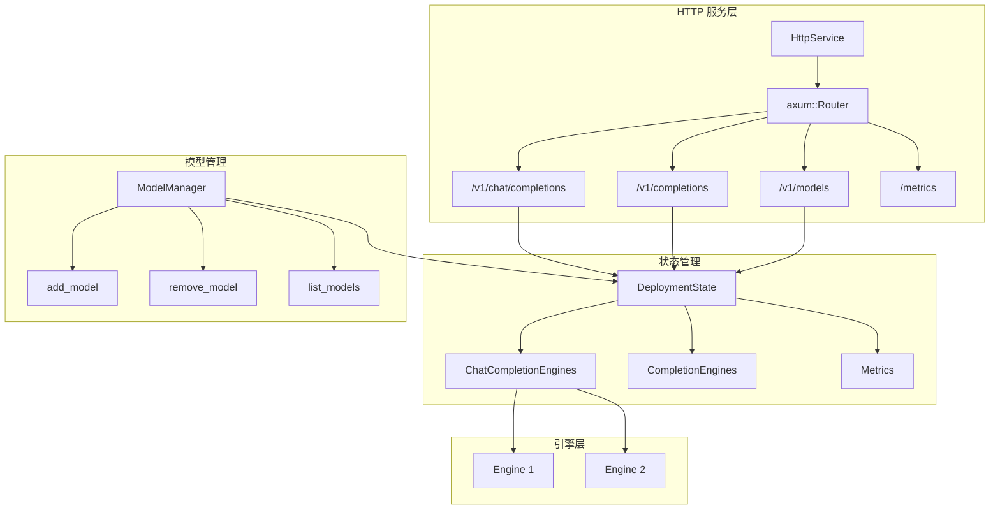
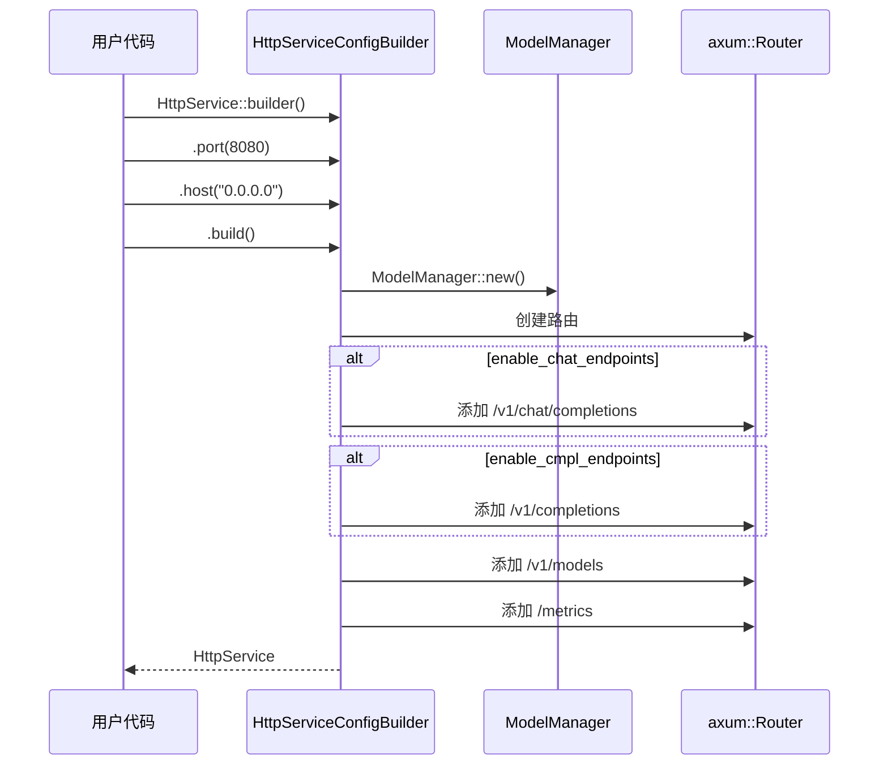
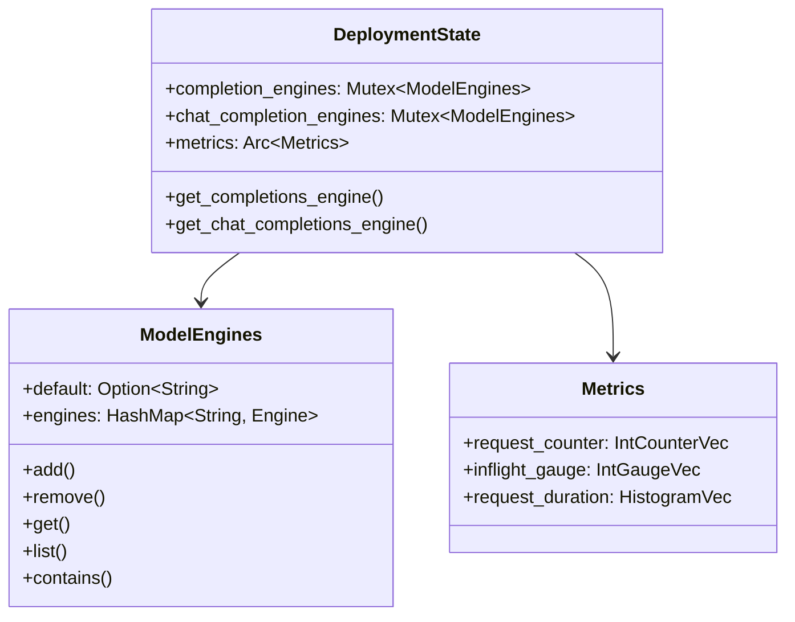
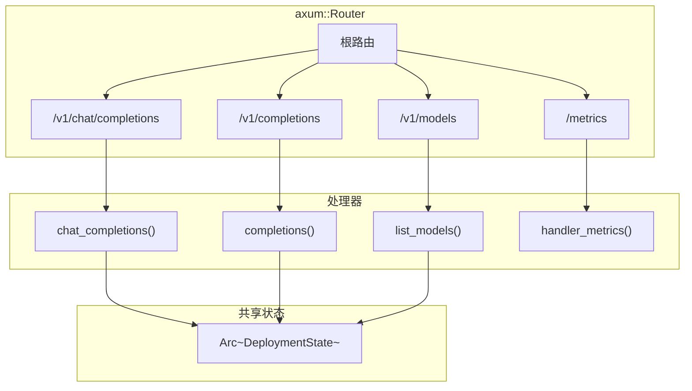
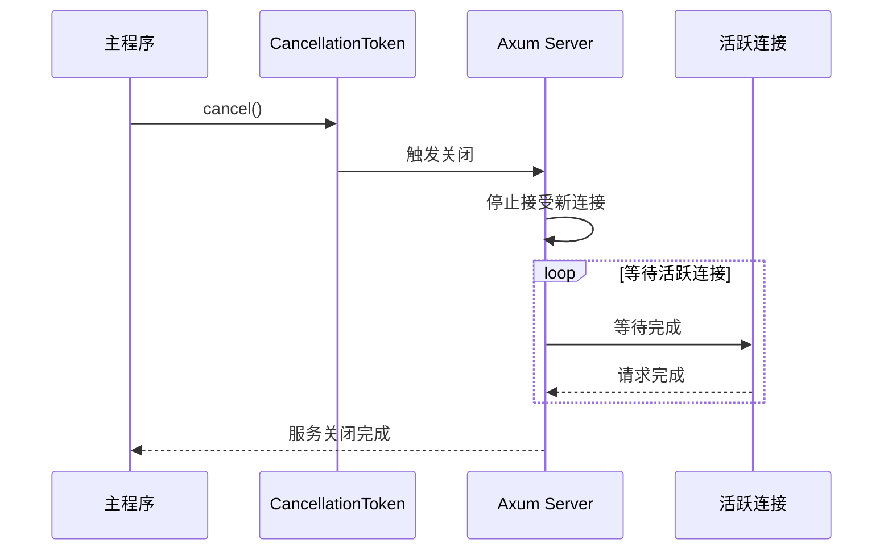
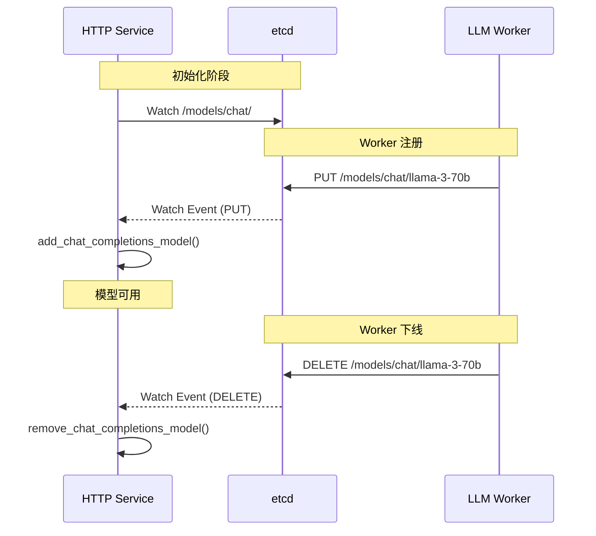

> 本文档详解 Dynamo HTTP 服务的架构设计，包括 HttpService、DeploymentState 和 ModelManager 的实现细节。

---

## 1. 整体架构

### 1.1 架构图



### 1.2 核心组件

| 组件 | 职责 |
|------|------|
| HttpService | HTTP 服务入口，管理路由和生命周期 |
| DeploymentState | 全局状态，存储引擎和指标 |
| ModelManager | 模型管理，增删查模型引擎 |
| ModelEngines | 模型到引擎的映射 |

---

## 2. HttpService 实现

### 2.1 结构定义

```rust
// lib/llm/src/http/service/service_v2.rs

#[derive(Clone)]
pub struct HttpService {
    models: ModelManager,
    router: axum::Router,
    port: u16,
    host: String,
}
```

### 2.2 Builder 模式

```rust
#[derive(Clone, Builder)]
#[builder(pattern = "owned", build_fn(private, name = "build_internal"))]
pub struct HttpServiceConfig {
    #[builder(default = "8787")]
    port: u16,

    #[builder(setter(into), default = "String::from(\"0.0.0.0\")")]
    host: String,

    #[builder(default = "true")]
    enable_chat_endpoints: bool,

    #[builder(default = "true")]
    enable_cmpl_endpoints: bool,
}
```

### 2.3 构建流程



### 2.4 服务启动

```rust
impl HttpService {
    /// 运行 HTTP 服务
    pub async fn run(&self, cancel_token: CancellationToken) -> Result<()> {
        let address = format!("{}:{}", self.host, self.port);
        tracing::info!(address, "Starting HTTP service on: {address}");

        let listener = tokio::net::TcpListener::bind(address.as_str())
            .await
            .unwrap_or_else(|_| panic!("could not bind to address: {address}"));

        let router = self.router.clone();
        let observer = cancel_token.child_token();

        // 使用 Axum 的优雅关闭
        axum::serve(listener, router)
            .with_graceful_shutdown(observer.cancelled_owned())
            .await
            .inspect_err(|_| cancel_token.cancel())?;

        Ok(())
    }

    /// 后台运行服务
    pub async fn spawn(&self, cancel_token: CancellationToken) -> JoinHandle<Result<()>> {
        let this = self.clone();
        tokio::spawn(async move { this.run(cancel_token).await })
    }
}
```

---

## 3. DeploymentState 状态管理

### 3.1 结构定义

```rust
// lib/llm/src/http/service.rs

/// 全局部署状态，跨所有请求共享
pub struct DeploymentState {
    completion_engines: Arc<Mutex<ModelEngines<OpenAICompletionsStreamingEngine>>>,
    chat_completion_engines: Arc<Mutex<ModelEngines<OpenAIChatCompletionsStreamingEngine>>>,
    metrics: Arc<Metrics>,
}
```

### 3.2 引擎获取

```rust
impl DeploymentState {
    fn new() -> Self {
        Self {
            completion_engines: Arc::new(Mutex::new(ModelEngines::default())),
            chat_completion_engines: Arc::new(Mutex::new(ModelEngines::default())),
            metrics: Arc::new(Metrics::default()),
        }
    }

    fn get_completions_engine(
        &self,
        model: &str,
    ) -> Result<OpenAICompletionsStreamingEngine, ServiceHttpError> {
        self.completion_engines
            .lock()
            .unwrap()
            .get(model)
            .cloned()
            .ok_or(ServiceHttpError::ModelNotFound(model.to_string()))
    }

    fn get_chat_completions_engine(
        &self,
        model: &str,
    ) -> Result<OpenAIChatCompletionsStreamingEngine, ServiceHttpError> {
        self.chat_completion_engines
            .lock()
            .unwrap()
            .get(model)
            .cloned()
            .ok_or(ServiceHttpError::ModelNotFound(model.to_string()))
    }
}
```

### 3.3 状态结构图



---

## 4. ModelManager 模型管理

### 4.1 结构定义

```rust
#[derive(Clone)]
pub struct ModelManager {
    state: Arc<DeploymentState>,
}
```

### 4.2 核心方法

```rust
impl ModelManager {
    pub fn new() -> Self {
        let state = Arc::new(DeploymentState::new());
        Self { state }
    }

    /// 检查是否存在指定模型
    pub fn has_model_any(&self, model: &str) -> bool {
        self.state.chat_completion_engines.lock().unwrap().contains(model)
            || self.state.completion_engines.lock().unwrap().contains(model)
    }

    /// 列出所有 Chat Completion 模型
    pub fn list_chat_completions_models(&self) -> Vec<String> {
        self.state.chat_completion_engines.lock().unwrap().list()
    }

    /// 列出所有 Completion 模型
    pub fn list_completions_models(&self) -> Vec<String> {
        self.state.completion_engines.lock().unwrap().list()
    }

    /// 添加 Chat Completion 模型引擎
    pub fn add_chat_completions_model(
        &self,
        model: &str,
        engine: OpenAIChatCompletionsStreamingEngine,
    ) -> Result<(), ServiceHttpError> {
        let mut clients = self.state.chat_completion_engines.lock().unwrap();
        clients.add(model, engine)
    }

    /// 添加 Completion 模型引擎
    pub fn add_completions_model(
        &self,
        model: &str,
        engine: OpenAICompletionsStreamingEngine,
    ) -> Result<(), ServiceHttpError> {
        let mut clients = self.state.completion_engines.lock().unwrap();
        clients.add(model, engine)
    }

    /// 移除模型
    pub fn remove_chat_completions_model(&self, model: &str) -> Result<(), ServiceHttpError> {
        let mut clients = self.state.chat_completion_engines.lock().unwrap();
        clients.remove(model)
    }

    /// 获取指标对象
    pub fn metrics(&self) -> Arc<Metrics> {
        self.state.metrics.clone()
    }

    /// 获取内部状态（用于路由处理器）
    pub fn state(&self) -> Arc<DeploymentState> {
        self.state.clone()
    }
}
```

### 4.3 模型引擎映射

```rust
pub struct ModelEngines<T> {
    default: Option<String>,
    engines: HashMap<String, T>,
}

impl<T: Clone> ModelEngines<T> {
    pub fn add(&mut self, model: &str, engine: T) -> Result<(), ServiceHttpError> {
        if self.engines.contains_key(model) {
            return Err(ServiceHttpError::ModelAlreadyExists(model.to_string()));
        }

        // 第一个添加的模型成为默认模型
        if self.default.is_none() {
            self.default = Some(model.to_string());
        }

        self.engines.insert(model.to_string(), engine);
        Ok(())
    }

    pub fn remove(&mut self, model: &str) -> Result<(), ServiceHttpError> {
        if self.engines.remove(model).is_none() {
            return Err(ServiceHttpError::ModelNotFound(model.to_string()));
        }

        // 如果移除的是默认模型，重新选择
        if self.default.as_deref() == Some(model) {
            self.default = self.engines.keys().next().cloned();
        }

        Ok(())
    }

    pub fn get(&self, model: &str) -> Option<&T> {
        self.engines.get(model)
    }

    pub fn list(&self) -> Vec<String> {
        self.engines.keys().cloned().collect()
    }

    pub fn contains(&self, model: &str) -> bool {
        self.engines.contains_key(model)
    }
}
```

---

## 5. 路由注册

### 5.1 路由结构



### 5.2 路由创建

```rust
impl HttpServiceConfigBuilder {
    pub fn build(self) -> Result<HttpService, anyhow::Error> {
        let config = self.build_internal()?;

        let model_manager = ModelManager::new();

        // 启用 Prometheus 指标
        let registry = metrics::Registry::new();
        model_manager.metrics().register(&registry)?;

        let mut router = axum::Router::new();
        let mut routes = vec![
            metrics::router(registry, None),
            openai::list_models_router(model_manager.state(), None),
        ];

        if config.enable_chat_endpoints {
            routes.push(openai::chat_completions_router(
                model_manager.state(),
                None,
            ));
        }

        if config.enable_cmpl_endpoints {
            routes.push(openai::completions_router(
                model_manager.state(),
                None,
            ));
        }

        for (route_docs, route) in routes.into_iter() {
            router = router.merge(route);
        }

        Ok(HttpService {
            models: model_manager,
            router,
            port: config.port,
            host: config.host,
        })
    }
}
```

---

## 6. Axum 框架特性

### 6.1 为什么选择 Axum

| 特性 | 说明 |
|------|------|
| Tokio 生态 | 与 Dynamo 运行时无缝集成 |
| 类型安全 | 编译时路由检查 |
| 高性能 | 零成本抽象 |
| 模块化 | 易于组合和扩展 |

### 6.2 状态共享模式

```rust
// 使用 State 提取器共享状态
async fn chat_completions(
    State(state): State<Arc<DeploymentState>>,
    Json(request): Json<NvCreateChatCompletionRequest>,
) -> Result<Response, (StatusCode, Json<ErrorResponse>)> {
    // state 在所有请求间共享
    let engine = state.get_chat_completions_engine(&request.inner.model)?;
    // ...
}
```

### 6.3 优雅关闭

```rust
axum::serve(listener, router)
    .with_graceful_shutdown(cancel_token.cancelled_owned())
    .await?;
```

关闭流程：



---

## 7. 动态模型发现

### 7.1 etcd Watch 机制

HTTP 服务通过 etcd Watch 动态发现可用模型：

```rust
// components/http/src/main.rs

async fn app(runtime: Runtime) -> Result<()> {
    let http_service = HttpService::builder()
        .port(args.port)
        .host(args.host)
        .build()?;
    let manager = http_service.model_manager().clone();

    // Watch 模型注册
    let etcd_path = format!("{}/models/chat/", etcd_root);
    let models_watcher = etcd_client
        .kv_get_and_watch_prefix(etcd_path)
        .await?;

    tokio::spawn(model_watcher(manager, models_watcher));

    http_service.run(cancel_token).await
}
```

### 7.2 模型发现流程



---

## 8. 使用示例

### 8.1 创建 HTTP 服务

```rust
let http_service = HttpService::builder()
    .port(8080)
    .host("0.0.0.0")
    .enable_chat_endpoints(true)
    .enable_cmpl_endpoints(false)
    .build()?;
```

### 8.2 添加模型

```rust
let manager = http_service.model_manager();

// 添加 Chat Completion 模型
manager.add_chat_completions_model(
    "llama-3-70b",
    chat_engine,
)?;

// 添加 Completion 模型
manager.add_completions_model(
    "codellama-34b",
    completion_engine,
)?;
```

### 8.3 启动服务

```rust
let cancel_token = CancellationToken::new();

// 方式 1: 阻塞运行
http_service.run(cancel_token.clone()).await?;

// 方式 2: 后台运行
let handle = http_service.spawn(cancel_token.clone()).await;

// 关闭服务
cancel_token.cancel();
handle.await??;
```

---

## 总结

Dynamo HTTP Server 的核心设计：

| 特性 | 实现 |
|------|------|
| 框架 | Axum（Tokio 生态） |
| 状态管理 | DeploymentState + Arc |
| 模型管理 | ModelManager + ModelEngines |
| 动态发现 | etcd Watch |
| 优雅关闭 | CancellationToken |

这套设计提供了高性能、可扩展的 HTTP 服务基础设施。

---

## 参考文件

- [lib/llm/src/http/service/service_v2.rs](../../../lib/llm/src/http/service/service_v2.rs) - HttpService 实现
- [lib/llm/src/http/service.rs](../../../lib/llm/src/http/service.rs) - 服务模块定义
- [components/http/src/main.rs](../../../components/http/src/main.rs) - HTTP 服务入口
