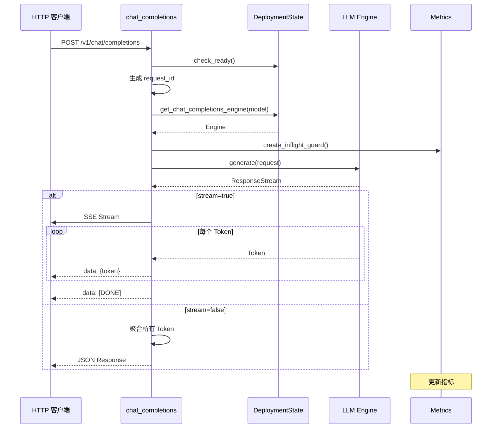
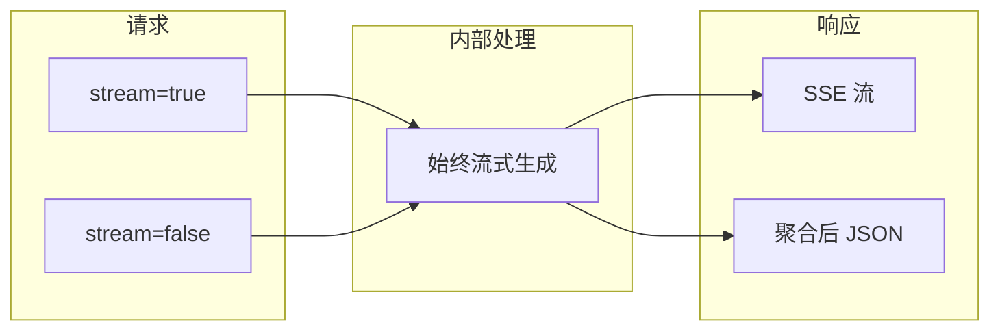

> 本文档详解 Dynamo 的 OpenAI 兼容 API 实现，包括 Chat Completions、Completions 和 Models 端点，以及 NVIDIA 扩展（NvExt）。

---

## 1. API 端点概览

### 1.1 端点列表

| 端点 | 方法 | 说明 |
|------|------|------|
| `/v1/chat/completions` | POST | 聊天完成（主要端点） |
| `/v1/completions` | POST | 文本完成（Legacy） |
| `/v1/models` | GET | 列出模型（OpenAI 格式） |
| `/dynamo/alpha/list-models` | GET | 列出模型（扩展格式） |
| `/metrics` | GET | Prometheus 指标 |

### 1.2 路由注册

```rust
// lib/llm/src/http/service/openai.rs

/// 创建 Chat Completions 路由
pub fn chat_completions_router(
    state: Arc<DeploymentState>,
    path: Option<String>,
) -> (Vec<RouteDoc>, Router) {
    let path = path.unwrap_or("/v1/chat/completions".to_string());
    let router = Router::new()
        .route(&path, post(chat_completions))
        .with_state(state);
    (vec![RouteDoc::new(Method::POST, &path)], router)
}

/// 创建 Completions 路由
pub fn completions_router(
    state: Arc<DeploymentState>,
    path: Option<String>,
) -> (Vec<RouteDoc>, Router) {
    let path = path.unwrap_or("/v1/completions".to_string());
    let router = Router::new()
        .route(&path, post(completions))
        .with_state(state);
    (vec![RouteDoc::new(Method::POST, &path)], router)
}

/// 创建 List Models 路由
pub fn list_models_router(
    state: Arc<DeploymentState>,
    path: Option<String>,
) -> (Vec<RouteDoc>, Router) {
    let router = Router::new()
        .route("/v1/models", get(list_models_openai))
        .route("/dynamo/alpha/list-models", get(list_models_custom))
        .with_state(state);
    (vec![...], router)
}
```

---

## 2. Chat Completions 端点

### 2.1 请求处理器

```rust
/// OpenAI Chat Completions 请求处理器
#[tracing::instrument(skip_all)]
async fn chat_completions(
    State(state): State<Arc<DeploymentState>>,
    Json(request): Json<NvCreateChatCompletionRequest>,
) -> Result<Response, (StatusCode, Json<ErrorResponse>)> {
    // 1. 服务就绪检查
    check_ready(&state)?;

    // 2. 生成请求 ID
    let request_id = uuid::Uuid::new_v4().to_string();

    // 3. 获取流式标志
    let streaming = request.inner.stream.unwrap_or(false);

    // 4. 强制使用流式请求（内部始终流式处理）
    let inner_request = async_openai::types::CreateChatCompletionRequest {
        stream: Some(true),
        ..request.inner
    };

    // 5. 获取对应模型的引擎
    let model = &request.inner.model;
    let engine = state
        .get_chat_completions_engine(model)
        .map_err(|_| ErrorResponse::model_not_found())?;

    // 6. 创建 Inflight 监控（RAII）
    let mut inflight = state.create_inflight_guard(
        model,
        Endpoint::ChatCompletions,
        streaming
    );

    // 7. 调用引擎生成
    let stream = engine
        .generate(Context::with_id(request, request_id))
        .await
        .map_err(|e| ErrorResponse::from_anyhow(e, "Failed to generate"))?;

    // 8. 根据流式标志返回不同响应
    if streaming {
        // 流式响应
        let sse_stream = stream.map(|r| Event::try_from(EventConverter::from(r)));
        let monitored = monitor_for_disconnects(sse_stream.boxed(), stream.context(), inflight).await;
        Ok(Sse::new(monitored).keep_alive(KeepAlive::default()).into_response())
    } else {
        // 非流式：聚合所有 Token
        let response = NvCreateChatCompletionResponse::from_annotated_stream(stream.into())
            .await
            .map_err(|e| ErrorResponse::internal_server_error(&e.to_string()))?;
        inflight.mark_ok();
        Ok(Json(response).into_response())
    }
}
```

### 2.2 处理流程



### 2.3 请求结构

```rust
/// 扩展的 Chat Completion 请求
#[derive(Serialize, Deserialize, Validate, Debug, Clone)]
pub struct NvCreateChatCompletionRequest {
    #[serde(flatten)]
    pub inner: async_openai::types::CreateChatCompletionRequest,

    #[serde(skip_serializing_if = "Option::is_none")]
    pub nvext: Option<NvExt>,
}
```

### 2.4 请求示例

```json
{
  "model": "llama-3-70b",
  "messages": [
    {"role": "system", "content": "You are a helpful assistant."},
    {"role": "user", "content": "Hello!"}
  ],
  "stream": true,
  "max_tokens": 256,
  "temperature": 0.7,
  "nvext": {
    "top_k": 40,
    "repetition_penalty": 1.1
  }
}
```

---

## 3. List Models 端点

### 3.1 OpenAI 格式

```rust
/// OpenAI 兼容格式的模型列表
async fn list_models_openai(
    State(state): State<Arc<DeploymentState>>,
) -> Result<Response, (StatusCode, Json<ErrorResponse>)> {
    check_ready(&state)?;

    let created = SystemTime::now()
        .duration_since(UNIX_EPOCH)
        .unwrap()
        .as_secs();

    // 合并所有模型
    let models: HashSet<String> = state
        .chat_completion_engines.lock().unwrap().engines.keys()
        .chain(state.completion_engines.lock().unwrap().engines.keys())
        .cloned()
        .collect();

    let data: Vec<ModelListing> = models
        .into_iter()
        .map(|id| ModelListing {
            id,
            object: "model",
            created,
            owned_by: "nvidia".to_string(),
        })
        .collect();

    Ok(Json(ListModelOpenAI { object: "list", data }).into_response())
}

#[derive(Serialize)]
struct ListModelOpenAI {
    object: &'static str,
    data: Vec<ModelListing>,
}

#[derive(Serialize)]
struct ModelListing {
    id: String,
    object: &'static str,
    created: u64,
    owned_by: String,
}
```

### 3.2 响应示例

```json
{
  "object": "list",
  "data": [
    {
      "id": "llama-3-70b",
      "object": "model",
      "created": 1694268190,
      "owned_by": "nvidia"
    },
    {
      "id": "codellama-34b",
      "object": "model",
      "created": 1694268190,
      "owned_by": "nvidia"
    }
  ]
}
```

---

## 4. NVIDIA 扩展（NvExt）

### 4.1 扩展参数

Dynamo 在 OpenAI API 基础上提供 NVIDIA 特有的扩展参数：

```rust
// lib/llm/src/protocols/openai/nvext.rs

/// NVIDIA LLM 扩展
#[derive(Serialize, Deserialize, Builder, Validate, Debug, Clone)]
pub struct NvExt {
    /// 忽略 EOS Token，生成到 max_tokens
    #[serde(default, skip_serializing_if = "Option::is_none")]
    pub ignore_eos: Option<bool>,

    /// Top-K 采样参数
    #[validate(custom(function = "validate_top_k"))]
    #[serde(default, skip_serializing_if = "Option::is_none")]
    pub top_k: Option<i64>,

    /// 重复惩罚（1.0 无惩罚，>1.0 抑制重复）
    #[validate(range(exclusive_min = 0.0, max = 2.0))]
    pub repetition_penalty: Option<f64>,

    /// 强制贪婪采样
    #[serde(default, skip_serializing_if = "Option::is_none")]
    pub greedy_sampling: Option<bool>,

    /// 使用原始 Prompt（绕过模板）
    #[serde(default, skip_serializing_if = "Option::is_none")]
    pub use_raw_prompt: Option<bool>,

    /// 注解列表（在 SSE 流中返回额外信息）
    #[serde(default, skip_serializing_if = "Option::is_none")]
    pub annotations: Option<Vec<String>>,
}
```

### 4.2 参数说明

| 参数 | 类型 | 说明 | 默认值 |
|------|------|------|--------|
| `ignore_eos` | bool | 忽略结束符，生成到 max_tokens | false |
| `top_k` | int | Top-K 采样，限制候选词数量 | - |
| `repetition_penalty` | float | 重复惩罚系数 | 1.0 |
| `greedy_sampling` | bool | 强制贪婪采样 | false |
| `use_raw_prompt` | bool | 绕过聊天模板 | false |
| `annotations` | array | 请求额外的注解信息 | - |

### 4.3 使用示例

```json
{
  "model": "llama-3-70b",
  "messages": [
    {"role": "user", "content": "Write a poem about AI"}
  ],
  "stream": true,
  "nvext": {
    "top_k": 40,
    "repetition_penalty": 1.1,
    "ignore_eos": false,
    "annotations": ["timing", "token_ids"]
  }
}
```

### 4.4 采样参数集成

```rust
impl OpenAISamplingOptionsProvider for NvCreateChatCompletionRequest {
    fn get_temperature(&self) -> Option<f32> {
        self.inner.temperature
    }

    fn get_top_p(&self) -> Option<f32> {
        self.inner.top_p
    }

    fn nvext(&self) -> Option<&NvExt> {
        self.nvext.as_ref()
    }
}

impl OpenAIStopConditionsProvider for NvCreateChatCompletionRequest {
    fn get_max_tokens(&self) -> Option<u32> {
        // 优先使用新参数名
        self.inner.max_completion_tokens.or(self.inner.max_tokens)
    }

    fn get_stop(&self) -> Option<Vec<String>> {
        self.inner.stop.as_ref().map(|stop| match stop {
            Stop::String(s) => vec![s.clone()],
            Stop::StringArray(arr) => arr.clone(),
        })
    }
}
```

---

## 5. 响应格式

### 5.1 流式响应（Chat Completion）

```rust
/// 流式响应块
#[derive(Serialize)]
struct ChatCompletionChunk {
    id: String,
    object: &'static str,  // "chat.completion.chunk"
    created: u64,
    model: String,
    choices: Vec<ChunkChoice>,
}

#[derive(Serialize)]
struct ChunkChoice {
    index: u32,
    delta: Delta,
    finish_reason: Option<String>,
}

#[derive(Serialize)]
struct Delta {
    #[serde(skip_serializing_if = "Option::is_none")]
    role: Option<String>,
    #[serde(skip_serializing_if = "Option::is_none")]
    content: Option<String>,
}
```

SSE 输出：

```
data: {"id":"chatcmpl-123","object":"chat.completion.chunk","created":1694268190,"model":"llama-3-70b","choices":[{"index":0,"delta":{"role":"assistant"},"finish_reason":null}]}

data: {"id":"chatcmpl-123","object":"chat.completion.chunk","created":1694268190,"model":"llama-3-70b","choices":[{"index":0,"delta":{"content":"Hello"},"finish_reason":null}]}

data: {"id":"chatcmpl-123","object":"chat.completion.chunk","created":1694268190,"model":"llama-3-70b","choices":[{"index":0,"delta":{},"finish_reason":"stop"}]}

data: [DONE]
```

### 5.2 非流式响应

```rust
/// 完整响应
#[derive(Serialize)]
struct ChatCompletionResponse {
    id: String,
    object: &'static str,  // "chat.completion"
    created: u64,
    model: String,
    choices: Vec<Choice>,
    usage: Usage,
}

#[derive(Serialize)]
struct Choice {
    index: u32,
    message: Message,
    finish_reason: String,
}

#[derive(Serialize)]
struct Usage {
    prompt_tokens: u32,
    completion_tokens: u32,
    total_tokens: u32,
}
```

JSON 输出：

```json
{
  "id": "chatcmpl-123",
  "object": "chat.completion",
  "created": 1694268190,
  "model": "llama-3-70b",
  "choices": [
    {
      "index": 0,
      "message": {
        "role": "assistant",
        "content": "Hello! How can I help you today?"
      },
      "finish_reason": "stop"
    }
  ],
  "usage": {
    "prompt_tokens": 10,
    "completion_tokens": 8,
    "total_tokens": 18
  }
}
```

---

## 6. 内部始终流式处理

### 6.1 设计原因

Dynamo 内部始终使用流式处理，即使客户端请求非流式响应：



### 6.2 优势

| 优势 | 说明 |
|------|------|
| 统一逻辑 | 只需维护一套生成逻辑 |
| 资源管理 | 统一的断开检测和取消机制 |
| 超时处理 | 流式更容易检测超时 |
| 指标一致 | 统一的指标收集方式 |

### 6.3 聚合实现

```rust
impl NvCreateChatCompletionResponse {
    /// 从流式响应聚合为完整响应
    pub async fn from_annotated_stream(
        mut stream: AnnotatedResponseStream<CreateChatCompletionStreamResponse>
    ) -> Result<Self> {
        let mut content = String::new();
        let mut finish_reason = None;
        let mut usage = None;
        let mut id = String::new();
        let mut model = String::new();

        while let Some(chunk) = stream.next().await {
            let chunk = chunk?;

            // 提取元信息
            if id.is_empty() {
                id = chunk.id.clone();
                model = chunk.model.clone();
            }

            // 聚合内容
            for choice in &chunk.choices {
                if let Some(ref delta_content) = choice.delta.content {
                    content.push_str(delta_content);
                }
                if choice.finish_reason.is_some() {
                    finish_reason = choice.finish_reason.clone();
                }
            }

            // 提取 usage（通常在最后一个 chunk）
            if chunk.usage.is_some() {
                usage = chunk.usage;
            }
        }

        Ok(NvCreateChatCompletionResponse {
            id,
            object: "chat.completion".to_string(),
            model,
            choices: vec![Choice {
                index: 0,
                message: Message {
                    role: "assistant".to_string(),
                    content,
                },
                finish_reason: finish_reason.unwrap_or("stop".to_string()),
            }],
            usage,
        })
    }
}
```

---

## 总结

Dynamo OpenAI 兼容 API 的核心特性：

| 特性 | 实现 |
|------|------|
| 完全兼容 | 支持 OpenAI SDK 直接使用 |
| NVIDIA 扩展 | NvExt 提供额外控制参数 |
| 流式/非流式 | 统一内部流式处理 |
| 动态模型 | 通过 etcd Watch 发现 |

这套 API 设计让用户可以无缝迁移到 Dynamo 平台。

---

## 参考文件

- [lib/llm/src/http/service/openai.rs](../../../lib/llm/src/http/service/openai.rs) - OpenAI API 处理器
- [lib/llm/src/protocols/openai/nvext.rs](../../../lib/llm/src/protocols/openai/nvext.rs) - NvExt 扩展
- [lib/llm/src/protocols/openai/chat_completions.rs](../../../lib/llm/src/protocols/openai/chat_completions.rs) - Chat Completions 协议
