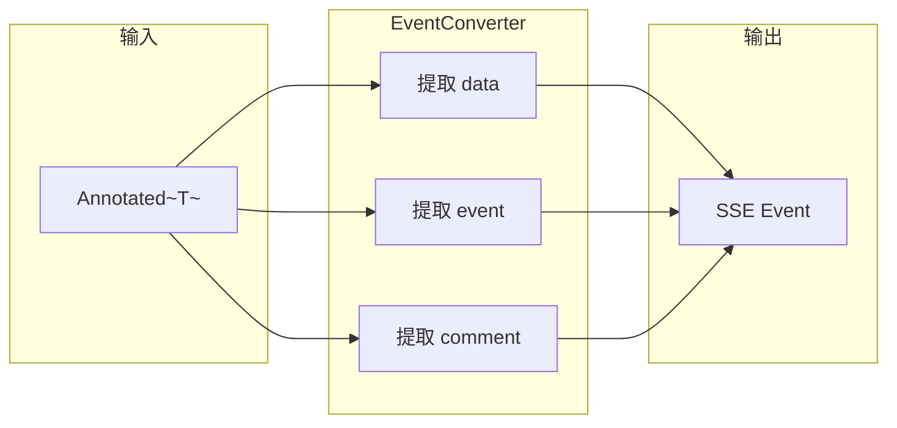
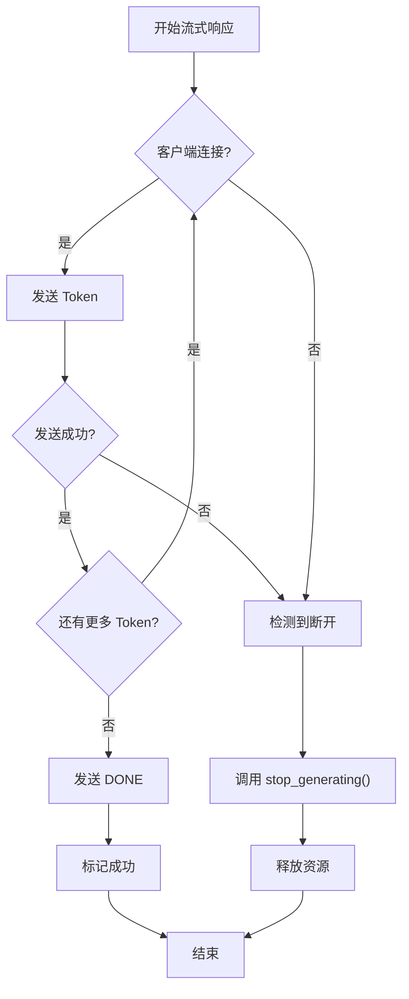
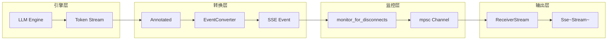
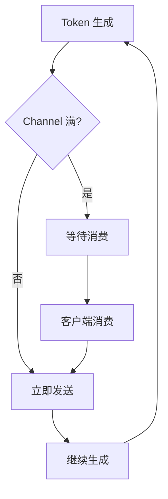

# 流式响应处理

> 本文档详解 Dynamo 的 SSE 流式响应实现，包括事件转换、断开检测和资源管理机制。

---

## 1. SSE 基础

### 1.1 Server-Sent Events 协议

SSE 是 HTML5 规范的一部分，用于服务端向客户端推送事件：

```http
HTTP/1.1 200 OK
Content-Type: text/event-stream
Cache-Control: no-cache
Connection: keep-alive

data: {"content": "Hello"}

data: {"content": " World"}

data: [DONE]
```

### 1.2 事件格式

| 字段 | 说明 | 示例 |
|------|------|------|
| `data:` | 数据内容 | `data: {"text": "hi"}` |
| `event:` | 事件类型 | `event: message` |
| `id:` | 事件 ID | `id: 123` |
| `retry:` | 重连间隔 | `retry: 3000` |
| `:` | 注释 | `: keep-alive` |

---

## 2. 事件转换

### 2.1 EventConverter

```rust
struct EventConverter<T>(Annotated<T>);

impl<T> From<Annotated<T>> for EventConverter<T> {
    fn from(annotated: Annotated<T>) -> Self {
        EventConverter(annotated)
    }
}

/// 将 Annotated 转换为 SSE Event
impl<T: Serialize> TryFrom<EventConverter<T>> for Event {
    type Error = axum::Error;

    fn try_from(annotated: EventConverter<T>) -> Result<Self, Self::Error> {
        let annotated = annotated.0;
        let mut event = Event::default();

        // 设置 data 字段
        if let Some(data) = annotated.data {
            event = event.json_data(data)?;
        }

        // 设置 event 字段（错误处理）
        if let Some(msg) = annotated.event {
            if msg == "error" {
                let msgs = annotated
                    .comment
                    .unwrap_or_else(|| vec!["unspecified error".to_string()]);
                return Err(axum::Error::new(msgs.join(" -- ")));
            }
            event = event.event(msg);
        }

        // 设置注释
        if let Some(comments) = annotated.comment {
            for comment in comments {
                event = event.comment(comment);
            }
        }

        Ok(event)
    }
}
```

### 2.2 Annotated 结构

```rust
/// 带注解的响应
pub struct Annotated<T> {
    pub data: Option<T>,        // 数据内容
    pub event: Option<String>,  // 事件类型
    pub comment: Option<Vec<String>>,  // 注释
}
```

### 2.3 转换流程



---

## 3. 断开检测与取消

### 3.1 检测机制

当客户端断开连接时，需要：
1. 检测断开事件
2. 通知后端停止生成
3. 释放计算资源

### 3.2 实现代码

```rust
/// 监控客户端断开并传播取消信号
async fn monitor_for_disconnects(
    stream: Pin<Box<dyn Stream<Item = Result<Event, axum::Error>> + Send>>,
    context: Arc<dyn AsyncEngineContext>,
    inflight: InflightGuard,
) -> ReceiverStream<Result<Event, axum::Error>> {
    let (tx, rx) = tokio::sync::mpsc::channel(8);

    tokio::spawn(async move {
        let mut inflight = inflight;
        let mut stream = stream;

        while let Some(event) = stream.next().await {
            let event = match event {
                Ok(event) => Ok(event),
                Err(err) => Ok(Event::default()
                    .event("error")
                    .comment(err.to_string())),
            };

            // 如果发送失败，说明客户端已断开
            if (tx.send(event).await).is_err() {
                tracing::trace!("Forwarding SSE stream was dropped; breaking loop");
                // 通知后端停止生成
                context.stop_generating();
                break;
            }
        }

        // 流正常完成，发送 [DONE] 并标记成功
        if tx.send(Ok(Event::default().data("[DONE]"))).await.is_ok() {
            inflight.mark_ok();
        }
    });

    ReceiverStream::new(rx)
}
```

### 3.3 断开处理流程



### 3.4 AsyncEngineContext 接口

```rust
/// 异步引擎上下文接口
pub trait AsyncEngineContext: Send + Sync {
    /// 停止生成
    fn stop_generating(&self);

    /// 检查是否已停止
    fn is_stopped(&self) -> bool;
}
```

---

## 4. Keep-Alive 机制

### 4.1 为什么需要 Keep-Alive

长时间生成过程中，需要防止连接超时：

| 问题 | 解决方案 |
|------|----------|
| 代理超时 | 定期发送心跳 |
| 连接断开 | Keep-Alive 包 |
| 客户端等待 | 减少等待焦虑 |

### 4.2 Axum SSE Keep-Alive

```rust
// 使用 Axum 的 SSE Keep-Alive
Ok(Sse::new(stream)
    .keep_alive(KeepAlive::default())
    .into_response())
```

Keep-Alive 默认配置：

| 参数 | 默认值 |
|------|--------|
| 间隔 | 15 秒 |
| 内容 | 空注释 (`:`) |

### 4.3 Keep-Alive 格式

```
: keep-alive

data: {"content": "token1"}

: keep-alive

data: {"content": "token2"}
```

---

## 5. 流式响应管道

### 5.1 完整管道



### 5.2 代码组装

```rust
async fn chat_completions(...) -> Result<Response, ...> {
    // 1. 调用引擎获取流
    let stream = engine.generate(request).await?;

    // 2. 获取上下文用于取消
    let ctx = stream.context();

    // 3. 转换为 SSE 事件流
    let sse_stream = stream.map(|response| {
        Event::try_from(EventConverter::from(response))
    });

    // 4. 添加断开检测
    let monitored = monitor_for_disconnects(
        sse_stream.boxed(),
        ctx,
        inflight
    ).await;

    // 5. 返回 SSE 响应
    Ok(Sse::new(monitored)
        .keep_alive(KeepAlive::default())
        .into_response())
}
```

---

## 6. 错误处理

### 6.1 流中的错误

```rust
impl<T: Serialize> TryFrom<EventConverter<T>> for Event {
    fn try_from(annotated: EventConverter<T>) -> Result<Self, Self::Error> {
        // 检查是否是错误事件
        if let Some(msg) = annotated.event {
            if msg == "error" {
                let msgs = annotated.comment
                    .unwrap_or_else(|| vec!["unspecified error".to_string()]);
                return Err(axum::Error::new(msgs.join(" -- ")));
            }
        }
        // ...
    }
}
```

### 6.2 错误转换

```rust
// monitor_for_disconnects 中的错误处理
while let Some(event) = stream.next().await {
    let event = match event {
        Ok(event) => Ok(event),
        // 将错误转换为 SSE 错误事件
        Err(err) => Ok(Event::default()
            .event("error")
            .comment(err.to_string())),
    };
    // ...
}
```

### 6.3 错误事件格式

```
event: error
: Internal server error: model unavailable

data: {"error": "model unavailable"}
```

---

## 7. 性能优化

### 7.1 缓冲策略

```rust
// 使用有界 channel 防止背压
let (tx, rx) = tokio::sync::mpsc::channel(8);
```

| 参数 | 值 | 说明 |
|------|-----|------|
| 缓冲大小 | 8 | 平衡内存和延迟 |

### 7.2 背压处理



### 7.3 零拷贝序列化

```rust
// 使用 json_data 直接序列化到输出
event = event.json_data(data)?;
```

---

## 8. 客户端使用

### 8.1 JavaScript（EventSource）

```javascript
const eventSource = new EventSource('/v1/chat/completions', {
    method: 'POST',
    headers: { 'Content-Type': 'application/json' },
    body: JSON.stringify({
        model: 'llama-3-70b',
        messages: [{role: 'user', content: 'Hello'}],
        stream: true
    })
});

eventSource.onmessage = (event) => {
    if (event.data === '[DONE]') {
        eventSource.close();
        return;
    }
    const data = JSON.parse(event.data);
    console.log(data.choices[0].delta.content);
};

eventSource.onerror = (error) => {
    console.error('Stream error:', error);
    eventSource.close();
};
```

### 8.2 Python（requests）

```python
import requests
import json

response = requests.post(
    'http://localhost:8080/v1/chat/completions',
    json={
        'model': 'llama-3-70b',
        'messages': [{'role': 'user', 'content': 'Hello'}],
        'stream': True
    },
    stream=True
)

for line in response.iter_lines():
    if line:
        line = line.decode('utf-8')
        if line.startswith('data: '):
            data = line[6:]
            if data == '[DONE]':
                break
            chunk = json.loads(data)
            content = chunk['choices'][0]['delta'].get('content', '')
            print(content, end='', flush=True)
```

---

## 总结

Dynamo 流式响应的核心机制：

| 机制 | 实现 |
|------|------|
| 事件格式 | SSE (Server-Sent Events) |
| 事件转换 | EventConverter |
| 断开检测 | mpsc channel 发送失败 |
| 资源释放 | AsyncEngineContext.stop_generating() |
| Keep-Alive | Axum SSE 内置支持 |

这套机制确保了流式响应的可靠性和资源效率。

---

## 参考文件

- [lib/llm/src/http/service/openai.rs](../../../lib/llm/src/http/service/openai.rs) - SSE 实现
- [lib/llm/src/http/service/sse.rs](../../../lib/llm/src/http/service/sse.rs) - SSE 工具
