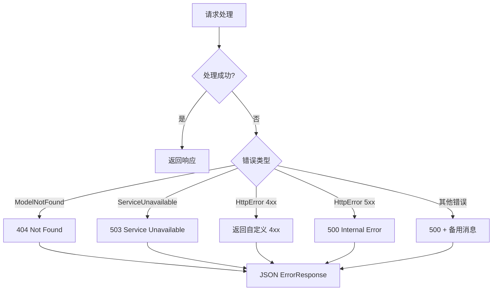
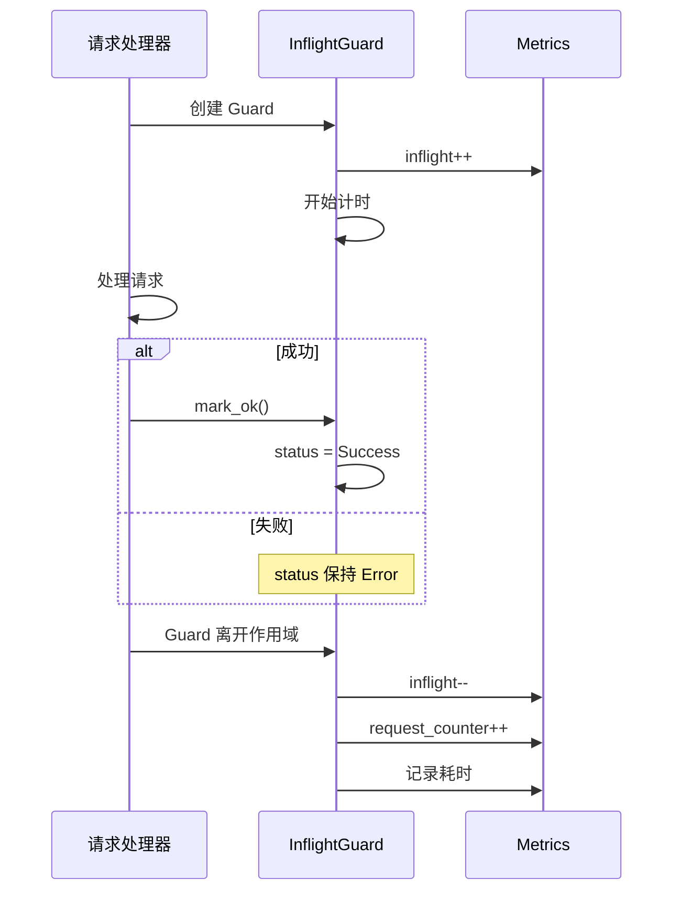

# 错误处理与指标监控

> 本文档详解 Dynamo HTTP 层的错误处理机制和 Prometheus 指标监控实现。

---

## 1. 错误类型定义

### 1.1 ServiceHttpError

```rust
// lib/llm/src/http/service/error.rs

#[derive(Debug, Error)]
pub enum ServiceHttpError {
    #[error("Model not found: {0}")]
    ModelNotFound(String),

    #[error("Model already exists: {0}")]
    ModelAlreadyExists(String),
}
```

### 1.2 HttpError

```rust
/// 用于自定义 HTTP 错误码
#[derive(Debug, Error)]
#[error("HTTP Error {code}: {message}")]
pub struct HttpError {
    pub code: u16,
    pub message: String,
}

impl HttpError {
    pub fn new(code: u16, message: impl Into<String>) -> Self {
        HttpError {
            code,
            message: message.into(),
        }
    }

    pub fn bad_request(message: impl Into<String>) -> Self {
        HttpError::new(400, message)
    }

    pub fn not_found(message: impl Into<String>) -> Self {
        HttpError::new(404, message)
    }

    pub fn internal_error(message: impl Into<String>) -> Self {
        HttpError::new(500, message)
    }
}
```

---

## 2. 错误响应格式

### 2.1 ErrorResponse 结构

```rust
#[derive(Serialize, Deserialize)]
pub struct ErrorResponse {
    error: String,
}
```

### 2.2 错误工厂方法

```rust
impl ErrorResponse {
    /// 404 模型未找到
    pub fn model_not_found() -> (StatusCode, Json<ErrorResponse>) {
        (
            StatusCode::NOT_FOUND,
            Json(ErrorResponse {
                error: "Model not found".to_string(),
            }),
        )
    }

    /// 503 服务不可用
    pub fn service_unavailable() -> (StatusCode, Json<ErrorResponse>) {
        (
            StatusCode::SERVICE_UNAVAILABLE,
            Json(ErrorResponse {
                error: "Service is not ready".to_string(),
            }),
        )
    }

    /// 500 内部服务器错误
    pub fn internal_server_error(msg: &str) -> (StatusCode, Json<ErrorResponse>) {
        tracing::error!("Internal server error: {msg}");
        (
            StatusCode::INTERNAL_SERVER_ERROR,
            Json(ErrorResponse {
                error: msg.to_string(),
            }),
        )
    }

    /// 从 anyhow::Error 转换
    pub fn from_anyhow(
        err: anyhow::Error,
        alt_msg: &str
    ) -> (StatusCode, Json<ErrorResponse>) {
        match err.downcast::<HttpError>() {
            Ok(http_error) => ErrorResponse::from_http_error(http_error),
            Err(err) => ErrorResponse::internal_server_error(
                &format!("{alt_msg}: {err}")
            ),
        }
    }

    /// 从 HttpError 转换（仅允许 4xx 错误）
    pub fn from_http_error(err: HttpError) -> (StatusCode, Json<ErrorResponse>) {
        // 只允许 4xx 客户端错误透传
        if err.code < 400 || err.code >= 500 {
            return ErrorResponse::internal_server_error(&err.message);
        }

        match StatusCode::from_u16(err.code) {
            Ok(code) => (code, Json(ErrorResponse { error: err.message })),
            Err(_) => ErrorResponse::internal_server_error(&err.message),
        }
    }
}
```

### 2.3 错误响应示例

```json
{
  "error": "Model 'unknown-model' not found"
}
```

---

## 3. 错误处理流程

### 3.1 处理器中的错误处理

```rust
async fn chat_completions(
    State(state): State<Arc<DeploymentState>>,
    Json(request): Json<NvCreateChatCompletionRequest>,
) -> Result<Response, (StatusCode, Json<ErrorResponse>)> {
    // 1. 服务就绪检查
    check_ready(&state)?;

    // 2. 获取引擎（可能失败）
    let engine = state
        .get_chat_completions_engine(&request.inner.model)
        .map_err(|_| ErrorResponse::model_not_found())?;

    // 3. 生成（可能失败）
    let stream = engine
        .generate(request)
        .await
        .map_err(|e| ErrorResponse::from_anyhow(e, "Failed to generate"))?;

    // ...
}
```

### 3.2 错误流程图



---

## 4. HTTP 状态码

### 4.1 常用状态码

| 状态码 | 说明 | 触发场景 |
|--------|------|----------|
| 200 | 成功 | 正常响应 |
| 400 | 请求错误 | 参数验证失败 |
| 404 | 未找到 | 模型不存在 |
| 429 | 限流 | 请求过多 |
| 500 | 服务器错误 | 内部异常 |
| 503 | 服务不可用 | 模型未就绪 |

### 4.2 服务就绪检查

```rust
fn check_ready(state: &DeploymentState) -> Result<(), (StatusCode, Json<ErrorResponse>)> {
    if !state.is_ready() {
        return Err(ErrorResponse::service_unavailable());
    }
    Ok(())
}
```

---

## 5. Prometheus 指标

### 5.1 指标定义

```rust
// lib/llm/src/http/service/metrics.rs

pub struct Metrics {
    /// 请求计数器
    request_counter: IntCounterVec,
    /// 在途请求数
    inflight_gauge: IntGaugeVec,
    /// 请求持续时间
    request_duration: HistogramVec,
}

impl Metrics {
    pub fn new(prefix: &str) -> Self {
        // 请求总数（按模型、端点、类型、状态分组）
        let request_counter = IntCounterVec::new(
            Opts::new(
                format!("{}_http_service_requests_total", prefix),
                "Total number of LLM requests processed",
            ),
            &["model", "endpoint", "request_type", "status"],
        ).unwrap();

        // 在途请求数（按模型分组）
        let inflight_gauge = IntGaugeVec::new(
            Opts::new(
                format!("{}_http_service_inflight_requests", prefix),
                "Number of inflight requests",
            ),
            &["model"],
        ).unwrap();

        // 请求持续时间直方图
        let buckets = vec![0.0, 1.0, 2.0, 4.0, 8.0, 16.0, 32.0, 64.0, 128.0, 256.0];
        let request_duration = HistogramVec::new(
            HistogramOpts::new(
                format!("{}_http_service_request_duration_seconds", prefix),
                "Duration of LLM requests",
            ).buckets(buckets),
            &["model"],
        ).unwrap();

        Metrics { request_counter, inflight_gauge, request_duration }
    }
}
```

### 5.2 指标标签

| 指标 | 标签 | 说明 |
|------|------|------|
| `requests_total` | model, endpoint, request_type, status | 请求总数 |
| `inflight_requests` | model | 在途请求数 |
| `request_duration_seconds` | model | 请求耗时分布 |

---

## 6. InflightGuard RAII 模式

### 6.1 Guard 结构

```rust
/// RAII 守卫：自动管理在途计数和请求统计
pub struct InflightGuard {
    metrics: Arc<Metrics>,
    model: String,
    endpoint: Endpoint,
    request_type: RequestType,
    status: Status,
    timer: Instant,
}
```

### 6.2 创建 Guard

```rust
impl InflightGuard {
    fn new(
        metrics: Arc<Metrics>,
        model: String,
        endpoint: Endpoint,
        request_type: RequestType,
    ) -> Self {
        // 启动计时器
        let timer = Instant::now();

        // 增加在途计数
        metrics.inc_inflight_gauge(&model);

        InflightGuard {
            metrics,
            model,
            endpoint,
            request_type,
            status: Status::Error,  // 默认错误，显式标记成功
            timer,
        }
    }

    /// 标记请求成功完成
    pub fn mark_ok(&mut self) {
        self.status = Status::Success;
    }
}
```

### 6.3 Drop 实现

```rust
impl Drop for InflightGuard {
    fn drop(&mut self) {
        // 减少在途计数
        self.metrics.dec_inflight_gauge(&self.model);

        // 增加请求计数
        self.metrics.inc_request_counter(
            &self.model,
            &self.endpoint,
            &self.request_type,
            &self.status,
        );

        // 记录请求持续时间
        self.metrics
            .request_duration
            .with_label_values(&[&self.model])
            .observe(self.timer.elapsed().as_secs_f64());
    }
}
```

### 6.4 RAII 流程



---

## 7. 指标端点

### 7.1 路由注册

```rust
/// 创建指标路由
pub fn router(registry: Registry, path: Option<String>) -> (Vec<RouteDoc>, Router) {
    let registry = Arc::new(registry);
    let path = path.unwrap_or_else(|| "/metrics".to_string());

    let route = Router::new()
        .route(&path, get(handler_metrics))
        .with_state(registry);

    (vec![RouteDoc::new(Method::GET, &path)], route)
}
```

### 7.2 指标处理器

```rust
/// Prometheus 指标处理器
async fn handler_metrics(
    State(registry): State<Arc<Registry>>
) -> impl IntoResponse {
    let encoder = prometheus::TextEncoder::new();
    let metric_families = registry.gather();
    let mut buffer = vec![];

    if encoder.encode(&metric_families, &mut buffer).is_err() {
        return (
            StatusCode::INTERNAL_SERVER_ERROR,
            "Failed to encode metrics"
        ).into_response();
    }

    let metrics = String::from_utf8(buffer)
        .unwrap_or_else(|_| String::from("Failed to encode metrics"));

    (StatusCode::OK, metrics).into_response()
}
```

### 7.3 输出示例

```prometheus
# HELP nv_llm_http_service_requests_total Total number of LLM requests processed
# TYPE nv_llm_http_service_requests_total counter
nv_llm_http_service_requests_total{model="llama-3-70b",endpoint="chat_completions",request_type="stream",status="success"} 1234
nv_llm_http_service_requests_total{model="llama-3-70b",endpoint="chat_completions",request_type="stream",status="error"} 12

# HELP nv_llm_http_service_inflight_requests Number of inflight requests
# TYPE nv_llm_http_service_inflight_requests gauge
nv_llm_http_service_inflight_requests{model="llama-3-70b"} 5

# HELP nv_llm_http_service_request_duration_seconds Duration of LLM requests
# TYPE nv_llm_http_service_request_duration_seconds histogram
nv_llm_http_service_request_duration_seconds_bucket{model="llama-3-70b",le="1"} 100
nv_llm_http_service_request_duration_seconds_bucket{model="llama-3-70b",le="2"} 300
nv_llm_http_service_request_duration_seconds_bucket{model="llama-3-70b",le="4"} 800
nv_llm_http_service_request_duration_seconds_bucket{model="llama-3-70b",le="+Inf"} 1246
nv_llm_http_service_request_duration_seconds_sum{model="llama-3-70b"} 3456.78
nv_llm_http_service_request_duration_seconds_count{model="llama-3-70b"} 1246
```

---

## 8. 监控集成

### 8.1 Prometheus 配置

```yaml
# prometheus.yml
scrape_configs:
  - job_name: 'dynamo-http'
    static_configs:
      - targets: ['localhost:8080']
    metrics_path: '/metrics'
    scrape_interval: 15s
```

### 8.2 Grafana 面板

推荐监控的指标：

| 面板 | PromQL | 说明 |
|------|--------|------|
| QPS | `rate(requests_total[1m])` | 每秒请求数 |
| 错误率 | `rate(requests_total{status="error"}[1m]) / rate(requests_total[1m])` | 错误比例 |
| 在途请求 | `inflight_requests` | 当前处理中的请求 |
| P99 延迟 | `histogram_quantile(0.99, rate(request_duration_seconds_bucket[5m]))` | 99 分位延迟 |

### 8.3 告警规则

```yaml
# alerts.yml
groups:
  - name: dynamo-http
    rules:
      - alert: HighErrorRate
        expr: rate(nv_llm_http_service_requests_total{status="error"}[5m]) > 0.1
        for: 5m
        labels:
          severity: warning
        annotations:
          summary: "High error rate on {{ $labels.model }}"

      - alert: HighLatency
        expr: histogram_quantile(0.99, rate(nv_llm_http_service_request_duration_seconds_bucket[5m])) > 30
        for: 5m
        labels:
          severity: warning
        annotations:
          summary: "High latency on {{ $labels.model }}"
```

---

## 总结

Dynamo HTTP 层的错误处理和监控特性：

| 特性 | 实现 |
|------|------|
| 错误类型 | ServiceHttpError, HttpError |
| 响应格式 | JSON ErrorResponse |
| RAII 指标 | InflightGuard |
| 指标类型 | Counter, Gauge, Histogram |
| 监控集成 | Prometheus 兼容 |

这套机制确保了服务的可观测性和故障排查能力。

---

## 参考文件

- [lib/llm/src/http/service/error.rs](../../../lib/llm/src/http/service/error.rs) - 错误类型定义
- [lib/llm/src/http/service/metrics.rs](../../../lib/llm/src/http/service/metrics.rs) - 指标实现
