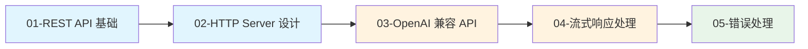
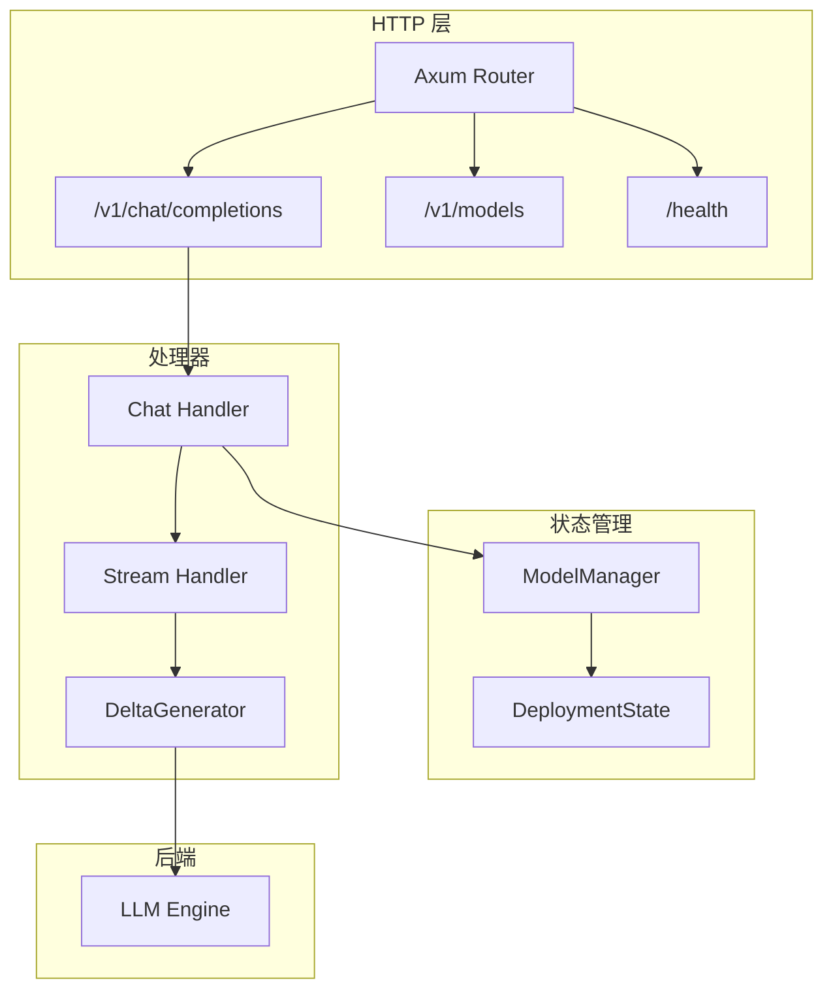

# 第七章：HTTP API 层原理

> Dynamo 的 HTTP API 层提供 OpenAI 兼容的 REST API 接口，支持流式响应和动态模型管理。

## 本章概述

本章深入解析 Dynamo 的 HTTP API 层，包括 REST API 基础、HTTP Server 设计、OpenAI 兼容 API、流式响应处理以及错误处理。

---

## 子文档列表

| 序号 | 文件 | 主题 | 内容简介 |
|------|------|------|----------|
| 1 | [01-rest-api-basics.md](01-rest-api-basics.md) | REST API 基础 | REST 原则、SSE、OpenAI 规范 |
| 2 | [02-http-server-design.md](02-http-server-design.md) | HTTP Server 设计 | Axum、DeploymentState、路由 |
| 3 | [03-openai-compatible-api.md](03-openai-compatible-api.md) | OpenAI 兼容 API | chat/completions、models、nvext |
| 4 | [04-streaming-response.md](04-streaming-response.md) | 流式响应处理 | SSE 实现、断开检测、Token 聚合 |
| 5 | [05-error-handling.md](05-error-handling.md) | 错误处理 | HttpError、响应格式 |

---

## 阅读顺序建议

---

## 关键概念速查

| 概念 | 说明 | 详见文档 |
|------|------|----------|
| **SSE** | Server-Sent Events 流式传输 | [01-rest-api-basics.md](01-rest-api-basics.md) |
| **Axum** | Rust HTTP 框架 | [02-http-server-design.md](02-http-server-design.md) |
| **ModelManager** | 动态模型管理器 | [02-http-server-design.md](02-http-server-design.md) |
| **chat/completions** | 聊天补全 API | [03-openai-compatible-api.md](03-openai-compatible-api.md) |
| **nvext** | NVIDIA 扩展字段 | [03-openai-compatible-api.md](03-openai-compatible-api.md) |
| **DeltaGenerator** | 增量响应生成器 | [04-streaming-response.md](04-streaming-response.md) |

---

## 架构总览

---

## API 端点列表

| 端点 | 方法 | 说明 |
|------|------|------|
| `/v1/chat/completions` | POST | 聊天补全 |
| `/v1/completions` | POST | 文本补全 |
| `/v1/models` | GET | 模型列表 |
| `/v1/models/{id}` | GET | 模型详情 |
| `/health` | GET | 健康检查 |
| `/metrics` | GET | Prometheus 指标 |

---

## 总索引

完成本章阅读后，您已完成 Dynamo 架构分析的全部内容。返回 [总索引](../README.md) 查看完整文档结构。
