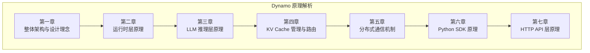

# NVIDIA Dynamo 原理解析

> NVIDIA Dynamo 是一个高吞吐、低延迟的分布式推理框架，专为在多节点环境中服务生成式 AI 和推理模型而设计。

本文档系列深入解析 Dynamo 的架构设计与实现原理，共分为 7 个章节，约 38 篇子文档。

---

## 文档结构

---

## 章节索引

| 章节 | 主题 | 子文档数 | 内容概述 |
|------|------|----------|----------|
| [第一章](01-architecture-overview/README.md) | 整体架构与设计理念 | 5 | LLM 推理基础、行业痛点、设计理念、系统架构、部署模式 |
| [第二章](02-runtime-layer/README.md) | 运行时层原理 | 6 | 异步编程、分布式基础、Runtime 设计、Component 系统、Pipeline、服务发现 |
| [第三章](03-llm-inference-layer/README.md) | LLM 推理层原理 | 6 | 推理引擎、vLLM、多引擎抽象、Worker 设计、Disaggregated Serving、请求处理 |
| [第四章](04-kv-cache-system/README.md) | KV Cache 管理与路由 | 6 | KV Cache 原理、优化技术、KV-Aware Router、RadixTree、Manager、事件系统 |
| [第五章](05-distributed-communication/README.md) | 分布式通信机制 | 6 | 通信基础、三平面架构、etcd、NATS、NIXL、TCP Pipeline |
| [第六章](06-python-sdk/README.md) | Python SDK 原理 | 5 | Rust-Python 互操作、PyO3、服务装饰器、DynamoService、CLI |
| [第七章](07-http-api-layer/README.md) | HTTP API 层原理 | 5 | REST API、HTTP Server、OpenAI API、流式响应、错误处理 |

---

## 阅读路径推荐

### 新手路径

从基础知识开始，逐步深入：

1. **理解背景** → 第一章（LLM 推理基础、行业痛点）
2. **掌握核心** → 第二章（Runtime）+ 第三章（推理层）
3. **深入特性** → 第四章（KV Cache）+ 第五章（通信）
4. **实践开发** → 第六章（Python SDK）+ 第七章（HTTP API）

### 快速上手路径

快速了解系统架构和使用方式：

1. 第一章：[04-系统架构总览](01-architecture-overview/04-system-architecture.md) + [05-部署模式](01-architecture-overview/05-deployment-modes.md)
2. 第三章：[04-Worker 设计](03-llm-inference-layer/04-worker-design.md)
3. 第六章：[03-服务装饰器](06-python-sdk/03-service-decorators.md)

### 性能优化路径

关注性能相关的核心技术：

1. 第三章：[05-Disaggregated Serving](03-llm-inference-layer/05-disaggregated-serving.md)
2. 第四章：[03-KV-Aware Router](04-kv-cache-system/03-kv-aware-router.md)
3. 第五章：[05-NIXL 传输](05-distributed-communication/05-nixl-data-transfer.md)

---

## 核心概念速查

### 架构概念

| 概念 | 说明 | 章节 |
|------|------|------|
| Namespace | 命名空间，逻辑隔离 | 第二章 |
| Component | 组件，可部署的服务单元 | 第二章 |
| Endpoint | 端点，可调用的服务接口 | 第二章 |
| Pipeline | 数据流处理管道 | 第二章 |

### 推理概念

| 概念 | 说明 | 章节 |
|------|------|------|
| Prefill | 首次计算，处理输入 prompt | 第一章、第三章 |
| Decode | 增量生成，逐 token 输出 | 第一章、第三章 |
| KV Cache | 存储历史 Key/Value | 第一章、第四章 |
| PagedAttention | vLLM 的分页 KV 管理 | 第三章、第四章 |

### 分布式概念

| 概念 | 说明 | 章节 |
|------|------|------|
| 控制平面 | etcd，服务注册发现 | 第五章 |
| 事件平面 | NATS，事件发布订阅 | 第五章 |
| 数据平面 | NIXL，高性能 KV 传输 | 第五章 |

---

## Mermaid 图表说明

本文档系列大量使用 Mermaid 图表，请确保您的 Markdown 渲染器支持 Mermaid。常用图表类型：

- `graph TB/LR`：流程图
- `sequenceDiagram`：时序图
- `stateDiagram-v2`：状态图
- `classDiagram`：类图
- `flowchart`：流程图

---

## 版本信息

- 文档版本：1.0
- 适用 Dynamo 版本：最新 main 分支
- 最后更新：2025-01

---

## 贡献指南

如发现文档错误或有改进建议，欢迎提交 Issue 或 PR。

## 参考资料

1. [Dynamo 官方文档](https://github.com/ai-dynamo/dynamo)
2. [vLLM: Easy, Fast, and Cheap LLM Serving](https://arxiv.org/abs/2309.06180)
3. [DistServe: Disaggregating Prefill and Decoding](https://arxiv.org/abs/2401.09670)
4. [SGLang: Efficient Execution of Structured Language Model Programs](https://arxiv.org/abs/2312.07104)
5. [Attention Is All You Need](https://arxiv.org/abs/1706.03762)
