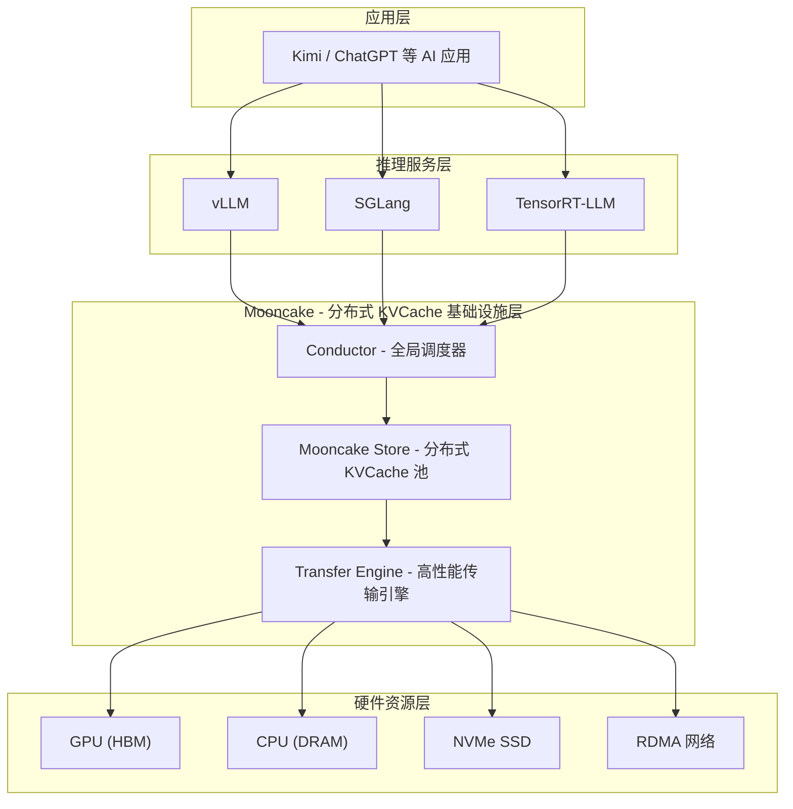
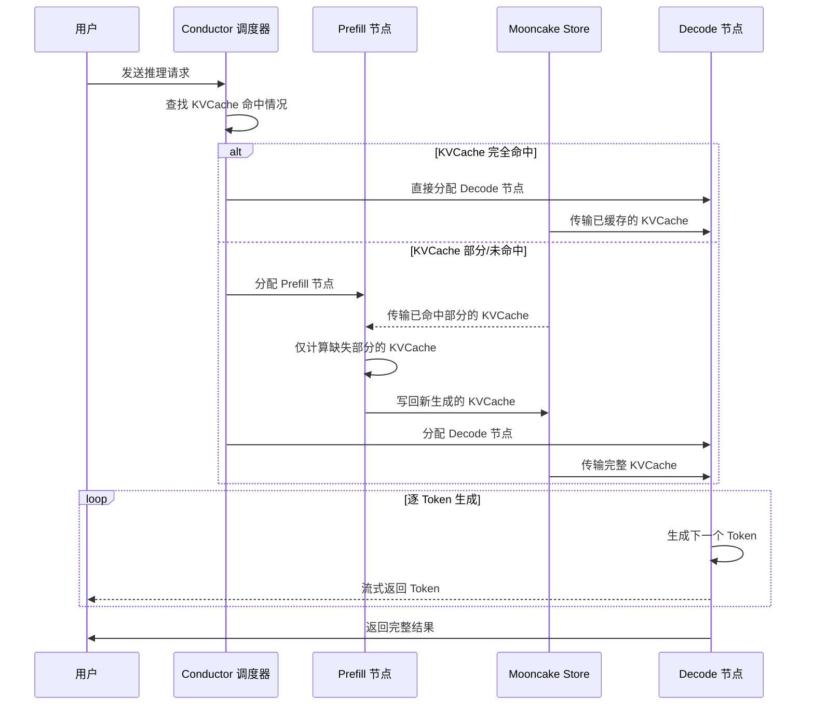

# 什么是 Mooncake

[目录](../README.md) | [下一篇: 核心概念详解](02-core-concepts.md)

---

> **一句话概括**: Mooncake 是一个以 KVCache 为中心的分离式 LLM 推理服务平台，通过"用存储换计算"的核心思想，大幅提升大语言模型推理效率。

---

## 1. Mooncake 解决什么问题

### 1.1 大语言模型推理的困境

大语言模型（LLM）正在改变我们与 AI 交互的方式。然而，在实际的生产环境中，运行这些模型面临着巨大的挑战：

- **计算成本高昂**: 每次推理请求都需要占用昂贵的 GPU 资源，GPU 集群的采购与运维成本极高
- **KVCache 占用大量显存**: 在 Transformer 模型推理过程中，为了避免重复计算，需要缓存中间状态（即 KVCache）。以 LLaMA3-70B 模型为例，每个 Token 对应的 KVCache 约 320KB，一个 128K 上下文窗口的请求将占用约 40GB 显存
- **资源利用率不均衡**: 推理过程包含 Prefill（预填充）和 Decode（解码）两个阶段，前者是计算密集型，后者是内存密集型，两者混合部署时会相互干扰，导致 GPU 利用率低下

### 1.2 现有方案的局限

传统的 LLM 推理系统（如单纯使用 vLLM、TensorRT-LLM 等推理引擎）将 Prefill 和 Decode 耦合在同一 GPU 上，存在以下问题：

| 问题 | 影响 |
|------|------|
| Prefill 阶段大量占用计算资源 | Decode 阶段延迟增加，用户感知到"卡顿" |
| 每个请求独立计算 KVCache | 相同前缀的请求重复计算，浪费计算资源 |
| KVCache 仅存在于本地 GPU 显存 | 无法跨节点共享，限制了调度灵活性 |
| GPU 显存容量有限 | 能同时服务的请求数量受限 |

### 1.3 Mooncake 的解法

Mooncake 的核心创新在于将 KVCache 从"GPU 本地状态"提升为"全集群共享资源"。它利用集群中所有节点的 DRAM 和 SSD 构建一个 PB 级的分布式 KVCache 存储池，结合高性能传输引擎，使得任何节点都可以快速获取所需的 KVCache，从而避免重复计算，并实现 Prefill 与 Decode 的解耦。

---

## 2. "用存储换计算" 核心思想

### 2.1 一个直观的类比

想象一座城市的图书馆系统：

> **传统方式（无共享 KVCache）**: 每位读者需要自己抄写一份完整的书稿才能阅读。如果 100 位读者想阅读同一本书，就需要抄写 100 遍 -- 这就是"重复计算"。
>
> **Mooncake 方式（共享 KVCache）**: 图书馆保存一份书稿，所有读者都可以直接借阅。新读者只需花少量时间到图书馆取书（高速传输），而不需要自己重新抄写（重新计算）。

这就是"**用存储换计算**"（Trading More Storage for Less Computation）的核心思想：

- **存储**: 利用集群中富余的 DRAM 和 SSD 空间存储 KVCache
- **换取**: 通过高速网络（RDMA）在节点间传输 KVCache
- **计算**: 避免相同内容的重复 Prefill 计算

### 2.2 为什么这种取舍是合理的

| 资源类型 | 成本对比 | 说明 |
|----------|----------|------|
| GPU 计算 | 极高 | A100/H100 GPU 价格昂贵，供不应求 |
| CPU DRAM | 较低 | 每 GB 成本远低于 GPU HBM |
| NVMe SSD | 很低 | 存储密度高，成本极低 |
| RDMA 网络 | 中等 | 数据中心已有基础设施，传输速度可达 400Gbps |

在实际的大规模 LLM 服务集群中，CPU 内存和 SSD 通常存在大量闲置容量，而 GPU 则是最稀缺的资源。Mooncake 正是利用了这种资源不对称性，用廉价的存储和网络换取了宝贵的 GPU 计算资源。

---

## 3. Mooncake 在 LLM Serving 生态中的定位

Mooncake 并非要替代现有的推理引擎，而是在其下方提供了一层分布式 KVCache 基础设施，与推理引擎形成互补。

### 3.1 各层的职责

| 层级 | 代表项目 | 主要职责 |
|------|----------|----------|
| 应用层 | Kimi, ChatGPT | 面向终端用户的 AI 产品 |
| 推理服务层 | vLLM, SGLang, TensorRT-LLM | 模型加载、Attention 计算、Batching 策略 |
| **KVCache 基础设施层** | **Mooncake** | **跨节点 KVCache 存储、传输、调度** |
| 硬件资源层 | GPU, DRAM, SSD, RDMA | 底层计算、存储和网络硬件 |

### 3.2 与推理引擎的关系

Mooncake 已经与多个主流推理引擎完成了集成：

- **vLLM**: 通过 Mooncake 集成层，vLLM 可以利用 Mooncake 的分布式 KVCache 实现 P/D 分离
- **SGLang**: 类似地支持与 SGLang 集成，提供 KVCache 共享能力
- **自定义引擎**: Mooncake 提供 C++ 和 Python API，支持与任意推理框架对接

---

## 4. FAST 2025 Best Paper

### 4.1 学术殊荣

Mooncake 论文"**Mooncake: Trading More Storage for Less Computation -- A KVCache-Centric Disaggregated Architecture for LLM Serving**"荣获 **USENIX FAST 2025 最佳论文奖**。

FAST (File and Storage Technologies) 是存储系统领域的国际顶级学术会议，Best Paper 的含金量极高。Mooncake 获此殊荣，标志着"以 KVCache 为中心的分离式架构"在学术界获得了高度认可。

### 4.2 生产验证

Mooncake 不仅是一篇学术论文，更是经过大规模生产环境验证的系统：

- **Kimi 服务**: Mooncake 是 Moonshot AI 旗下 Kimi 智能助手的底层推理服务平台
- **规模**: 数千节点集群，日均处理 **1000 亿+** Token
- **性能提升**: 在严格 SLO（Service Level Objective）约束下，相比 vLLM 基线系统实现了高达 **525%** 的吞吐量提升（75% 的请求为 Cache 命中时）
- **开源**: 核心代码已开源至 [GitHub](https://github.com/kvcache-ai/Mooncake)，社区持续活跃

---

## 5. 一个请求的完整生命周期

下面用一个简化的时序图展示用户请求在 Mooncake 系统中的处理流程：

**关键观察**:
1. **KVCache 命中**: 如果之前有类似请求处理过，其 KVCache 已存储在 Mooncake Store 中，后续请求可以直接复用，跳过 Prefill 阶段
2. **P/D 分离**: Prefill 和 Decode 运行在不同的 GPU 节点上，互不干扰
3. **流式返回**: Decode 阶段逐个生成 Token 并实时返回给用户

---

## 6. 关键术语表

| 术语 | 英文全称 | 简要说明 |
|------|----------|----------|
| **KVCache** | Key-Value Cache | Transformer 推理过程中缓存的注意力机制中间状态，避免重复计算已处理的 Token |
| **Prefill** | Prefill Phase | 推理的第一阶段，处理所有输入 Token，生成完整的 KVCache，计算密集型 |
| **Decode** | Decode Phase | 推理的第二阶段，基于 KVCache 逐个生成输出 Token，内存密集型 |
| **RDMA** | Remote Direct Memory Access | 远程直接内存访问，允许网卡直接读写远程节点内存，绕过 CPU，延迟极低 |
| **Transfer Engine** | - | Mooncake 的高性能数据传输引擎，支持 RDMA/TCP，实现跨节点高速数据搬运 |
| **Mooncake Store** | - | Mooncake 的分布式 KVCache 存储引擎，利用集群 DRAM 和 SSD 构建 PB 级缓存池 |
| **Conductor** | - | Mooncake 的全局调度器，负责请求路由、KVCache 命中查找和负载均衡 |
| **P/D Disaggregation** | Prefill/Decode Disaggregation | 将 Prefill 和 Decode 阶段部署在不同的 GPU 节点上，消除相互干扰 |

---

## 下一步

理解了 Mooncake 的基本概念和定位后，接下来深入了解各个核心组件的工作原理：

> [下一篇: 核心概念详解](02-core-concepts.md) -- 详细讲解 KVCache、P/D 分离、Transfer Engine 和 Mooncake Store 等核心概念。
