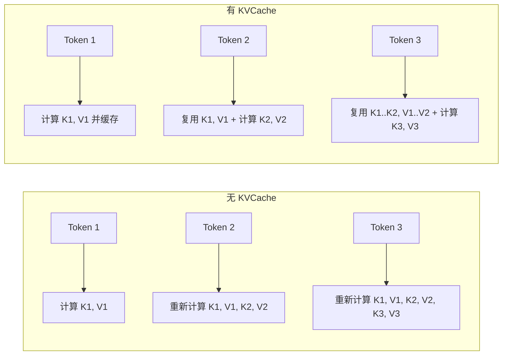
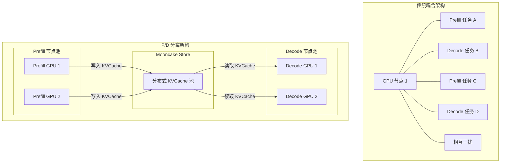
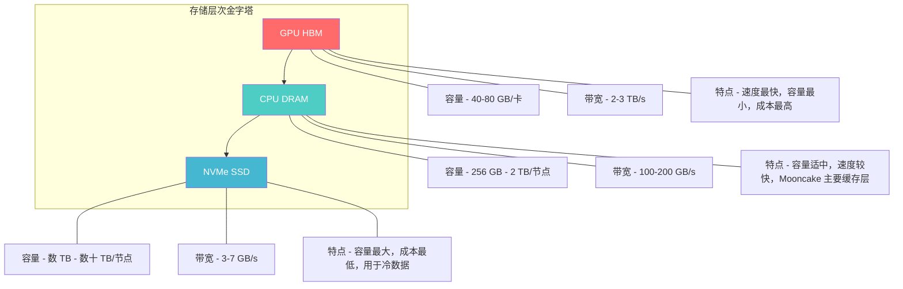
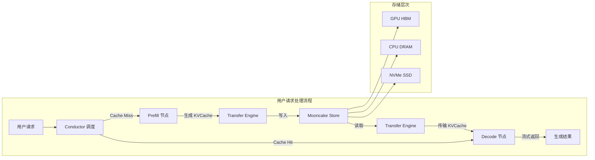

# 核心概念详解

[上一篇: 什么是 Mooncake](01-what-is-mooncake.md) | [目录](../README.md) | [下一篇: 快速上手教程](03-quick-start-tutorial.md)

---

> 本篇将深入讲解 Mooncake 涉及的核心概念，帮助读者建立对系统各组件的直觉理解。

---

## 1. KVCache 通俗解读

### 1.1 为什么需要 KVCache

在 Transformer 架构中，Self-Attention 机制需要计算每个 Token 与之前所有 Token 之间的关系。如果没有缓存，每生成一个新 Token，都需要对所有历史 Token 重新计算 Key 和 Value 向量 -- 这意味着生成 100 个 Token，第 100 个 Token 需要对前 99 个 Token 全部重新计算一遍。

**KVCache 的作用**就是将已经计算过的 Key 和 Value 向量缓存下来，后续生成新 Token 时直接复用，避免重复计算。



### 1.2 KVCache 有多大

以 LLaMA3-70B 模型为例，我们来具体计算 KVCache 的大小：

| 参数 | 值 |
|------|------|
| 模型层数 (num_layers) | 80 |
| 注意力头数 (num_kv_heads) | 8 (GQA) |
| 每头维度 (head_dim) | 128 |
| 数据精度 | FP16 (2 bytes) |

**单个 Token 的 KVCache 大小**:

```
= num_layers x num_kv_heads x head_dim x 2(K+V) x 2(FP16)
= 80 x 8 x 128 x 2 x 2
= 327,680 bytes ≈ 320 KB
```

**不同上下文长度对应的 KVCache 总大小**:

| 上下文长度 | KVCache 大小 | 相当于 |
|-----------|-------------|--------|
| 4K tokens | 1.25 GB | 一块中端显卡的 1/10 显存 |
| 32K tokens | 10 GB | 一块 A100 (40GB) 的 1/4 |
| 128K tokens | 40 GB | 一块 A100 (40GB) 的全部显存 |
| 1M tokens | 320 GB | 需要 4 块 A100 (80GB) |

可以看到，随着上下文窗口的增长，KVCache 的显存占用迅速膨胀，成为 LLM 推理的核心瓶颈之一。这正是 Mooncake 要解决的问题 -- 将 KVCache 从有限的 GPU 显存"溢出"到集群中更充裕的 DRAM 和 SSD 中。

---

## 2. Prefill vs Decode 阶段对比

LLM 推理过程分为两个截然不同的阶段，理解它们的差异是理解 P/D 分离架构的关键。

### 2.1 Prefill 阶段（预填充）

- **输入**: 用户的完整 Prompt（可能包含数千到数十万个 Token）
- **过程**: 一次性并行处理所有输入 Token，计算每一层的 Key 和 Value
- **输出**: 完整的 KVCache + 第一个生成的 Token
- **特点**: **计算密集型** -- GPU 算力被充分利用，显存带宽不是瓶颈

### 2.2 Decode 阶段（解码）

- **输入**: 上一步生成的 Token + 已有的 KVCache
- **过程**: 每次仅处理 1 个新 Token，但需要读取完整 KVCache
- **输出**: 下一个 Token
- **特点**: **内存密集型** -- 每步计算量小，但需要从显存读取大量 KVCache 数据

### 2.3 特性对比表

| 维度 | Prefill 阶段 | Decode 阶段 |
|------|-------------|------------|
| 处理 Token 数量 | 成百上千（批量） | 每次仅 1 个 |
| 计算强度 | 高（矩阵乘法为主） | 低（向量-矩阵乘法） |
| 显存访问模式 | 计算密集，高算术强度 | 内存密集，低算术强度 |
| GPU 利用率 | 高（接近峰值算力） | 低（受限于显存带宽） |
| 延迟特征 | 单次耗时长，但只需执行一次 | 单次耗时短，但需执行上百次 |
| SLO 约束 | TTFT（首 Token 延迟） | TBT（Token 间延迟） |
| 资源瓶颈 | GPU FLOPs | GPU 显存带宽 |

### 2.4 为什么混合部署有问题

当 Prefill 和 Decode 在同一 GPU 上混合运行时：

- Prefill 的大量矩阵计算会**抢占** GPU 算力，导致同一 GPU 上的 Decode 任务延迟增加
- Decode 需要大量显存存放 KVCache，**挤压**了 Prefill 可用的 Batch Size
- 两种任务的显存访问模式冲突，导致**缓存命中率下降**

这就像在一条车道上同时跑大型货车（Prefill）和小轿车（Decode），互相干扰导致整体效率低下。

---

## 3. P/D 分离架构

### 3.1 核心思想

P/D 分离（Prefill/Decode Disaggregation）的核心思想很简单：**让 Prefill 和 Decode 运行在不同的 GPU 节点上**。

- **Prefill 节点**: 配备高算力 GPU，专注于处理输入 Prompt 并生成 KVCache
- **Decode 节点**: 配备大显存 GPU，专注于利用 KVCache 逐个生成输出 Token



### 3.2 P/D 分离的关键挑战

分离架构带来的核心挑战是：**如何在 Prefill 完成后，将 KVCache 高效地传输到 Decode 节点？**

以 LLaMA3-70B、32K 上下文为例：
- KVCache 大小约 10GB
- 如果使用普通 TCP 网络（25Gbps），传输需要 **3.2 秒** -- 这比用户能容忍的首 Token 延迟要长得多
- 如果使用 RDMA 网络（200Gbps），传输仅需 **0.4 秒** -- 可以满足生产要求

这正是 Mooncake Transfer Engine 要解决的问题。

### 3.3 分离带来的收益

| 收益 | 说明 |
|------|------|
| 消除资源干扰 | Prefill 和 Decode 独立运行，互不影响 |
| 独立弹性伸缩 | 可以根据流量特征独立调整 Prefill/Decode 节点数量 |
| 异构硬件适配 | Prefill 节点可以用高算力卡，Decode 节点可以用大显存卡 |
| KVCache 复用 | 不同请求的公共前缀 KVCache 可以跨节点共享 |

---

## 4. Transfer Engine 功能概述

Transfer Engine 是 Mooncake 的高性能数据传输引擎，负责在集群节点之间搬运 KVCache 和其他数据。

### 4.1 核心能力

- **高速传输**: 支持 RDMA（InfiniBand / RoCE）和 TCP 协议，单节点可达 200Gbps+ 吞吐
- **零拷贝**: 通过 RDMA 实现 GPU 显存到远程节点的直接数据传输，无需经过 CPU
- **拓扑感知**: 自动发现网络拓扑（RDMA 网卡与 GPU 的亲和性），选择最优传输路径
- **多协议支持**: 同时支持 RDMA 和 TCP，可在不同网络环境中灵活使用
- **内存注册管理**: 自动管理 RDMA Memory Region 的注册与生命周期

### 4.2 在系统中的角色

Transfer Engine 是整个 Mooncake 系统的"血管"，所有 KVCache 数据的跨节点流动都依赖它：

- Prefill 节点完成计算后，通过 Transfer Engine 将 KVCache 写入 Mooncake Store
- Decode 节点开始工作前，通过 Transfer Engine 从 Mooncake Store 拉取 KVCache
- 节点之间的点对点数据传输也通过 Transfer Engine 完成

### 4.3 传输方式对比

| 传输方式 | 带宽 | 延迟 | CPU 开销 | 适用场景 |
|----------|------|------|---------|---------|
| TCP | 10-25 Gbps | 较高 | 高 | 开发测试、无 RDMA 环境 |
| RDMA (RoCE) | 100-200 Gbps | 极低 | 极低 | 生产环境、以太网数据中心 |
| RDMA (InfiniBand) | 200-400 Gbps | 极低 | 极低 | 高性能计算集群 |

---

## 5. Mooncake Store 功能概述

Mooncake Store 是 Mooncake 的分布式 KVCache 存储引擎，它将集群中所有节点的 CPU DRAM 和 NVMe SSD 汇聚成一个统一的 KVCache 缓存池。

### 5.1 核心能力

- **分布式存储**: 跨节点统一管理 KVCache，容量可达 PB 级
- **多层存储**: 支持 GPU HBM、CPU DRAM、NVMe SSD 三级存储层次
- **KV 语义感知**: 理解 KVCache 的结构（按层、按 Token 组织），支持细粒度缓存管理
- **缓存策略**: 基于 LRU 等策略自动淘汰过期 KVCache
- **前缀匹配**: 支持高效的 KVCache 前缀匹配，最大化缓存命中率

### 5.2 存储层次



### 5.3 使用模式

Mooncake Store 提供简洁的 Key-Value 接口：

- **Put(key, value)**: 将 KVCache 数据写入存储池
- **Get(key)**: 从存储池中读取 KVCache 数据
- **前缀查询**: 查找与请求 Prompt 具有最长公共前缀的已缓存 KVCache

---

## 6. 分布式缓存心智模型

### 6.1 类比 CDN

如果你熟悉 Web 开发中的 CDN（内容分发网络），那么理解 Mooncake Store 就会很直观：

| CDN 概念 | Mooncake Store 对应 |
|----------|-------------------|
| 源站（Origin Server） | Prefill 节点（计算并生成 KVCache） |
| CDN 边缘节点 | 各节点的 DRAM / SSD 缓存 |
| 缓存内容 | KVCache 数据 |
| 缓存 Key | Prompt 的 Token 序列前缀 |
| Cache Hit | 请求的 Prompt 前缀命中已缓存的 KVCache |
| Cache Miss | 需要 Prefill 节点重新计算 KVCache |
| 缓存淘汰 | LRU 策略自动清理不常用的 KVCache |

### 6.2 核心理念

就像 CDN 让全球用户都能快速获取静态资源一样，Mooncake Store 让集群中的任何 Decode 节点都能快速获取所需的 KVCache：

1. **首次计算**: 用户发送一个新的 Prompt，Prefill 节点计算 KVCache 并存入 Mooncake Store
2. **缓存命中**: 后续相同或相似前缀的请求，直接从 Mooncake Store 获取已有的 KVCache，跳过重复计算
3. **就近获取**: KVCache 可以缓存在距离 Decode 节点最近的内存中，最小化传输延迟
4. **自动淘汰**: 当存储空间不足时，自动清理最久未使用的 KVCache

### 6.3 Conductor 的角色

Conductor 是 Mooncake 的全局调度器，类似 CDN 中的智能 DNS 解析器：

- **请求路由**: 根据 KVCache 命中情况，将请求分配到最优节点
- **负载均衡**: 监控各节点资源使用情况，避免热点
- **缓存管理**: 决定 KVCache 的存储位置和淘汰策略
- **SLO 保障**: 在满足延迟约束的前提下，最大化系统吞吐量

---

## 概念关系总结

下面的图展示了本篇介绍的所有核心概念之间的关系：



---

## 下一步

掌握了核心概念后，让我们动手实践：

> [下一篇: 快速上手教程](03-quick-start-tutorial.md) -- 安装 Mooncake 并运行第一个 Transfer Engine 和 Mooncake Store 示例。
