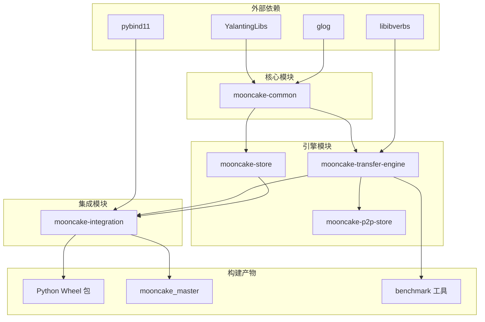

# 编译与开发指南

[上一篇: 快速上手教程](03-quick-start-tutorial.md) | [目录](../README.md)

---

> 本篇详细介绍 Mooncake 的源码编译流程、CMake 构建选项以及开发工作流，帮助开发者快速参与到项目开发中。

---

## 1. 依赖分析

### 1.1 系统级依赖

Mooncake 的依赖可以通过项目根目录下的 `dependencies.sh` 脚本一键安装。以下是主要依赖的详细说明：

| 依赖项 | 推荐版本 | 用途 |
|--------|---------|------|
| GCC | 9.4+ | C/C++ 编译器 |
| CMake | 3.20+ | 构建系统 |
| Go | 1.23.8 | etcd 客户端、P2P Store 等 Go 组件编译 |
| YalantingLibs | 0.5.6 | 协程与序列化框架（阿里巴巴开源） |
| libibverbs | 系统版本 | RDMA 用户态驱动库 |
| libgoogle-glog | 系统版本 | 日志框架 |
| googletest | 系统版本 | 单元测试框架 |
| jsoncpp | 系统版本 | JSON 解析库 |
| libnuma | 系统版本 | NUMA 感知内存管理 |
| Boost | 系统版本 | C++ 通用工具库 |
| OpenSSL | 系统版本 | TLS/SSL 加密支持 |
| pybind11 | 子模块 | C++ 到 Python 的绑定生成 |
| libcurl | 系统版本 | HTTP 客户端库 |
| hiredis | 系统版本 | Redis C 客户端库 |
| liburing | 系统版本 | io_uring 异步 I/O 库 |
| jemalloc | 系统版本 | 高性能内存分配器 |

### 1.2 可选依赖

| 依赖项 | 何时需要 | 说明 |
|--------|---------|------|
| CUDA 12.1+ | GPU Direct RDMA 和 NVMe-of | NVIDIA GPU 支持 |
| MUSA | Moore Threads GPU 支持 | 摩尔线程 GPU |
| HIP/ROCm | AMD GPU 支持 | AMD GPU |
| etcd | 使用 etcd 作为元数据服务时 | 分布式 KV 存储 |
| Redis | 使用 Redis 作为元数据服务时 | 内存数据库 |

### 1.3 一键安装依赖

```bash
# 需要 root 权限
sudo bash dependencies.sh

# 跳过确认提示
sudo bash dependencies.sh -y
```

该脚本会自动完成以下操作：
1. 安装系统包（build-essential, cmake, libibverbs-dev 等）
2. 下载并编译安装 YalantingLibs 0.5.6
3. 初始化 Git 子模块（pybind11 等）
4. 安装 Go 1.23.8

---

## 2. CMake 选项详解

### 2.1 组件开关

这些选项控制编译哪些 Mooncake 组件：

| CMake 选项 | 默认值 | 说明 |
|-----------|--------|------|
| `-DWITH_TE=ON/OFF` | `ON` | 编译 Transfer Engine 及示例代码 |
| `-DWITH_STORE=ON/OFF` | `ON` | 编译 Mooncake Store 组件 |
| `-DWITH_P2P_STORE=ON/OFF` | `OFF` | 编译 P2P Store 组件（需要 Go 1.23+） |
| `-DWITH_EP=ON/OFF` | `OFF` | Expert Parallelism 支持（已弃用，改用 setuptools 的 `BUILD_WITH_EP=1`） |
| `-DWITH_RUST_EXAMPLE=ON/OFF` | `OFF` | 编译 Rust 接口及示例 |

### 2.2 硬件加速选项

| CMake 选项 | 默认值 | 说明 |
|-----------|--------|------|
| `-DUSE_CUDA=ON/OFF` | `OFF` | 启用 NVIDIA GPU Direct RDMA 和 NVMe-of 支持 |
| `-DUSE_MUSA=ON/OFF` | `OFF` | 启用 Moore Threads GPU 支持（MUSA） |
| `-DUSE_HIP=ON/OFF` | `OFF` | 启用 AMD GPU 支持（HIP/ROCm） |
| `-DUSE_CXL=ON/OFF` | `OFF` | 启用 CXL 内存支持 |

### 2.3 元数据服务选项

| CMake 选项 | 默认值 | 说明 |
|-----------|--------|------|
| `-DUSE_ETCD=ON/OFF` | `OFF` | 启用 etcd 作为 Transfer Engine 的元数据服务（需要 Go 1.23+） |
| `-DSTORE_USE_ETCD=ON/OFF` | `OFF` | 启用 etcd 作为 Mooncake Store 的故障恢复机制（需要 Go 1.23+） |
| `-DUSE_REDIS=ON/OFF` | `OFF` | 启用 Redis 作为元数据服务 |
| `-DUSE_HTTP=ON/OFF` | `OFF` | 启用 HTTP 元数据服务 |

> **注意**: `USE_ETCD` 和 `STORE_USE_ETCD` 是两个独立选项。启用 `STORE_USE_ETCD` 不依赖于 `USE_ETCD`。

### 2.4 构建选项

| CMake 选项 | 默认值 | 说明 |
|-----------|--------|------|
| `-DBUILD_UNIT_TESTS=ON/OFF` | `ON` | 编译单元测试 |
| `-DBUILD_EXAMPLES=ON/OFF` | `ON` | 编译示例程序 |
| `-DBUILD_SHARED_LIBS=ON/OFF` | `OFF` | 将 Transfer Engine 编译为共享库（默认静态链接） |
| `-DSTORE_USE_JEMALLOC=ON/OFF` | `OFF` | 在 Mooncake Store Master 中使用 jemalloc |

### 2.5 常用组合示例

**开发测试（最小编译）:**
```bash
cmake .. -DBUILD_UNIT_TESTS=ON -DBUILD_EXAMPLES=ON
```

**生产部署（完整功能）:**
```bash
cmake .. -DUSE_CUDA=ON -DSTORE_USE_ETCD=ON -DUSE_ETCD=ON -DWITH_P2P_STORE=ON
```

**仅 Transfer Engine:**
```bash
cmake .. -DWITH_STORE=OFF -DWITH_P2P_STORE=OFF
```

**无 GPU 环境:**
```bash
cmake .. -DUSE_CUDA=OFF
```

---

## 3. 源码编译步骤

### 3.1 标准编译流程

```bash
# 1. 克隆仓库（包含子模块）
git clone https://github.com/kvcache-ai/Mooncake.git
cd Mooncake

# 2. 安装依赖
sudo bash dependencies.sh -y

# 3. 创建构建目录
mkdir build && cd build

# 4. 配置 CMake
cmake ..

# 5. 编译（使用所有 CPU 核心）
make -j$(nproc)

# 6. 安装（Python 包和 mooncake_master 可执行文件）
sudo make install
```

### 3.2 GPU Direct 支持

如果需要 GPU Direct RDMA 支持，需额外配置 CUDA 环境：

```bash
# 确保 CUDA 已安装（12.1+）
nvidia-smi

# 配置库路径
export LIBRARY_PATH=$LIBRARY_PATH:/usr/local/cuda/lib64
export LD_LIBRARY_PATH=$LD_LIBRARY_PATH:/usr/local/cuda/lib64

# 启用 CUDA 编译
cmake .. -DUSE_CUDA=ON
make -j$(nproc)
```

### 3.3 CMake 模块依赖关系

下图展示了 Mooncake 各 CMake 模块之间的依赖关系：



---

## 4. Docker 构建

### 4.1 使用预构建镜像

Mooncake 提供预构建的 Docker 镜像：

```bash
docker pull alogfans/mooncake
```

### 4.2 从 Dockerfile 构建

项目根目录提供了 `Dockerfile`，基于 PyTorch + CUDA 12.1.1 + Ubuntu 22.04 镜像：

```bash
docker build -t mooncake:latest .
```

### 4.3 运行容器

使用 RDMA 设备运行容器时，需要挂载主机的 InfiniBand 设备：

```bash
sudo docker run \
  --net=host \
  --device=/dev/infiniband/uverbs0 \
  --device=/dev/infiniband/rdma_cm \
  --ulimit memlock=-1 \
  -it mooncake:latest /bin/bash
```

参数说明：

| 参数 | 说明 |
|------|------|
| `--net=host` | 使用宿主机网络（RDMA 必需） |
| `--device=/dev/infiniband/uverbs0` | 挂载 RDMA 设备 |
| `--device=/dev/infiniband/rdma_cm` | 挂载 RDMA 连接管理器 |
| `--ulimit memlock=-1` | 解除内存锁定限制（RDMA 必需） |

### 4.4 构建流程


---

## 5. 运行测试

### 5.1 单元测试

编译时需开启 `BUILD_UNIT_TESTS`（默认开启）：

```bash
# 在 build 目录中
cd build

# 运行所有测试
ctest --output-on-failure

# 运行特定模块的测试
ctest -R transfer_engine --output-on-failure
ctest -R store --output-on-failure
```

### 5.2 运行 Benchmark

编译时需开启 `BUILD_EXAMPLES`（默认开启），benchmark 工具位于 `build/mooncake-transfer-engine/example/` 目录。

**Target 端（接收端）:**

```bash
./transfer_engine_bench \
  --device_name=ibp6s0 \
  --metadata_server=10.1.101.3:2379 \
  --mode=target \
  --local_server_name=10.1.100.3
```

**Initiator 端（发起端）:**

```bash
./transfer_engine_bench \
  --device_name=ibp6s0 \
  --metadata_server=10.1.101.3:2379 \
  --mode=initiator \
  --local_server_name=10.1.100.2 \
  --remote_server_name=10.1.100.3
```

### 5.3 Python 测试

```bash
# 确保已安装 Mooncake
python3 -m pytest tests/ -v
```

---

## 6. 开发工作流

### 6.1 代码风格

Mooncake 遵循以下代码规范：

| 语言 | 规范 | 工具 |
|------|------|------|
| C++ | Google C++ Style Guide | clang-format（配置文件: `.clang-format`） |
| Python | Google Python Style Guide | ruff + ruff-format |
| CMake | 标准 CMake 格式 | cmake-format |

项目的 `.clang-format` 配置：

```yaml
BasedOnStyle: Google
IndentWidth: 4
TabWidth: 4
UseTab: Never
ColumnLimit: 80
SortIncludes: false
```

### 6.2 Pre-commit Hooks

Mooncake 使用 [pre-commit](https://pre-commit.com/) 在提交前自动检查代码质量：

**安装 pre-commit:**

```bash
pip install -r requirements-dev.txt
pre-commit install
```

**手动运行所有检查:**

```bash
pre-commit run --all-files
```

**包含的检查项:**

| 类型 | 工具 | 用途 |
|------|------|------|
| 通用 | trailing-whitespace / end-of-file-fixer | 行尾空格和文件末尾换行 |
| Python | ruff / ruff-format | Lint + 格式化（含 import 排序） |
| 拼写 | codespell | 捕获常见拼写错误 |
| C/C++ | clang-format | 应用 `.clang-format` 样式 |
| CMake | cmake-format | 保持构建脚本可读性 |
| 元检查 | check-yaml / check-merge-conflict | 防止格式错误和冲突标记 |

### 6.3 贡献流程

1. **Fork 仓库** 并 clone 到本地
2. **创建特性分支**: `git checkout -b feature/your-feature`
3. **编写代码** 并确保遵循代码规范
4. **运行测试**: `ctest --output-on-failure`
5. **运行 pre-commit**: `pre-commit run --all-files`
6. **提交代码** 并推送到你的 Fork
7. **创建 Pull Request**

### 6.4 PR 标题规范

提交 Pull Request 时，标题需使用如下前缀：

| 前缀 | 适用范围 |
|------|---------|
| `[Bugfix]` | Bug 修复 |
| `[CI/Build]` | 构建或 CI 改进 |
| `[Doc]` | 文档修复和改进 |
| `[Integration]` | `mooncake-integration` 模块变更 |
| `[P2PStore]` | `mooncake-p2p-store` 模块变更 |
| `[Store]` | `mooncake-store` 模块变更 |
| `[TransferEngine]` | `mooncake-transfer-engine` 模块变更 |
| `[Misc]` | 不属于以上类别（尽量少用） |

### 6.5 RFC 流程

对于重大架构变更（超过 500 行代码，不含测试），需要先在 GitHub Issues 中创建 RFC（Request for Comments），讨论技术方案和理由，获得社区认可后再开始实现。

---

## 参考资源

| 资源 | 链接 |
|------|------|
| GitHub 仓库 | [https://github.com/kvcache-ai/Mooncake](https://github.com/kvcache-ai/Mooncake) |
| PyPI 包（CUDA） | [https://pypi.org/project/mooncake-transfer-engine/](https://pypi.org/project/mooncake-transfer-engine/) |
| PyPI 包（非 CUDA） | [https://pypi.org/project/mooncake-transfer-engine-non-cuda/](https://pypi.org/project/mooncake-transfer-engine-non-cuda/) |
| FAST'25 论文 | [https://www.usenix.org/conference/fast25/presentation/qin](https://www.usenix.org/conference/fast25/presentation/qin) |
| Google C++ Style Guide | [https://google.github.io/styleguide/cppguide.html](https://google.github.io/styleguide/cppguide.html) |
| Google Python Style Guide | [https://google.github.io/styleguide/pyguide.html](https://google.github.io/styleguide/pyguide.html) |

---

> 恭喜你完成了初学者指南的全部内容。如需深入了解 Mooncake 的架构设计和核心模块实现，请继续阅读 [01-overview](../01-overview/) 模块。
