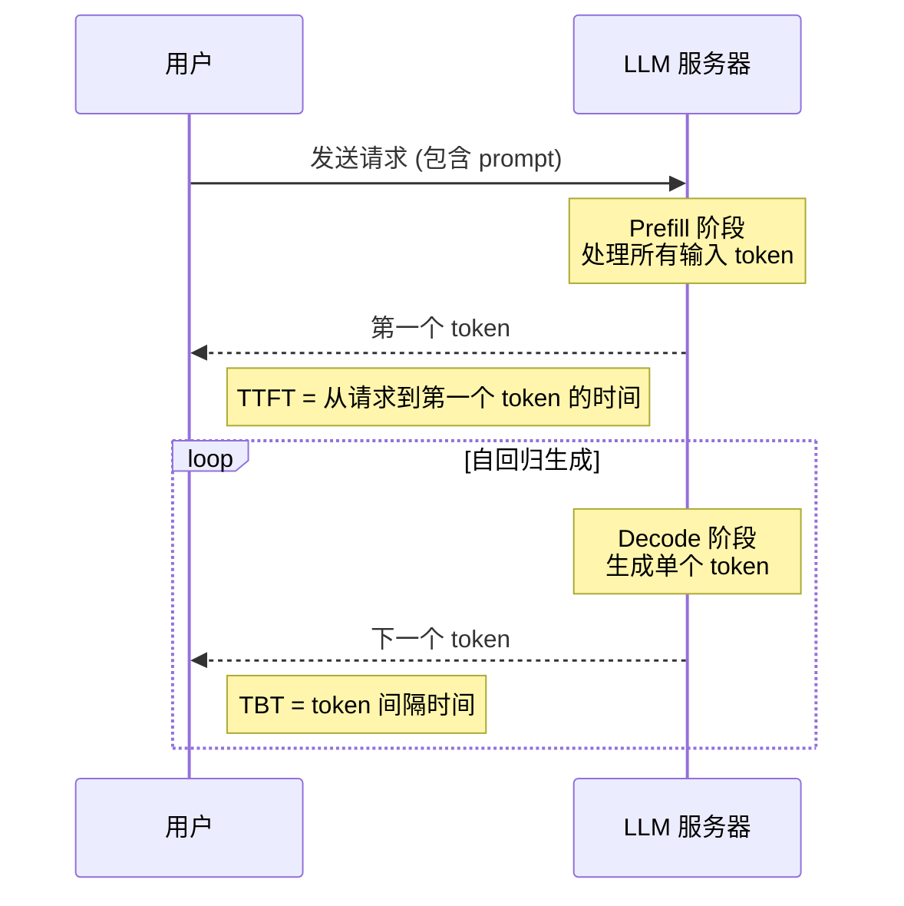
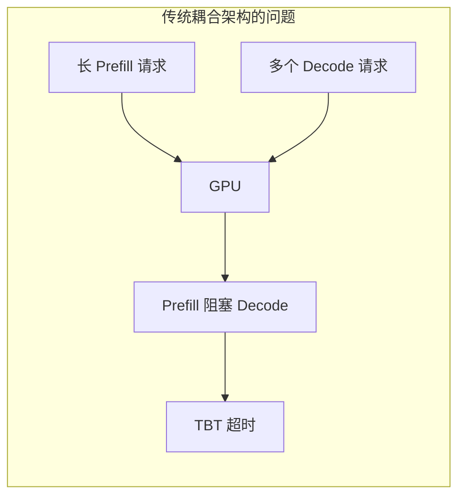
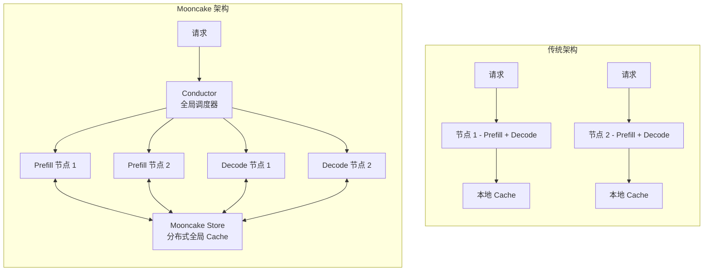

[上一篇: README](../README.md) | [下一篇: 技术预备知识](./02-prerequisites.md)

---

# 引言与项目背景

### 1.1 LLM 推理服务的挑战

随着 ChatGPT、Kimi、Claude 等大语言模型（Large Language Model, LLM）服务的爆发式增长，LLM 推理服务（LLM Serving）已成为 AI 基础设施领域最具挑战性的工程问题之一。与传统的 Web 服务不同，LLM 推理服务面临着独特的技术挑战：

#### 1.1.1 计算与存储的双重压力

LLM 推理的核心瓶颈在于 **KVCache**（Key-Value Cache）。在 Transformer 架构中，每次生成新 token 时，模型需要访问之前所有 token 的 Key 和 Value 向量。以 LLaMA3-70B 模型为例：

```
单个 token 的 KVCache 大小 = 层数 × 2 × (维度 / GQA比例) × 数据类型大小
                        = 80 × 2 × (8192 / 8) × 2 bytes
                        = 320 KB
```

对于一个 128K 上下文长度的请求，KVCache 大小将达到：

```
128K tokens × 320 KB/token = 40 GB
```

这意味着单个长上下文请求的 KVCache 就可能占满一张 80GB 显存的 A800 GPU 的一半空间。

#### 1.1.2 SLO 约束 - TTFT 与 TBT

LLM 服务商需要满足严格的服务等级目标（Service Level Objectives, SLOs），主要包括两个关键指标：

| 指标 | 全称 | 含义 | 典型阈值 |
|------|------|------|----------|
| **TTFT** | Time To First Token | 从请求到达到生成第一个 token 的时间 | < 30 秒 |
| **TBT** | Time Between Tokens | 连续 token 生成之间的间隔时间 | < 100-300 毫秒 |



**TTFT** 主要受 Prefill 阶段影响，该阶段需要处理所有输入 token，是**计算密集型**任务。对于长上下文（如 128K tokens），Prefill 可能需要数十秒。

**TBT** 主要受 Decode 阶段影响，该阶段每次只生成一个 token，但需要访问完整的 KVCache，是**内存密集型**任务。

#### 1.1.3 资源利用率的困境

传统的 LLM 推理架构将 Prefill 和 Decode 阶段耦合在同一节点上运行，这带来了严重的资源利用率问题：



**问题一 - Prefill 干扰 Decode**

当一个长上下文请求进入 Prefill 阶段时，GPU 被完全占用，导致正在进行 Decode 的请求无法获得计算资源，TBT 急剧上升。

**问题二 - KVCache 本地化限制**

传统系统将 KVCache 存储在本地 GPU 显存或 CPU 内存中：
- GPU 显存容量有限（80GB），只能缓存少量请求的 KVCache
- CPU 内存虽然更大，但缓存命中率受限于单节点容量
- 相同前缀的请求可能被调度到不同节点，无法共享 KVCache

**问题三 - 资源浪费**

GPU 服务器配备了大量的 CPU、DRAM、SSD 和高速网卡资源，但在传统架构中这些资源严重未被利用：

| 资源 | 典型配置 (8xA800 节点) | 传统利用率 |
|------|------------------------|------------|
| GPU 显存 | 8 x 80GB = 640GB | 高 |
| CPU 内存 | 1-2 TB | 低 |
| NVMe SSD | 数 TB | 极低 |
| RDMA 网卡 | 8 x 200Gbps | 低 |

### 1.2 Mooncake 的核心理念

#### 1.2.1 "Trading More Storage for Less Computation"

Mooncake 的核心设计理念是：**用更多的存储换取更少的计算**。

这一理念基于一个关键洞察：**KVCache 的复用可以显著减少 Prefill 阶段的计算量**。

考虑以下场景：
- 用户 A 发送请求："请分析这份 50 页的 PDF 文档..."
- 用户 B 发送相同请求："请分析这份 50 页的 PDF 文档..."（相同前缀）

在传统系统中，两个请求都需要完整执行 Prefill，计算量翻倍。而如果能够缓存并复用用户 A 生成的 KVCache，用户 B 的请求可以直接跳过已缓存前缀的计算。

**数学分析**：

给定输入长度 n，Prefill 阶段的计算量（FLOPs）为：

$$flops(n) = l \times (an^2d + bnd^2)$$

其中：
- $l$ = 层数 (LLaMA3-70B: 80)
- $d$ = 模型维度 (LLaMA3-70B: 8192)
- $a, b$ = 常数系数 (约 4, 22)

如果请求的 prompt 长度为 n，其中有 p 个 token 的前缀可以从缓存中复用，则：

**计算节省量** ≈ $l \times (ap^2d + bpd^2)$

**需要传输的 KVCache 大小** = $p \times l \times (2 \times d / gqa) \times s$

其中 $gqa$ 是 GQA（Grouped Query Attention）的比例，$s$ 是数据类型大小。

复用 KVCache 有利于改善 TTFT 的条件是：

$$\frac{B}{G} > \frac{2ds}{gqa \times (apd + bd^2)}$$

其中 $B$ 是 KVCache 加载带宽，$G$ 是 GPU 计算吞吐量。

**关键结论**：对于 LLaMA3-70B 在 8xA800 上，当前缀长度为 8192 时，只需要约 **6 GB/s** 的带宽就能使 KVCache 复用有利可图。对于 8xH800，这一阈值约为 **19 GB/s**。而现代 RDMA 网络可以轻松提供 **100+ GB/s** 的聚合带宽。

#### 1.2.2 KVCache-centric 架构

基于上述洞察，Mooncake 提出了 **KVCache 中心化（KVCache-centric）** 的架构设计：



**核心设计原则**：

1. **Prefill/Decode 分离（P/D Disaggregation）**
   - Prefill 节点专注于处理输入，优化 TTFT
   - Decode 节点专注于生成输出，优化 TBT
   - 两类节点可以独立扩缩容

2. **分布式 KVCache 池（Mooncake Store）**
   - 利用集群中所有节点的 CPU 内存和 SSD 构建全局缓存池
   - 通过高速 RDMA 网络实现跨节点 KVCache 共享
   - 支持 PB 级别的缓存容量

3. **KVCache 中心化调度（KVCache-centric Scheduling）**
   - 调度决策以 KVCache 的分布和复用为核心
   - 将请求调度到能复用最多 KVCache 的节点
   - 自动进行热点 KVCache 的迁移和复制

### 1.3 论文核心贡献与性能数据

#### 1.3.1 主要贡献

Mooncake 论文（FAST'25）的核心贡献包括：

1. **首个大规模部署的分布式 KVCache 系统**
   - 在 Kimi 服务中部署于数千节点
   - 每日处理超过 1000 亿 tokens

2. **高性能 Transfer Engine**
   - 支持 8x400 Gbps RDMA 网络
   - 传输速度比 TCP 快 2.4x-4.6x
   - 拓扑感知的路径选择

3. **KVCache 中心化调度算法**
   - Cache-aware 的全局调度
   - 启发式热点迁移策略
   - 无需精确预测的自动副本管理

4. **Chunked Pipeline Parallelism (CPP)**
   - 针对长上下文的跨节点并行方案
   - 比 Sequence Parallelism 更低的通信开销

#### 1.3.2 性能对比数据

与 vLLM 基准系统相比，Mooncake 在不同 TBT SLO 阈值下的有效请求容量提升：

| TBT 阈值 | 提升幅度 | 场景 |
|----------|----------|------|
| 100 ms | **+498%** | 严格 SLO（实时对话）|
| 200 ms | **+157%** | 中等 SLO |
| 300 ms | **+59%** | 宽松 SLO |

```
有效请求容量对比 (16x8xA800 节点，真实对话工作负载)

TBT SLO: 100ms
Mooncake:     ████████████████████████████████████████ 100%
vLLM:         ██████                                    17%

TBT SLO: 200ms
Mooncake:     ████████████████████████████████████████ 100%
vLLM:         ███████████████                           39%

TBT SLO: 300ms
Mooncake:     ████████████████████████████████████████ 100%
vLLM:         █████████████████████████                 63%
```

#### 1.3.3 生产环境效果

在 Kimi 的实际生产部署中：

| 集群类型 | 相比之前系统的提升 |
|----------|-------------------|
| A800 集群 | **+115%** 请求处理能力 |
| H800 集群 | **+107%** 请求处理能力 |

**Cache 命中率对比**：

| 缓存策略 | 命中率 | Prefill 计算时间节省 |
|----------|--------|---------------------|
| 本地 Cache | ~50% 理论最大值 | - |
| Mooncake Store | **2.36x** 本地 Cache | 最高 **48%** |

### 1.4 开源项目概览

Mooncake 已在 GitHub 开源：https://github.com/kvcache-ai/Mooncake

#### 1.4.1 代码库结构

```
Mooncake/
├── mooncake-transfer-engine/    # 核心传输引擎
│   ├── include/                 # 头文件
│   │   ├── transfer_engine.h    # 主 API
│   │   ├── transport/           # 传输协议
│   │   │   ├── rdma_transport/  # RDMA 实现
│   │   │   ├── tcp_transport/   # TCP 实现
│   │   │   └── ...
│   │   └── topology.h           # 拓扑发现
│   └── src/                     # 实现代码
│
├── mooncake-store/              # 分布式 KVCache 存储
│   ├── include/
│   │   ├── storage_backend.h    # 存储后端
│   │   ├── eviction_strategy.h  # 驱逐策略
│   │   └── master_service.h     # Master 服务
│   └── src/
│
├── mooncake-integration/        # 与 LLM 框架集成
│   ├── vllm/                    # vLLM 集成
│   └── sglang/                  # SGLang 集成
│
├── mooncake-p2p-store/          # P2P 对象存储
├── mooncake-ep/                 # Expert Parallelism 支持
├── mooncake-wheel/              # Python 包装和 CLI
└── docs/                        # 文档
```

#### 1.4.2 支持的硬件和协议

| 类别 | 支持列表 |
|------|----------|
| GPU | NVIDIA (CUDA)、AMD (HIP)、华为昇腾 (Ascend) |
| 网络 | InfiniBand、RoCE、eRDMA |
| 传输协议 | RDMA、TCP、NVMe-oF、NVLink、CXL |
| 存储 | GPU VRAM、CPU DRAM、NVMe SSD |

#### 1.4.3 集成支持

Mooncake 已与主流 LLM 推理框架深度集成：

- **vLLM**: v0.2 / v1 版本支持
- **SGLang**: HiCache 集成
- **LMDeploy**: 适配中
- **LMCache**: 适配中

### 1.5 本文结构

本文将从以下七个部分深入解析 Mooncake：

| 部分 | 内容 | 重点 |
|------|------|------|
| 第一部分 | 概述与背景 | 问题定义、设计理念 |
| 第二部分 | 系统架构 | 整体设计、请求流程 |
| 第三部分 | Mooncake Store | 存储设计、Transfer Engine |
| 第四部分 | 调度系统 | 调度算法、负载均衡 |
| 第五部分 | 性能优化 | 优化技术、部署调试 |
| 第六部分 | 代码解析 | 核心代码逐行分析 |
| 第七部分 | 总结展望 | 贡献回顾、未来方向 |

---

[上一篇: README](../README.md) | [下一篇: 技术预备知识](./02-prerequisites.md)
