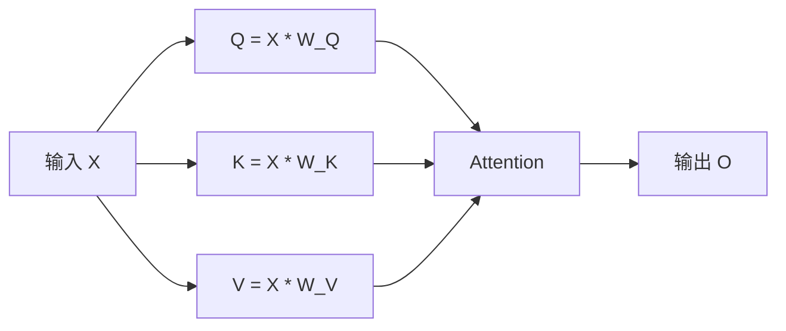
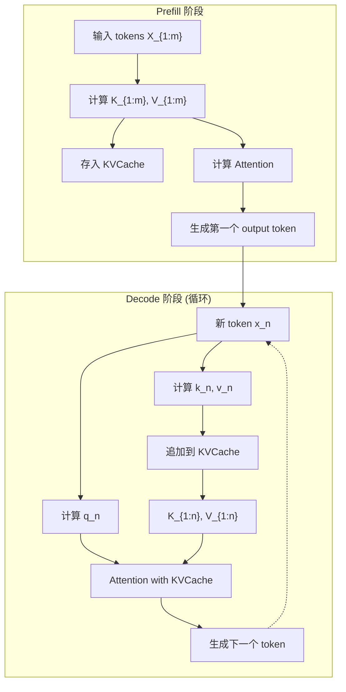
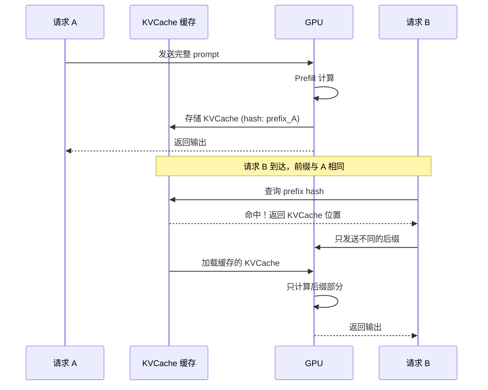
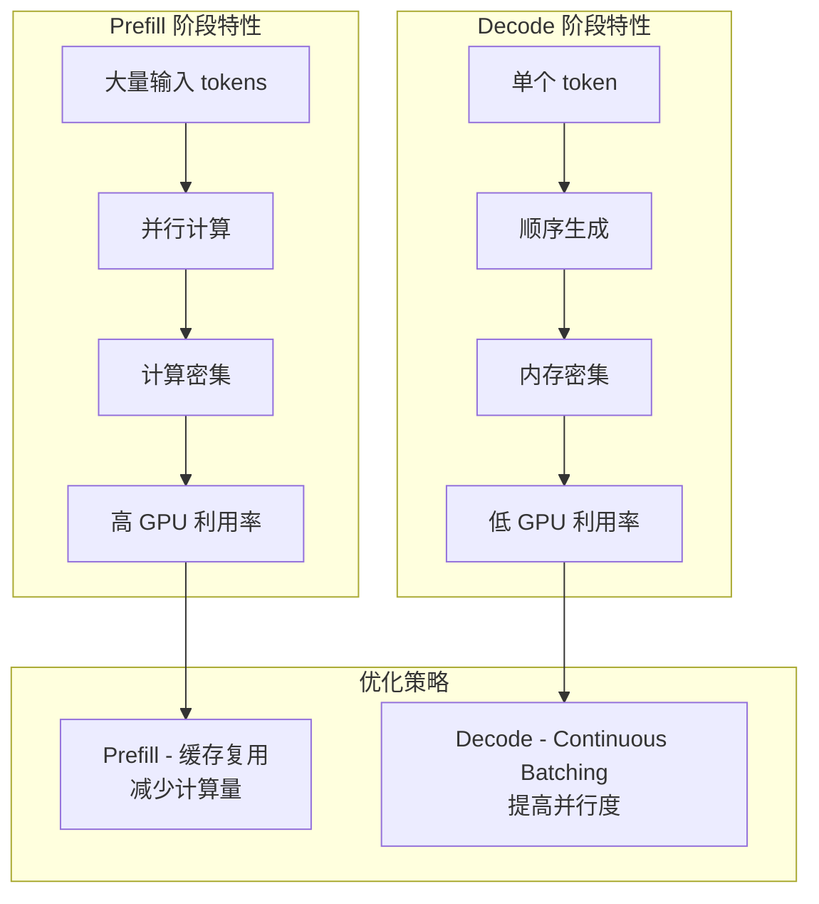
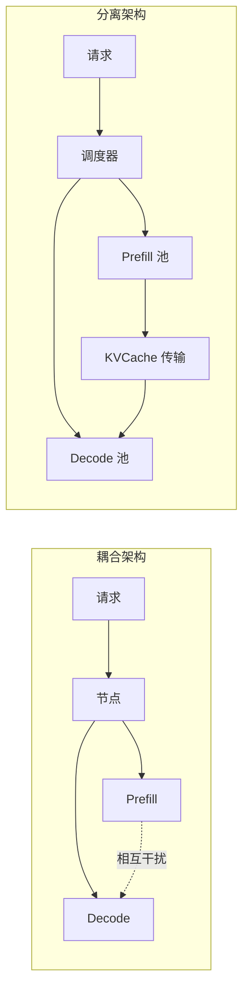
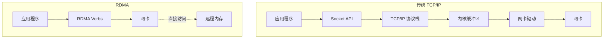
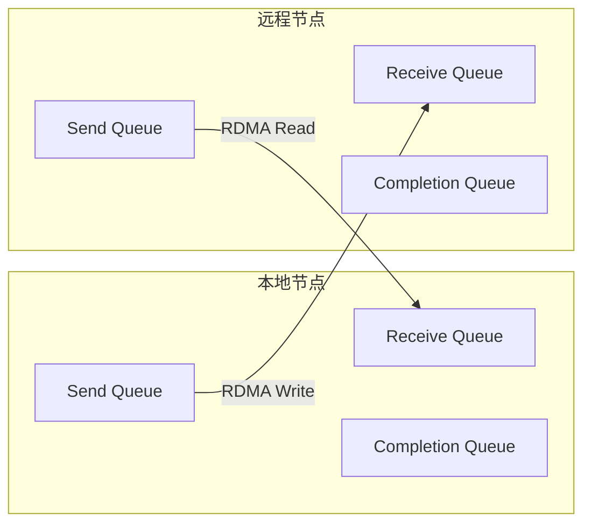
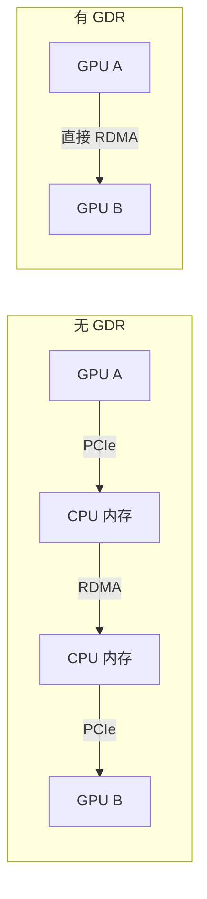
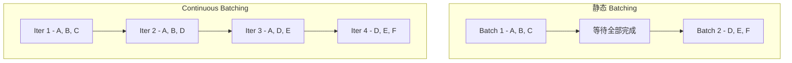

[上一篇: 引言与项目背景](./01-introduction.md) | [下一篇: 整体架构设计](../02-architecture/01-system-architecture.md)

---

# 技术预备知识

在深入 Mooncake 的设计细节之前，本章将介绍必要的技术背景知识，包括 Transformer 架构、KVCache 原理、LLM 推理的两阶段特性，以及 RDMA 网络基础。

### 2.1 Transformer 架构与 KVCache 原理

#### 2.1.1 Transformer 的 Attention 机制回顾

现代大语言模型（如 GPT、LLaMA、Kimi）都基于 Transformer 架构，其核心是 **自注意力机制（Self-Attention）**。

对于输入序列 $X \in \mathbb{R}^{n \times d}$（n 个 token，每个 token 的维度为 d），自注意力的计算过程如下：



**计算公式**：

$$Q = XW_Q, \quad K = XW_K, \quad V = XW_V$$

$$\text{Attention}(Q, K, V) = \text{softmax}\left(\frac{QK^T}{\sqrt{d_k}}\right)V$$

其中：
- $W_Q, W_K, W_V$ 是可学习的投影矩阵
- $d_k$ 是 Key 向量的维度
- softmax 操作确保注意力权重归一化

#### 2.1.2 自回归生成与 KVCache

LLM 采用**自回归（Autoregressive）**方式生成文本：每次只生成一个 token，新 token 依赖于之前所有 token 的信息。

**朴素实现的问题**：

```
生成第 n 个 token 时：
  需要计算 Q_n = x_n · W_Q  (只需当前 token)
  需要计算 K_{1:n} = X_{1:n} · W_K  (需要所有历史 token)
  需要计算 V_{1:n} = X_{1:n} · W_V  (需要所有历史 token)
```

每生成一个新 token，都需要重新计算所有历史 token 的 K 和 V，造成大量重复计算。

**KVCache 优化**：

将历史 token 的 K 和 V 缓存起来，生成新 token 时只需：
1. 计算新 token 的 $q_n, k_n, v_n$
2. 将 $k_n, v_n$ 追加到 KVCache
3. 使用 $q_n$ 与完整的 $K_{1:n}, V_{1:n}$ 计算注意力



#### 2.1.3 KVCache 的内存占用分析

对于一个典型的 LLM（以 LLaMA3-70B 为例）：

| 参数 | 符号 | LLaMA3-70B |
|------|------|------------|
| 层数 | $l$ | 80 |
| 模型维度 | $d$ | 8192 |
| 注意力头数 | $n_{head}$ | 64 |
| KV 头数 (GQA) | $n_{kv}$ | 8 |
| 数据类型 | - | BFloat16 (2 bytes) |

**单个 token 的 KVCache 大小**：

$$\text{KVCache per token} = l \times 2 \times \frac{d}{n_{head}/n_{kv}} \times \text{sizeof(dtype)}$$

$$= 80 \times 2 \times \frac{8192}{64/8} \times 2 = 80 \times 2 \times 1024 \times 2 = 327,680 \text{ bytes} \approx 320 \text{ KB}$$

**不同上下文长度的 KVCache 总大小**：

| 上下文长度 | KVCache 大小 |
|------------|--------------|
| 4K tokens | 1.28 GB |
| 32K tokens | 10.24 GB |
| 128K tokens | 40.96 GB |
| 1M tokens | 320 GB |

这解释了为什么长上下文推理对内存需求如此之高。

#### 2.1.4 Prefix Caching 的原理

**关键洞察**：自回归语言模型具有**前缀无关性**——相同前缀的 KVCache 完全相同，与后续内容无关。

```
请求 A: "请分析这份报告：[报告内容]... 给出总结"
请求 B: "请分析这份报告：[报告内容]... 给出要点"

共同前缀: "请分析这份报告：[报告内容]..."
```

如果请求 A 先执行，其前缀部分的 KVCache 可以被缓存。当请求 B 到达时，可以直接复用这部分 KVCache，只需计算不同后缀部分。

**Prefix Caching 的工作流程**：



### 2.2 LLM 推理的两阶段特性

LLM 推理可以明确分为两个阶段：**Prefill** 和 **Decode**。这两个阶段具有截然不同的计算特性。

#### 2.2.1 Prefill 阶段

**特点**：
- 处理所有输入 tokens（可能数万甚至数十万）
- 计算密集型（Compute-bound）
- 高度并行化（所有 token 可同时计算）
- 输出：第一个生成的 token + 完整的 KVCache

**计算复杂度**：

$$T_{prefill} \propto l \times (an^2d + bnd^2)$$

其中 $n$ 是输入长度。注意 $n^2$ 项来自注意力计算，这使得长上下文的 Prefill 时间急剧增长。

**GPU 利用率**：由于高并行度，Prefill 阶段可以充分利用 GPU 的计算能力，MFU（Model FLOPs Utilization）较高。

#### 2.2.2 Decode 阶段

**特点**：
- 每次只生成一个 token
- 内存密集型（Memory-bound）
- 无法并行化（自回归依赖）
- 需要访问完整的 KVCache

**计算复杂度**：

$$T_{decode} \propto l \times d^2 + l \times nd$$

第一项是 MLP 计算，第二项是与 KVCache 的注意力计算。由于每次只处理一个 token，GPU 计算单元严重闲置。

**GPU 利用率**：单个请求的 Decode 阶段 MFU 很低。优化方法是使用 **Continuous Batching**，将多个请求的 Decode 合并执行。

#### 2.2.3 两阶段对比

| 特性 | Prefill | Decode |
|------|---------|--------|
| 处理 token 数 | 多（输入长度）| 单个 |
| 计算类型 | 计算密集型 | 内存密集型 |
| 并行度 | 高 | 低 |
| GPU 利用率 | 高 | 低（需 batching）|
| 主要瓶颈 | 计算吞吐量 | 内存带宽 |
| 优化目标 | TTFT | TBT |



#### 2.2.4 为什么需要 P/D 分离

传统架构将 Prefill 和 Decode 耦合在同一节点，导致：

1. **相互干扰**：长 Prefill 请求阻塞 Decode 请求，造成 TBT 超时
2. **资源配置困难**：无法针对不同阶段优化资源配置
3. **弹性伸缩受限**：无法独立扩缩容 Prefill 或 Decode 能力

**P/D 分离的优势**：



- Prefill 节点可以专注于最大化计算吞吐
- Decode 节点可以专注于保证 TBT SLO
- 可以根据负载特征独立调整 P/D 比例

### 2.3 RDMA 网络基础

Mooncake 的高性能 KVCache 传输依赖于 RDMA（Remote Direct Memory Access）网络。本节介绍 RDMA 的基本概念。

#### 2.3.1 什么是 RDMA

RDMA 允许一台计算机直接访问另一台计算机的内存，**绕过操作系统内核和 CPU**，实现极低延迟和高带宽的数据传输。



**RDMA 的优势**：

| 特性 | TCP/IP | RDMA |
|------|--------|------|
| CPU 参与 | 每个数据包 | 仅初始化 |
| 内存拷贝 | 多次 | 零拷贝 |
| 延迟 | ~100us | ~1-2us |
| 带宽利用率 | ~50-70% | ~95%+ |

#### 2.3.2 RDMA 的主要实现

| 技术 | 网络类型 | 特点 |
|------|----------|------|
| **InfiniBand** | 专用网络 | 最高性能，需专用硬件 |
| **RoCE v2** | 以太网 | 基于以太网，需支持 ECN |
| **iWARP** | 以太网 | 兼容性好，性能较低 |
| **eRDMA** | 云网络 | 阿里云等云厂商提供 |

Mooncake 主要使用 **InfiniBand** 和 **RoCE**，因为它们在 GPU 集群中最为常见。

#### 2.3.3 RDMA 核心概念

**1. 保护域（Protection Domain, PD）**

PD 是 RDMA 资源的安全边界，同一 PD 内的资源可以相互访问。

**2. 内存区域（Memory Region, MR）**

应用程序必须先向 RDMA 子系统注册内存区域，获得 `lkey`（本地访问）和 `rkey`（远程访问）。

```cpp
// 内存注册示例
struct ibv_mr *mr = ibv_reg_mr(pd, addr, length,
    IBV_ACCESS_LOCAL_WRITE |
    IBV_ACCESS_REMOTE_WRITE |
    IBV_ACCESS_REMOTE_READ);
uint32_t lkey = mr->lkey;  // 本地访问密钥
uint32_t rkey = mr->rkey;  // 远程访问密钥
```

**3. 队列对（Queue Pair, QP）**

QP 是 RDMA 通信的端点，包含：
- **Send Queue (SQ)**：发送工作请求
- **Receive Queue (RQ)**：接收工作请求



**4. 完成队列（Completion Queue, CQ）**

当 RDMA 操作完成时，结果被放入 CQ，应用程序轮询 CQ 获取完成通知。

**5. RDMA 操作类型**

| 操作 | 描述 | 是否需要远程 CPU |
|------|------|-----------------|
| RDMA Write | 写入远程内存 | 否 |
| RDMA Read | 读取远程内存 | 否 |
| Send/Recv | 消息传递 | 是（需预先 post recv）|

Mooncake 主要使用 **RDMA Write** 和 **RDMA Read** 进行 KVCache 传输，因为它们完全绕过远程 CPU。

#### 2.3.4 GPU Direct RDMA

**GPU Direct RDMA (GDR)** 允许网卡直接访问 GPU 显存，无需经过 CPU 内存中转：



**GDR 的优势**：
- 减少数据拷贝
- 降低延迟
- 释放 CPU 内存带宽

**限制**：
- 需要 GPU 和网卡在同一 PCIe 域
- 需要特定驱动支持

Mooncake 的 Transfer Engine 会自动检测 GDR 支持情况，并选择最优传输路径。

#### 2.3.5 多网卡聚合

现代 GPU 服务器通常配备多块 RDMA 网卡。例如，NVIDIA HGX 系统中：
- 8xA800 配备 8x100Gbps 或 4x200Gbps 网卡
- 8xH800 配备 8x400Gbps 网卡

**聚合带宽**可达 800Gbps - 3200Gbps（100-400 GB/s），与 DDR5 内存带宽相当。

Mooncake 的 Transfer Engine 实现了**拓扑感知的多网卡聚合**，能够：
1. 自动发现所有可用网卡
2. 根据数据位置选择最优网卡
3. 将大传输分割到多网卡并行执行

### 2.4 相关系统与技术

#### 2.4.1 vLLM 与 PagedAttention

vLLM 是当前最流行的开源 LLM 推理系统，其核心创新是 **PagedAttention**：
- 将 KVCache 分成固定大小的页（block）
- 使用类似操作系统的页表管理
- 支持 Prefix Caching（本地）

Mooncake 借鉴了 PagedAttention 的分页思想，但将其扩展到分布式场景。

#### 2.4.2 Continuous Batching

Continuous Batching（持续批处理）是 Decode 阶段的关键优化：
- 不等待所有请求完成再开始新批次
- 每个 iteration 动态添加新请求、移除已完成请求
- 显著提高 GPU 利用率



#### 2.4.3 Chunked Prefill

Chunked Prefill 将长 Prefill 请求分成多个小块执行：
- 减少单次 Prefill 对 Decode 的干扰
- 缺点：无法完全消除干扰，且降低 Prefill MFU

Mooncake 选择 P/D 分离而非 Chunked Prefill，因为前者能更彻底地解决干扰问题。

#### 2.4.4 Sequence Parallelism

Sequence Parallelism (SP) 将长序列分布到多个节点并行处理：
- 支持超长上下文
- 缺点：需要频繁的跨节点通信（每层 2 次 AllReduce）

Mooncake 提出的 Chunked Pipeline Parallelism (CPP) 通过流水线方式减少通信开销。

### 2.5 本章小结

本章介绍了理解 Mooncake 所需的技术背景：

1. **KVCache** 是 LLM 推理的核心数据结构，大小与上下文长度成正比
2. **Prefix Caching** 可以显著减少重复计算，但需要大容量全局缓存
3. **Prefill/Decode 分离** 可以消除两阶段的相互干扰
4. **RDMA** 提供了高带宽、低延迟的跨节点数据传输能力
5. **GPU Direct RDMA** 进一步减少了数据拷贝开销

有了这些背景知识，我们将在下一章深入 Mooncake 的系统架构设计。

---

[上一篇: 引言与项目背景](./01-introduction.md) | [下一篇: 整体架构设计](../02-architecture/01-system-architecture.md)
