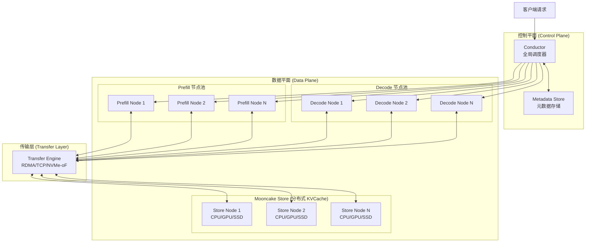
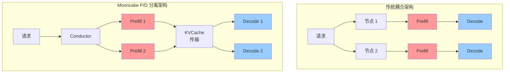
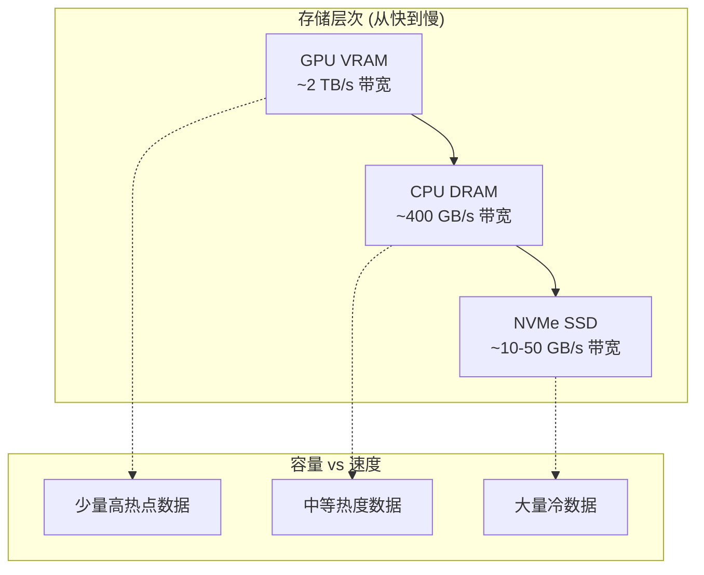
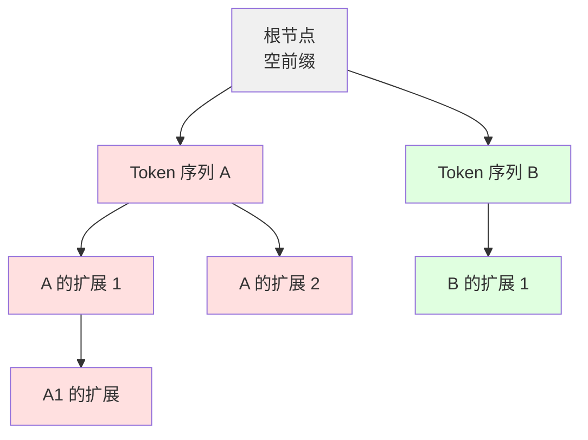
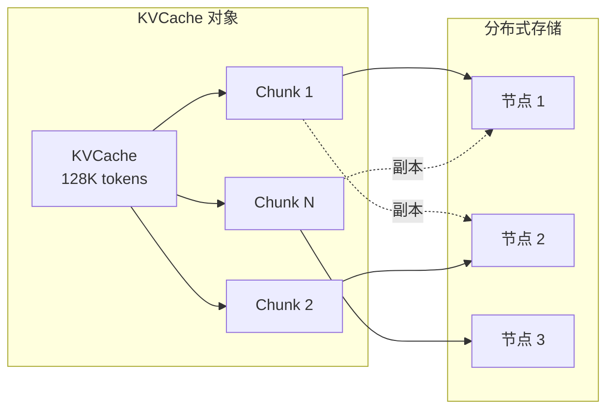
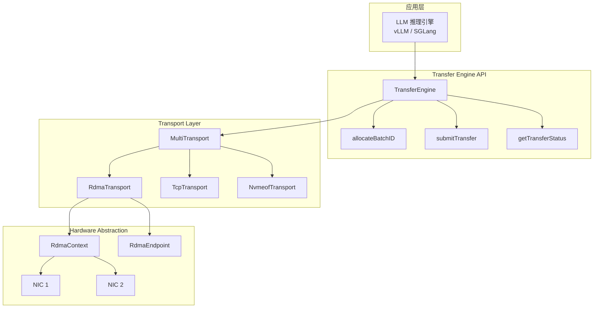
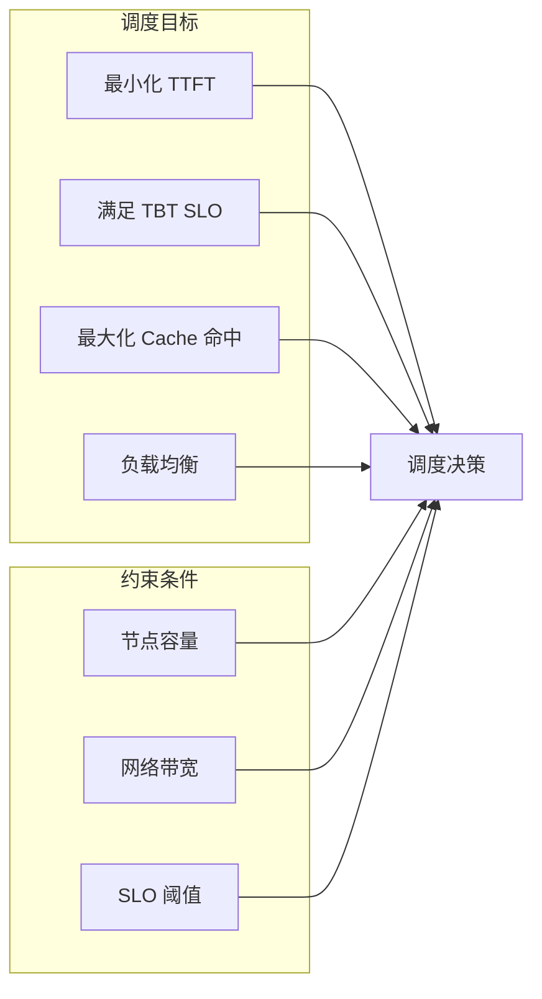
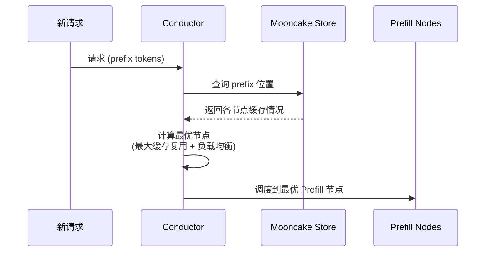
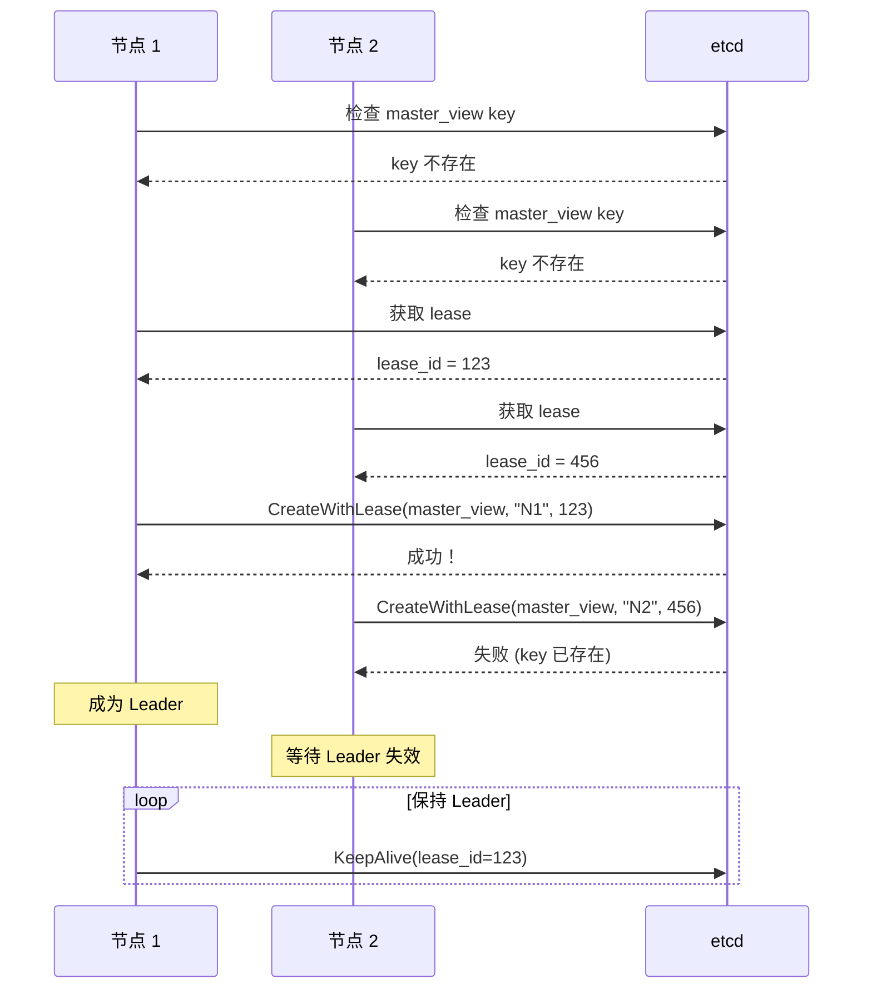

[上一篇：核心概念与关键技术](../01-overview/02-core-concepts.md) | [目录](../README.md) | [下一篇：请求处理流程详解](02-request-lifecycle.md)

---

# 整体架构设计

### 3.1 架构总览

Mooncake 采用了一个精心设计的分层架构，将 LLM 推理系统分解为多个独立但协作的组件。这种设计使得系统能够在保持高性能的同时，实现灵活的资源管理和调度。

#### 3.1.1 核心组件



Mooncake 系统由以下核心组件构成：

| 组件 | 职责 | 关键特性 |
|------|------|----------|
| **Conductor** | 全局调度器 | Cache-aware 调度、负载均衡、SLO 保证 |
| **Prefill Nodes** | 处理输入 tokens | 计算密集型、生成 KVCache |
| **Decode Nodes** | 生成输出 tokens | 内存密集型、消费 KVCache |
| **Mooncake Store** | 分布式 KVCache 存储 | 多级存储、跨节点共享 |
| **Transfer Engine** | 高性能数据传输 | RDMA、拓扑感知、多协议支持 |
| **Metadata Store** | 元数据管理 | 基于 etcd、高可用 |

#### 3.1.2 代码模块对应关系

Mooncake 的代码结构与上述架构紧密对应：

```
Mooncake/
├── mooncake-transfer-engine/    # Transfer Engine 核心实现
│   ├── include/
│   │   ├── transfer_engine.h    # 主入口 API
│   │   ├── transport/           # 各种传输协议实现
│   │   │   ├── rdma_transport/  # RDMA 传输
│   │   │   ├── tcp_transport/   # TCP 传输
│   │   │   └── nvmeof_transport/# NVMe-oF 传输
│   │   ├── topology.h           # 拓扑发现
│   │   └── transfer_metadata.h  # 元数据管理
│   └── src/
│       ├── transfer_engine.cpp  # Transfer Engine 实现
│       └── transport/           # 传输层实现
│
├── mooncake-store/              # Mooncake Store 实现
│   ├── include/
│   │   ├── storage_backend.h    # 存储后端抽象
│   │   ├── eviction_strategy.h  # 缓存驱逐策略
│   │   ├── master_service.h     # Master 服务
│   │   └── ha_helper.h          # 高可用支持
│   └── src/
│       ├── ha_helper.cpp        # Leader 选举实现
│       └── master_service.cpp   # Master 服务实现
│
├── mooncake-integration/        # 与推理框架的集成
│   ├── vllm/                    # vLLM 集成
│   └── sglang/                  # SGLang 集成
│
└── mooncake-wheel/              # Python 包装器和 CLI 工具
```

### 3.2 P/D 分离架构详解

#### 3.2.1 分离架构的核心思想

P/D（Prefill/Decode）分离是 Mooncake 架构的核心设计决策。与传统的将两个阶段耦合在同一节点的方案不同，Mooncake 将它们部署在独立的节点池中：



#### 3.2.2 分离带来的优势

**1. 消除阶段干扰**

在耦合架构中，长 Prefill 请求会阻塞同节点上的 Decode 请求，导致 TBT 超时。分离后：
- Prefill 节点可以专注于处理计算密集型任务
- Decode 节点不受 Prefill 干扰，TBT 稳定可控

**2. 独立资源配置**

| 阶段 | 资源需求 | 优化方向 |
|------|----------|----------|
| Prefill | 高计算能力、中等内存 | 最大化 MFU |
| Decode | 高内存带宽、大 batch size | 最大化并发请求数 |

分离后可以针对不同阶段优化配置：
- Prefill 节点可以使用计算更强的 GPU
- Decode 节点可以配置更大的显存和 batch size

**3. 弹性伸缩**

可以根据工作负载特征独立调整 P/D 节点比例：
- 长上下文场景：增加 Prefill 节点
- 高并发场景：增加 Decode 节点

#### 3.2.3 分离带来的挑战：KVCache 传输

P/D 分离的代价是需要在 Prefill 完成后将 KVCache 传输到 Decode 节点。这引入了额外的网络开销：

**传输量估算**（以 LLaMA3-70B 为例）：

| 上下文长度 | KVCache 大小 | 100GB/s 网络传输时间 |
|------------|--------------|---------------------|
| 4K tokens | 1.28 GB | ~13 ms |
| 32K tokens | 10.24 GB | ~100 ms |
| 128K tokens | 40.96 GB | ~400 ms |

**关键洞察**：Mooncake 通过以下机制将传输开销最小化：

1. **Prefix Caching**：如果目标 Decode 节点已有部分 KVCache 缓存，只需传输差异部分
2. **并行传输**：利用多网卡聚合带宽
3. **流水线**：KVCache 可以边生成边传输

### 3.3 Mooncake Store 设计概览

Mooncake Store 是系统的核心组件，实现了分布式 KVCache 存储池。

#### 3.3.1 存储层次结构



Mooncake Store 利用集群中所有节点的多级存储资源：

| 存储层 | 介质 | 典型带宽 | 典型容量 (8 节点) |
|--------|------|----------|------------------|
| L1 | GPU VRAM | 2-3 TB/s | 640 GB - 1.28 TB |
| L2 | CPU DRAM | 400 GB/s | 8-16 TB |
| L3 | NVMe SSD | 10-50 GB/s | 数十 TB |

#### 3.3.2 KVCache 对象模型

Mooncake Store 将 KVCache 组织为树形结构：



**Radix Tree 结构特点**：
- 公共前缀共享存储空间
- 支持快速前缀匹配
- 天然支持 Prefix Caching

#### 3.3.3 分片与复制策略

KVCache 被分成固定大小的 **Chunk**（通常 4KB-64KB），每个 Chunk 可以：
- 存储在不同节点上
- 拥有多个副本（用于热点数据）
- 在不同存储层之间迁移



### 3.4 Transfer Engine 设计概览

Transfer Engine 是 Mooncake 的高性能数据传输层，负责在节点间高效传输 KVCache 数据。

#### 3.4.1 核心设计目标

1. **高带宽**：充分利用多 RDMA 网卡的聚合带宽
2. **低延迟**：最小化传输开销
3. **拓扑感知**：自动选择最优传输路径
4. **协议抽象**：统一 API 支持多种传输协议

#### 3.4.2 架构分层



#### 3.4.3 关键代码结构

从 `transfer_engine.h` 中可以看到 Transfer Engine 的核心 API：

```cpp
class TransferEngine {
public:
    // 初始化引擎
    int init(const std::string& metadata_conn_string,
             const std::string& local_server_name,
             const std::string& ip_or_host_name,
             uint64_t rpc_port);

    // 安装传输协议
    Transport* installTransport(const std::string& proto, void** args);

    // 注册本地内存区域 (用于 RDMA)
    int registerLocalMemory(void* addr, size_t length,
                           const std::string& location,
                           bool remote_accessible,
                           bool update_metadata = true);

    // 分配 Batch ID (用于批量传输)
    BatchID allocateBatchID(size_t batch_size);

    // 提交传输请求
    Status submitTransfer(BatchID batch_id,
                         const std::vector<TransferRequest>& entries);

    // 获取传输状态
    Status getTransferStatus(BatchID batch_id, size_t task_id,
                            TransferStatus& status);

    // 打开远程 Segment
    SegmentHandle openSegment(const std::string& segment_name);
};
```

**核心数据结构**（来自 `transport.h`）：

```cpp
struct TransferRequest {
    enum OpCode { READ, WRITE };

    OpCode opcode;           // 读或写操作
    void* source;            // 本地地址
    SegmentID target_id;     // 目标 Segment
    uint64_t target_offset;  // 目标偏移
    size_t length;           // 传输长度
};

enum TransferStatusEnum {
    WAITING,     // 等待执行
    PENDING,     // 执行中
    COMPLETED,   // 完成
    FAILED,      // 失败
    TIMEOUT      // 超时
};
```

### 3.5 Conductor 调度器概览

Conductor 是 Mooncake 的全局调度器，负责将请求分配到合适的 Prefill 和 Decode 节点。

#### 3.5.1 调度目标

Conductor 需要同时优化多个目标：



#### 3.5.2 Cache-aware 调度

Conductor 的核心创新是 **Cache-aware** 调度——将请求调度到能够复用最多 KVCache 的节点：



**调度算法核心思想**：

给定请求 $r$ 和候选节点集合 $N$，调度得分为：

$$score(r, n) = \alpha \cdot \frac{cached\_prefix\_length(r, n)}{total\_prefix\_length(r)} + \beta \cdot (1 - load(n))$$

其中：
- $cached\_prefix\_length(r, n)$：节点 $n$ 上已缓存的请求 $r$ 的前缀长度
- $total\_prefix\_length(r)$：请求 $r$ 的总前缀长度
- $load(n)$：节点 $n$ 的当前负载
- $\alpha, \beta$：权重参数

### 3.6 元数据管理

Mooncake 使用 etcd 作为分布式元数据存储，管理以下信息：

#### 3.6.1 元数据类型

| 元数据类型 | 内容 | 更新频率 |
|------------|------|----------|
| Segment 信息 | 节点地址、端口、协议 | 节点启动/退出时 |
| Buffer 描述 | 内存地址、大小、rkey | 内存注册时 |
| 拓扑信息 | NIC 配置、存储层次 | 节点启动时 |
| Master 视图 | 当前 Master 地址 | Leader 选举时 |

#### 3.6.2 高可用设计

从 `ha_helper.cpp` 可以看到 Master 选举机制：

```cpp
void MasterViewHelper::ElectLeader(const std::string& master_address,
                                   ViewVersionId& version,
                                   EtcdLeaseId& lease_id) {
    while (true) {
        // 1. 检查是否已有 Leader
        auto ret = EtcdHelper::Get(master_view_key_, ...);

        if (ret != ErrorCode::ETCD_KEY_NOT_EXIST) {
            // 已有 Leader，等待其失效
            EtcdHelper::WatchUntilDeleted(master_view_key_, ...);
            continue;
        }

        // 2. 尝试成为 Leader
        // 获取租约
        EtcdHelper::GrantLease(ETCD_MASTER_VIEW_LEASE_TTL, lease_id);

        // 原子创建 key (带租约)
        ret = EtcdHelper::CreateWithLease(master_view_key_, master_address,
                                          lease_id, version);

        if (ret == ErrorCode::OK) {
            // 成功成为 Leader
            return;
        }
        // 失败则重试
    }
}
```

**选举流程**：



### 3.7 本章小结

本章介绍了 Mooncake 的整体架构设计：

1. **分层架构**：控制平面（Conductor）、数据平面（P/D 节点）、存储层（Mooncake Store）、传输层（Transfer Engine）
2. **P/D 分离**：消除阶段干扰、支持独立资源配置和弹性伸缩
3. **Mooncake Store**：多级存储层次、树形 KVCache 组织、分片与复制
4. **Transfer Engine**：协议抽象、拓扑感知、多网卡聚合
5. **Conductor**：Cache-aware 调度、负载均衡、SLO 保证
6. **元数据管理**：基于 etcd、Leader 选举、高可用

---

[上一篇：核心概念与关键技术](../01-overview/02-core-concepts.md) | [目录](../README.md) | [下一篇：请求处理流程详解](02-request-lifecycle.md)
