[上一篇：整体架构设计](01-system-architecture.md) | [目录](../README.md) | [下一篇：存储架构设计](../03-mooncake-store/01-storage-architecture.md)

---

# 请求处理流程详解

本章将深入分析一个请求从进入系统到返回结果的完整流程，涵盖各个组件之间的交互细节。

### 4.1 请求生命周期总览

一个 LLM 推理请求在 Mooncake 系统中经历以下主要阶段：

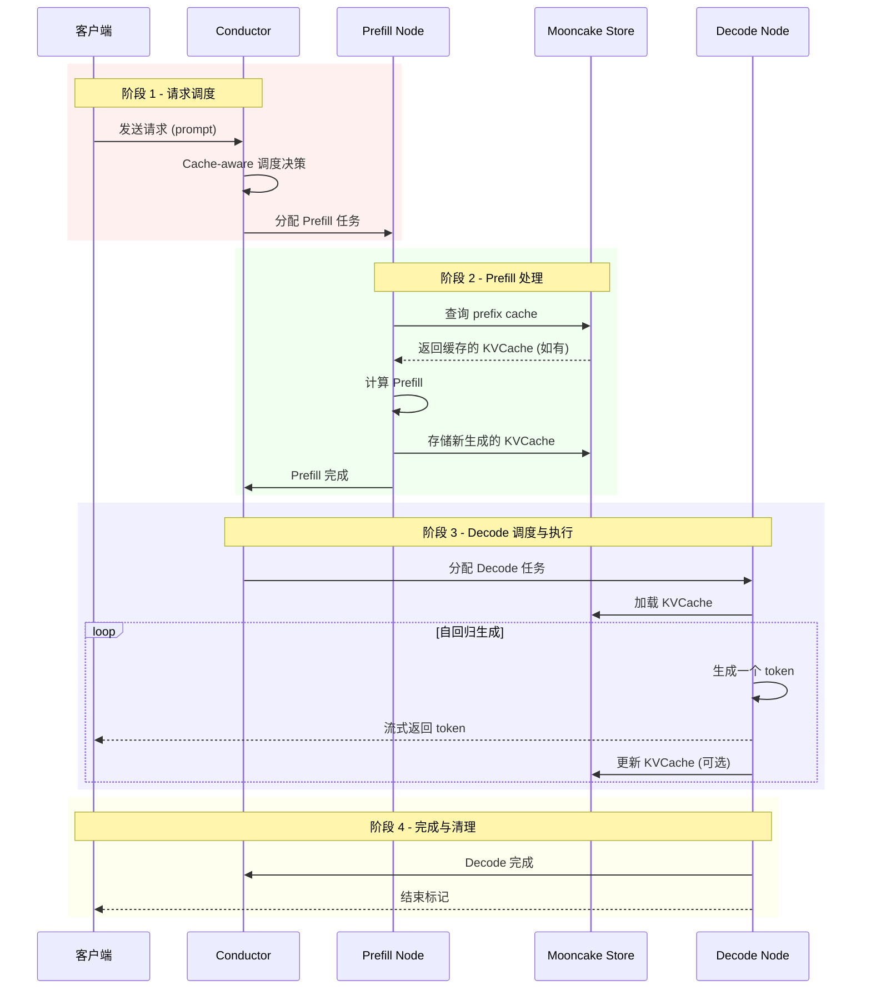

### 4.2 阶段一：请求调度

#### 4.2.1 请求接收与解析

当客户端发送请求时，Conductor 首先解析请求内容：

```python
# 请求结构示例
request = {
    "prompt": "Please analyze this document: [doc content]...",
    "max_tokens": 2048,
    "temperature": 0.7,
    "stream": True
}
```

Conductor 将 prompt 进行 tokenize，并计算其 **prefix hash**：

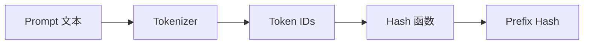

#### 4.2.2 Cache 查询

Conductor 查询 Mooncake Store，获取各节点上已缓存的 prefix 情况：

```mermaid
graph TB
    subgraph "Mooncake Store 元数据"
        M[Prefix Hash 索引]
        M --> E1[Hash: abc123<br/>节点: [N1, N3]<br/>长度: 4096]
        M --> E2[Hash: def456<br/>节点: [N2]<br/>长度: 8192]
        M --> E3[Hash: ghi789<br/>节点: [N1, N2, N4]<br/>长度: 2048]
    end
```

查询结果告诉 Conductor：
- 哪些节点缓存了请求的部分或全部前缀
- 各节点的缓存命中长度

#### 4.2.3 调度决策

Conductor 综合考虑以下因素做出调度决策：

**1. Cache 命中优化**

选择缓存命中长度最大的节点，可以最大程度减少 Prefill 计算量：

```
节省的计算量 ∝ cached_prefix_length²
```

**2. 负载均衡**

避免将请求都调度到同一节点：

```python
# 伪代码：调度得分计算
def compute_score(node, request):
    cache_hit_length = get_cache_hit_length(node, request.prefix_hash)
    cache_score = cache_hit_length / request.total_length

    load = get_node_load(node)
    load_score = 1.0 - load

    return alpha * cache_score + beta * load_score
```

**3. 网络拓扑**

优先选择与数据源网络距离近的节点：

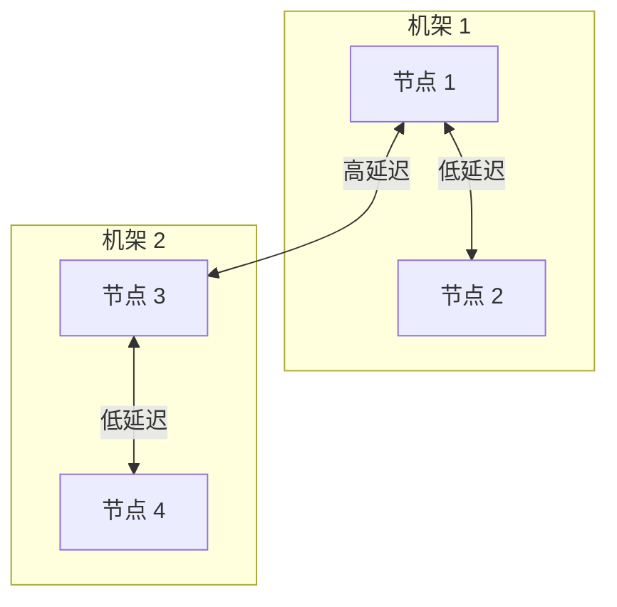

如果 KVCache 主要在机架 1 的节点上，优先选择同机架的 Prefill 节点。

### 4.3 阶段二：Prefill 处理

#### 4.3.1 KVCache 加载

Prefill 节点收到任务后，首先从 Mooncake Store 加载已缓存的 KVCache：

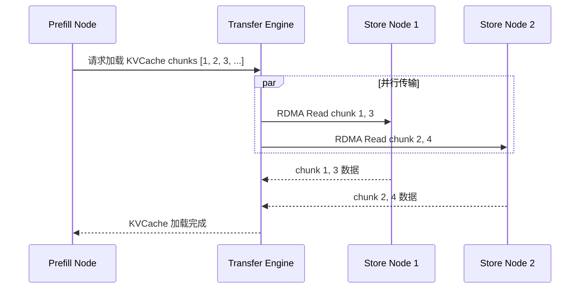

**Transfer Engine 的并行传输机制**（来自 `rdma_transport.cpp`）：

```cpp
Status RdmaTransport::submitTransfer(
    BatchID batch_id, const std::vector<TransferRequest>& entries) {

    // 将大传输分割成 slices
    const size_t kBlockSize = globalConfig().slice_size;  // 通常 64KB

    for (auto& request : entries) {
        for (uint64_t offset = 0; offset < request.length;
             offset += kBlockSize) {

            Slice* slice = getSliceCache().allocate();
            slice->source_addr = (char*)request.source + offset;
            slice->length = std::min(kBlockSize, request.length - offset);
            slice->opcode = request.opcode;
            slice->rdma.dest_addr = request.target_offset + offset;

            // 选择最优网卡
            int device_id = selectDevice(...);
            slices_to_post[context_list_[device_id]].push_back(slice);
        }
    }

    // 提交到各网卡并行执行
    for (auto& entry : slices_to_post) {
        entry.first->submitPostSend(entry.second);
    }
}
```

#### 4.3.2 增量 Prefill

只对未缓存的 tokens 执行 Prefill 计算：

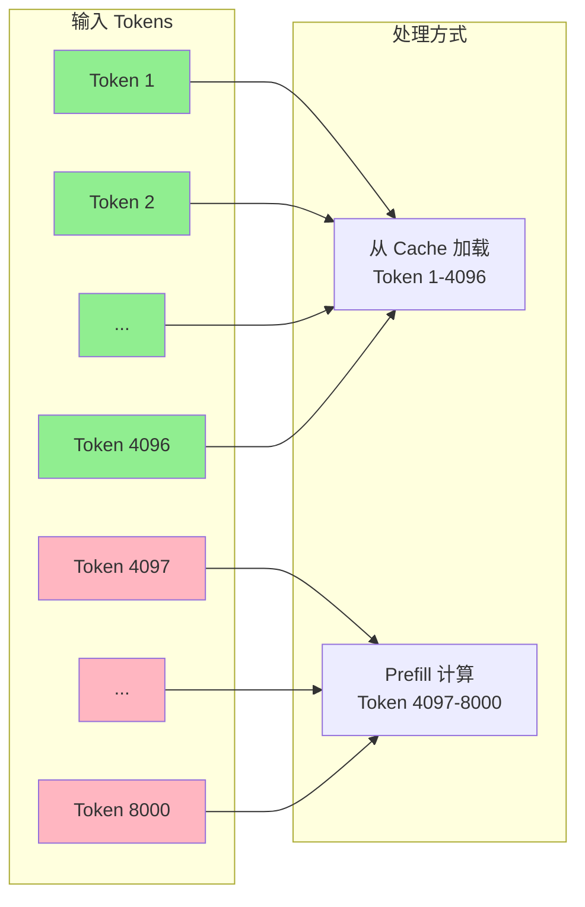

**增量 Prefill 的计算节省**：

假设总长度 8000 tokens，缓存命中 4096 tokens：
- 传统方式：需要计算 8000² ≈ 6400 万次注意力操作
- 增量方式：只需计算 (8000² - 4096²) ≈ 4720 万次注意力操作
- **节省：26% 计算量**

#### 4.3.3 KVCache 存储

Prefill 完成后，将新生成的 KVCache 存储到 Mooncake Store：

```cpp
// 伪代码：KVCache 存储流程
void store_kvcache(KVCache& cache, PrefixHash& hash) {
    // 1. 分割成 chunks
    auto chunks = cache.split_into_chunks(CHUNK_SIZE);

    // 2. 计算存储位置
    std::vector<NodeId> target_nodes = select_storage_nodes(chunks);

    // 3. 并行写入
    BatchID batch = engine.allocateBatchID(chunks.size());
    for (size_t i = 0; i < chunks.size(); i++) {
        TransferRequest req;
        req.opcode = WRITE;
        req.source = chunks[i].data();
        req.target_id = target_nodes[i];
        req.target_offset = get_chunk_offset(hash, i);
        req.length = chunks[i].size();
        requests.push_back(req);
    }
    engine.submitTransfer(batch, requests);

    // 4. 等待完成
    wait_for_completion(batch);

    // 5. 更新元数据
    update_prefix_metadata(hash, target_nodes);
}
```

### 4.4 阶段三：Decode 处理

#### 4.4.1 Decode 节点分配

Prefill 完成后，Conductor 选择 Decode 节点。选择策略考虑：

1. **KVCache 位置**：优先选择已有 KVCache 的节点（避免传输）
2. **当前负载**：选择有足够空闲 batch 槽位的节点
3. **TBT SLO**：确保选择的节点能满足 TBT 要求

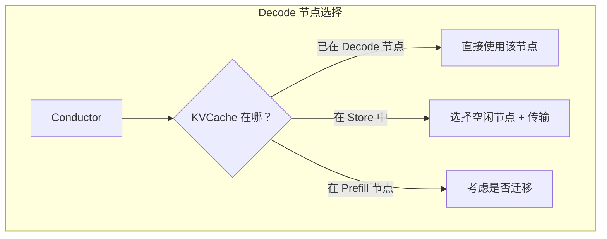

#### 4.4.2 KVCache 迁移（如需要）

如果 KVCache 不在目标 Decode 节点上，需要进行迁移：

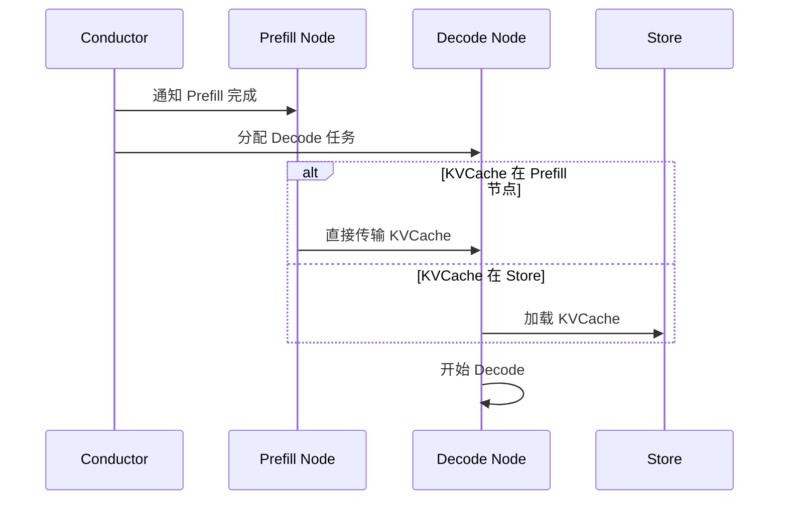

**传输与计算重叠**：

Mooncake 支持边传输边计算，进一步减少延迟：

```mermaid
gantt
    title KVCache 传输与 Decode 重叠
    dateFormat X
    axisFormat %s

    section 传输
    Chunk 1-4    :t1, 0, 10
    Chunk 5-8    :t2, 10, 20

    section Decode
    使用 Chunk 1-4 :d1, 10, 25
    使用 Chunk 5-8 :d2, 20, 35
```

#### 4.4.3 自回归生成

Decode 节点进入自回归生成循环：

```python
# 伪代码：Decode 循环
def decode_loop(kvcache, prompt_tokens, max_new_tokens):
    generated_tokens = []
    current_kvcache = kvcache

    for i in range(max_new_tokens):
        # 1. 获取最后一个 token
        last_token = generated_tokens[-1] if generated_tokens else prompt_tokens[-1]

        # 2. 前向计算 (使用 KVCache)
        logits = model.forward(last_token, current_kvcache)

        # 3. 采样下一个 token
        next_token = sample(logits, temperature, top_p)

        # 4. 更新 KVCache
        current_kvcache.append(next_token_kv)

        # 5. 流式返回
        yield next_token

        # 6. 检查停止条件
        if next_token == EOS_TOKEN:
            break

        generated_tokens.append(next_token)
```

**Continuous Batching**：

Decode 节点通常同时处理多个请求，使用 Continuous Batching 最大化 GPU 利用率：

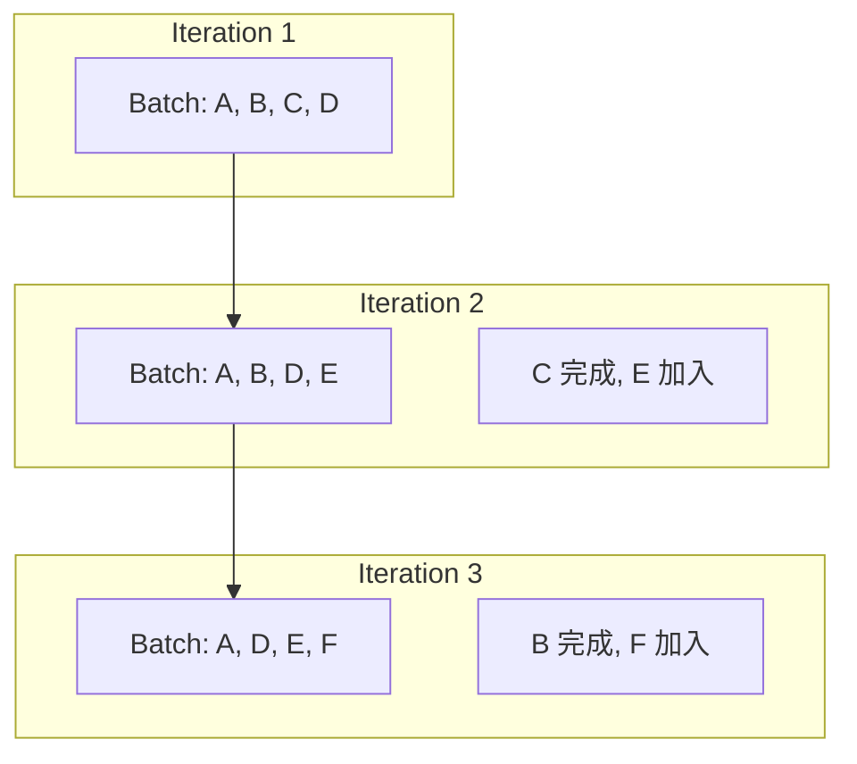

#### 4.4.4 KVCache 增量存储

Decode 过程中，新生成的 KVCache 可以选择性地存储到 Mooncake Store：

- **热数据**：高频访问的前缀，主动复制到多节点
- **冷数据**：低频访问的数据，可以延迟写入或丢弃

### 4.5 阶段四：完成与资源回收

#### 4.5.1 请求完成处理

当 Decode 完成（生成 EOS 或达到 max_tokens）：

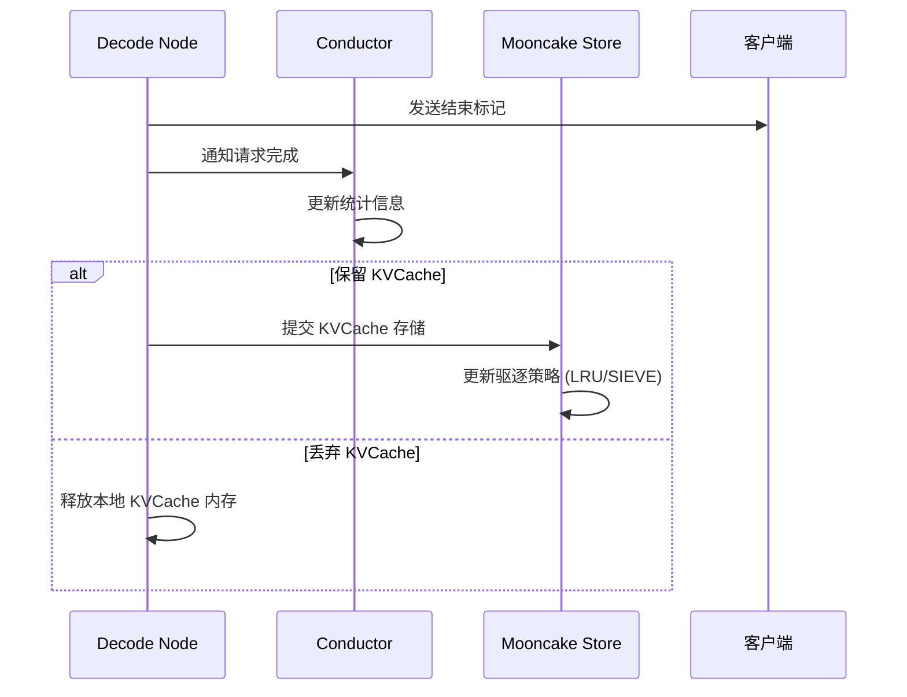

#### 4.5.2 缓存驱逐策略

从 `eviction_strategy.h` 可以看到 Mooncake 支持的驱逐策略：

**LRU (Least Recently Used)**：

```cpp
class LRUEvictionStrategy : public EvictionStrategy {
public:
    ErrorCode AddKey(const std::string& key) override {
        // 新 key 添加到队列头部
        all_key_list_.push_front(key);
        all_key_idx_map_[key] = all_key_list_.begin();
        return ErrorCode::OK;
    }

    ErrorCode UpdateKey(const std::string& key) override {
        // 访问时移动到头部
        auto it = all_key_idx_map_.find(key);
        if (it != all_key_idx_map_.end()) {
            all_key_list_.erase(it->second);
            all_key_list_.push_front(key);
            all_key_idx_map_[key] = all_key_list_.begin();
        }
        return ErrorCode::OK;
    }

    std::string EvictKey() override {
        // 驱逐尾部 (最久未使用)
        if (all_key_list_.empty()) return "";
        std::string evicted_key = all_key_list_.back();
        all_key_list_.pop_back();
        all_key_idx_map_.erase(evicted_key);
        return evicted_key;
    }
};
```

**FIFO (First In First Out)**：

```cpp
class FIFOEvictionStrategy : public EvictionStrategy {
public:
    ErrorCode AddKey(const std::string& key) override {
        // 新 key 添加到头部
        all_key_list_.push_front(key);
        return ErrorCode::OK;
    }

    ErrorCode UpdateKey(const std::string& key) override {
        // FIFO 不关心访问顺序
        return ErrorCode::OK;
    }

    std::string EvictKey() override {
        // 驱逐尾部 (最早进入)
        if (all_key_list_.empty()) return "";
        std::string evicted_key = all_key_list_.back();
        all_key_list_.pop_back();
        return evicted_key;
    }
};
```

### 4.6 异常处理与容错

#### 4.6.1 节点故障处理

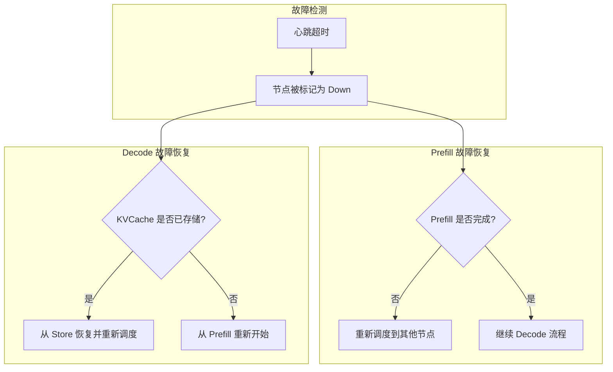

#### 4.6.2 传输失败重试

Transfer Engine 内置了重试机制（来自 `transport.h`）：

```cpp
struct Slice {
    // ...
    struct {
        uint32_t retry_cnt;      // 当前重试次数
        uint32_t max_retry_cnt;  // 最大重试次数
    } rdma;

    void markFailed() {
        if (rdma.retry_cnt < rdma.max_retry_cnt) {
            // 重新提交
            status = PENDING;
            rdma.retry_cnt++;
            resubmit();
        } else {
            // 永久失败
            status = FAILED;
            task->failed_slice_count++;
        }
    }
};
```

### 4.7 性能关键路径分析

#### 4.7.1 延迟分解

一个典型请求的延迟分解：

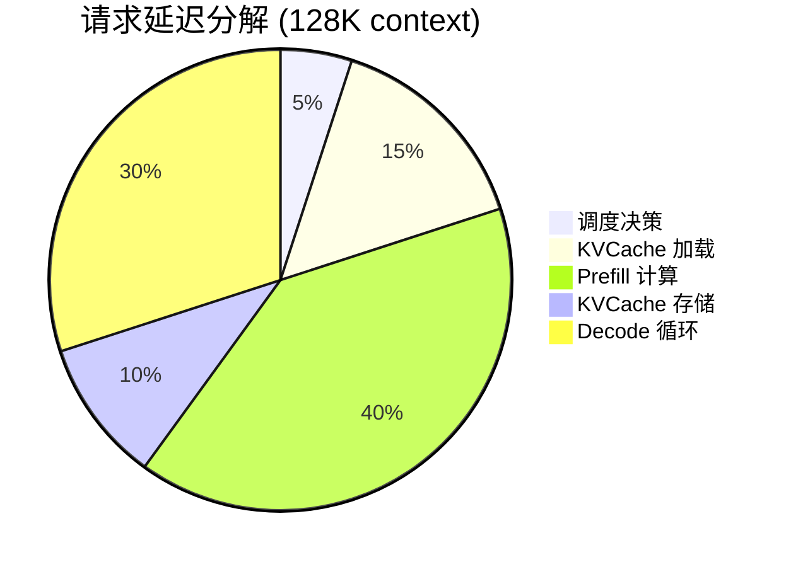

#### 4.7.2 关键优化点

| 阶段 | 优化技术 | 效果 |
|------|----------|------|
| 调度 | 预计算 prefix hash | 减少决策延迟 |
| 加载 | 多网卡并行 | 2-8x 带宽提升 |
| Prefill | Prefix Caching | 减少 20-80% 计算 |
| 传输 | 流水线 | 隐藏传输延迟 |
| Decode | Continuous Batching | 提高 GPU 利用率 |

### 4.8 本章小结

本章详细分析了 Mooncake 中请求的完整处理流程：

1. **调度阶段**：Cache-aware 调度、负载均衡、拓扑感知
2. **Prefill 阶段**：KVCache 加载、增量计算、存储
3. **Decode 阶段**：KVCache 迁移、自回归生成、Continuous Batching
4. **完成阶段**：资源回收、缓存驱逐
5. **容错机制**：故障检测、重试、恢复

这种精心设计的流程确保了 Mooncake 能够在满足 SLO 要求的同时，最大化资源利用率和缓存命中率。

---

[上一篇：整体架构设计](01-system-architecture.md) | [目录](../README.md) | [下一篇：存储架构设计](../03-mooncake-store/01-storage-architecture.md)
