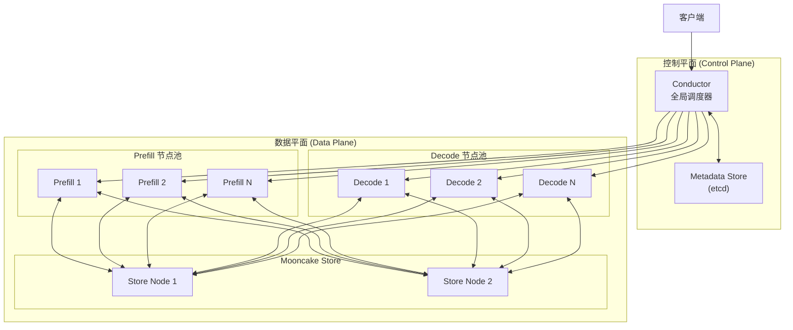
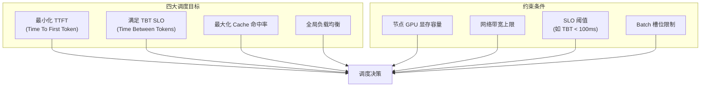
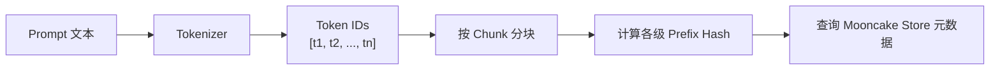
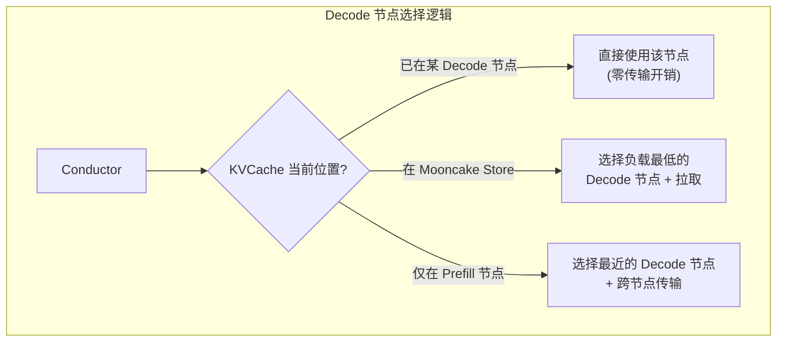
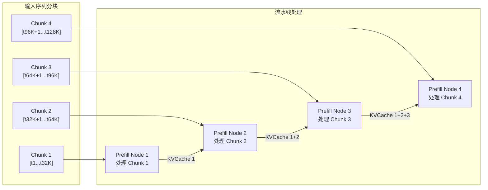
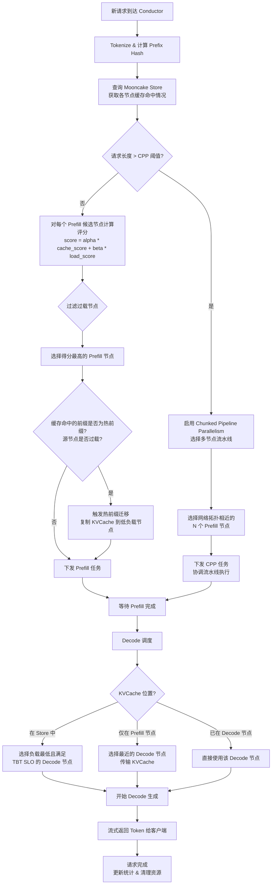
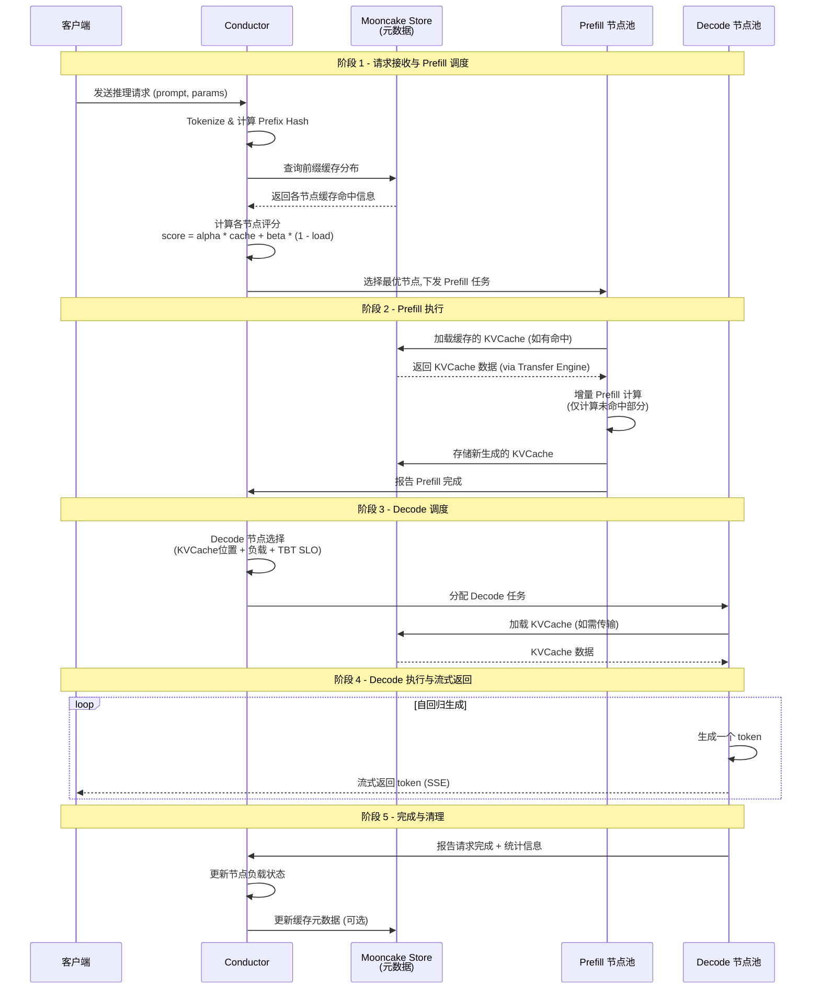

[上一篇](02-request-lifecycle.md) | [目录](../README.md) | [下一篇](../03-mooncake-store/01-storage-architecture.md)

---

# Conductor 全局调度器深度解析

> **注意**：Conductor 是 Mooncake 系统中的内部组件，**尚未开源**。本文的分析完全基于 FAST'25 论文（*Mooncake: Trading More Storage for Less Computation*）中的描述以及系统架构推导，不涉及具体源代码实现。

---

## 1. Conductor 的角色与定位

### 1.1 什么是 Conductor

Conductor 是 Mooncake 系统的**全局调度器（Global Scheduler）**，位于整个架构的控制平面（Control Plane）。它是所有客户端请求进入系统的第一个接触点，负责将请求智能地分配到 Prefill 节点池和 Decode 节点池中最合适的实例上。

在 Mooncake 的分层架构中，Conductor 的位置如下：



与传统推理系统中简单的负载均衡器不同，Conductor 是一个**具备全局视图的智能调度决策引擎**，它了解：

- 每个节点上缓存了哪些 KVCache 前缀（通过 Mooncake Store 元数据）
- 每个节点的实时负载和资源使用情况
- 请求的 token 前缀特征
- 全局 SLO 约束条件

### 1.2 为什么需要全局调度器

在 P/D 分离架构中，调度决策的质量直接决定了系统整体的性能表现。一个简单的轮询（Round-Robin）或最少连接（Least-Connection）调度策略会带来以下问题：

| 问题 | 描述 | 影响 |
|------|------|------|
| **Cache 命中率低** | 相同前缀的请求被分散到不同节点 | Prefill 重复计算，TTFT 升高 |
| **负载不均** | 热门前缀请求集中在部分节点 | 部分节点过载，整体吞吐下降 |
| **SLO 违反** | 无法感知节点的实际处理能力 | TBT 超时，用户体验下降 |
| **资源浪费** | 缓存空间未被充分利用 | 集群整体 GPU 利用率低下 |

Conductor 的设计目标正是在这些相互冲突的约束之间找到最优平衡。

---

## 2. 调度目标体系

Conductor 的调度决策需要**同时优化**多个目标，这些目标之间存在天然的张力关系。

### 2.1 四大核心调度目标



**目标 1 - 最小化 TTFT**

TTFT 由两部分组成：

$$TTFT = T_{scheduling} + T_{cache\_load} + T_{prefill\_compute}$$

其中 $T_{prefill\_compute}$ 与需要实际计算的 token 数成正比。通过最大化缓存命中，可以减少需要计算的 token 数，从而降低 TTFT。

**目标 2 - 满足 TBT SLO**

TBT SLO 是一个**硬约束**。在 Decode 阶段，每生成一个 token 的时间间隔必须低于 SLO 阈值（如 100ms、200ms 或 300ms）。Conductor 必须确保选择的 Decode 节点有足够的处理能力。

**目标 3 - 最大化 Cache 命中率**

将请求调度到已经缓存了其前缀 KVCache 的节点，可以：
- 避免重复的 Prefill 计算（节省计算量与缓存命中长度的平方成正比）
- 减少 KVCache 传输开销
- 提高 Mooncake Store 的整体缓存效率

**目标 4 - 全局负载均衡**

避免"热点效应" -- 当多个请求具有相同前缀时，仅考虑 Cache 命中会将所有请求集中到同一节点，导致：
- 该节点过载，排队延迟增加
- 其他节点空闲，资源浪费

### 2.2 目标间的冲突与权衡

这四个目标之间存在固有矛盾：

| 冲突 | 描述 |
|------|------|
| **Cache 命中 vs 负载均衡** | 追求 Cache 命中会导致请求集中；追求均衡会牺牲命中率 |
| **TTFT 最小化 vs TBT 保证** | 为了快速 Prefill 可能选择已有缓存但负载较高的节点，影响 Decode TBT |
| **短期最优 vs 长期最优** | 当前最优的调度可能导致未来某个节点成为瓶颈 |

Conductor 通过**加权评分函数**来平衡这些冲突，我们将在下一节详细分析。

---

## 3. Cache-aware 调度算法

Cache-aware 调度是 Conductor 最核心的创新。其基本思想是：在进行调度决策时，将 KVCache 的分布情况作为首要考量因素。

### 3.1 评分函数

根据 FAST'25 论文，Conductor 对每个候选 Prefill 节点计算一个综合得分。给定请求 $r$ 和候选节点集合 $N$，节点 $n$ 的调度得分为：

$$score(r, n) = \alpha \cdot \frac{cached\_prefix\_length(r, n)}{total\_prefix\_length(r)} + \beta \cdot (1 - load(n))$$

其中：

| 符号 | 含义 |
|------|------|
| $cached\_prefix\_length(r, n)$ | 节点 $n$ 上已缓存的请求 $r$ 的前缀 KVCache 长度（token 数） |
| $total\_prefix\_length(r)$ | 请求 $r$ 的总前缀长度（即 prompt 的 token 数） |
| $load(n)$ | 节点 $n$ 的当前归一化负载（0 到 1 之间） |
| $\alpha$ | Cache 命中权重 |
| $\beta$ | 负载均衡权重 |

**评分函数的直觉**：

- 第一项 $\frac{cached\_prefix\_length}{total\_prefix\_length}$ 衡量的是缓存命中比例。值越高，意味着该节点可以复用越多的 KVCache，需要实际 Prefill 计算的 token 越少
- 第二项 $(1 - load(n))$ 衡量节点的空闲程度。负载越低的节点得分越高，鼓励将请求分散到空闲节点

### 3.2 伪代码实现

以下伪代码展示了 Conductor 的调度决策过程：

```python
# 伪代码 - Conductor 调度决策（基于论文描述推导）

def schedule_prefill(request, prefill_nodes, mooncake_store):
    """
    为请求选择最优的 Prefill 节点
    """
    # 1. Tokenize 并计算 prefix hash
    tokens = tokenizer.encode(request.prompt)
    prefix_hash = compute_prefix_hash(tokens)
    total_length = len(tokens)

    # 2. 查询各节点的缓存命中情况
    cache_info = mooncake_store.query_prefix_locations(prefix_hash)

    # 3. 对每个候选节点计算得分
    best_node = None
    best_score = -1

    for node in prefill_nodes:
        # 3a. 检查节点是否过载（硬约束）
        if node.is_overloaded():
            continue

        # 3b. 计算缓存命中得分
        cached_length = cache_info.get(node.id, 0)
        cache_score = cached_length / total_length

        # 3c. 计算负载得分
        load_score = 1.0 - node.current_load()

        # 3d. 综合评分
        score = alpha * cache_score + beta * load_score

        if score > best_score:
            best_score = score
            best_node = node

    # 4. 如果没有可用节点，进入过载保护
    if best_node is None:
        return handle_overload(request)

    return best_node
```

### 3.3 参数 alpha 和 beta 的权衡

$\alpha$ 和 $\beta$ 的取值直接影响调度策略的倾向性：

| 配置 | 行为特征 | 适用场景 |
|------|----------|----------|
| $\alpha \gg \beta$ | 强烈倾向缓存命中 | 前缀重复率高、节点数量充足 |
| $\alpha \approx \beta$ | 平衡缓存与负载 | 通用工作负载 |
| $\alpha \ll \beta$ | 强烈倾向负载均衡 | 前缀分散、节点负载差异大 |

在实际生产环境中，这两个参数需要根据工作负载特征和集群规模进行调优。论文指出，在 Kimi 的真实场景中，用户请求存在大量共享前缀（如系统 prompt、常见文档前缀），因此较高的 $\alpha$ 值通常能带来更好的效果。

### 3.4 计算节省量分析

Cache 命中带来的计算节省是**超线性**的。假设总 prompt 长度为 $L$ tokens，缓存命中长度为 $C$ tokens：

$$\text{节省的计算量} \propto C^2$$

这是因为 Self-Attention 的计算复杂度是 $O(n^2)$，跳过前 $C$ 个 token 的 Prefill 计算后：

| 场景 | 总长度 | 缓存命中 | 需计算 | 计算量（相对） | 节省 |
|------|--------|----------|--------|---------------|------|
| 无缓存 | 8000 | 0 | 8000 | 6400 万 | 0% |
| 50% 命中 | 8000 | 4000 | 4000 | 1600 万 | 75% |
| 75% 命中 | 8000 | 6000 | 2000 | 400 万 | 94% |

这解释了为什么 Cache-aware 调度能够带来如此显著的性能提升 -- 即使只提升少量的缓存命中长度，也能大幅减少 Prefill 计算时间。

---

## 4. Prefill 调度策略

### 4.1 调度流程详解

当一个新请求到达 Conductor 时，Prefill 调度的完整流程如下：

**第一步 - 请求预处理**

Conductor 接收到客户端请求后，首先对 prompt 进行 tokenize，并按照固定的 chunk 大小（如每 256 或 512 个 token 为一块）计算每个前缀块的哈希值。这些哈希值用于在 Mooncake Store 的全局元数据中查找匹配的缓存条目。



**第二步 - 全局缓存状态查询**

Conductor 向 Mooncake Store 的元数据服务查询，获取各 Prefill 节点上已缓存的前缀信息。查询结果是一个映射：每个节点 ID 对应该节点上与当前请求前缀匹配的最长缓存长度。

**第三步 - 候选节点评分与选择**

Conductor 对所有未过载的 Prefill 节点应用评分函数，选择得分最高的节点。

**第四步 - 下发任务**

将请求及其缓存命中信息（命中了哪些 chunk、从哪里加载）一起下发给选中的 Prefill 节点。

### 4.2 实例选择策略

Prefill 实例选择不仅考虑评分函数，还需要满足一系列硬约束：

| 约束 | 说明 |
|------|------|
| **显存可用性** | 节点必须有足够的 GPU 显存容纳新请求的 KVCache |
| **队列深度** | 节点的待处理队列不能超过阈值（避免排队延迟过长） |
| **健康状态** | 节点必须处于健康状态（通过心跳检测） |
| **SLO 可行性** | 预估在该节点上的 TTFT 不能超过 SLO 阈值 |

### 4.3 缓存命中优化

Conductor 在进行缓存查询时，利用 Mooncake Store 的 **Radix Tree（基数树）** 结构进行高效的最长前缀匹配：

```
请求 prompt tokens: [t1, t2, t3, ..., t8000]

Mooncake Store 缓存树:
├─ [t1, t2, ..., t4096]     -> 存储在 Node 1, Node 3
│  ├─ [... t6000]           -> 存储在 Node 1
│  └─ [... t5000]           -> 存储在 Node 2
└─ [t1, t2, ..., t2048]     -> 存储在 Node 4, Node 5

匹配结果:
  Node 1: 命中 6000 tokens (最长匹配)
  Node 2: 命中 5000 tokens
  Node 3: 命中 4096 tokens
  Node 4: 命中 2048 tokens
  Node 5: 命中 2048 tokens
```

Conductor 会结合各节点的命中长度和负载情况，选出最优节点。在上例中，如果 Node 1 负载适中，它将被优先选择（6000 token 命中带来的计算节省远超负载差异）。

---

## 5. Decode 调度策略

### 5.1 Decode 调度的特殊性

与 Prefill 调度不同，Decode 调度发生在 Prefill 完成之后，此时 KVCache 已经生成完毕。Decode 调度的核心问题是：**将请求分配到哪个 Decode 节点，以最小化 KVCache 传输开销并保证 TBT SLO**。

### 5.2 Decode 节点选择策略

Conductor 在选择 Decode 节点时，考虑三个关键因素：

**因素 1 - KVCache 位置**



**因素 2 - 实时负载与 Batch 槽位**

每个 Decode 节点使用 Continuous Batching 技术同时处理多个请求。Conductor 需要确保选择的节点有空闲的 batch 槽位，并且当前 batch 中的请求总量不会导致 TBT 超时。

**因素 3 - TBT SLO 保证**

Conductor 需要预估：如果将当前请求加入某 Decode 节点的 batch，该节点上所有请求（包括新请求）的 TBT 是否仍能满足 SLO。这需要考虑：
- 当前 batch 大小
- 每个请求的 KVCache 大小（影响 Attention 计算量）
- GPU 的实际处理能力

### 5.3 KVCache 传输路径优化

当 KVCache 需要从 Prefill 节点或 Mooncake Store 传输到 Decode 节点时，Conductor 协调传输过程。传输路径的选择考虑网络拓扑：

| 传输场景 | 路径 | 延迟特性 |
|----------|------|----------|
| 同机架内传输 | Prefill -> Decode（直连） | 低延迟，高带宽 |
| 跨机架传输 | Prefill -> Store -> Decode | 中等延迟 |
| 从 Store 拉取 | Store Node -> Decode | 取决于 Store 节点位置 |

Mooncake 支持**传输与计算重叠** -- Decode 节点在收到部分 KVCache 后就可以开始执行，无需等待全部传输完成。

---

## 6. Chunked Pipeline Parallelism (CPP)

### 6.1 长上下文的挑战

当请求的上下文长度极长（如 128K tokens）时，单个 Prefill 节点可能无法在 SLO 允许的时间内完成 Prefill 计算。以 LLaMA3-70B 模型为例：

| 上下文长度 | KVCache 大小 | 单节点 Prefill 时间 (估算) |
|------------|-------------|--------------------------|
| 4K tokens | 1.28 GB | ~0.5 秒 |
| 32K tokens | 10.24 GB | ~4 秒 |
| 128K tokens | 40.96 GB | ~30+ 秒 |

对于 128K 上下文，单节点 Prefill 时间可能超过 30 秒，远超 TTFT SLO 阈值。

### 6.2 传统方案的局限

**Sequence Parallelism (SP)** 是处理长上下文的传统方法，将序列分布到多个节点并行处理。但 SP 存在严重的通信瓶颈：

- 每一层 Transformer 需要 2 次 AllReduce 操作
- 对于 80 层模型，总共需要 160 次跨节点通信
- 通信开销随节点数增加而线性增长

### 6.3 CPP 的设计思想

Mooncake 提出了 **Chunked Pipeline Parallelism (CPP)**，核心思想是将长上下文按 chunk 分割后，采用**流水线并行**而非序列并行的方式处理：



**CPP vs SP 通信开销对比**：

| 方案 | 通信模式 | 每层通信次数 | 总通信量 |
|------|----------|-------------|----------|
| Sequence Parallelism | AllReduce | 2 | $2 \times L \times N$ |
| CPP | 点对点 KVCache 传输 | 1（层间） | $N \times KV\_size$ |

CPP 的优势在于：
1. 通信模式从 AllReduce（全对全）变为**点对点传输**
2. KVCache 传输可以与下一个 chunk 的计算重叠
3. 通信量与模型层数无关，仅与 KVCache 大小成正比

### 6.4 CPP 的调度协调

Conductor 在处理长上下文请求时，需要协调 CPP 的执行：

1. **判断是否启用 CPP**：基于请求长度和 TTFT SLO 判断单节点是否能满足要求
2. **确定分块数量**：根据可用 Prefill 节点数和最优 chunk 大小确定
3. **选择参与节点**：选择一组网络拓扑上相近的 Prefill 节点，最小化传输延迟
4. **协调流水线执行**：确保各节点按顺序接收上一阶段的 KVCache 并开始计算

---

## 7. 热前缀迁移策略

### 7.1 热点问题的成因

在实际生产环境中，部分前缀会被大量请求共享。例如：

- **系统 Prompt**：所有使用同一系统指令的请求共享前缀
- **热门文档**：被频繁引用的文档内容
- **模板前缀**：常见的对话模板或格式指令

这些"热前缀"如果只缓存在少数节点上，会导致这些节点成为瓶颈。

### 7.2 启发式热点迁移

论文描述了一种**启发式热点迁移策略**，核心思想是：

> 当某个前缀的缓存被频繁命中且所在节点负载较高时，自动将该前缀的 KVCache 副本复制到其他节点，实现热点数据的分散。

迁移决策的触发条件：

```python
# 伪代码 - 热前缀迁移判断（基于论文描述推导）

def should_migrate_prefix(prefix, source_node, cluster_state):
    """
    判断是否需要将热前缀迁移（复制）到其他节点
    """
    # 条件 1: 前缀被频繁访问
    access_rate = get_recent_access_rate(prefix)
    if access_rate < HOT_THRESHOLD:
        return False

    # 条件 2: 源节点负载高于集群平均
    avg_load = cluster_state.average_load()
    if source_node.load < avg_load * LOAD_RATIO_THRESHOLD:
        return False

    # 条件 3: 存在负载较低的目标节点
    target_candidates = [n for n in cluster_state.nodes
                         if n.load < avg_load
                         and n.has_storage_capacity(prefix.size)]
    if not target_candidates:
        return False

    return True
```

### 7.3 迁移策略的优势

相比静态副本策略，Mooncake 的热前缀迁移具有以下特点：

| 特点 | 说明 |
|------|------|
| **自适应** | 根据实时访问模式动态调整，无需人工配置 |
| **无需精确预测** | 基于历史访问频率的启发式判断，不依赖复杂的流量预测模型 |
| **渐进式** | 热度上升时逐步增加副本，热度下降时自然淘汰（通过 LRU/SIEVE 驱逐） |
| **存储高效** | 只为真正的热前缀创建副本，不浪费存储空间 |

迁移完成后，后续具有相同前缀的请求就可以被 Conductor 分散调度到多个持有副本的节点，从而打破热点瓶颈。

---

## 8. 调度决策树

以下流程图展示了 Conductor 处理一个请求的完整调度决策过程：



---

## 9. Conductor 与 P/D 节点池的交互

以下时序图展示了 Conductor 在一次完整请求处理过程中与各组件的交互细节：



---

## 10. 生产环境效果与关键数据

### 10.1 Cache 命中率提升

得益于 Conductor 的 Cache-aware 调度，Mooncake 在实际部署中实现了显著的缓存命中率提升：

| 缓存策略 | 命中率 | Prefill 计算时间节省 |
|----------|--------|---------------------|
| 本地 Cache（无全局调度） | ~50% 理论最大值 | 基准 |
| Mooncake Store + Conductor | **2.36x** 本地 Cache | 最高 **48%** |

### 10.2 有效请求容量提升

在不同 TBT SLO 阈值下，Mooncake 相比 vLLM 基准系统的有效请求容量提升：

| TBT SLO 阈值 | 提升幅度 | 场景特征 |
|--------------|----------|----------|
| 100 ms | **+498%** | 严格 SLO（实时对话） |
| 200 ms | **+157%** | 中等 SLO |
| 300 ms | **+59%** | 宽松 SLO |

在严格 SLO（100ms）下提升最为显著，这是因为 P/D 分离 + Cache-aware 调度彻底消除了 Prefill 对 Decode 的干扰，使得 Decode 节点的 TBT 可以保持稳定。

### 10.3 生产集群效果

在 Kimi 的实际生产集群中：

| 集群类型 | 处理能力提升 |
|----------|------------|
| A800 集群 | **+115%** |
| H800 集群 | **+107%** |

---

## 11. 设计总结

### 11.1 Conductor 的核心设计理念

| 理念 | 实现方式 |
|------|----------|
| **KVCache 中心化** | 以 KVCache 分布作为调度决策的首要因素 |
| **全局视图** | 集中式调度器掌握所有节点的缓存和负载状态 |
| **SLO 驱动** | TBT SLO 作为硬约束过滤不满足条件的节点 |
| **自适应热点** | 启发式热前缀迁移，无需人工干预 |
| **可扩展** | CPP 方案将长上下文分散到多节点，突破单节点瓶颈 |

### 11.2 值得关注的未来方向

由于 Conductor 尚未开源，以下是基于论文描述和架构分析推测的潜在改进方向：

1. **更精细的负载预测** -- 结合历史数据预测未来负载，进行预防性调度
2. **多模型支持** -- 在异构集群中同时服务多个模型，需要更复杂的资源分配策略
3. **分布式 Conductor** -- 当集群规模超过一定阈值时，单个 Conductor 可能成为瓶颈，需要考虑分布式调度方案
4. **更智能的 CPP 分块策略** -- 根据注意力模式自适应确定最优 chunk 大小和分块方式
5. **与推理引擎的深度协同** -- 如与 vLLM 的 Speculative Decoding、SGLang 的 RadixAttention 等技术协同优化

---

[上一篇](02-request-lifecycle.md) | [目录](../README.md) | [下一篇](../03-mooncake-store/01-storage-architecture.md)
