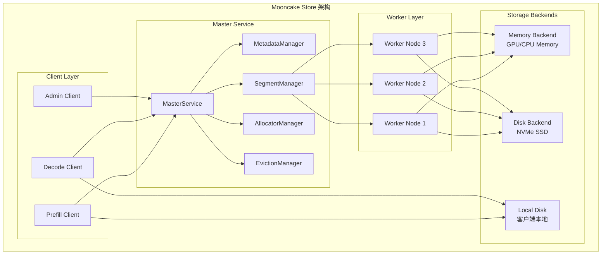
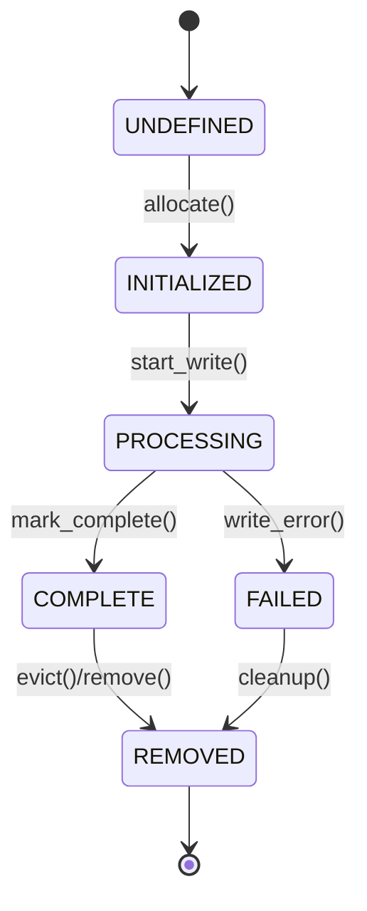
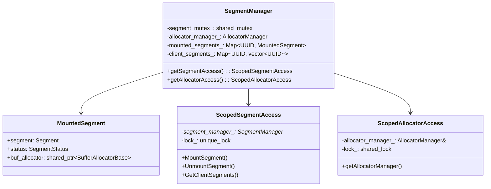
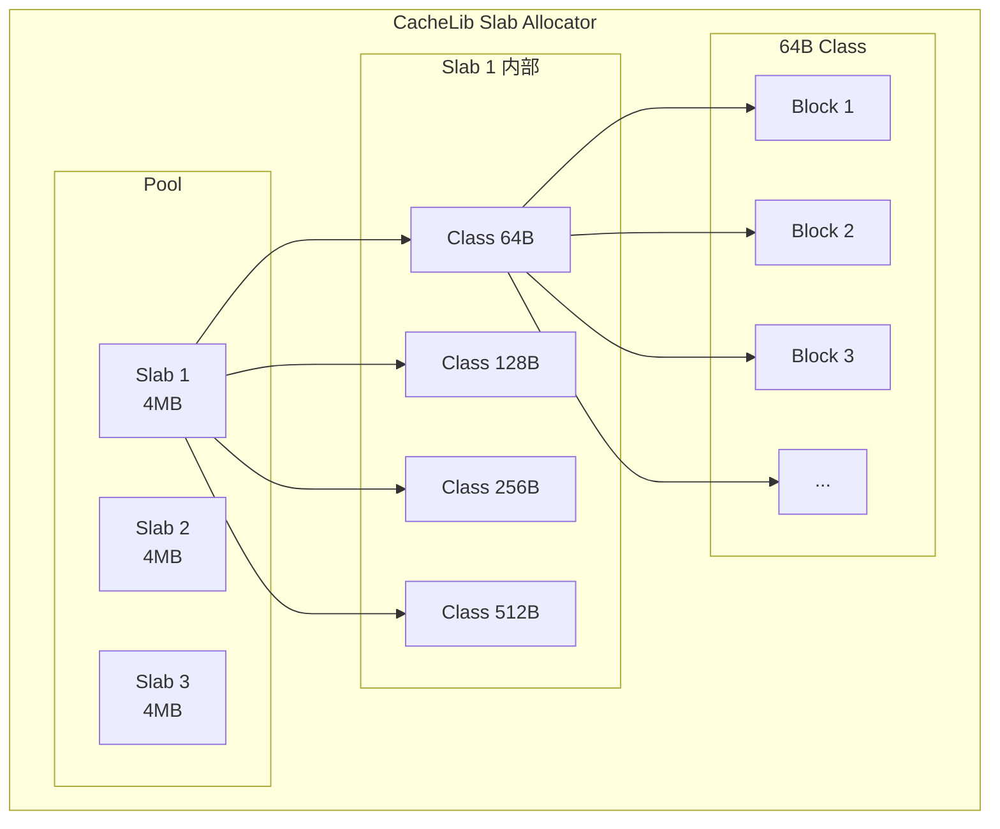
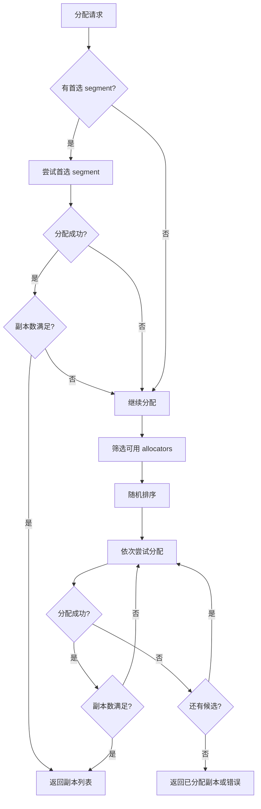

# 存储架构设计

[上一篇](../02-architecture/) | [目录](../README.md) | [下一篇](02-master-service.md)

---

本部分深入分析 Mooncake Store 的内部实现，包括存储架构设计、元数据管理、内存分配器、副本管理、驱逐策略以及高可用机制。

## 5.1 整体存储架构

Mooncake Store 是一个专门为 KVCache 设计的分布式存储系统。与传统的分布式存储不同，它针对 LLM 推理场景进行了深度优化：



## 5.2 核心数据结构

### 5.2.1 类型定义（types.h）

从 `mooncake-store/include/types.h` 中可以看到系统的核心类型定义：

```cpp
// 关键类型别名
using ObjectKey = std::string;          // 对象键
using Version = uint64_t;               // 版本号
using SegmentId = int64_t;              // 段 ID
using UUID = std::pair<uint64_t, uint64_t>; // 唯一标识符

// 错误码枚举（部分）
enum class ErrorCode : int32_t {
    OK = 0,
    INTERNAL_ERROR = -1,
    NO_AVAILABLE_HANDLE = -200,   // 内存分配失败
    OBJECT_NOT_FOUND = -704,      // 对象未找到
    OBJECT_ALREADY_EXISTS = -705, // 对象已存在
    OBJECT_HAS_LEASE = -706,      // 对象持有租约
    // ...
};

// Segment 结构：表示一块连续的内存区域
struct Segment {
    UUID id{0, 0};
    std::string name{};       // 逻辑段名称
    uintptr_t base{0};        // 基地址
    size_t size{0};           // 大小
    std::string te_endpoint{}; // Transfer Engine 端点
};
```

### 5.2.2 副本管理（replica.h）

副本（Replica）是 Mooncake Store 中数据存储的基本单元：

```cpp
// 副本类型
enum class ReplicaType {
    MEMORY,     // 内存副本（GPU/CPU）
    DISK,       // 磁盘副本（共享存储）
    LOCAL_DISK  // 本地磁盘副本
};

// 副本状态机
enum class ReplicaStatus {
    UNDEFINED = 0,   // 未初始化
    INITIALIZED,     // 空间已分配，等待写入
    PROCESSING,      // 写入进行中
    COMPLETE,        // 写入完成，可用
    REMOVED,         // 已移除
    FAILED,          // 失败状态
};

// 副本配置
struct ReplicateConfig {
    size_t replica_num{1};              // 副本数量
    bool with_soft_pin{false};          // 软钉住（soft pin）
    std::string preferred_segment{};     // 首选段
    bool prefer_alloc_in_same_node{false}; // 优先在同节点分配
};
```

副本状态转换图：



### 5.2.3 Replica 类实现

```cpp
class Replica {
public:
    // 内存副本构造函数
    Replica(std::unique_ptr<AllocatedBuffer> buffer, ReplicaStatus status)
        : data_(MemoryReplicaData{std::move(buffer)}), status_(status) {}

    // 磁盘副本构造函数
    Replica(std::string file_path, uint64_t object_size, ReplicaStatus status)
        : data_(DiskReplicaData{std::move(file_path), object_size}),
          status_(status) {
        // RAII 方式更新文件大小指标
        MasterMetricManager::instance().inc_allocated_file_size(object_size);
    }

    // 本地磁盘副本构造函数
    Replica(UUID client_id, uint64_t object_size,
            std::string transport_endpoint, ReplicaStatus status)
        : data_(LocalDiskReplicaData{client_id, object_size,
                                     std::move(transport_endpoint)}),
          status_(status) {}

    // 获取副本描述符（用于网络传输）
    [[nodiscard]] Descriptor get_descriptor() const;

    // 类型检查
    [[nodiscard]] bool is_memory_replica() const;
    [[nodiscard]] bool is_disk_replica() const;
    [[nodiscard]] bool is_local_disk_replica() const;

    // 标记完成
    void mark_complete() {
        if (status_ == ReplicaStatus::PROCESSING) {
            status_ = ReplicaStatus::COMPLETE;
        }
    }

private:
    // 使用 std::variant 实现类型安全的联合体
    std::variant<MemoryReplicaData, DiskReplicaData, LocalDiskReplicaData> data_;
    ReplicaStatus status_{ReplicaStatus::UNDEFINED};
};
```

## 5.3 Segment 管理

### 5.3.1 Segment 层次结构



### 5.3.2 Segment 状态

```cpp
enum class SegmentStatus {
    UNDEFINED = 0,  // 未初始化
    OK,             // 已挂载，可用于分配
    UNMOUNTING,     // 正在卸载
};
```

### 5.3.3 RAII 风格的访问控制

Mooncake Store 使用 RAII（Resource Acquisition Is Initialization）模式来保证线程安全：

```cpp
// Segment 访问的 RAII 封装
class ScopedSegmentAccess {
public:
    explicit ScopedSegmentAccess(SegmentManager* segment_manager,
                                 std::shared_mutex& mutex)
        : segment_manager_(segment_manager), lock_(mutex) {}

    // 挂载 segment
    ErrorCode MountSegment(const Segment& segment, const UUID& client_id);

    // 准备卸载（删除分配器）
    ErrorCode PrepareUnmountSegment(const UUID& segment_id,
                                    size_t& metrics_dec_capacity);

    // 提交卸载（删除 segment）
    ErrorCode CommitUnmountSegment(const UUID& segment_id,
                                   const UUID& client_id,
                                   const size_t& metrics_dec_capacity);

private:
    SegmentManager* segment_manager_;
    std::unique_lock<std::shared_mutex> lock_;  // 独占锁
};

// Allocator 访问的 RAII 封装
class ScopedAllocatorAccess {
public:
    explicit ScopedAllocatorAccess(const AllocatorManager& allocator_manager,
                                   std::shared_mutex& mutex)
        : allocator_manager_(allocator_manager), lock_(mutex) {}

    const AllocatorManager& getAllocatorManager() { return allocator_manager_; }

private:
    const AllocatorManager& allocator_manager_;
    std::shared_lock<std::shared_mutex> lock_;  // 共享锁（读锁）
};
```

这种设计的优势：
1. **自动释放锁**：离开作用域时自动释放，避免死锁
2. **读写分离**：Segment 操作用独占锁，Allocator 查询用共享锁
3. **编译时检查**：类型系统保证正确使用

## 5.4 内存分配器

### 5.4.1 分配器类型

Mooncake Store 支持两种内存分配器：

```cpp
enum class BufferAllocatorType {
    CACHELIB = 0,  // Facebook CacheLib 分配器
    OFFSET = 1,    // Offset 分配器
};
```

### 5.4.2 分配器接口

```cpp
class BufferAllocatorBase {
public:
    virtual ~BufferAllocatorBase() = default;

    // 分配内存
    virtual std::unique_ptr<AllocatedBuffer> allocate(size_t size) = 0;

    // 释放内存
    virtual void deallocate(AllocatedBuffer* handle) = 0;

    // 容量信息
    virtual size_t capacity() const = 0;
    virtual size_t size() const = 0;

    // 元数据
    virtual std::string getSegmentName() const = 0;
    virtual std::string getTransportEndpoint() const = 0;

    // 获取最大可用空闲区域（用于分配决策）
    virtual size_t getLargestFreeRegion() const = 0;
};
```

### 5.4.3 CacheLib 分配器

CacheLib 是 Facebook 开源的高性能缓存库，采用 Slab 分配策略：

```cpp
class CachelibBufferAllocator
    : public BufferAllocatorBase,
      public std::enable_shared_from_this<CachelibBufferAllocator> {
public:
    CachelibBufferAllocator(std::string segment_name, size_t base, size_t size,
                            std::string transport_endpoint);

    std::unique_ptr<AllocatedBuffer> allocate(size_t size) override;
    void deallocate(AllocatedBuffer* handle) override;

    // CacheLib 无法精确获知最大空闲区域，返回特殊值
    size_t getLargestFreeRegion() const override {
        return kAllocatorUnknownFreeSpace;
    }

private:
    const std::string segment_name_;
    const size_t base_;
    const size_t total_size_;
    std::atomic_size_t cur_size_;

    // CacheLib 内部结构
    std::unique_ptr<char[]> header_region_start_;
    std::unique_ptr<facebook::cachelib::MemoryAllocator> memory_allocator_;
    facebook::cachelib::PoolId pool_id_;
};
```

CacheLib Slab 分配原理：



### 5.4.4 Offset 分配器

Offset 分配器提供更精细的内存管理：

```cpp
class OffsetBufferAllocator
    : public BufferAllocatorBase,
      public std::enable_shared_from_this<OffsetBufferAllocator> {
public:
    OffsetBufferAllocator(std::string segment_name, size_t base, size_t size,
                          std::string transport_endpoint);

    std::unique_ptr<AllocatedBuffer> allocate(size_t size) override;
    void deallocate(AllocatedBuffer* handle) override;

    // Offset 分配器可以返回精确的最大空闲区域
    size_t getLargestFreeRegion() const override;

private:
    const std::string segment_name_;
    const size_t base_;
    const size_t total_size_;
    std::atomic_size_t cur_size_;

    // 使用 offset_allocator 库
    std::shared_ptr<offset_allocator::OffsetAllocator> offset_allocator_;
};
```

### 5.4.5 AllocatedBuffer

`AllocatedBuffer` 是分配结果的 RAII 封装：

```cpp
class AllocatedBuffer {
public:
    AllocatedBuffer(std::shared_ptr<BufferAllocatorBase> allocator,
                    void* buffer_ptr, std::size_t size,
                    std::optional<offset_allocator::OffsetAllocationHandle>&&
                        offset_handle = std::nullopt)
        : allocator_(std::move(allocator)),  // 使用 weak_ptr 避免循环引用
          buffer_ptr_(buffer_ptr),
          size_(size),
          offset_handle_(std::move(offset_handle)) {}

    ~AllocatedBuffer(); // 析构时自动归还内存

    // 获取描述符（用于 RDMA 传输）
    [[nodiscard]] Descriptor get_descriptor() const;

    // 描述符结构
    struct Descriptor {
        uint64_t size_;
        uintptr_t buffer_address_;      // RDMA 远程地址
        std::string transport_endpoint_; // 传输端点
    };

private:
    std::weak_ptr<BufferAllocatorBase> allocator_;  // 弱引用
    void* buffer_ptr_{nullptr};
    std::size_t size_{0};
    std::optional<offset_allocator::OffsetAllocationHandle> offset_handle_;
};
```

## 5.5 分配策略

### 5.5.1 分配策略接口

```cpp
class AllocationStrategy {
public:
    virtual ~AllocationStrategy() = default;

    // 分配副本
    virtual tl::expected<std::vector<Replica>, ErrorCode> Allocate(
        const AllocatorManager& allocator_manager,
        uint64_t size,
        size_t replica_num,
        const std::vector<std::string>& preferred_segments) = 0;
};
```

### 5.5.2 随机分配策略

```cpp
class RandomAllocationStrategy : public AllocationStrategy {
public:
    tl::expected<std::vector<Replica>, ErrorCode> Allocate(
        const AllocatorManager& allocator_manager,
        uint64_t size,
        size_t replica_num,
        const std::vector<std::string>& preferred_segments) override {

        std::vector<Replica> replicas;
        auto& allocators = allocator_manager.getAllocators();

        // 1. 首先尝试首选 segment
        for (const auto& preferred : preferred_segments) {
            if (auto it = allocators.find(preferred); it != allocators.end()) {
                auto buffer = it->second->allocate(size);
                if (buffer) {
                    replicas.emplace_back(std::move(buffer),
                                         ReplicaStatus::PROCESSING);
                    if (replicas.size() >= replica_num) {
                        return replicas;
                    }
                }
            }
        }

        // 2. 随机选择其他 segment
        std::vector<std::string> candidates;
        for (const auto& [name, alloc] : allocators) {
            if (alloc->getLargestFreeRegion() >= size) {
                candidates.push_back(name);
            }
        }

        std::shuffle(candidates.begin(), candidates.end(),
                    std::default_random_engine{});

        for (const auto& name : candidates) {
            auto buffer = allocators.at(name)->allocate(size);
            if (buffer) {
                replicas.emplace_back(std::move(buffer),
                                     ReplicaStatus::PROCESSING);
                if (replicas.size() >= replica_num) {
                    return replicas;
                }
            }
        }

        if (replicas.empty()) {
            return tl::make_unexpected(ErrorCode::NO_AVAILABLE_HANDLE);
        }
        return replicas;
    }
};
```

分配决策流程：



---

[上一篇](../02-architecture/) | [目录](../README.md) | [下一篇](02-master-service.md)
