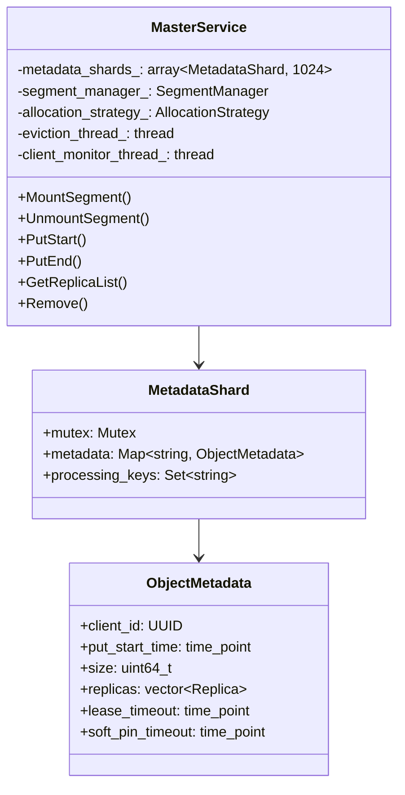
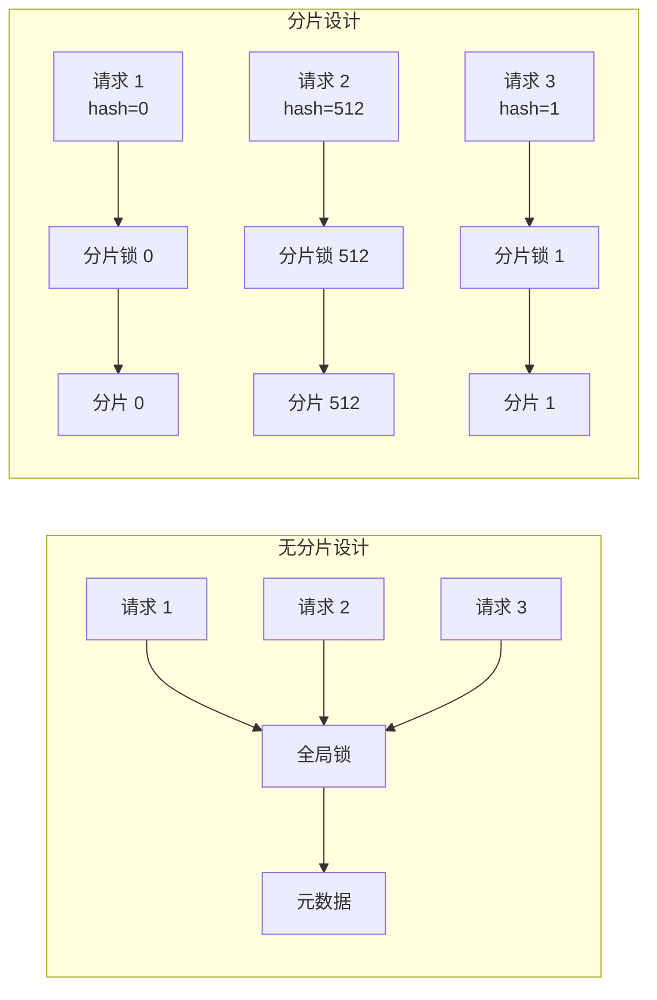
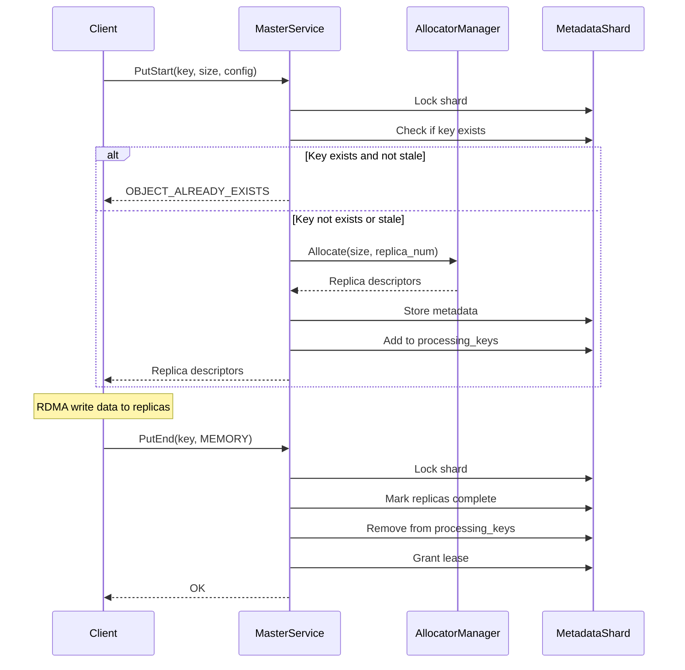
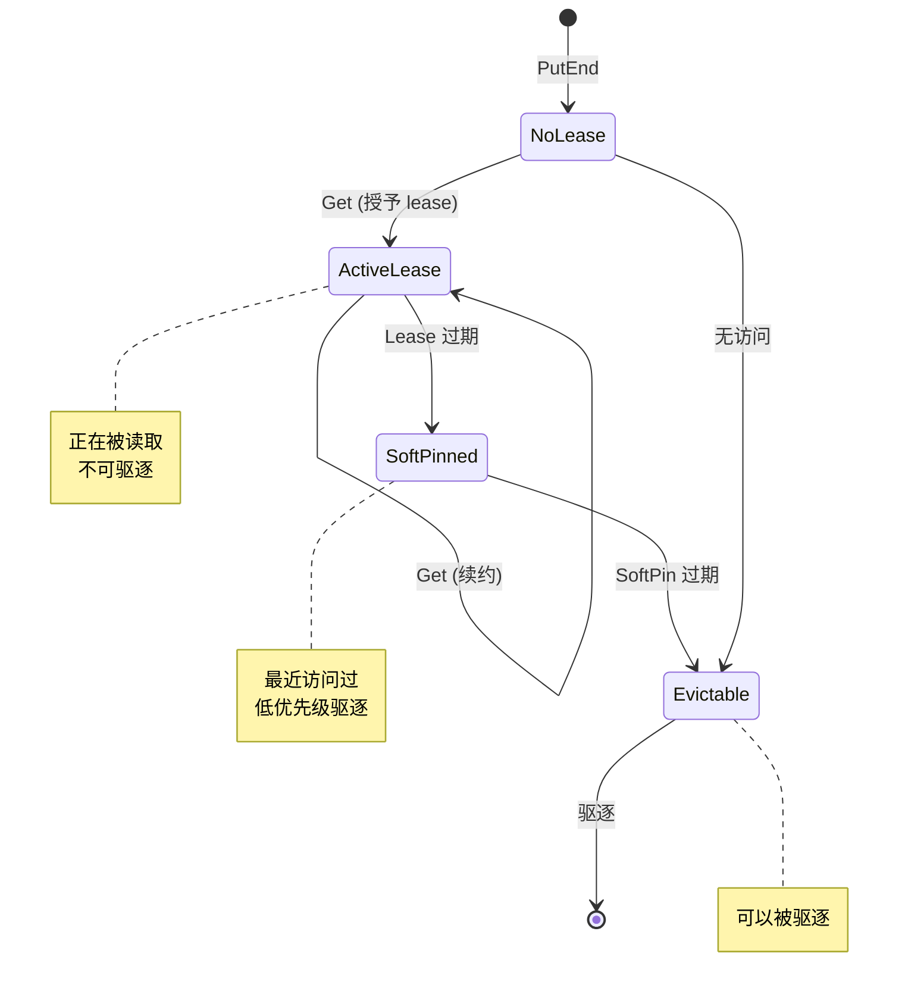
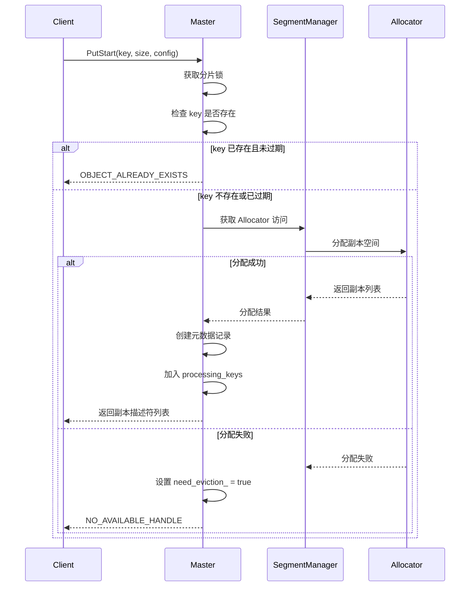
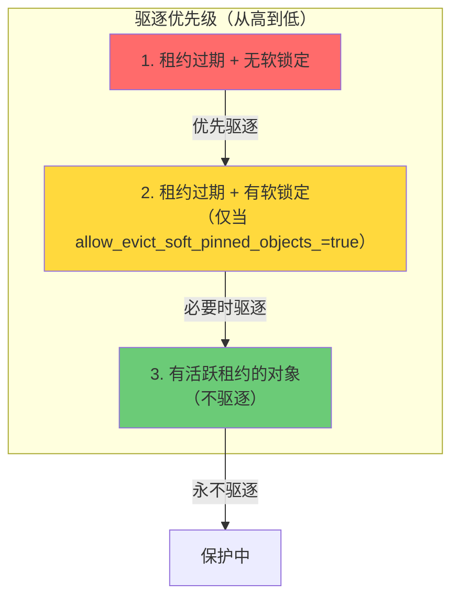
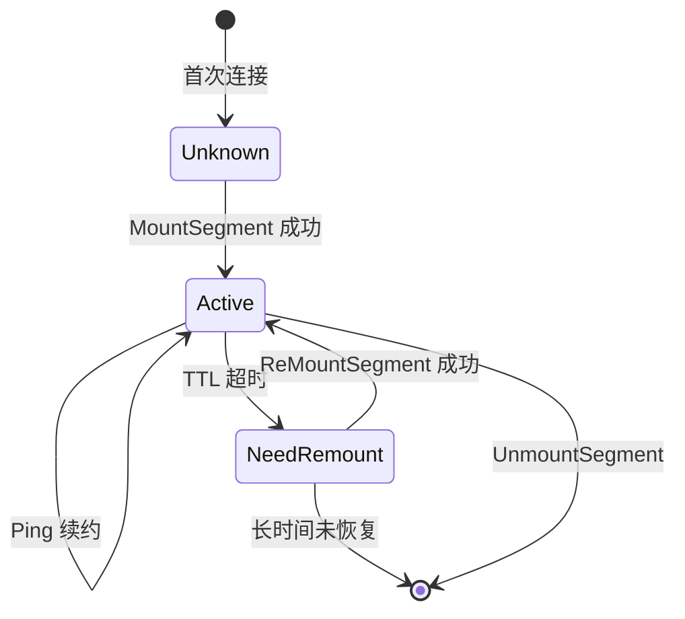

# MasterService 核心实现

[上一篇](01-storage-architecture.md) | [目录](../README.md) | [下一篇](03-eviction-and-ha.md)

---

## 6.1 MasterService 概述

MasterService 是 Mooncake Store 的核心组件，负责：
- 元数据管理
- 空间分配
- 副本管理
- 客户端监控
- 驱逐控制



## 6.2 分片元数据管理

### 6.2.1 分片设计

为了支持高并发访问，元数据被分成 1024 个分片：

```cpp
// 分片数量
static constexpr size_t kNumShards = 1024;

// 元数据分片结构
struct MetadataShard {
    mutable Mutex mutex;  // 分片级别的锁
    std::unordered_map<std::string, ObjectMetadata> metadata;
    std::unordered_set<std::string> processing_keys;  // 正在处理的 key
};

// 分片数组
std::array<MetadataShard, kNumShards> metadata_shards_;

// 分片索引计算
size_t getShardIndex(const std::string& key) const {
    return std::hash<std::string>{}(key) % kNumShards;
}
```

### 6.2.2 元数据访问器

```cpp
class MetadataAccessor {
public:
    MetadataAccessor(MasterService* service, const std::string& key)
        : service_(service),
          key_(key),
          shard_idx_(service->getShardIndex(key)),
          lock_(&service->metadata_shards_[shard_idx_].mutex) {}

    bool Exists() const {
        return service_->metadata_shards_[shard_idx_].metadata.count(key_) > 0;
    }

    ObjectMetadata& Get() {
        return service_->metadata_shards_[shard_idx_].metadata.at(key_);
    }

    void Erase() {
        service_->metadata_shards_[shard_idx_].metadata.erase(key_);
    }

    bool InProcessing() const {
        return service_->metadata_shards_[shard_idx_]
                   .processing_keys.count(key_) > 0;
    }

private:
    MasterService* service_;
    std::string key_;
    size_t shard_idx_;
    MutexLocker lock_;  // RAII 锁
};
```

分片设计的优势：



## 6.3 Put 操作实现

### 6.3.1 PutStart

```cpp
auto MasterService::PutStart(const UUID& client_id, const std::string& key,
                             const uint64_t slice_length,
                             const ReplicateConfig& config)
    -> tl::expected<std::vector<Replica::Descriptor>, ErrorCode> {

    // 1. 参数验证
    if (config.replica_num == 0 || key.empty() || slice_length == 0) {
        return tl::make_unexpected(ErrorCode::INVALID_PARAMS);
    }

    // 2. CacheLib 大小限制检查
    if ((memory_allocator_type_ == BufferAllocatorType::CACHELIB) &&
        (slice_length > kMaxSliceSize)) {
        return tl::make_unexpected(ErrorCode::INVALID_PARAMS);
    }

    // 3. 锁定分片并检查对象是否已存在
    size_t shard_idx = getShardIndex(key);
    MutexLocker lock(&metadata_shards_[shard_idx].mutex);

    const auto now = std::chrono::steady_clock::now();
    auto it = metadata_shards_[shard_idx].metadata.find(key);

    if (it != metadata_shards_[shard_idx].metadata.end() &&
        !CleanupStaleHandles(it->second)) {
        auto& metadata = it->second;

        // 处理过期的 PutStart（允许覆盖）
        if (!metadata.HasCompletedReplicas() &&
            metadata.put_start_time + put_start_discard_timeout_sec_ < now) {
            // 丢弃旧的处理中副本
            auto replicas = metadata.DiscardProcessingReplicas();
            if (!replicas.empty()) {
                std::lock_guard lock(discarded_replicas_mutex_);
                discarded_replicas_.emplace_back(
                    std::move(replicas),
                    metadata.put_start_time + put_start_release_timeout_sec_);
            }
            metadata_shards_[shard_idx].processing_keys.erase(key);
            metadata_shards_[shard_idx].metadata.erase(it);
        } else {
            return tl::make_unexpected(ErrorCode::OBJECT_ALREADY_EXISTS);
        }
    }

    // 4. 分配副本空间
    std::vector<Replica> replicas;
    {
        ScopedAllocatorAccess allocator_access =
            segment_manager_.getAllocatorAccess();

        auto allocation_result = allocation_strategy_->Allocate(
            allocator_access.getAllocatorManager(),
            slice_length,
            config.replica_num,
            preferred_segments);

        if (!allocation_result.has_value()) {
            need_eviction_ = true;  // 触发驱逐
            return tl::make_unexpected(ErrorCode::NO_AVAILABLE_HANDLE);
        }
        replicas = std::move(allocation_result.value());
    }

    // 5. 如果启用磁盘副本，添加磁盘副本
    if (use_disk_replica_) {
        std::string file_path = ResolvePath(key);
        replicas.emplace_back(file_path, slice_length, ReplicaStatus::PROCESSING);
    }

    // 6. 创建描述符列表返回给客户端
    std::vector<Replica::Descriptor> replica_list;
    for (const auto& replica : replicas) {
        replica_list.emplace_back(replica.get_descriptor());
    }

    // 7. 存储元数据
    metadata_shards_[shard_idx].metadata.emplace(
        std::piecewise_construct,
        std::forward_as_tuple(key),
        std::forward_as_tuple(client_id, now, slice_length,
                              std::move(replicas), config.with_soft_pin));

    // 8. 加入处理集合用于超时监控
    metadata_shards_[shard_idx].processing_keys.insert(key);

    return replica_list;
}
```

### 6.3.2 PutEnd

```cpp
auto MasterService::PutEnd(const UUID& client_id, const std::string& key,
                           ReplicaType replica_type)
    -> tl::expected<void, ErrorCode> {

    MetadataAccessor accessor(this, key);

    if (!accessor.Exists()) {
        return tl::make_unexpected(ErrorCode::OBJECT_NOT_FOUND);
    }

    auto& metadata = accessor.Get();

    // 验证客户端权限
    if (client_id != metadata.client_id) {
        return tl::make_unexpected(ErrorCode::ILLEGAL_CLIENT);
    }

    // 标记对应类型的副本为完成
    for (auto& replica : metadata.replicas) {
        if (replica.type() == replica_type) {
            replica.mark_complete();
        }

        // 如果启用 offload，推送到 offload 队列
        if (enable_offload_) {
            PushOffloadingQueue(key, replica);
        }
    }

    // 如果所有副本完成，从处理集合中移除
    if (metadata.IsAllReplicasComplete() && accessor.InProcessing()) {
        accessor.EraseFromProcessing();
    }

    // 更新指标
    if (replica_type == ReplicaType::MEMORY) {
        MasterMetricManager::instance().inc_mem_cache_nums();
    } else if (replica_type == ReplicaType::DISK) {
        MasterMetricManager::instance().inc_file_cache_nums();
    }

    // 授予初始租约
    metadata.GrantLease(0, default_kv_soft_pin_ttl_);

    return {};
}
```

Put 操作时序图：



## 6.4 Get 操作实现

```cpp
auto MasterService::GetReplicaList(std::string_view key)
    -> tl::expected<GetReplicaListResponse, ErrorCode> {

    MetadataAccessor accessor(this, std::string(key));

    // 更新指标
    MasterMetricManager::instance().inc_total_get_nums();

    if (!accessor.Exists()) {
        return tl::make_unexpected(ErrorCode::OBJECT_NOT_FOUND);
    }

    auto& metadata = accessor.Get();

    // 收集完成状态的副本
    std::vector<Replica::Descriptor> replica_list;
    for (const auto& replica : metadata.replicas) {
        if (replica.status() == ReplicaStatus::COMPLETE) {
            replica_list.emplace_back(replica.get_descriptor());
        }
    }

    if (replica_list.empty()) {
        return tl::make_unexpected(ErrorCode::REPLICA_IS_NOT_READY);
    }

    // 更新缓存命中指标
    if (replica_list[0].is_memory_replica()) {
        MasterMetricManager::instance().inc_mem_cache_hit_nums();
    } else if (replica_list[0].is_disk_replica()) {
        MasterMetricManager::instance().inc_file_cache_hit_nums();
    }

    MasterMetricManager::instance().inc_valid_get_nums();

    // 授予租约防止被驱逐
    metadata.GrantLease(default_kv_lease_ttl_, default_kv_soft_pin_ttl_);

    return GetReplicaListResponse(std::move(replica_list), default_kv_lease_ttl_);
}
```

## 6.5 租约机制

租约（Lease）是 Mooncake Store 保护正在使用的对象不被驱逐的机制：

```cpp
class ObjectMetadata {
public:
    // 授予租约
    void GrantLease(uint64_t lease_ttl_ms, uint64_t soft_pin_ttl_ms) {
        auto now = std::chrono::steady_clock::now();
        lease_timeout = now + std::chrono::milliseconds(lease_ttl_ms);
        if (with_soft_pin) {
            soft_pin_timeout = now + std::chrono::milliseconds(soft_pin_ttl_ms);
        }
    }

    // 检查租约是否过期
    bool IsLeaseExpired(const std::chrono::steady_clock::time_point& now
                        = std::chrono::steady_clock::now()) const {
        return now > lease_timeout;
    }

    // 检查是否软钉住
    bool IsSoftPinned(const std::chrono::steady_clock::time_point& now
                      = std::chrono::steady_clock::now()) const {
        return with_soft_pin && now <= soft_pin_timeout;
    }

public:
    UUID client_id;
    std::chrono::steady_clock::time_point put_start_time;
    uint64_t size;
    std::vector<Replica> replicas;
    std::chrono::steady_clock::time_point lease_timeout;
    std::chrono::steady_clock::time_point soft_pin_timeout;
    bool with_soft_pin{false};
};
```

租约生命周期：



---

## 代码深度解析

本节从实际源码角度深入分析 Master Service 的设计哲学和关键技术细节。

### 14.1 MasterService 类结构分析

#### 14.1.1 类定义与成员变量

MasterService 是整个 Mooncake Store 的核心控制类，管理着元数据、分段和副本。让我们从其构造函数入手：

```cpp
// 文件: mooncake-store/src/master_service.cpp

MasterService::MasterService(const MasterServiceConfig& config)
    : default_kv_lease_ttl_(config.default_kv_lease_ttl),
      default_kv_soft_pin_ttl_(config.default_kv_soft_pin_ttl),
      allow_evict_soft_pinned_objects_(config.allow_evict_soft_pinned_objects),
      eviction_ratio_(config.eviction_ratio),
      eviction_high_watermark_ratio_(config.eviction_high_watermark_ratio),
      client_live_ttl_sec_(config.client_live_ttl_sec),
      enable_ha_(config.enable_ha),
      enable_offload_(config.enable_offload),
      cluster_id_(config.cluster_id),
      root_fs_dir_(config.root_fs_dir),
      global_file_segment_size_(config.global_file_segment_size),
      enable_disk_eviction_(config.enable_disk_eviction),
      quota_bytes_(config.quota_bytes),
      segment_manager_(config.memory_allocator),
      memory_allocator_type_(config.memory_allocator),
      allocation_strategy_(std::make_shared<RandomAllocationStrategy>()),
      put_start_discard_timeout_sec_(config.put_start_discard_timeout_sec),
      put_start_release_timeout_sec_(config.put_start_release_timeout_sec) {

    // 参数验证
    if (eviction_ratio_ < 0.0 || eviction_ratio_ > 1.0) {
        LOG(ERROR) << "Eviction ratio must be between 0.0 and 1.0";
        throw std::invalid_argument("Invalid eviction ratio");
    }

    // 启动后台线程
    eviction_running_ = true;
    eviction_thread_ = std::thread(&MasterService::EvictionThreadFunc, this);

    client_monitor_running_ = true;
    client_monitor_thread_ =
        std::thread(&MasterService::ClientMonitorFunc, this);
}
```

**设计要点分析**：

1. **配置驱动**：通过 `MasterServiceConfig` 结构体集中管理所有配置参数
2. **后台线程**：自动启动两个关键后台线程
   - `eviction_thread_`：负责内存驱逐
   - `client_monitor_thread_`：负责客户端健康监控
3. **资源管理**：使用 RAII 模式，在构造时初始化，在析构时清理

#### 14.1.2 元数据分片架构

MasterService 采用分片 (Sharding) 架构来减少锁竞争：

```cpp
// 元数据分片定义
static constexpr size_t kNumShards = 256;

struct MetadataShard {
    mutable Mutex mutex;
    std::unordered_map<std::string, ObjectMetadata> metadata;
    std::unordered_set<std::string> processing_keys;
};

std::array<MetadataShard, kNumShards> metadata_shards_;

// 分片索引计算
size_t getShardIndex(const std::string& key) const {
    return std::hash<std::string>{}(key) % kNumShards;
}
```

**分片策略分析**：

```mermaid
graph TB
    subgraph "Key Space"
        K1[Key: "model/layer1"]
        K2[Key: "model/layer2"]
        K3[Key: "cache/token1"]
        K4[Key: "cache/token2"]
    end

    subgraph "Hash Function"
        H[std::hash]
    end

    subgraph "256 Shards"
        S0[Shard 0]
        S1[Shard 1]
        S127[Shard 127]
        S255[Shard 255]
    end

    K1 --> H
    K2 --> H
    K3 --> H
    K4 --> H

    H -->|hash % 256 = 42| S0
    H -->|hash % 256 = 128| S127
    H -->|hash % 256 = 7| S1
    H -->|hash % 256 = 200| S255

    style H fill:#FFD700
```

分片的好处：
- 减少锁粒度，提高并发性能
- 256 个分片在大多数场景下提供足够的并行度
- 使用标准库 `std::hash` 保证良好的分布

#### 14.1.3 MetadataAccessor 辅助类

为了简化元数据访问并确保线程安全，代码使用了 Accessor 模式：

```cpp
class MetadataAccessor {
public:
    MetadataAccessor(MasterService* service, const std::string& key)
        : service_(service),
          shard_idx_(service->getShardIndex(key)),
          key_(key) {
        // 获取分片锁
        service_->metadata_shards_[shard_idx_].mutex.lock();
    }

    ~MetadataAccessor() {
        // 释放分片锁
        service_->metadata_shards_[shard_idx_].mutex.unlock();
    }

    bool Exists() const {
        return service_->metadata_shards_[shard_idx_]
            .metadata.count(key_) > 0;
    }

    ObjectMetadata& Get() {
        return service_->metadata_shards_[shard_idx_].metadata.at(key_);
    }

    void Erase() {
        service_->metadata_shards_[shard_idx_].metadata.erase(key_);
    }

    bool InProcessing() const {
        return service_->metadata_shards_[shard_idx_]
            .processing_keys.count(key_) > 0;
    }

    void EraseFromProcessing() {
        service_->metadata_shards_[shard_idx_]
            .processing_keys.erase(key_);
    }

private:
    MasterService* service_;
    size_t shard_idx_;
    std::string key_;
};
```

**使用示例**：

```cpp
auto MasterService::GetReplicaList(std::string_view key)
    -> tl::expected<GetReplicaListResponse, ErrorCode> {
    // RAII 自动管理锁的获取和释放
    MetadataAccessor accessor(this, std::string(key));

    MasterMetricManager::instance().inc_total_get_nums();

    if (!accessor.Exists()) {
        return tl::make_unexpected(ErrorCode::OBJECT_NOT_FOUND);
    }

    auto& metadata = accessor.Get();
    // ... 处理逻辑
}
```

### 14.2 PutStart/PutEnd 事务流程

#### 14.2.1 PutStart：两阶段提交的第一阶段

`PutStart` 是写入操作的核心入口，实现了类似两阶段提交的第一阶段：

```cpp
auto MasterService::PutStart(const UUID& client_id, const std::string& key,
                             const uint64_t slice_length,
                             const ReplicateConfig& config)
    -> tl::expected<std::vector<Replica::Descriptor>, ErrorCode> {

    // 1. 参数验证
    if (config.replica_num == 0 || key.empty() || slice_length == 0) {
        return tl::make_unexpected(ErrorCode::INVALID_PARAMS);
    }

    // 2. 锁定分片
    size_t shard_idx = getShardIndex(key);
    MutexLocker lock(&metadata_shards_[shard_idx].mutex);

    const auto now = std::chrono::steady_clock::now();
    auto it = metadata_shards_[shard_idx].metadata.find(key);

    // 3. 检查对象是否已存在
    if (it != metadata_shards_[shard_idx].metadata.end() &&
        !CleanupStaleHandles(it->second)) {
        auto& metadata = it->second;

        // 处理过期的未完成写入
        if (!metadata.HasCompletedReplicas() &&
            metadata.put_start_time + put_start_discard_timeout_sec_ < now) {
            // 丢弃过期的处理中副本
            auto replicas = metadata.DiscardProcessingReplicas();
            if (!replicas.empty()) {
                std::lock_guard lock(discarded_replicas_mutex_);
                discarded_replicas_.emplace_back(
                    std::move(replicas),
                    metadata.put_start_time + put_start_release_timeout_sec_);
            }
            metadata_shards_[shard_idx].processing_keys.erase(key);
            metadata_shards_[shard_idx].metadata.erase(it);
        } else {
            return tl::make_unexpected(ErrorCode::OBJECT_ALREADY_EXISTS);
        }
    }

    // 4. 分配副本空间
    std::vector<Replica> replicas;
    {
        ScopedAllocatorAccess allocator_access =
            segment_manager_.getAllocatorAccess();
        const auto& allocator_manager = allocator_access.getAllocatorManager();

        std::vector<std::string> preferred_segments;
        if (!config.preferred_segment.empty()) {
            preferred_segments.push_back(config.preferred_segment);
        }

        // 使用分配策略分配副本
        auto allocation_result = allocation_strategy_->Allocate(
            allocator_manager, slice_length, config.replica_num,
            preferred_segments);

        if (!allocation_result.has_value()) {
            need_eviction_ = true;  // 触发驱逐
            return tl::make_unexpected(ErrorCode::NO_AVAILABLE_HANDLE);
        }

        replicas = std::move(allocation_result.value());
    }

    // 5. 创建元数据记录
    std::vector<Replica::Descriptor> replica_list;
    replica_list.reserve(replicas.size());
    for (const auto& replica : replicas) {
        replica_list.emplace_back(replica.get_descriptor());
    }

    metadata_shards_[shard_idx].metadata.emplace(
        std::piecewise_construct, std::forward_as_tuple(key),
        std::forward_as_tuple(client_id, now, total_length,
                              std::move(replicas), config.with_soft_pin));

    // 6. 加入处理中集合用于监控
    metadata_shards_[shard_idx].processing_keys.insert(key);

    return replica_list;
}
```

**流程图解**：



#### 14.2.2 PutEnd：完成事务

`PutEnd` 标记写入操作完成：

```cpp
auto MasterService::PutEnd(const UUID& client_id, const std::string& key,
                           ReplicaType replica_type)
    -> tl::expected<void, ErrorCode> {

    MetadataAccessor accessor(this, key);

    if (!accessor.Exists()) {
        return tl::make_unexpected(ErrorCode::OBJECT_NOT_FOUND);
    }

    auto& metadata = accessor.Get();

    // 安全检查：确保是同一个客户端
    if (client_id != metadata.client_id) {
        LOG(ERROR) << "Illegal client " << client_id
                   << " to PutEnd key " << key;
        return tl::make_unexpected(ErrorCode::ILLEGAL_CLIENT);
    }

    // 标记副本完成
    for (auto& replica : metadata.replicas) {
        if (replica.type() == replica_type) {
            replica.mark_complete();
        }
        // 如果启用 offload，推送到卸载队列
        if (enable_offload_) {
            PushOffloadingQueue(key, replica);
        }
    }

    // 从处理中集合移除
    if (metadata.IsAllReplicasComplete() && accessor.InProcessing()) {
        accessor.EraseFromProcessing();
    }

    // 更新指标
    if (replica_type == ReplicaType::MEMORY) {
        MasterMetricManager::instance().inc_mem_cache_nums();
    } else if (replica_type == ReplicaType::DISK) {
        MasterMetricManager::instance().inc_file_cache_nums();
    }

    // 初始化租约
    metadata.GrantLease(0, default_kv_soft_pin_ttl_);

    return {};
}
```

#### 14.2.3 PutRevoke：事务回滚

当写入失败时，客户端可以调用 `PutRevoke` 回滚：

```cpp
auto MasterService::PutRevoke(const UUID& client_id, const std::string& key,
                              ReplicaType replica_type)
    -> tl::expected<void, ErrorCode> {

    MetadataAccessor accessor(this, key);

    if (!accessor.Exists()) {
        return tl::make_unexpected(ErrorCode::OBJECT_NOT_FOUND);
    }

    auto& metadata = accessor.Get();

    // 安全验证
    if (client_id != metadata.client_id) {
        return tl::make_unexpected(ErrorCode::ILLEGAL_CLIENT);
    }

    // 验证副本状态必须是 PROCESSING
    if (auto status = metadata.HasDiffRepStatus(ReplicaStatus::PROCESSING,
                                                replica_type)) {
        return tl::make_unexpected(ErrorCode::INVALID_WRITE);
    }

    // 更新指标并删除副本
    if (replica_type == ReplicaType::MEMORY) {
        MasterMetricManager::instance().dec_mem_cache_nums();
    }

    metadata.EraseReplica(replica_type);

    // 从处理中集合移除
    if (metadata.IsAllReplicasComplete() && accessor.InProcessing()) {
        accessor.EraseFromProcessing();
    }

    // 如果没有有效副本，删除整个对象
    if (metadata.IsValid() == false) {
        accessor.Erase();
    }

    return {};
}
```

### 14.3 驱逐机制深度解析

#### 14.3.1 驱逐线程主循环

驱逐线程持续运行，根据内存使用率触发驱逐：

```cpp
void MasterService::EvictionThreadFunc() {
    VLOG(1) << "action=eviction_thread_started";

    while (eviction_running_) {
        double used_ratio =
            MasterMetricManager::instance().get_global_mem_used_ratio();

        // 两种触发条件：
        // 1. 使用率超过高水位线
        // 2. 有显式的驱逐请求（need_eviction_）
        if (used_ratio > eviction_high_watermark_ratio_ ||
            (need_eviction_ && eviction_ratio_ > 0.0)) {

            // 计算驱逐目标比例
            double evict_ratio_target = std::max(
                eviction_ratio_,
                used_ratio - eviction_high_watermark_ratio_ + eviction_ratio_);
            double evict_ratio_lowerbound =
                std::max(evict_ratio_target * 0.5,
                         used_ratio - eviction_high_watermark_ratio_);

            BatchEvict(evict_ratio_target, evict_ratio_lowerbound);
        }

        std::this_thread::sleep_for(
            std::chrono::milliseconds(kEvictionThreadSleepMs));
    }
}
```

#### 14.3.2 批量驱逐算法

驱逐算法采用两阶段策略，优先驱逐没有软锁定的对象：

```cpp
void MasterService::BatchEvict(double evict_ratio_target,
                               double evict_ratio_lowerbound) {
    auto now = std::chrono::steady_clock::now();
    long evicted_count = 0;
    long object_count = 0;
    uint64_t total_freed_size = 0;

    // 候选对象分类
    std::vector<std::chrono::steady_clock::time_point> no_pin_objects;
    std::vector<std::chrono::steady_clock::time_point> soft_pin_objects;

    // 随机选择起始分片，避免驱逐不均衡
    size_t start_idx = rand() % metadata_shards_.size();

    // ========== 第一阶段：驱逐无软锁定且租约过期的对象 ==========
    for (size_t i = 0; i < metadata_shards_.size(); i++) {
        auto& shard = metadata_shards_[(start_idx + i) % metadata_shards_.size()];
        MutexLocker lock(&shard.mutex);

        // 先处理过期的处理中 key
        DiscardExpiredProcessingKeys(shard, now);

        object_count += shard.metadata.size();

        // 计算此分片理想的驱逐数量
        const long ideal_evict_num =
            std::ceil(object_count * evict_ratio_target) - evicted_count;

        std::vector<std::chrono::steady_clock::time_point> candidates;

        for (auto it = shard.metadata.begin(); it != shard.metadata.end(); it++) {
            // 跳过未过期或有未完成副本的对象
            if (!it->second.IsLeaseExpired(now) ||
                it->second.HasDiffRepStatus(ReplicaStatus::COMPLETE,
                                            ReplicaType::MEMORY)) {
                continue;
            }

            if (!it->second.IsSoftPinned(now)) {
                if (ideal_evict_num > 0) {
                    candidates.push_back(it->second.lease_timeout);
                } else {
                    no_pin_objects.push_back(it->second.lease_timeout);
                }
            } else if (allow_evict_soft_pinned_objects_) {
                soft_pin_objects.push_back(it->second.lease_timeout);
            }
        }

        // 使用 nth_element 找到驱逐阈值（O(n) 复杂度）
        if (ideal_evict_num > 0 && !candidates.empty()) {
            long evict_num = std::min(ideal_evict_num, (long)candidates.size());
            std::nth_element(candidates.begin(),
                             candidates.begin() + (evict_num - 1),
                             candidates.end());
            auto target_timeout = candidates[evict_num - 1];

            // 驱逐租约超时 <= target_timeout 的对象
            auto it = shard.metadata.begin();
            while (it != shard.metadata.end()) {
                if (/* 满足驱逐条件 */
                    it->second.lease_timeout <= target_timeout) {
                    total_freed_size +=
                        it->second.size * it->second.GetMemReplicaCount();
                    it->second.EraseReplica(ReplicaType::MEMORY);
                    if (!it->second.IsValid()) {
                        it = shard.metadata.erase(it);
                    } else {
                        ++it;
                    }
                    evicted_count++;
                } else {
                    ++it;
                }
            }
        }
    }

    // ========== 第二阶段：如果还需要驱逐更多 ==========
    uint64_t released_discarded_cnt = ReleaseExpiredDiscardedReplicas(now);

    long target_evict_num = std::ceil(object_count * evict_ratio_lowerbound) -
                            evicted_count - released_discarded_cnt;

    if (target_evict_num > 0) {
        // 第二阶段驱逐逻辑...
        // 优先驱逐 no_pin_objects，必要时驱逐 soft_pin_objects
    }

    // 更新指标
    if (evicted_count > 0 || released_discarded_cnt > 0) {
        need_eviction_ = false;
        MasterMetricManager::instance().inc_eviction_success(
            evicted_count, total_freed_size);
    }
}
```

**驱逐优先级图解**：



### 14.4 客户端监控与故障检测

#### 14.4.1 客户端监控线程

客户端监控线程负责检测客户端是否存活，并在超时后清理其资源：

```cpp
void MasterService::ClientMonitorFunc() {
    std::unordered_map<UUID, std::chrono::steady_clock::time_point,
                       boost::hash<UUID>> client_ttl;

    while (client_monitor_running_) {
        auto now = std::chrono::steady_clock::now();

        // 1. 处理 Ping 消息，更新 TTL
        PodUUID pod_client_id;
        while (client_ping_queue_.pop(pod_client_id)) {
            UUID client_id = {pod_client_id.first, pod_client_id.second};
            client_ttl[client_id] =
                now + std::chrono::seconds(client_live_ttl_sec_);
        }

        // 2. 检测过期客户端
        std::vector<UUID> expired_clients;
        for (auto it = client_ttl.begin(); it != client_ttl.end();) {
            if (it->second < now) {
                LOG(INFO) << "client_id=" << it->first
                          << ", action=client_expired";
                expired_clients.push_back(it->first);
                it = client_ttl.erase(it);
            } else {
                ++it;
            }
        }

        // 3. 清理过期客户端的资源
        if (!expired_clients.empty()) {
            std::vector<UUID> unmount_segments;
            std::vector<size_t> dec_capacities;
            std::vector<UUID> client_ids;

            {
                std::unique_lock<std::shared_mutex> lock(client_mutex_);

                // 从活跃客户端集合中移除
                for (auto& client_id : expired_clients) {
                    auto it = ok_client_.find(client_id);
                    if (it != ok_client_.end()) {
                        ok_client_.erase(it);
                        MasterMetricManager::instance().dec_active_clients();
                    }
                }

                // 准备卸载所有相关 Segment
                ScopedSegmentAccess segment_access =
                    segment_manager_.getSegmentAccess();
                for (auto& client_id : expired_clients) {
                    std::vector<Segment> segments;
                    segment_access.GetClientSegments(client_id, segments);
                    for (auto& seg : segments) {
                        size_t metrics_dec_capacity = 0;
                        if (segment_access.PrepareUnmountSegment(
                                seg.id, metrics_dec_capacity) == ErrorCode::OK) {
                            unmount_segments.push_back(seg.id);
                            dec_capacities.push_back(metrics_dec_capacity);
                            client_ids.push_back(client_id);
                        }
                    }
                }
            }

            // 清理无效的元数据句柄
            if (!unmount_segments.empty()) {
                ClearInvalidHandles();

                // 提交卸载操作
                ScopedSegmentAccess segment_access =
                    segment_manager_.getSegmentAccess();
                for (size_t i = 0; i < unmount_segments.size(); i++) {
                    segment_access.CommitUnmountSegment(
                        unmount_segments[i], client_ids[i], dec_capacities[i]);
                }
            }
        }

        std::this_thread::sleep_for(
            std::chrono::milliseconds(kClientMonitorSleepMs));
    }
}
```

**客户端生命周期管理**：



---

[上一篇](01-storage-architecture.md) | [目录](../README.md) | [下一篇](03-eviction-and-ha.md)
