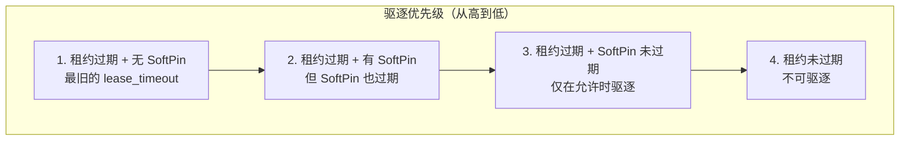
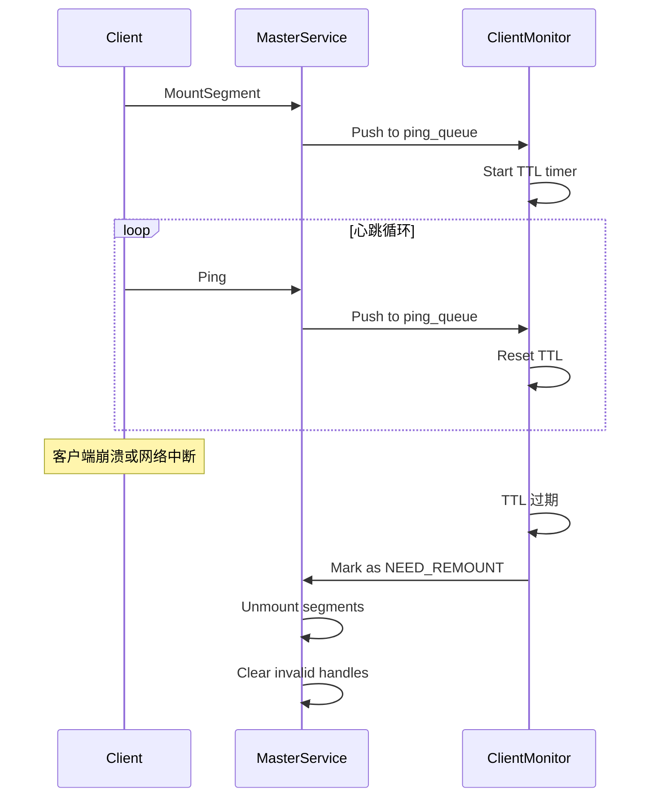
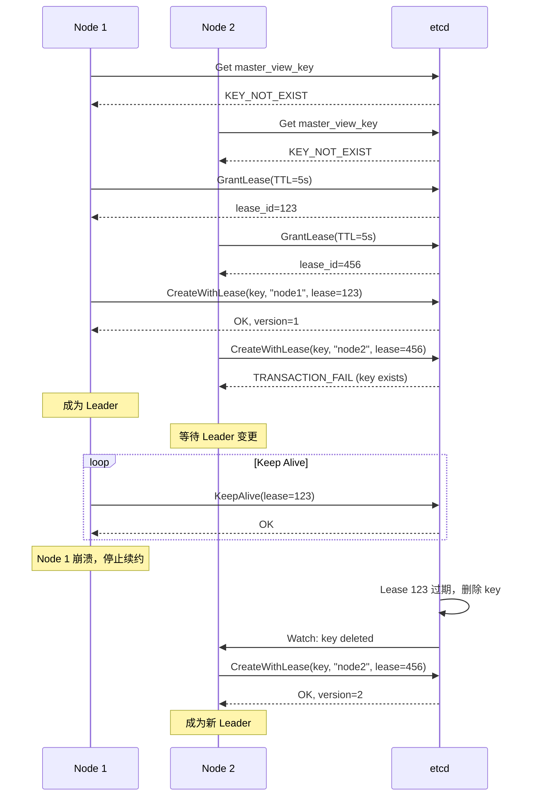

# 驱逐与高可用

[上一篇](02-master-service.md) | [目录](../README.md) | [下一篇](../04-transfer-engine/)

---

## 7.1 驱逐策略

### 7.1.1 驱逐触发条件

```cpp
void MasterService::EvictionThreadFunc() {
    while (eviction_running_) {
        double used_ratio =
            MasterMetricManager::instance().get_global_mem_used_ratio();

        // 触发条件：
        // 1. 使用率超过高水位
        // 2. 或者 need_eviction_ 标志被设置（分配失败时）
        if (used_ratio > eviction_high_watermark_ratio_ ||
            (need_eviction_ && eviction_ratio_ > 0.0)) {

            double evict_ratio_target = std::max(
                eviction_ratio_,
                used_ratio - eviction_high_watermark_ratio_ + eviction_ratio_);

            BatchEvict(evict_ratio_target, evict_ratio_lowerbound);
        }

        std::this_thread::sleep_for(
            std::chrono::milliseconds(kEvictionThreadSleepMs));
    }
}
```

### 7.1.2 批量驱逐算法

```cpp
void MasterService::BatchEvict(double evict_ratio_target,
                               double evict_ratio_lowerbound) {
    auto now = std::chrono::steady_clock::now();
    long evicted_count = 0;
    uint64_t total_freed_size = 0;

    // 候选列表
    std::vector<std::chrono::steady_clock::time_point> no_pin_objects;
    std::vector<std::chrono::steady_clock::time_point> soft_pin_objects;

    // 随机起始分片，避免不均衡驱逐
    size_t start_idx = rand() % metadata_shards_.size();

    // 第一遍：驱逐无 soft pin 且租约过期的对象
    for (size_t i = 0; i < metadata_shards_.size(); i++) {
        auto& shard = metadata_shards_[(start_idx + i) % metadata_shards_.size()];
        MutexLocker lock(&shard.mutex);

        // 先清理过期的处理中 key
        DiscardExpiredProcessingKeys(shard, now);

        // 计算该分片需要驱逐的数量
        const long ideal_evict_num =
            std::ceil(object_count * evict_ratio_target) - evicted_count;

        // 收集候选对象
        std::vector<std::chrono::steady_clock::time_point> candidates;
        for (auto it = shard.metadata.begin(); it != shard.metadata.end(); it++) {
            // 跳过未过期或未完成的对象
            if (!it->second.IsLeaseExpired(now) ||
                it->second.HasDiffRepStatus(ReplicaStatus::COMPLETE,
                                            ReplicaType::MEMORY)) {
                continue;
            }

            if (!it->second.IsSoftPinned(now)) {
                if (ideal_evict_num > 0) {
                    candidates.push_back(it->second.lease_timeout);
                } else {
                    no_pin_objects.push_back(it->second.lease_timeout);
                }
            } else if (allow_evict_soft_pinned_objects_) {
                soft_pin_objects.push_back(it->second.lease_timeout);
            }
        }

        // 使用 nth_element 找到驱逐阈值
        if (ideal_evict_num > 0 && !candidates.empty()) {
            long evict_num = std::min(ideal_evict_num, (long)candidates.size());
            std::nth_element(candidates.begin(),
                             candidates.begin() + (evict_num - 1),
                             candidates.end());
            auto target_timeout = candidates[evict_num - 1];

            // 驱逐 lease_timeout <= target_timeout 的对象
            auto it = shard.metadata.begin();
            while (it != shard.metadata.end()) {
                if (ShouldEvict(it->second, target_timeout, now)) {
                    total_freed_size += it->second.size *
                                       it->second.GetMemReplicaCount();
                    it->second.EraseReplica(ReplicaType::MEMORY);
                    if (!it->second.IsValid()) {
                        it = shard.metadata.erase(it);
                    } else {
                        ++it;
                    }
                    evicted_count++;
                } else {
                    ++it;
                }
            }
        }
    }

    // 第二遍：如果第一遍不够，继续驱逐
    if (target_evict_num > 0) {
        // ... 第二遍驱逐逻辑
    }
}
```

驱逐优先级：



### 7.1.3 nth_element 优化

使用 `std::nth_element` 而非完全排序，时间复杂度从 O(n log n) 降为 O(n)：

```cpp
// 找到第 k 小的元素作为阈值
std::nth_element(candidates.begin(),
                 candidates.begin() + (evict_num - 1),
                 candidates.end());
auto target_timeout = candidates[evict_num - 1];

// 驱逐所有 <= target_timeout 的对象
```

## 7.2 客户端监控

### 7.2.1 心跳机制

```cpp
void MasterService::ClientMonitorFunc() {
    std::unordered_map<UUID, std::chrono::steady_clock::time_point,
                       boost::hash<UUID>> client_ttl;

    while (client_monitor_running_) {
        auto now = std::chrono::steady_clock::now();

        // 从队列中读取心跳消息
        PodUUID pod_client_id;
        while (client_ping_queue_.pop(pod_client_id)) {
            UUID client_id = {pod_client_id.first, pod_client_id.second};
            client_ttl[client_id] =
                now + std::chrono::seconds(client_live_ttl_sec_);
        }

        // 找出过期的客户端
        std::vector<UUID> expired_clients;
        for (auto it = client_ttl.begin(); it != client_ttl.end();) {
            if (it->second < now) {
                expired_clients.push_back(it->first);
                it = client_ttl.erase(it);
            } else {
                ++it;
            }
        }

        // 处理过期客户端
        if (!expired_clients.empty()) {
            HandleExpiredClients(expired_clients);
        }

        std::this_thread::sleep_for(
            std::chrono::milliseconds(kClientMonitorSleepMs));
    }
}
```

### 7.2.2 过期客户端处理

```cpp
void HandleExpiredClients(const std::vector<UUID>& expired_clients) {
    // 1. 更新客户端状态为 NEED_REMOUNT
    {
        std::unique_lock<std::shared_mutex> lock(client_mutex_);
        for (auto& client_id : expired_clients) {
            auto it = ok_client_.find(client_id);
            if (it != ok_client_.end()) {
                ok_client_.erase(it);
                MasterMetricManager::instance().dec_active_clients();
            }
        }

        // 2. 准备卸载 segment
        ScopedSegmentAccess segment_access = segment_manager_.getSegmentAccess();
        for (auto& client_id : expired_clients) {
            std::vector<Segment> segments;
            segment_access.GetClientSegments(client_id, segments);
            for (auto& seg : segments) {
                segment_access.PrepareUnmountSegment(seg.id, ...);
            }
        }
    }

    // 3. 清理无效句柄（释放锁后执行，避免长时间持锁）
    ClearInvalidHandles();

    // 4. 提交卸载
    ScopedSegmentAccess segment_access = segment_manager_.getSegmentAccess();
    for (const auto& segment_id : unmount_segments) {
        segment_access.CommitUnmountSegment(segment_id, ...);
    }
}
```

客户端生命周期：



## 7.3 高可用与 Leader 选举

### 7.3.1 基于 etcd 的 Leader 选举

```cpp
void MasterViewHelper::ElectLeader(const std::string& master_address,
                                   ViewVersionId& version,
                                   EtcdLeaseId& lease_id) {
    while (true) {
        // 1. 检查是否已有 leader
        ViewVersionId current_version = 0;
        std::string current_master;
        auto ret = EtcdHelper::Get(master_view_key_.c_str(), ...,
                                   current_master, current_version);

        if (ret != ErrorCode::ETCD_KEY_NOT_EXIST) {
            // 已有 leader，等待其退位
            LOG(INFO) << "CurrentLeader=" << current_master
                      << ", Waiting for leadership change...";
            EtcdHelper::WatchUntilDeleted(master_view_key_.c_str(), ...);
            continue;
        }

        // 2. 无 leader，尝试选举自己
        LOG(INFO) << "No leader found, trying to elect self as leader";

        // 3. 申请租约
        ret = EtcdHelper::GrantLease(ETCD_MASTER_VIEW_LEASE_TTL, lease_id);
        if (ret != ErrorCode::OK) {
            std::this_thread::sleep_for(std::chrono::seconds(1));
            continue;
        }

        // 4. 原子性创建 key（事务）
        ret = EtcdHelper::CreateWithLease(
            master_view_key_.c_str(), ...,
            master_address.c_str(), ...,
            lease_id, version);

        if (ret == ErrorCode::ETCD_TRANSACTION_FAIL) {
            // 竞争失败，其他节点已成为 leader
            std::this_thread::sleep_for(std::chrono::seconds(1));
            continue;
        } else if (ret == ErrorCode::OK) {
            LOG(INFO) << "Successfully elected self as leader";
            return;
        }
    }
}
```

### 7.3.2 租约保活

```cpp
void MasterViewHelper::KeepLeader(EtcdLeaseId lease_id) {
    // 周期性续约，保持 leader 地位
    EtcdHelper::KeepAlive(lease_id);
}
```

### 7.3.3 防止脑裂

```cpp
int MasterServiceSupervisor::Start() {
    while (true) {
        // 1. 选举成为 leader
        mv_helper.ElectLeader(config_.local_hostname, view_version, lease_id);

        // 2. 启动保活线程
        auto keep_leader_thread = std::thread([&]() {
            mv_helper.KeepLeader(lease_id);
            server.stop();  // 租约丢失时停止服务
        });

        // 3. 等待足够长时间让旧 leader 退位
        // 防止脑裂：等待时间 >= 租约 TTL
        const int waiting_time = ETCD_MASTER_VIEW_LEASE_TTL;
        std::this_thread::sleep_for(std::chrono::seconds(waiting_time));

        // 4. 启动服务
        server.async_start();

        // 5. 等待服务停止（租约丢失或其他错误）
        auto server_err = std::move(ec).get();

        // 6. 清理并重新选举
        EtcdHelper::CancelKeepAlive(lease_id);
        keep_leader_thread.join();
    }
}
```

Leader 选举流程：



## 7.4 持久化存储后端

### 7.4.1 文件路径解析

```cpp
std::string MasterService::ResolvePath(const std::string& key) const {
    // 计算 key 的哈希值
    size_t hash = std::hash<std::string>{}(key);

    // 使用低 8 位创建 2 级目录结构
    // 目的：避免单目录文件过多
    char dir1 = static_cast<char>('a' + (hash & 0x0F));        // 16 个目录
    char dir2 = static_cast<char>('a' + ((hash >> 4) & 0x0F)); // 16 个子目录

    // 构建完整路径
    namespace fs = std::filesystem;
    fs::path full_path = fs::path(root_fs_dir_) / cluster_id_ /
                         std::string(1, dir1) / std::string(1, dir2) /
                         SanitizeKey(key);

    return full_path.lexically_normal().string();
}

// 示例：
// key = "model/layer1/kvcache/token_0"
// hash = 0x1234ABCD
// dir1 = 'a' + (0xD) = 'n'
// dir2 = 'a' + (0xC) = 'm'
// path = /data/mooncake_cluster/n/m/model_layer1_kvcache_token_0
```

### 7.4.2 Key 清理

```cpp
std::string MasterService::SanitizeKey(const std::string& key) const {
    // 不允许的文件系统字符
    constexpr std::string_view kInvalidChars = "/\\:*?\"<>|";

    std::string sanitized_key;
    sanitized_key.reserve(key.size());

    for (char c : key) {
        // 将非法字符替换为下划线
        sanitized_key.push_back(
            kInvalidChars.find(c) != std::string_view::npos ? '_' : c);
    }
    return sanitized_key;
}
```

## 7.5 本章小结

本章深入分析了 Mooncake Store 的核心实现：

1. **分片元数据**：1024 分片设计，支持高并发访问
2. **RAII 访问控制**：通过 Scoped Access 类保证线程安全
3. **租约机制**：保护正在使用的对象不被驱逐
4. **智能驱逐**：两遍扫描、nth_element 优化、SoftPin 支持
5. **客户端监控**：心跳检测、过期清理
6. **高可用**：基于 etcd 的 Leader 选举、防脑裂设计

这些设计使 Mooncake Store 能够在高并发、大规模 KVCache 场景下保持高性能和高可靠性。

---

[上一篇](02-master-service.md) | [目录](../README.md) | [下一篇](../04-transfer-engine/)
