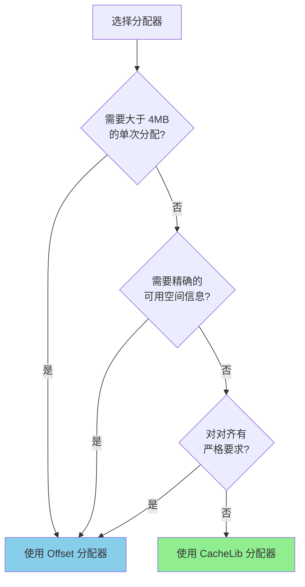

[上一篇](03-eviction-and-ha.md) | [目录](../README.md) | [下一篇](05-segment-replica.md)

# 内存分配器实现解析

本章深入分析 Mooncake Store 的内存分配器实现，包括 CacheLib 和 Offset 两种分配策略。

## 15.1 分配器架构设计

### 15.1.1 抽象基类定义

所有分配器都继承自 `BufferAllocatorBase`：

```cpp
// 文件: mooncake-store/include/allocator.h

// 用于表示分配器无法精确追踪可用空间的情况
static constexpr size_t kAllocatorUnknownFreeSpace =
    std::numeric_limits<size_t>::max();

class BufferAllocatorBase {
public:
    virtual ~BufferAllocatorBase() = default;

    // 核心分配接口
    virtual std::unique_ptr<AllocatedBuffer> allocate(size_t size) = 0;
    virtual void deallocate(AllocatedBuffer* handle) = 0;

    // 容量查询
    virtual size_t capacity() const = 0;
    virtual size_t size() const = 0;

    // 元数据获取
    virtual std::string getSegmentName() const = 0;
    virtual std::string getTransportEndpoint() const = 0;

    // 最大可用区域查询（用于分配决策）
    virtual size_t getLargestFreeRegion() const = 0;
};
```

### 15.1.2 AllocatedBuffer：分配结果封装

`AllocatedBuffer` 封装了分配的内存块，支持 RAII 自动释放：

```cpp
class AllocatedBuffer {
public:
    friend class CachelibBufferAllocator;
    friend class OffsetBufferAllocator;

    struct Descriptor {
        uint64_t size_;
        uintptr_t buffer_address_;
        std::string transport_endpoint_;
        YLT_REFL(Descriptor, size_, buffer_address_, transport_endpoint_);
    };

    AllocatedBuffer(std::shared_ptr<BufferAllocatorBase> allocator,
                    void* buffer_ptr, std::size_t size,
                    std::optional<offset_allocator::OffsetAllocationHandle>&&
                        offset_handle = std::nullopt)
        : allocator_(std::move(allocator)),
          buffer_ptr_(buffer_ptr),
          size_(size),
          offset_handle_(std::move(offset_handle)) {}

    ~AllocatedBuffer() {
        // RAII: 自动归还内存
        auto alloc = allocator_.lock();
        if (alloc) {
            alloc->deallocate(this);
            VLOG(1) << "buf_handle_deallocated size=" << size_;
        }
    }

    // 禁止拷贝
    AllocatedBuffer(const AllocatedBuffer&) = delete;
    AllocatedBuffer& operator=(const AllocatedBuffer&) = delete;

    [[nodiscard]] void* data() const noexcept { return buffer_ptr_; }
    [[nodiscard]] std::size_t size() const noexcept { return size_; }

    // 检查分配器是否仍然有效
    [[nodiscard]] bool isAllocatorValid() const {
        return !allocator_.expired();
    }

    // 序列化为描述符（用于网络传输）
    [[nodiscard]] Descriptor get_descriptor() const {
        auto alloc = allocator_.lock();
        std::string endpoint;
        if (alloc) {
            endpoint = alloc->getTransportEndpoint();
        }
        return {static_cast<uint64_t>(size()),
                reinterpret_cast<uintptr_t>(buffer_ptr_), endpoint};
    }

private:
    std::weak_ptr<BufferAllocatorBase> allocator_;  // 弱引用避免循环
    void* buffer_ptr_{nullptr};
    std::size_t size_{0};
    std::optional<offset_allocator::OffsetAllocationHandle> offset_handle_;
};
```

**关键设计要点**：

1. **weak_ptr 避免循环引用**：`allocator_` 使用 `weak_ptr`，因为分配器管理着 Buffer，而 Buffer 需要引用分配器进行释放
2. **RAII 自动释放**：析构函数自动调用 `deallocate`
3. **Descriptor 用于序列化**：支持将 Buffer 信息序列化后通过网络传输

## 15.2 CacheLib 分配器实现

### 15.2.1 初始化与配置

CacheLib 分配器使用 Facebook CacheLib 的 Slab 分配策略：

```cpp
// 文件: mooncake-store/src/allocator.cpp

CachelibBufferAllocator::CachelibBufferAllocator(
    std::string segment_name, size_t base, size_t size,
    std::string transport_endpoint)
    : segment_name_(segment_name),
      base_(base),
      total_size_(size),
      cur_size_(0),
      transport_endpoint_(std::move(transport_endpoint)) {

    VLOG(1) << "initializing_buffer_allocator segment_name=" << segment_name
            << " base_address=" << reinterpret_cast<void*>(base)
            << " size=" << size;

    // 计算头部区域大小
    // CacheLib 需要额外空间存储 Slab 元数据
    header_region_size_ =
        sizeof(facebook::cachelib::SlabHeader) *
            static_cast<unsigned int>(size / sizeof(facebook::cachelib::Slab)) +
        1;
    header_region_start_ = std::make_unique<char[]>(header_region_size_);

    LOG_ASSERT(header_region_start_);

    // 初始化 CacheLib MemoryAllocator
    memory_allocator_ = std::make_unique<facebook::cachelib::MemoryAllocator>(
        facebook::cachelib::MemoryAllocator::Config(
            facebook::cachelib::MemoryAllocator::generateAllocSizes()),
        reinterpret_cast<void*>(header_region_start_.get()),
        header_region_size_,
        reinterpret_cast<void*>(base),
        size);

    // 添加主内存池
    pool_id_ = memory_allocator_->addPool("main", size);

    VLOG(1) << "buffer_allocator_initialized pool_id="
            << static_cast<int>(pool_id_);
}
```

**CacheLib 内存布局**：

```
┌─────────────────────────────────────────────────────┐
│                Header Region (Heap)                  │
│  ┌──────────┬──────────┬──────────┬────────────┐   │
│  │SlabHdr 0 │SlabHdr 1 │SlabHdr 2 │    ...     │   │
│  └──────────┴──────────┴──────────┴────────────┘   │
└─────────────────────────────────────────────────────┘

┌─────────────────────────────────────────────────────┐
│              Data Region (Base Address)              │
│  ┌──────────┬──────────┬──────────┬────────────┐   │
│  │  Slab 0  │  Slab 1  │  Slab 2  │    ...     │   │
│  │  (4MB)   │  (4MB)   │  (4MB)   │            │   │
│  └──────────┴──────────┴──────────┴────────────┘   │
└─────────────────────────────────────────────────────┘
```

### 15.2.2 分配与释放

```cpp
std::unique_ptr<AllocatedBuffer> CachelibBufferAllocator::allocate(size_t size) {
    void* buffer = nullptr;
    try {
        // 最小分配大小限制
        size_t padding_size = std::max(size, kMinSliceSize);

        // 调用 CacheLib 分配
        buffer = memory_allocator_->allocate(pool_id_, padding_size);
        if (!buffer) {
            VLOG(1) << "allocation_failed size=" << size
                    << " segment=" << segment_name_
                    << " current_size=" << cur_size_;
            return nullptr;
        }
    } catch (const std::exception& e) {
        LOG(ERROR) << "allocation_exception error=" << e.what();
        return nullptr;
    }

    // 更新统计信息
    cur_size_.fetch_add(size);
    MasterMetricManager::instance().inc_allocated_mem_size(segment_name_, size);

    return std::make_unique<AllocatedBuffer>(shared_from_this(), buffer, size);
}

void CachelibBufferAllocator::deallocate(AllocatedBuffer* handle) {
    try {
        memory_allocator_->free(handle->buffer_ptr_);
        size_t freed_size = handle->size_;
        cur_size_.fetch_sub(freed_size);
        MasterMetricManager::instance().dec_allocated_mem_size(
            segment_name_, freed_size);
    } catch (const std::exception& e) {
        LOG(ERROR) << "deallocation_exception error=" << e.what();
    }
}
```

## 15.3 Offset 分配器实现

### 15.3.1 Offset 分配器特点

Offset 分配器使用简单的偏移量管理策略，适合需要精确控制可用空间的场景：

```cpp
OffsetBufferAllocator::OffsetBufferAllocator(
    std::string segment_name, size_t base, size_t size,
    std::string transport_endpoint)
    : segment_name_(segment_name),
      base_(base),
      total_size_(size),
      cur_size_(0),
      transport_endpoint_(std::move(transport_endpoint)) {

    try {
        // 计算容量参数
        // 初始容量: size/4096，范围 [1K, 64K]
        uint64_t init_capacity = size / 4096;
        init_capacity = std::max(init_capacity, static_cast<uint64_t>(1024));
        init_capacity = std::min(init_capacity, static_cast<uint64_t>(64 * 1024));

        // 最大容量: size/1024，范围 [1M, 64M]
        uint64_t max_capacity = size / 1024;
        max_capacity = std::max(max_capacity, static_cast<uint64_t>(1024 * 1024));
        max_capacity = std::min(max_capacity, static_cast<uint64_t>(64 * 1024 * 1024));

        // 创建 Offset 分配器
        offset_allocator_ = offset_allocator::OffsetAllocator::create(
            base, size,
            static_cast<uint32_t>(init_capacity),
            static_cast<uint32_t>(max_capacity));

        if (!offset_allocator_) {
            throw std::runtime_error("Failed to create offset allocator");
        }
    } catch (const std::exception& e) {
        LOG(ERROR) << "offset_allocator_init_exception error=" << e.what();
        throw;
    }
}
```

### 15.3.2 精确的可用空间查询

Offset 分配器可以精确报告最大可用区域：

```cpp
size_t OffsetBufferAllocator::getLargestFreeRegion() const {
    if (!offset_allocator_) {
        return 0;
    }

    try {
        auto report = offset_allocator_->storageReport();
        return report.largestFreeRegion;
    } catch (const std::exception& e) {
        LOG(ERROR) << "Failed to get storage report: " << e.what();
        return 0;
    }
}
```

### 15.3.3 分配与释放

```cpp
std::unique_ptr<AllocatedBuffer> OffsetBufferAllocator::allocate(size_t size) {
    if (!offset_allocator_) {
        return nullptr;
    }

    std::unique_ptr<AllocatedBuffer> allocated_buffer = nullptr;
    try {
        // 分配并获取句柄
        auto allocation_handle = offset_allocator_->allocate(size);
        if (!allocation_handle) {
            return nullptr;
        }

        void* buffer_ptr = allocation_handle->ptr();

        // 创建 Buffer，传入句柄用于 RAII 管理
        allocated_buffer = std::make_unique<AllocatedBuffer>(
            shared_from_this(), buffer_ptr, size, std::move(allocation_handle));
    } catch (const std::exception& e) {
        LOG(ERROR) << "allocation_exception error=" << e.what();
        return nullptr;
    }

    cur_size_.fetch_add(size);
    MasterMetricManager::instance().inc_allocated_mem_size(segment_name_, size);
    return allocated_buffer;
}

void OffsetBufferAllocator::deallocate(AllocatedBuffer* handle) {
    try {
        // RAII: 释放 offset_handle 自动归还空间
        size_t freed_size = handle->size();
        handle->offset_handle_.reset();
        cur_size_.fetch_sub(freed_size);
        MasterMetricManager::instance().dec_allocated_mem_size(
            segment_name_, freed_size);
    } catch (const std::exception& e) {
        LOG(ERROR) << "deallocation_exception error=" << e.what();
    }
}
```

## 15.4 分配器对比与选择

### 15.4.1 特性对比

| 特性 | CacheLib 分配器 | Offset 分配器 |
|------|----------------|---------------|
| 分配效率 | O(1) 平均 | O(log n) |
| 碎片处理 | Slab 内自动合并 | 显式管理 |
| 可用空间查询 | 近似值 | 精确值 |
| 内存开销 | 较高（元数据） | 较低 |
| 对齐要求 | 4MB 对齐 | 无严格要求 |
| 最大分配 | 4MB | 理论无限制 |

### 15.4.2 选择建议



---

[上一篇](03-eviction-and-ha.md) | [目录](../README.md) | [下一篇](05-segment-replica.md)
