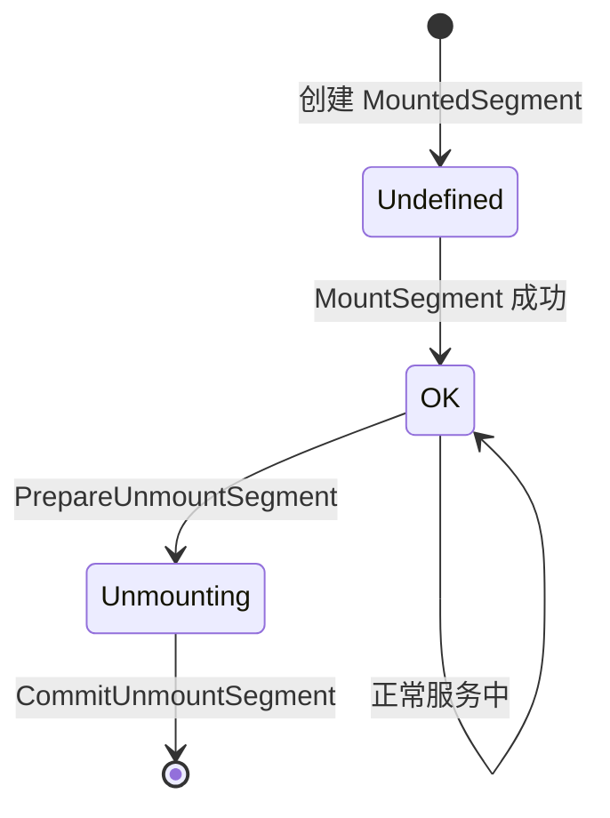

[上一篇](04-memory-allocators.md) | [目录](../README.md) | [下一篇](../04-transfer-engine/)

# Segment 与 Replica 管理

本章分析 Mooncake Store 中 Segment 和 Replica 的管理机制。

## 16.1 Segment 管理架构

### 16.1.1 Segment 定义

```cpp
// 文件: mooncake-store/include/types.h

struct Segment {
    UUID id;                      // 唯一标识
    std::string name;             // 名称（如 "node001"）
    uintptr_t base;               // 基地址
    size_t size;                  // 大小
    std::string te_endpoint;      // Transfer Engine 端点

    YLT_REFL(Segment, id, name, base, size, te_endpoint);
};
```

### 16.1.2 SegmentManager 实现

```cpp
// 文件: mooncake-store/include/segment.h

class SegmentManager {
public:
    explicit SegmentManager(
        BufferAllocatorType memory_allocator = BufferAllocatorType::CACHELIB)
        : memory_allocator_(memory_allocator) {}

    // RAII 风格的访问接口
    ScopedSegmentAccess getSegmentAccess() {
        return ScopedSegmentAccess(this, segment_mutex_);
    }

    ScopedAllocatorAccess getAllocatorAccess() {
        return ScopedAllocatorAccess(allocator_manager_, segment_mutex_);
    }

private:
    mutable std::shared_mutex segment_mutex_;
    const BufferAllocatorType memory_allocator_;
    AllocatorManager allocator_manager_;

    // segment_id -> mounted segment
    std::unordered_map<UUID, MountedSegment, boost::hash<UUID>>
        mounted_segments_;

    // client_id -> segment_ids
    std::unordered_map<UUID, std::vector<UUID>, boost::hash<UUID>>
        client_segments_;

    // segment name -> client_id
    std::unordered_map<std::string, UUID> client_by_name_;

    friend class ScopedSegmentAccess;
};
```

### 16.1.3 Segment 挂载流程

```cpp
// 文件: mooncake-store/src/segment.cpp

ErrorCode ScopedSegmentAccess::MountSegment(const Segment& segment,
                                            const UUID& client_id) {
    const uintptr_t buffer = segment.base;
    const size_t size = segment.size;

    // 1. 参数验证
    if (buffer == 0 || size == 0) {
        return ErrorCode::INVALID_PARAMS;
    }

    // 2. CacheLib 对齐检查
    if (segment_manager_->memory_allocator_ == BufferAllocatorType::CACHELIB &&
        (buffer % facebook::cachelib::Slab::kSize ||
         size % facebook::cachelib::Slab::kSize)) {
        LOG(ERROR) << "buffer or size not aligned to 4MB";
        return ErrorCode::INVALID_PARAMS;
    }

    // 3. 检查是否已存在
    auto exist_segment_it = segment_manager_->mounted_segments_.find(segment.id);
    if (exist_segment_it != segment_manager_->mounted_segments_.end()) {
        if (exist_segment_it->second.status == SegmentStatus::OK) {
            return ErrorCode::SEGMENT_ALREADY_EXISTS;
        } else {
            return ErrorCode::UNAVAILABLE_IN_CURRENT_STATUS;
        }
    }

    // 4. 创建分配器
    std::shared_ptr<BufferAllocatorBase> allocator;
    try {
        switch (segment_manager_->memory_allocator_) {
            case BufferAllocatorType::CACHELIB:
                allocator = std::make_shared<CachelibBufferAllocator>(
                    segment.name, buffer, size, segment.te_endpoint);
                break;
            case BufferAllocatorType::OFFSET:
                allocator = std::make_shared<OffsetBufferAllocator>(
                    segment.name, buffer, size, segment.te_endpoint);
                break;
            default:
                return ErrorCode::INVALID_PARAMS;
        }
    } catch (...) {
        return ErrorCode::INVALID_PARAMS;
    }

    // 5. 注册到各个映射表
    segment_manager_->allocator_manager_.addAllocator(segment.name, allocator);
    segment_manager_->client_segments_[client_id].push_back(segment.id);
    segment_manager_->mounted_segments_[segment.id] = {
        segment, SegmentStatus::OK, std::move(allocator)};
    segment_manager_->client_by_name_[segment.name] = client_id;

    // 6. 更新指标
    MasterMetricManager::instance().inc_total_mem_capacity(segment.name, size);

    return ErrorCode::OK;
}
```

**Segment 生命周期**：



### 16.1.4 Segment 卸载：两阶段流程

为了避免死锁和数据不一致，卸载分为准备和提交两个阶段：

```cpp
// 阶段 1: 准备卸载
ErrorCode ScopedSegmentAccess::PrepareUnmountSegment(
    const UUID& segment_id, size_t& metrics_dec_capacity) {

    auto it = segment_manager_->mounted_segments_.find(segment_id);
    if (it == segment_manager_->mounted_segments_.end()) {
        return ErrorCode::SEGMENT_NOT_FOUND;
    }

    if (it->second.status == SegmentStatus::UNMOUNTING) {
        return ErrorCode::UNAVAILABLE_IN_CURRENT_STATUS;
    }

    auto& mounted_segment = it->second;
    metrics_dec_capacity = mounted_segment.segment.size;

    // 从分配器管理器移除
    segment_manager_->allocator_manager_.removeAllocator(
        mounted_segment.segment.name, mounted_segment.buf_allocator);

    // 释放分配器引用
    mounted_segment.buf_allocator.reset();

    // 标记状态
    mounted_segment.status = SegmentStatus::UNMOUNTING;

    return ErrorCode::OK;
}

// 阶段 2: 提交卸载（释放锁后调用）
ErrorCode ScopedSegmentAccess::CommitUnmountSegment(
    const UUID& segment_id, const UUID& client_id,
    const size_t& metrics_dec_capacity) {

    // 从 client_segments_ 移除
    auto client_it = segment_manager_->client_segments_.find(client_id);
    if (client_it != segment_manager_->client_segments_.end()) {
        auto& segments = client_it->second;
        segments.erase(std::remove(segments.begin(), segments.end(), segment_id),
                       segments.end());
        if (segments.empty()) {
            segment_manager_->client_segments_.erase(client_it);
        }
    }

    // 获取 segment name 用于指标更新
    std::string segment_name;
    auto segment_it = segment_manager_->mounted_segments_.find(segment_id);
    if (segment_it != segment_manager_->mounted_segments_.end()) {
        segment_name = segment_it->second.segment.name;
    }

    // 从 mounted_segments_ 移除
    segment_manager_->mounted_segments_.erase(segment_id);

    // 更新指标
    MasterMetricManager::instance().dec_total_mem_capacity(
        segment_name, metrics_dec_capacity);

    return ErrorCode::OK;
}
```

## 16.2 Replica 类型系统

### 16.2.1 Replica 类型定义

```cpp
// 文件: mooncake-store/include/replica.h

enum class ReplicaType {
    MEMORY,     // 内存副本
    DISK,       // 磁盘副本（共享存储）
    LOCAL_DISK  // 本地磁盘副本
};

enum class ReplicaStatus {
    UNDEFINED = 0,  // 未初始化
    INITIALIZED,    // 空间已分配，等待写入
    PROCESSING,     // 写入进行中
    COMPLETE,       // 写入完成，可读
    REMOVED,        // 已移除
    FAILED,         // 失败状态
};

// 配置结构
struct ReplicateConfig {
    size_t replica_num{1};           // 副本数量
    bool with_soft_pin{false};       // 是否软锁定
    std::vector<std::string> preferred_segments{};  // 首选 Segment
    std::string preferred_segment{};  // 兼容旧版 API
    bool prefer_alloc_in_same_node{false};  // 优先同节点分配
};
```

### 16.2.2 Replica 类实现

`Replica` 使用 `std::variant` 支持多种副本类型：

```cpp
class Replica {
public:
    struct Descriptor;  // 前向声明

    // 内存副本构造函数
    Replica(std::unique_ptr<AllocatedBuffer> buffer, ReplicaStatus status)
        : data_(MemoryReplicaData{std::move(buffer)}), status_(status) {}

    // 磁盘副本构造函数
    Replica(std::string file_path, uint64_t object_size, ReplicaStatus status)
        : data_(DiskReplicaData{std::move(file_path), object_size}),
          status_(status) {
        // 更新磁盘使用指标
        MasterMetricManager::instance().inc_allocated_file_size(object_size);
    }

    // 本地磁盘副本构造函数
    Replica(UUID client_id, uint64_t object_size,
            std::string transport_endpoint, ReplicaStatus status)
        : data_(LocalDiskReplicaData{client_id, object_size,
                                     std::move(transport_endpoint)}),
          status_(status) {}

    // 析构时更新指标
    ~Replica() {
        if (status_ != ReplicaStatus::UNDEFINED && is_disk_replica()) {
            const auto& disk_data = std::get<DiskReplicaData>(data_);
            MasterMetricManager::instance().dec_allocated_file_size(
                disk_data.object_size);
        }
    }

    // 移动语义支持
    Replica(Replica&& src) noexcept
        : data_(std::move(src.data_)), status_(src.status_) {
        // 标记源对象为已移动，避免析构时重复更新指标
        src.status_ = ReplicaStatus::UNDEFINED;
    }

    // 类型检查
    [[nodiscard]] ReplicaType type() const {
        return std::visit(ReplicaTypeVisitor{}, data_);
    }

    [[nodiscard]] bool is_memory_replica() const {
        return std::holds_alternative<MemoryReplicaData>(data_);
    }

    // 检查内存句柄是否有效
    [[nodiscard]] bool has_invalid_mem_handle() const {
        if (is_memory_replica()) {
            const auto& mem_data = std::get<MemoryReplicaData>(data_);
            return !mem_data.buffer->isAllocatorValid();
        }
        return false;
    }

    // 状态转换
    void mark_complete() {
        if (status_ == ReplicaStatus::PROCESSING) {
            status_ = ReplicaStatus::COMPLETE;
        }
    }

private:
    std::variant<MemoryReplicaData, DiskReplicaData, LocalDiskReplicaData> data_;
    ReplicaStatus status_{ReplicaStatus::UNDEFINED};

    struct ReplicaTypeVisitor {
        ReplicaType operator()(const MemoryReplicaData&) const {
            return ReplicaType::MEMORY;
        }
        ReplicaType operator()(const DiskReplicaData&) const {
            return ReplicaType::DISK;
        }
        ReplicaType operator()(const LocalDiskReplicaData&) const {
            return ReplicaType::LOCAL_DISK;
        }
    };
};
```

### 16.2.3 Replica Descriptor：序列化支持

```cpp
struct Replica::Descriptor {
    std::variant<MemoryDescriptor, DiskDescriptor, LocalDiskDescriptor>
        descriptor_variant;
    ReplicaStatus status;

    YLT_REFL(Descriptor, descriptor_variant, status);

    // 类型判断助手
    bool is_memory_replica() const noexcept {
        return std::holds_alternative<MemoryDescriptor>(descriptor_variant);
    }

    bool is_disk_replica() const noexcept {
        return std::holds_alternative<DiskDescriptor>(descriptor_variant);
    }

    // 类型获取器
    const MemoryDescriptor& get_memory_descriptor() const {
        if (auto* desc = std::get_if<MemoryDescriptor>(&descriptor_variant)) {
            return *desc;
        }
        throw std::runtime_error("Expected MemoryDescriptor");
    }
};

// 生成 Descriptor
inline Replica::Descriptor Replica::get_descriptor() const {
    Replica::Descriptor desc;
    desc.status = status_;

    if (is_memory_replica()) {
        const auto& mem_data = std::get<MemoryReplicaData>(data_);
        MemoryDescriptor mem_desc;
        if (mem_data.buffer) {
            mem_desc.buffer_descriptor = mem_data.buffer->get_descriptor();
        } else {
            LOG(ERROR) << "Trying to get invalid memory replica descriptor";
        }
        desc.descriptor_variant = std::move(mem_desc);
    } else if (is_disk_replica()) {
        const auto& disk_data = std::get<DiskReplicaData>(data_);
        DiskDescriptor disk_desc;
        disk_desc.file_path = disk_data.file_path;
        disk_desc.object_size = disk_data.object_size;
        desc.descriptor_variant = std::move(disk_desc);
    } else if (is_local_disk_replica()) {
        const auto& disk_data = std::get<LocalDiskReplicaData>(data_);
        LocalDiskDescriptor local_disk_desc;
        local_disk_desc.client_id = disk_data.client_id;
        local_disk_desc.object_size = disk_data.object_size;
        local_disk_desc.transport_endpoint = disk_data.transport_endpoint;
        desc.descriptor_variant = std::move(local_disk_desc);
    }

    return desc;
}
```

## 16.3 RPC 客户端实现

### 16.3.1 模板化 RPC 调用

MasterClient 使用模板实现类型安全的 RPC 调用：

```cpp
// 文件: mooncake-store/src/master_client.cpp

// RPC 方法名称特化
template <auto Method>
struct RpcNameTraits;

template <>
struct RpcNameTraits<&WrappedMasterService::GetReplicaList> {
    static constexpr const char* value = "GetReplicaList";
};

template <>
struct RpcNameTraits<&WrappedMasterService::PutStart> {
    static constexpr const char* value = "PutStart";
};

// ... 更多特化

// 统一的 RPC 调用模板
template <auto ServiceMethod, typename ReturnType, typename... Args>
tl::expected<ReturnType, ErrorCode> MasterClient::invoke_rpc(Args&&... args) {
    auto pool = client_accessor_.GetClientPool();

    // 更新指标
    if (metrics_) {
        metrics_->rpc_count.inc({RpcNameTraits<ServiceMethod>::value});
    }

    auto start_time = std::chrono::steady_clock::now();

    return async_simple::coro::syncAwait(
        [&]() -> async_simple::coro::Lazy<tl::expected<ReturnType, ErrorCode>> {
            // 发送请求
            auto ret = co_await pool->send_request(
                [&](coro_io::client_reuse_hint,
                    coro_rpc::coro_rpc_client& client) {
                    return client.send_request<ServiceMethod>(
                        std::forward<Args>(args)...);
                });

            if (!ret.has_value()) {
                LOG(ERROR) << "Client not available";
                co_return tl::make_unexpected(ErrorCode::RPC_FAIL);
            }

            auto result = co_await std::move(ret.value());
            if (!result) {
                LOG(ERROR) << "RPC call failed: " << result.error().msg;
                co_return tl::make_unexpected(ErrorCode::RPC_FAIL);
            }

            // 记录延迟
            if (metrics_) {
                auto end_time = std::chrono::steady_clock::now();
                auto latency = std::chrono::duration_cast<
                    std::chrono::microseconds>(end_time - start_time);
                metrics_->rpc_latency.observe(
                    {RpcNameTraits<ServiceMethod>::value}, latency.count());
            }

            co_return result->result();
        }());
}
```

### 16.3.2 使用示例

```cpp
tl::expected<GetReplicaListResponse, ErrorCode> MasterClient::GetReplicaList(
    const std::string& object_key) {
    ScopedVLogTimer timer(1, "MasterClient::GetReplicaList");
    timer.LogRequest("object_key=", object_key);

    auto result = invoke_rpc<&WrappedMasterService::GetReplicaList,
                             GetReplicaListResponse>(object_key);
    timer.LogResponseExpected(result);
    return result;
}

tl::expected<std::vector<Replica::Descriptor>, ErrorCode>
MasterClient::PutStart(const std::string& key,
                       const std::vector<size_t>& slice_lengths,
                       const ReplicateConfig& config) {
    ScopedVLogTimer timer(1, "MasterClient::PutStart");

    uint64_t total_slice_length = 0;
    for (const auto& slice_length : slice_lengths) {
        total_slice_length += slice_length;
    }

    auto result = invoke_rpc<&WrappedMasterService::PutStart,
                             std::vector<Replica::Descriptor>>(
        client_id_, key, total_slice_length, config);
    return result;
}
```

## 16.4 本章小结

本章深入分析了 Mooncake Store 的核心代码实现：

1. **MasterService**：分片架构、MetadataAccessor 模式、两阶段写入事务
2. **驱逐机制**：两阶段驱逐、优先级策略、nth_element 优化
3. **内存分配器**：CacheLib 和 Offset 两种策略的实现细节
4. **Segment 管理**：RAII 风格访问、两阶段卸载流程
5. **Replica 系统**：variant 多态、状态机转换、序列化支持
6. **RPC 客户端**：模板化调用、协程异步、指标集成

这些代码体现了现代 C++ 的最佳实践：RAII 资源管理、类型安全、零拷贝设计和高效的并发控制。

---

[上一篇](04-memory-allocators.md) | [目录](../README.md) | [下一篇](../04-transfer-engine/)
