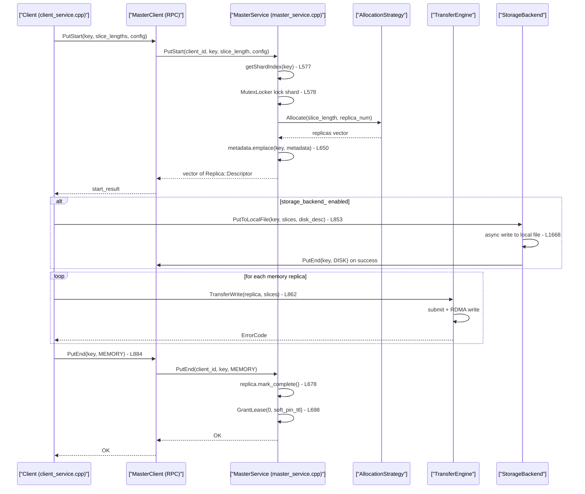
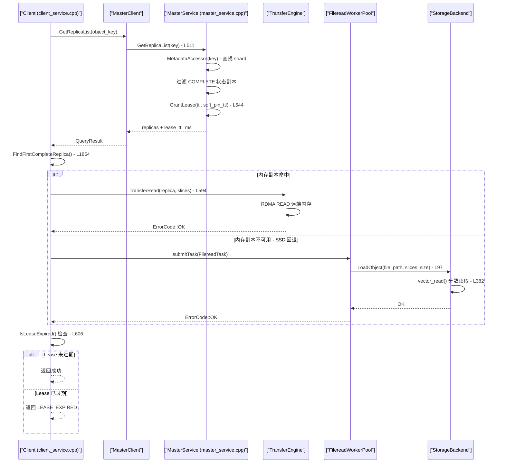
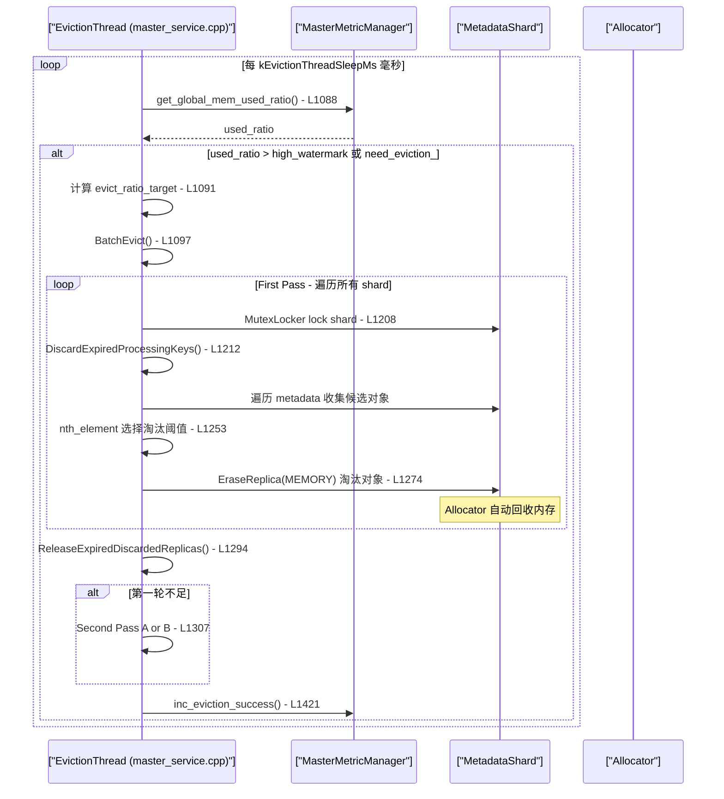

# Mooncake Store 代码调试追踪

本文档提供 Mooncake Store 核心操作的端到端代码调试追踪,包含详细的文件/行号引用、GDB 断点设置方法、日志配置指南以及 Mermaid 序列图。

---

## 目录

- [调试环境准备](#调试环境准备)
- [Debug Trace 1 - Put 操作端到端追踪](#debug-trace-1---put-操作端到端追踪)
- [Debug Trace 2 - Get 操作与 Cache Miss 回退](#debug-trace-2---get-操作与-cache-miss-回退)
- [Debug Trace 3 - 内存淘汰触发与执行](#debug-trace-3---内存淘汰触发与执行)

---

## 调试环境准备

### GDB 配置

```bash
# 以 Debug 模式编译
cmake -DCMAKE_BUILD_TYPE=Debug -B build
cmake --build build -j$(nproc)

# 启动 GDB 调试 Store 进程
gdb --args ./build/mooncake-store/mooncake_store_server --flagfile=flags.txt
```

### glog 日志级别设置

```bash
# 设置 VLOG 级别,1 级可以看到大部分操作日志
export GLOG_v=1
# 输出到 stderr
export GLOG_logtostderr=1
# 也可以仅对特定文件启用详细日志
export GLOG_vmodule="client_service=2,master_service=2,transfer_task=2"
```

### 关键环境变量

| 环境变量 | 用途 | 推荐调试值 |
|---------|------|-----------|
| `GLOG_v` | 全局 VLOG 级别 | `1` 或 `2` |
| `GLOG_vmodule` | 模块级别日志控制 | `client_service=2,master_service=2` |
| `MC_STORE_CLIENT_METRIC` | 启用客户端指标收集 | `1` |

---

## Debug Trace 1 - Put 操作端到端追踪

### 概述

Put 操作将数据从客户端写入远端 Store 节点的内存(和可选的磁盘)。完整链路为:
`Client::Put` -> `MasterClient::PutStart`(分配副本空间) -> `TransferWrite`(RDMA 写入) -> `MasterClient::PutEnd`(标记完成)。

### 调用链路详解

#### 步骤 1 - Client::Put 入口

**文件**: `mooncake-store/src/client_service.cpp:814-892`

```cpp
tl::expected<void, ErrorCode> Client::Put(const ObjectKey& key,
                                          std::vector<Slice>& slices,
                                          const ReplicateConfig& config) {
    // 1. 准备 slice lengths
    std::vector<size_t> slice_lengths;
    for (size_t i = 0; i < slices.size(); ++i) {
        slice_lengths.emplace_back(slices[i].size);
    }

    // 2. 向 Master 请求分配空间
    auto start_result = master_client_.PutStart(key, slice_lengths, config);
    // ...
```

**GDB 断点**:
```gdb
b client_service.cpp:824
# 条件断点 - 只在特定 key 时触发
b client_service.cpp:824 if key == "test_key"
```

#### 步骤 2 - MasterService::PutStart 分配副本

**文件**: `mooncake-store/src/master_service.cpp:550-658`

```cpp
auto MasterService::PutStart(const UUID& client_id, const std::string& key,
                             const uint64_t slice_length,
                             const ReplicateConfig& config)
    -> tl::expected<std::vector<Replica::Descriptor>, ErrorCode> {
    // 1. 参数校验 (L554-559)
    if (config.replica_num == 0 || key.empty() || slice_length == 0) { ... }

    // 2. 锁定 shard 并检查对象是否存在 (L577-603)
    size_t shard_idx = getShardIndex(key);
    MutexLocker lock(&metadata_shards_[shard_idx].mutex);
    // ...检查是否已存在,处理过期 PutStart...

    // 3. 分配副本空间 (L606-632)
    ScopedAllocatorAccess allocator_access = segment_manager_.getAllocatorAccess();
    auto allocation_result = allocation_strategy_->Allocate(
        allocator_manager, slice_length, config.replica_num, preferred_segments);

    // 4. 如果启用磁盘副本,分配磁盘路径 (L635-639)
    if (use_disk_replica_) {
        std::string file_path = ResolvePath(key);
        replicas.emplace_back(file_path, total_length, ReplicaStatus::PROCESSING);
    }

    // 5. 写入元数据 (L650-655)
    metadata_shards_[shard_idx].metadata.emplace(...);
    metadata_shards_[shard_idx].processing_keys.insert(key);
```

**GDB 断点**:
```gdb
b master_service.cpp:577
# 查看分配结果
b master_service.cpp:617
p allocation_result.has_value()
```

**关键日志输出**:
```
VLOG(1): key=xxx, value_length=xxx, slice_length=xxx, config=xxx, action=put_start_begin
```

#### 步骤 3 - 磁盘副本写入(如果启用)

**文件**: `mooncake-store/src/client_service.cpp:846-857`

```cpp
// 先处理磁盘副本
if (storage_backend_) {
    for (auto it = start_result.value().rbegin(); ...) {
        if (replica.is_disk_replica()) {
            auto disk_descriptor = replica.get_disk_descriptor();
            PutToLocalFile(key, slices, disk_descriptor);
            break;
        }
    }
}
```

**PutToLocalFile** 异步写入逻辑位于 `client_service.cpp:1644-1690`。数据被序列化到 `std::string` 中,然后通过线程池异步写入本地文件系统。写入成功后调用 `PutEnd(key, ReplicaType::DISK)`,失败则调用 `PutRevoke(key, ReplicaType::DISK)`。

#### 步骤 4 - RDMA 传输写入内存副本

**文件**: `mooncake-store/src/client_service.cpp:859-874`

```cpp
for (const auto& replica : start_result.value()) {
    if (replica.is_memory_replica()) {
        ErrorCode transfer_err = TransferWrite(replica, slices);
        if (transfer_err != ErrorCode::OK) {
            // 传输失败,撤销操作
            auto revoke_result = master_client_.PutRevoke(key, ReplicaType::MEMORY);
            return tl::unexpected(transfer_err);
        }
    }
}
```

`TransferWrite` -> `TransferData` (`client_service.cpp:1692-1710`) -> `TransferSubmitter::submit` -> Transfer Engine `submitTransfer`。

**GDB 断点**:
```gdb
b client_service.cpp:862
# 查看传输结果
b client_service.cpp:863
p transfer_err
```

#### 步骤 5 - PutEnd 标记完成

**文件**: `mooncake-store/src/client_service.cpp:884-889`

```cpp
auto end_result = master_client_.PutEnd(key, ReplicaType::MEMORY);
```

**Master 端处理** (`master_service.cpp:660-700`):
- 校验 client_id 合法性
- 将对应 Replica 状态从 `PROCESSING` 标记为 `COMPLETE`
- 从 `processing_keys` 集合中移除
- 更新指标计数器
- 授予初始 Lease (TTL=0 表示无 Lease)

### Put 操作序列图



---

## Debug Trace 2 - Get 操作与 Cache Miss 回退

### 概述

Get 操作先查询 Master 获取对象副本列表,然后选择第一个 `COMPLETE` 状态的副本进行数据读取。副本优先级为: 内存副本(RDMA 读) > 磁盘副本(SSD 本地读)。

### 调用链路详解

#### 步骤 1 - Client::Get 入口与 Query

**文件**: `mooncake-store/src/client_service.cpp:454-461`

```cpp
tl::expected<void, ErrorCode> Client::Get(const std::string& object_key,
                                          std::vector<Slice>& slices) {
    auto query_result = Query(object_key);    // 查询元数据
    if (!query_result) {
        return tl::unexpected(query_result.error());
    }
    return Get(object_key, query_result.value(), slices);
}
```

#### 步骤 2 - Query 从 Master 获取 ReplicaList

**文件**: `mooncake-store/src/client_service.cpp:526-537`

```cpp
tl::expected<QueryResult, ErrorCode> Client::Query(const std::string& object_key) {
    auto result = master_client_.GetReplicaList(object_key);
    // ...
    return QueryResult(std::move(result.value().replicas),
        start_time + std::chrono::milliseconds(result.value().lease_ttl_ms));
}
```

**Master 端** `GetReplicaList` (`master_service.cpp:511-548`):
- 通过 `MetadataAccessor` 按 shard 锁定并查找 key
- 过滤出 `COMPLETE` 状态的副本
- 如果第一个副本是内存类型,增加 `mem_cache_hit_nums` 计数器
- 如果第一个副本是磁盘类型,增加 `file_cache_hit_nums` 计数器
- 授予 Lease 防止读取期间被淘汰

**关键日志**:
```
# key 不存在
VLOG(1): key=xxx, info=object_not_found  (返回 OBJECT_NOT_FOUND)

# 副本未就绪
LOG(WARNING): key=xxx, error=replica_not_ready
```

#### 步骤 3 - FindFirstCompleteReplica 选择副本

**文件**: `mooncake-store/src/client_service.cpp:1854-1867`

```cpp
ErrorCode Client::FindFirstCompleteReplica(
    const std::vector<Replica::Descriptor>& replica_list,
    Replica::Descriptor& replica) {
    for (size_t i = 0; i < replica_list.size(); ++i) {
        if (replica_list[i].status == ReplicaStatus::COMPLETE) {
            replica = replica_list[i];
            return ErrorCode::OK;
        }
    }
    return ErrorCode::INVALID_REPLICA;
}
```

副本列表中的顺序决定了优先级: **内存副本通常排在磁盘副本之前**。

#### 步骤 4a - 内存副本命中路径 (RDMA Read)

**文件**: `mooncake-store/src/client_service.cpp:580-612`

```cpp
tl::expected<void, ErrorCode> Client::Get(const std::string& object_key,
                                          const QueryResult& query_result,
                                          std::vector<Slice>& slices) {
    Replica::Descriptor replica;
    ErrorCode err = FindFirstCompleteReplica(query_result.replicas, replica);
    // ...
    err = TransferRead(replica, slices);   // 发起 RDMA 读
    // ...
    if (query_result.IsLeaseExpired()) {   // 检查 lease 是否过期
        return tl::unexpected(ErrorCode::LEASE_EXPIRED);
    }
}
```

`TransferRead` (`client_service.cpp:1717-1736`) 校验 slice 大小后调用 `TransferData`,最终通过 Transfer Engine 执行 RDMA READ。

#### 步骤 4b - 磁盘副本回退路径 (SSD Fallback)

当没有可用的内存副本时,`FindFirstCompleteReplica` 会选择磁盘副本。此时 `TransferData` 内的 `TransferSubmitter` 识别出是磁盘副本,将任务提交给 `FilereadWorkerPool`。

**文件**: `mooncake-store/src/transfer_task.cpp:50-62` (任务提交)

```cpp
void FilereadWorkerPool::submitTask(FilereadTask task) {
    {
        std::lock_guard<std::mutex> lock(queue_mutex_);
        task_queue_.push(std::move(task));
    }
    queue_cv_.notify_one();
}
```

**文件**: `mooncake-store/src/transfer_task.cpp:64-100` (Worker 执行)

```cpp
void FilereadWorkerPool::workerThread() {
    // ... 等待任务 ...
    auto load_result = backend_->LoadObject(
        task.file_path, task.slices, task.object_size);
}
```

**StorageBackend::LoadObject** (`storage_backend.cpp:361-438`):
使用 `vector_read` 进行高效的分散读取 (scatter read)。

**GDB 断点 - Cache Miss 场景**:
```gdb
# 在副本选择处断点
b client_service.cpp:585
# 检查选中的副本类型
p replica.is_memory_replica()
p replica.is_disk_replica()

# SSD 读取路径
b transfer_task.cpp:97
```

#### 步骤 5 - Lease 过期检查

**文件**: `mooncake-store/src/client_service.cpp:606-610`

```cpp
if (query_result.IsLeaseExpired()) {
    LOG(WARNING) << "lease_expired_before_data_transfer_completed key=" << object_key;
    return tl::unexpected(ErrorCode::LEASE_EXPIRED);
}
```

Lease 的目的是在读取期间防止对象被淘汰。如果传输耗时过长导致 Lease 过期,客户端需要重试。

### Get 操作序列图



---

## Debug Trace 3 - 内存淘汰触发与执行

### 概述

Mooncake Store 使用一个后台驱逐线程 (`EvictionThreadFunc`) 持续监控内存使用率。当使用率超过高水位线或者有 `Put` 操作因空间不足失败时,会触发批量淘汰操作。

### 调用链路详解

#### 步骤 1 - 淘汰线程启动

**文件**: `mooncake-store/src/master_service.cpp:60-62`

```cpp
// 在 MasterService 构造函数中启动
eviction_running_ = true;
eviction_thread_ = std::thread(&MasterService::EvictionThreadFunc, this);
```

#### 步骤 2 - EvictionThreadFunc 主循环

**文件**: `mooncake-store/src/master_service.cpp:1083-1105`

```cpp
void MasterService::EvictionThreadFunc() {
    while (eviction_running_) {
        double used_ratio = MasterMetricManager::instance().get_global_mem_used_ratio();

        // 触发条件:
        // 1. 使用率超过高水位线
        // 2. need_eviction_ 标志被 PutStart 设置 (空间不足时)
        if (used_ratio > eviction_high_watermark_ratio_ ||
            (need_eviction_ && eviction_ratio_ > 0.0)) {

            double evict_ratio_target = std::max(
                eviction_ratio_,
                used_ratio - eviction_high_watermark_ratio_ + eviction_ratio_);
            double evict_ratio_lowerbound = ...;

            BatchEvict(evict_ratio_target, evict_ratio_lowerbound);
        }

        std::this_thread::sleep_for(
            std::chrono::milliseconds(kEvictionThreadSleepMs));
    }
}
```

**GDB 断点**:
```gdb
# 监控淘汰触发条件
b master_service.cpp:1088
p used_ratio
p eviction_high_watermark_ratio_
p need_eviction_
```

`need_eviction_` 标志在 `PutStart` 分配失败时被设置 (`master_service.cpp:628`):
```cpp
need_eviction_ = true;
return tl::make_unexpected(ErrorCode::NO_AVAILABLE_HANDLE);
```

#### 步骤 3 - BatchEvict 执行淘汰

**文件**: `mooncake-store/src/master_service.cpp:1182-1432`

BatchEvict 分为两轮 (two-pass) 执行:

**第一轮 (First Pass)** - 淘汰无 soft-pin 且 lease 过期的对象:

```cpp
// L1205-1290
for (size_t i = 0; i < metadata_shards_.size(); i++) {
    auto& shard = metadata_shards_[(start_idx + i) % metadata_shards_.size()];
    MutexLocker lock(&shard.mutex);

    // 先清理过期的 processing keys
    DiscardExpiredProcessingKeys(shard, now);

    for (auto it = shard.metadata.begin(); it != shard.metadata.end(); it++) {
        // 跳过有 Lease 或未完成的对象
        if (!it->second.IsLeaseExpired(now) ||
            it->second.HasDiffRepStatus(ReplicaStatus::COMPLETE, ReplicaType::MEMORY)) {
            continue;
        }
        if (!it->second.IsSoftPinned(now)) {
            candidates.push_back(it->second.lease_timeout);
        }
    }

    // 使用 nth_element 找到第 N 小的 lease_timeout 作为阈值
    std::nth_element(candidates.begin(),
                     candidates.begin() + (evict_num - 1),
                     candidates.end());
    auto target_timeout = candidates[evict_num - 1];

    // 淘汰 lease_timeout <= target_timeout 的对象
    while (it != shard.metadata.end()) {
        if (it->second.lease_timeout <= target_timeout) {
            total_freed_size += it->second.size * it->second.GetMemReplicaCount();
            it->second.EraseReplica(ReplicaType::MEMORY);
            // ...
        }
    }
}
```

**第二轮 (Second Pass)** - 如果第一轮淘汰不足:

- **Pass A** (`L1312-1351`): 继续从跨 shard 的无 soft-pin 候选中淘汰
- **Pass B** (`L1352-1404`): 允许淘汰 soft-pin 对象(仅当 `allow_evict_soft_pinned_objects_` 启用时)

**GDB 断点**:
```gdb
# 第一轮淘汰
b master_service.cpp:1249
p evict_num
p candidates.size()

# 查看淘汰统计
b master_service.cpp:1430
p evicted_count
p total_freed_size
```

#### 步骤 4 - DiscardExpiredProcessingKeys 清理过期 Put

**文件**: `mooncake-store/src/master_service.cpp:1107-1165`

```cpp
void MasterService::DiscardExpiredProcessingKeys(
    MetadataShard& shard, const std::chrono::steady_clock::time_point& now) {
    for (auto key_it = shard.processing_keys.begin(); ...) {
        auto& metadata = it->second;

        // PutStart 超时检测
        const auto ttl = metadata.put_start_time + put_start_release_timeout_sec_;
        if (ttl < now) {
            auto replicas = metadata.DiscardProcessingReplicas();
            // 放入 discarded_replicas_ 列表等待释放
            discarded_replicas_.emplace_back(std::move(replicas), ttl);
            shard.metadata.erase(it);
        }
    }
}
```

#### 步骤 5 - 淘汰完成与指标更新

**文件**: `mooncake-store/src/master_service.cpp:1419-1432`

```cpp
if (evicted_count > 0 || released_discarded_cnt > 0) {
    need_eviction_ = false;
    MasterMetricManager::instance().inc_eviction_success(evicted_count, total_freed_size);
} else {
    if (object_count == 0) {
        need_eviction_ = false;
    }
    MasterMetricManager::instance().inc_eviction_fail();
}
```

**关键日志**:
```
VLOG(1): action=evict_objects, evicted_count=xxx, total_freed_size=xxx
```

### 淘汰操作序列图



### 淘汰决策树

```mermaid
flowchart TD
    A["EvictionThread 周期检测"] --> B{"used_ratio > high_watermark\n或 need_eviction_?"}
    B -->|"否"| C["sleep(kEvictionThreadSleepMs)"]
    C --> A

    B -->|"是"| D["计算 evict_ratio_target"]
    D --> E["BatchEvict()"]

    E --> F["First Pass - 遍历 shard"]
    F --> G{"对象 Lease 过期?"}
    G -->|"否"| H["跳过"]
    G -->|"是"| I{"对象有 soft-pin?"}
    I -->|"否"| J["加入第一轮候选"]
    I -->|"是"| K["加入 soft-pin 候选"]

    J --> L["nth_element 选择阈值"]
    L --> M["淘汰 lease_timeout <= 阈值的对象"]
    M --> N{"第一轮淘汰数量足够?"}

    N -->|"是"| O["更新指标,清除 need_eviction_"]
    N -->|"否"| P{"无 soft-pin 候选足够?"}
    P -->|"是"| Q["Second Pass A - 继续淘汰无 pin 对象"]
    P -->|"否"| R{"allow_evict_soft_pinned?"}
    R -->|"是"| S["Second Pass B - 淘汰 soft-pin 对象"]
    R -->|"否"| T["淘汰失败,记录指标"]

    Q --> O
    S --> O
    H --> G
    K --> G
